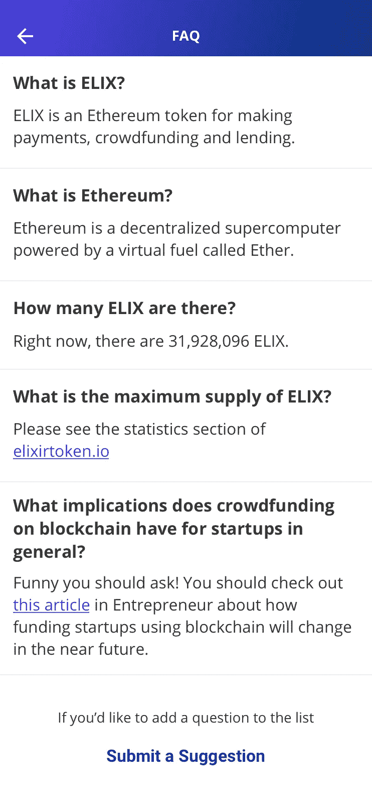

# 赠品更新、开发进度和即将发布的应用

> 原文：<https://medium.com/hackernoon/giveaway-update-development-progress-upcoming-app-release-fa367b22947d>

如果您还没有参加，请在此参加 10，000 份 ELIX 赠品[！](https://www.elixirtoken.io/giveaway)

**背景**

上周，我们开始了 10，000 份 ELIX 赠品，为我们即将于 8 月 9 日发布的应用做准备。结果令人震惊——在 Twitter 上，我们在头四天内收到了超过**16000 条转发**和超过**14000 条赠品条目**。请继续阅读，了解更多关于我们营销和发布策略的激动人心的消息。

We’re running a 10,000 ELIX Giveaway. Click [here](https://www.elixirtoken.io/giveaway) to join the giveaway.

**视频**

我们一直在寻找新的方式来传播 Elix 的理念和愿景。最好的方法是制作一个视频。一个成功的视频将会降低为长生不老药投放的任何广告的每次点击成本，树立权威，展示专业精神。该视频目前正在制作中，一旦制作完成，我们希望您能就如何改进该视频提供反馈！

**7 月 26 日至 7 月 30 日的数字**

推特:4 800 名粉丝至 6 300 名

电子邮件:1，800 至 3，800 名订户

电报:2700 个用户对 3500 个用户

Instagram: 188 个关注者到 206 个

YouTube:170 个用户中有 160 个

脸书:234 页喜欢 321 页

FB 广告:0.4 美元到 0.23 美元

赠品转化率:30%到 33%

**赠品**

赠品目前的重点是增加 Twitter、电子邮件、搜索引擎中的关键词排名，并获得尽可能多的曝光率。Instagram、脸书和 Youtube 并不是赠品的重点，但这些渠道因为赠品的曝光而有机增长。

赠品目前正通过广告、Bitcointalk、Twitter 上的影响者、目录和 Discord 频道进行推广。最好的结果来自具有高达 20%病毒系数的广告。

该赠品的最终目标是为每个初次接触 ELIX 的人提供明确的指导，逐步说明如何获得 Elix，以及在 Elixir 应用程序上使用 Elix 的许多不同优势和方法。

我们为赠品活动建立病毒循环的目标已经成功了。我们可能无法控制赠品分享到哪里，但我们保证赠品对社区中的每个人都是公平的。

如果你还没有机会参加赠品活动，那就去 elixirtoken.io/giveaway 吧。8 月 9 日中午 12:00 Elix 应用发布时，赠品结束。

**发布后**

发布后，重点将转移到有机增长。在发布后的一个月，我们将创建一个博客，以高质量的文章为特色，对众筹进行排名，并向谷歌的第一页提供相关的关键词。我们将通过更多的内容、更多的助推项目、博客文章、客座博文和影响者外联来实现这一目标。同时，我们将在多个网络上投放广告，为 Elixir 应用增加流量。

一个成功的 boost 项目对 Elixir 和社区都是极其有益的。我们希望每个 boost 项目都能为他们的项目带来流量，从而增加 Elixir 的日活跃用户。一旦进入应用程序，他们将被引入钱包以及贷款。

**报名通知**

在此[注册](https://www.elixirtoken.io/)，当应用程序在苹果和谷歌商店上线时，您会收到通知！当您访问我们的网站时，请务必在这里参与 ELIX 赠品[。](https://www.elixirtoken.io/giveaway)

**开发**

我们正在对我们的应用程序进行最后的润色，并准备推出。这包括浏览最终的改进列表，在发布前做最后的更改！

**设计**

Jane & Rosello 介绍了一个 FAQ 页面的设计。该页面将帮助新人熟悉该应用程序，并回答关于 ELIX 的常见问题。FAQ 页面设计看起来应该是这样的:

这星期就这些了！我们和我们的社区一样兴奋地与世界分享这一产品。我们希望你喜欢这一周的更新！请务必在我们的[主页](https://www.elixirtoken.io/)上注册该应用程序，并通过社交媒体在 [Reddit](https://www.reddit.com/r/elixirtoken/) 、 [Twitter](http://twitter.com/elixtoken/) 、 [Discord](https://discord.gg/mu4EJaz) 和 [Telegram](https://t.me/ElixirToken) 上进行连接。我们还有[脸书](https://www.facebook.com/elixirtoken/)和 [Instagram](https://www.instagram.com/elixtoken/) 页面，你可以在我们的[网站](https://www.elixirtoken.io/)底部注册订阅时事通讯。要创建自己的项目，请在此注册成为早期创建者[。敬请关注我们的中型博客](https://www.elixirtoken.io/boost)以获得令人兴奋的更新！

