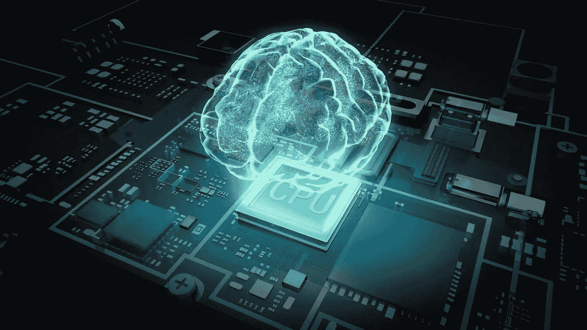

# 给予人工智能硝基助推器！

> 原文：<https://medium.com/hackernoon/giving-nitro-boost-to-artificial-intelligence-e8126ee5feed>

人工智能每天都在达到新的高度。没有一个星期没有人工智能技术解决的新问题的任何重大宣布。人工智能系统已经存在于我们之中，而且已经存在了一段时间。尽管取得了这一真正的进步，但我们距离人类水平的智能还有很长的路要走。世界上还没有出现人工超级智能(ASI)——一种合成系统，其认知能力在所有相关指标上都超过人类，并假设在这个世界中，计算机的认知能力优于人类。

随着人工智能每天都在继续发展，关于人工智能的下一个重大进步将来自何方，有一个重大问题？

下面我列出了 5 个可能的领域，它们有潜力将人工智能带到新的高度。**我列出的观点可能不是你通常听到的观点，它们可能是高度虚构或乐观的，但它们肯定包含了对每个人都有意义的提示。**

这就是他们:

# 大脑模拟

一个**人工大脑**(或**人工头脑**)是具有类似于动物或人脑的认知能力的软件和硬件。许多顶尖的研究人员已经在研究这方面的东西，但我不确定需要多长时间才能达到一个水平，使我们能够完美地模拟一个功能完全像人脑的人工大脑。对理论神经科学家来说，理解智能如何工作的关键是在计算机内重建它。一个接一个的神经元，这些奇才希望重建导致思想、记忆或感觉的神经过程。

有了数字大脑，科学家可以测试当前的认知理论，或者探索导致大脑故障的参数。只有一个问题:我们的计算机无法处理我们大脑的大规模并行性。人类大脑的神经元活动极其复杂，以目前的技术不可能以 1:1 的比例模拟它。我们的大脑有超过 1000 亿个相互连接的神经元和数万亿个突触。当今最强大的超级计算机最多只能处理 10%的神经元模拟率。我们可能需要一些时间来达到大脑的水平——10 年或 20 年，甚至可能需要 50 年。但是随着计算能力和硬件技术的提高，人工智能驱动的大脑可能很快就会成为现实。

# 自主机器人系统

人工智能(AI)可以说是机器人领域中最令人兴奋的领域，但它肯定也是最具争议的领域。机器人专家目前远未达到模仿人类行为的水平，但他们在人工智能方面取得了很大进展。21 世纪的前二十年给我们带来了通常被称为“自主技术”和“人工智能”的惊人例子。今天的人工智能机器可以复制智能的一些特定元素。人工智能(AI)，特别是机器学习形式的人工智能，以及来自生活各个领域的大数据集的日益增加的可用性，是近年来该领域发展的重要驱动力。

人工智能的真正挑战是理解自然智能是如何工作的。人工智能研究很大程度上是理论性的。科学家假设我们如何以及为什么学习和思考，他们用机器人来试验他们的想法。具有现代传感器和致动器的自主机器人将为人工智能提供丰富的体现，而在其他领域缺乏这样的体现可能会阻碍通用智能的出现。麻省理工学院人工智能实验室的机器人 Kismet 可以识别人体语言和声音变化，并做出适当的反应。

# 可组合的可区分架构(又名深度学习)

深度学习是最复杂的人工智能功能的核心，包括语音识别、图像和视频识别、语音生成和机器人技术。深度学习已经实现了机器学习的许多实际应用，并扩展到人工智能的整个领域。下一代企业人工智能系统有望加速企业发展，改变企业运营方式。深度学习是基于学习数据表示的更广泛的机器学习方法家族的一部分，与特定任务的算法相反。学习可以是有监督的、半监督的或无监督的。深度学习分解任务的方式让各种机器辅助看起来都有可能。无人驾驶汽车，更好的预防性医疗保健，甚至更好的电影推荐，都在今天或即将到来。

但是在深度学习和人工智能合作的道路上，一个常见的障碍是深度学习系统需要大量的监督数据才能工作。未来的人工智能系统需要能够利用这种丰富的数据源。目前的深度学习依赖于主要由游戏行业资助的 GPU 开发。在深度学习的帮助下，人工智能甚至可能达到我们长期以来想象的科幻小说中的状态。

# 游戏科学

游戏环境是一个多样化的具有挑战性的地方，也是测试人工通用智能代理能力的最佳领域之一。在视频游戏中，人工智能主要用于在非玩家角色中生成响应性、适应性或智能行为，类似于类人智能。人工智能算法变得更加智能，并通过输入大量数据来学习执行任务。从一开始，玩游戏就是人工智能研究的一个领域。人工智能的第一个例子是 1951 年制作并于 1952 年出版的计算机游戏 Nim T1。尽管在《T2》乒乓《T3》问世的 20 年前，这款游戏就已经是一项先进的技术，但它还是以一个相对较小的盒子的形式出现，甚至能够在与技术高超的玩家的比赛中赢得胜利。

游戏旨在挑战我们的智力，涉及多个代理之间的交互，并且足够抽象以形式化，这使得游戏成为推动人工智能研究的理想研究工具。**也许下一个突破将是掌握另一种游戏。**

# 宇宙智能和人工生命

人工智能的一个根本问题是，没有人真正知道什么是智能。当我们需要考虑与人类显著不同的人工系统时，这个问题就变得特别尖锐。一种将算法信息理论用于普通人工智能的方法是 [AIXI agent](https://en.wikipedia.org/wiki/AIXI) ，这是由 [Marcus Hutter](http://www.hutter1.net/) 提出的一种理论，它试图在某种意义上具有通用性，它将成功并优化地解决任何可解决的任务。

人工生命与生物学的关系就像人工智能与心理学的关系一样。在上述大脑模拟的观点中，我认为通过理解人脑，我们最终将能够达到人类水平的智力。然而，抛开复杂的部分，我们可以从更基础的层面开始:通过理解和模拟化学的合成形式，我们也许能够模拟人工生命。如果有足够丰富的环境，这样的生命可能会进化成为智慧生物。

有一个很酷的假说让我个人很兴奋，那就是大智慧过滤假说，它认为生命可能很丰富，但智慧生命可能非常稀少。我们目前不知道智慧生命在宇宙中是罕见还是丰富，但如果罕见，在任何人工生命模拟中也可能极其罕见。甚至对于我们星球上的生命，我们也不确定是什么触发了智慧的出现；一个普遍认为的假设是，它发生在很短的时间内，类似于相变，因为 5.4 亿年前海洋氧气水平的变化，导致了寒武纪大爆发。

(补充:读一读**费米悖论，**它肯定会让你感兴趣。)

# 结论

虽然我们不知道确切的未来，但很明显，与人工智能互动将很快成为一种日常活动。这些互动显然将有助于我们的社会发展。人工智能技术可以以更多的方式影响我们的未来，这一事实让多个行业的专业人士对人工智能不断蓬勃发展的未来感到非常兴奋。人工智能将在未来十年取得快速发展，也许会沿着我们刚刚讨论的方向发展。

在 Linkedin 上联系我:【https://www.linkedin.com/in/gauravneuer/ 