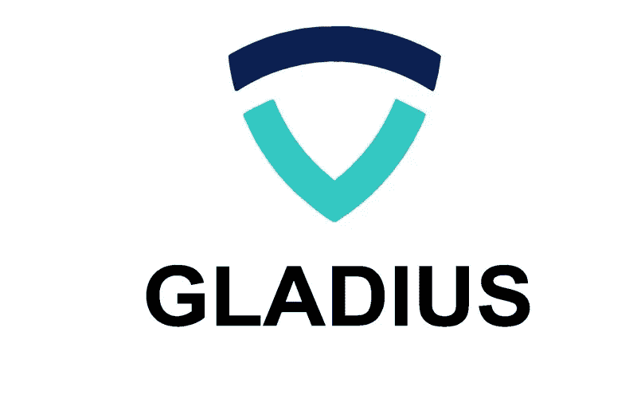

# Gladius (GLA)使用区块链技术的 DDoS 安全和页面加载时间解决方案

> 原文：<https://medium.com/hackernoon/gladius-gla-ddos-security-and-page-load-time-solution-using-blockchain-technology-53178e7c69ab>

# 关于 Gladius 的信息

Gladius 是一个独特的新网络，它结合了区块链的点对点特性，开发了一个内容交付网络(CDN ),只对每项服务收费，并保护使用该平台的用户免受 DDoS 攻击。

该系统背后的理念是创建注重保护和效率的高质量 CDN。Gladius 通过管理连接到网络的计算机的备用 CPU、存储和带宽来执行保护服务和 cdn 所需的任务，即多层网站认证、恶意攻击防范、云存储和内容交付。

建立在以太坊区块链的基础上，使用智能合同将服务分配给用户群，然后用户群的计算机提供存储和交付内容所需的资源，以及监控和验证网络连接请求，Gladius 将成为一个真正的随用随付市场，网站所有者和用户可以以可承受的价格获得基本的在线安全和内容交付。

Gladius 解决了什么问题？

Gladius 网络为困扰所有在线计算机和用户的两个主要问题提供了新颖的解决方案；安全性和页面加载时间。

说到保护，Gladius 将解决日益增长的 DDoS(拒绝服务)攻击的威胁，这种攻击可能会使任何网站瘫痪；网络犯罪在 2017 年造成了约 1500 亿美元的损失，而企业同时平均每月花费 5000 多美元用于安全措施以防止此类攻击。

许多知名公司如 BBC、GitHub 和 Blizzard Entertainment 都经历过破坏性的、代价高昂的 DDoS 攻击形式的黑客攻击；据说平均攻击成本约为。250 万美元。

许多网站还利用 CDN 服务来加快内容的交付时间，以便世界各地的用户可以访问网页，而不会有明显较长的页面加载时间。Gladius 使用区块链和点对点架构，将网络上的计算机资源汇集在一起，创建高效安全的 CDN，同时提供针对 DDoS 攻击的保护服务。

**格拉迪斯是如何工作的？**

【Gladius 背后的技术…

只要下载并安装桌面对等客户端，任何计算机都可以加入 Gladius，成为网络池中的一个节点。然后，用户可以出租他们机器的 CPU 和存储空间，以及他们的连接带宽。

然后，CPU 用于验证网站连接并阻止恶意活动，而存储空间和带宽用于远程保存内容并将其发送给浏览网页的人。对于数百甚至数千用户的大型池，Gladius 将有效地利用网络上未使用的计算机资源，轻松处理连续不断的请求流，这将是全天候的。

此外，这种对等结构还提供了更高的安全性，因为站点受到数千个池的保护，这些池需要同时受到攻击才能被关闭。

池可能由多个节点或个体组成。用户通过市场找到他们喜欢的池，在那里他们可以看到关于池的信誉、带宽、最大缓存大小、位置和成本的信息。要加入池，用户通过智能合约提出请求，如果池基于带宽、存储和声誉等因素认为用户不会对组有益，则池可能会拒绝该请求。

每个池将运行 DNS 服务，将所有流量分发到节点进行验证。然后，池能够决定如何向用户分配其资源。

网络 GLA 上的所有节点为每个通过验证的请求获得代币，然后用户可以将这些代币卖回给网站，以创造促进增长的经济。这些用户将竞相为他们的保护服务提供尽可能低的价格，随着平台的成熟，这将有助于降低价格。

Gladius 还具有内置的信誉系统，有助于防止恶意池，所有池都将能够批准其他节点试图进入池中。这确保了平台保持清洁和健康，不需要额外的维护。由于网站受到数千个不同池和节点的保护，攻击者必须攻击每个池，而不是关闭一个主要的中央服务器。这是这种类型的分散式安全首次在在线保护服务中实施。

**Gladius 的安全优势**

根据 Nexusguard 的 Q1 2017 年“威胁报告”,仅在 Q1 2017 年第一季度，DDoS 攻击就增加了惊人的 380%,这将威胁定位为推动互联网安全解决方案行业的主要力量之一，同样，CDN 市场近年来也经历了巨大的增长，现在有超过 1450 万个依赖该技术的直播网站。Gladius 通过提供一站式解决方案打破了这两个不断增长的在线服务领域，该解决方案不仅消除了昂贵的中间商，还为参与网络的 it 用户提供了简单的回报。

通过将解决这两个问题的解决方案整合到一个建立在区块链的安全性和可信赖性基础上的自给自足的生态系统中，Gladius 为在 Gladius 网络的帮助下上网冲浪的整个设备生态系统提供了明显的优势，包括:

1.  处理日益增长的用户需求；每天都有越来越多的设备连接到互联网，所有这些都要求内容在尽可能快的时间内交付。这意味着需要更多的 cdn，然而成本和昂贵的费用阻止了许多网站利用这些服务。Gladius 的点对点性质，以及奖励用户提供资源的激励计划，鼓励任何拥有连接到互联网的设备的人成为网络的一部分，从而增加节点的数量和全天候按需处理所有请求和服务的能力
2.  行业标准解决方案；由于内容是网上的王道，快速高效的内容传递是必不可少的。Gladius 的独特架构使所有计算机都可以访问保护和内容交付服务。
3.  收入增加；在这种情况下，速度，即页面加载时间，是影响网站能够处理的转换数量的主要因素之一，反过来，直接影响网站能够产生的利润。点对点 CDN 服务将大大改善网络上所有网站的加载时间，并全面增加收入。
4.  Gladius 的点对点特性消除了第三方服务费用，实现了按服务付费的结构。这使得更多的用户能够使用服务，因为他们只需要支付他们所需的费用，而不是支付一揽子订阅费用，其中大部分费用用于支付不需要的功能/服务的费用。

它还鼓励用户提供否则会被浪费的资源，并以代币奖励他们的“挖掘”工作。随着有限数量的 Gladius 令牌的发行，以及所有用户挖掘令牌的能力，GLA 的价值将随着网络的增长而成比例地增加。

**格拉迪斯路线图**

Gladius 将首先分两个阶段建造；第一个是开发和整合构成平台架构的技术，第二个是使产品大规模商业化。该平台将在两个阶段分三步进行。前两步将实现一个概念系统，在第二步进入正式生产模式之前展示基本功能。此时，只有经过批准的网站才能加入网络。然后，一旦网络可以支持大规模攻击，核心技术得到微调，第三步将看到产品在世界范围内推出。

**有价值的信息**

硬币名称:Gladius (GLA)

总供应量:9632 万格拉

循环供应量:总供应量的 60%

市值:1250 万美元；200 万美元软帽

Ico 前价格:1 ETH = 600–750 GLA

Ico 价格:1 ETH = 500 GLA

通过 ICO 筹集的代币/资金:14 681 250 美元

**社交媒体信息**

**脸书**

网址:https://www . Facebook . com/gladiusio

喜欢:6 368 个喜欢者 6 698 个关注者

过去 7 天有多少帖子/更新:最近没有更新

**推特**

网址:https://twitter.com/gladiusio

追随者:8 125 名追随者

过去 7 天有多少条推文/转发:最近没有更新

**电报**

网址:https://t.me/gladiusio

用户:7 710 名成员

**电报管理员**

用户名:@anothermadmax

用户名:@alex_godwin

用户名:@JChong91

**Reddit**

网址:https://www . Reddit . com/r/gladius network/

读者:808 名读者

**中等**

网址:https://medium.com/@gladiusio

追随者:1K 追随者

**GitHub**

网址:https://github.com/gladiusio

过去 7 天内有多少次更新:1 次最近更新

**额外的**

BitcoinTalk 网址:[https://bitcointalk.org/index.php?topic=2217711](https://bitcointalk.org/index.php?topic=2217711)

**员工/团队信息**

姓名:马克斯·尼拜斯基

**头衔** : 创始人& CEO

**简历** : Max 是 Gladius 最初的创始人。马克斯是权力下放和区块链技术的大力支持者。他拥有超过 8 年的编程和创业经验，是带领 Gladius 成为 DDoS 防护行业中流砥柱的最佳人选。

LinkedIn:https://www . LinkedIn . com/in/maxniebylski/

姓名:亚历克斯·戈德温

**头衔**:联合创始人& CTO

亚历克斯是 Gladius 的联合创始人。他从小就对编程感兴趣，最近想参与一个分散的项目，因为他相信这是互联网的未来。Alex 在开发智能合同和通用系统架构方面发挥着关键作用

LinkedIn:https://www . LinkedIn . com/in/Alexander-Godwin/

姓名:马塞洛·麦克安德鲁

**头衔**:联合创始人&首席运营官

简历:马塞洛是 Gladius 的联合创始人。凭借对网络开发和创造新技术的热情，他决心让 Gladius 成为 DDoS 保护和 CDN 行业的领导者。Marcelo 在管理 Gladius 桌面客户端和门户网站的开发中起着至关重要的作用。

LinkedIn:https://www . LinkedIn . com/in/Marcelo-mcandrew-7a2a 68126/

**姓名**:吉姆·布林克斯马

**头衔**:经营战略与发展总监

**简历**:吉姆·布林克斯马拥有超过 20 年的技术经验，涉及国防部、电信和金融服务。他将领导我们的战略和业务发展工作，重点是吸引投资者、发展合作伙伴关系和增加收入。Jim 之前的职位包括 Ciena 的战略业务发展副总裁和高盛的网络产品战略副总裁。

**名字**:纳达夫·达克纳

头衔:营销总监

纳达夫是一位资深的网络营销者，也是一位连续创业者。他是 InboundJunction 的创始人兼首席执行官，inbound junction 是一家老牌数字营销公司，帮助知名品牌和初创公司通过公关、搜索引擎优化、声誉管理和影响者营销来提高他们的在线知名度和声誉。作为一名数字影响者和密码专家，他还为区块链初创公司和 ico 提供营销、运营和业务发展方面的建议。

LinkedIn:https://www . LinkedIn . com/in/ndak ner/

**姓名** : Ori Levi

**职务**:营销总监

**简历** : Ori Levi 是一名数字营销人员，在公关、搜索引擎优化和内容营销方面拥有超过 10 年的经验。他是一个加密货币爱好者，已经交易 altcoins 好几年了。Ori 在幕后参与了无数成功的营销和业务发展项目，并在 2017 年为许多 ico 和区块链创业公司提供了建议

**LinkedIn**:https://www . LinkedIn . com/in/Levi ori/

姓名:约瑟夫·斯坦伯格

**头衔**:网络安全顾问

约瑟夫·斯坦伯格是公认的网络安全思想领袖和技术影响者，从业超过 25 年。他还是福布斯和 Inc 的专栏作家，也是社交媒体实时安全监控系统 SecureMySocials 的创始人兼首席执行官。

**LinkedIn**:https://www . LinkedIn . com/in/Joseph Steinberg/

姓名:弗兰克·博内

**头衔**:技术顾问

简历:作为 Dcorp 的创始人和开发者，Frank Bonnet 拥有九年的设计经验，并建立了无数的企业。NET 应用程序。他对可靠性和智能合同开发有着深刻的理解，是我们团队的重要顾问。Frank 有一个开发人员专业知识的商业观点。

**LinkedIn**:https://www . LinkedIn . com/in/frank-bonnet-3b 890865/

**姓名**:多利·哈帕兹

**头衔**:商务和营销顾问

**简历** : Dori Harpaz 拥有超过 6 年的网络安全和 10 年的在线营销经验。Dori 是 Incapsula Imperva 的营销总监，Incapsula imper va 是当今最大的 DDoS 缓解和 CDN 提供商之一。目前，他是端点安全和事件响应初创公司 Secdo 的营销副总裁。

**LinkedIn**:https://www . LinkedIn . com/in/doriharpaz/

**姓名**:荷西叶舒润

**头衔**:业务增长和安全顾问

作为 ForeScout 的董事长和联合创始人，Hezy Yeshurun 提供了宝贵的技术和创业见解。Hezy 是一位思想领袖，他创立了几家成功的技术公司，包括 TapGuard(被 Elron Software 收购)和 Top Image Systems。Hezy 是特拉维夫大学的计算机科学教授，主要研究计算机视觉和计算神经科学。

**LinkedIn** :作为 ForeScout 的董事长和联合创始人，Hezy Yeshurun 提供了宝贵的技术和创业见解。Hezy 是一位思想领袖，他创立了几家成功的技术公司，包括 TapGuard(被 Elron Software 收购)和 Top Image Systems。Hezy 是特拉维夫大学的计算机科学教授，主要研究计算机视觉和计算神经科学。

**名称**:汉斯科韭菜

**头衔**:运营顾问

**生物**:早期比特币采用者和投资者，目前投资以太等。成功的股票经纪人、企业家和企业主。在许多市场上交易和投机都取得了巨大的成功。作为 Dcorp 的联合创始人，以及几个成功的金融科技项目和 ico 的重要顾问，他是 Gladius 的坚定支持者，并从多个方向为我们的团队提供建议

**LinkedIn**:https://www . LinkedIn . com/in/hansco-leek-5bb 86210/

姓名:迈克·巴拉尼亚

**职位**:营销传播顾问

迈克见解深刻，多才多艺，在形成许多创新的营销理念方面表现非凡。作为一名公关专家，他曾担任过 Dcorp 的营销和传播经理，他从多个角度为 Gladius 带来了价值。他在区块链领域的几个项目中担任顾问和管理，在许多成功的 ico 中发挥了重要作用。

**LinkedIn**:https://www . LinkedIn . com/in/Michael-balagna-196 b 3182

**名称**:鲁本绞线机

**标题**:人工智能顾问

Ruben Stranders 博士在荷兰代尔夫特理工大学学习计算机科学，并拥有英国南安普顿大学的人工智能博士学位。他是 FireServiceRota 的联合创始人，这是一家专门为紧急服务规划和调度软件的公司。鲁本住在墨西哥(享受美食！)，他在克雷塔罗的蒙特雷技术学院教授人工智能。除了担任 DCOR 的顾问和测试员之外

**领英**:【https://www.linkedin.com/in/stranders/】T4

**名称**:康拉德·塞维林

**头衔**:网络开发者

**简历**:全栈开发者，CracSoft 创始人。神经网络和机器学习的超级粉丝。他参与了许多国际项目。拥有计算机科学硕士学位和 10 年编程经验的他是 Gladius Web 应用程序的忠实支持者。

**LinkedIn**:https://www . LinkedIn . com/in/Konrad-seweryn-21b 762 a2/

**名称** : Roi Dalal

**头衔** : UX/UI 设计师

**简历** : Roi 是一位经验丰富的图形设计师，专注于 UX/UI 和数据可视化。他参与了物联网、人工智能、电子商务等领域的许多创新项目。

名字:杰瑞米·爱泼斯坦

**职位**:营销顾问

杰里米拥有 20 年的国际营销经验，致力于将创新技术引入主流。他是 Sprinklr 的营销副总裁，该公司在 4 年内从 2000 万美元的估值和 30 名员工发展到 18 亿美元的估值和 1400 名员工。杰里米也是著名的区块链研究所的营销教员，也是 Crypto Explorers 的联合创始人，这是一个充满激情的领先社区

**LinkedIn**:https://www . LinkedIn . com/in/jer 979/