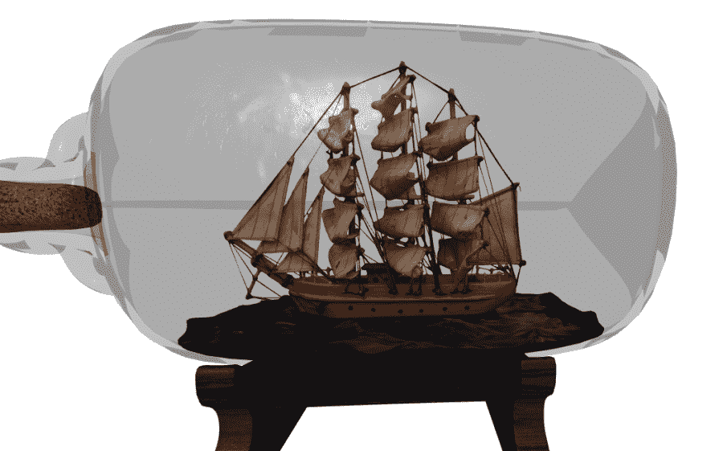

# glTF:一种用于增强现实/虚拟现实的图像格式

> 原文：<https://medium.com/hackernoon/gltf-an-image-format-for-ar-vr-68087bfed6f1>

增强现实和虚拟现实(AR/VR)是越来越主流的酷技术。虽然今天它们可能主要在游戏中，有些需要像 Oculus 这样的花哨耳机，但有一些技术正在将 AR/VR 带入主流。例如，A-Frame 是一个 web 框架，允许您将 VR 体验带入浏览器。作为一个框架，在语法上类似于写 HTML，给很多开发者带来了较低的入门门槛。如果你不熟悉 A-Frame，并且想了解更多——[教程](https://aframe.io/docs/0.8.0/introduction/)非常棒。

在 A-frame 中构建一个简单的世界很容易——一旦你完成了上面链接的教程，你将拥有一个简单的世界！但是让这个世界不仅仅是盒子、球体和圆柱体会很酷。幸运的是，有数百名(如果不是数千名)3D 艺术家正在创作可用于你的 AR/VR 世界的物体渲染图。更好的是，这些文件有一个开放的、免版税的标准，在整个生态系统中都得到很好的支持: [glTF](https://www.khronos.org/gltf/) 。

这篇文章中的样本 glTF 文件来自 KhronosGroup 的 [Github 的样本文件](https://github.com/KhronosGroup/glTF-Sample-Models/tree/master/2.0/AnimatedCube/glTF)，以及来自 [SketchFab](https://sketchfab.com/) ，我在那里下载了[“瓶中船”](https://sketchfab.com/models/9ddbc5b32da94bafbfdb56e1f6be9a38)



这些文件以及它们的优化版本都在一个 [GitHub 存储库中。](https://github.com/dougsillars/glTF_optimization)

# glTF

glTF 被其创始人称为“3D 的 JPEG ”,它基于 JSON，但在其层次结构中有支持文件来创建 3D 结构。从上面链接的 glTF 页面:


的。gltf 文件(如上所示)只是直接的 JSON-将文件和几何图形链接成一个 3D 文件。例如，以下是 Avocado gltf 文件的文件结构:

# glTF 在行动

让我们展示一下 afra frame 中的 3D 鳄梨。为此，我们将 Avocado gltf 建立为一项资产，然后显示该实体。(它被放大了 10 倍，因为默认情况下这个鳄梨显示得非常小。):

```
<a-scene> <a-assets> <a-asset-item id="avocado" src="Avocado/glTF/Avocado.gltf"></a-asset-item> </a-assets> <a-entity position="0 1.5 -1"scale="10 10 10" rotation="0 0 0" gltf-model="#avocado"></a-entity> </a-scene>
```

如果你在你最喜欢的开发者工具中打开这个链接，你会看到这个简单的 Avocado 用了 8.2 MB 在页面上渲染。其中 7.9 MB 是因为图像。一个鳄梨。我认为我们可以做得更好。

在所有测试的模型中，用于包装模型的图像占 gltf 文件大小的 95%以上。

# 图像优化

与 gltf 文件相关的图像可以在 Github repo 的相关文件夹中找到。它们似乎是作为 3D 渲染引擎的原始输出导出的，很少考虑文件大小。由于这些模型中的任何一个都被设计为在应用程序或网站中分发，因此这些图像的大小应该是加载时间(和一般数据量)的一个问题。

这是一个很远的论点，VR 应用程序通常运行在具有快速网络条件的设备上，这些非常大的文件仍然会增加场景加载到页面上的明显延迟。在慢速网络上，文件大小可能会阻止 3D 模型的加载。

为了优化我研究的 gltfs 中的图像，我选择了两种图像优化方法:改变图像格式和降低图像质量。为此，我将所有原始文件上传到 Cloudinary，然后使用他们的图像转换工具为浏览器选择最佳格式——我在 Chrome 中进行测试，因此 PNG 和 jpg 大多被转换为 WebP。我还利用结构相似性降低了图像质量，使其分辨率达到人眼无法分辨的程度。为此，我将图片上传到 Cloudinary，并在 url 中添加参数 q_auto、f_auto。

要将这些新图像应用到 gltf 文件，我们必须替换 gltf JSON 中的图像引用。在这里，他们从本地参考转移到第三方云 URI:

收件人:


同样，gltf 文件都在 GitHub repo 中，优化后的 gltf 和 html 页面都在文件名后附加了“_opt”。

# 结果:

这是瓶中船的两个相似视图:


从视觉上看，两个船帆没有什么大的区别。使用 Chrome DevTools 和一个模拟的 5 MBPS 下行链路连接，我估计了 4 种不同型号的 MB 和加载时间:

原始(MB)优化(MB)加载(原始)加载(优化)%数据节省加载时间节省 Cube 1.1 0.33 3.7 1.3 70.00% 64.86% Avocado 8.2 0.584 14 1.85 92.88% 86.79% Camera 43.5 4.7 80 8.5 89.20% 89.38% Ship 31.2 9.1 51 15.1 70.83% 70.39

使用优化的映像，数据节省在 70–93%之间，加载时间加快了 65–90%。

你可以自己比较一下:

# glTF 优化的现状

从快速阅读文档来看，有一些关于图像格式的工作将会变得更小，但是似乎没有做什么来降低现在使用的 JPG 或 PNG 文件的大小。

另一个重点是 Draco 优化/压缩的使用，它允许更快地读取构建几何图形的 gltf 和 bin 文件。这是一项伟大的工作(查看演示 Draco 加速渲染[曼哈顿](https://cesium.com/blog/2018/04/09/draco-compression/)。性能的提高是惊人的。当我使用 [gltf 管道](https://github.com/AnalyticalGraphicsInc/gltf-pipeline)通过 Draco 优化运行 AntiqueCamera 模型时，整个 gltf 是一个 JSON 文件。在查看这个文件时，它是 59MB，所有的图像都是在 JSON 中进行 Base64 编码的。我最近[研究了 Base64 作为图像的反模式](https://calendar.perfplanet.com/2018/performance-anti-patterns-base64-encoding/)。Base64 编码的图像将比原始的 JPG 或 PNG 文件大 10–20 %,此外，Base64 的渲染速度比原始文件慢。让我们希望这种模式不会在 glTF 优化中继续下去。

# 结论

AR/VR 的使用正在增长，现在可以很容易地添加到主流游戏、应用和网站中。有数以千计的 3D 渲染对象可以添加到这些世界中，并且有一个很棒的、免版税的、开放的标准叫做 gltf，它允许轻松共享和重用这些对象。

然而，这些对象远没有优化到可以在互联网上传送。图像往往是 PNG 或 JPG 文件，没有质量降低或试图格式化为较小的尺寸。在这个简单的实验中，我通过利用 JPG、WebP 和结构相似性，将 4 个 gltf 文件的大小缩小了 70–92 %,图像清晰度几乎没有损失。

感谢 [@ **tanay1337**](https://twitter.com/tanay1337) 在 glTF 在圣彼得堡 DevFest 的演讲中向我介绍了他。

*原载于 2018 年 12 月 17 日*[*dougsillars.com*](https://dougsillars.com/2018/12/17/gltf-jpeg-for-3d/)*。*