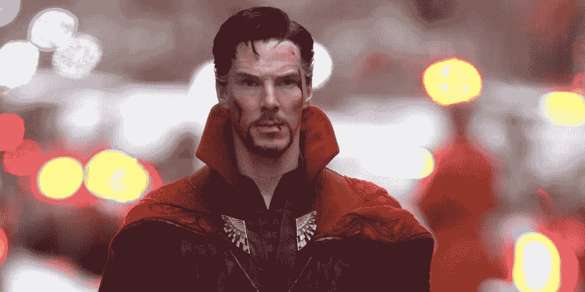

# Go 人脸识别教程—第 1 部分

> 原文：<https://medium.com/hackernoon/go-face-recognition-tutorial-part-1-373357230baa>


我喜欢阅读关于[面部](https://hackernoon.com/tagged/face)识别的全部内容。自己实现一个会让你听起来像托尼·斯塔克，你可以将它们用于各种不同的项目，比如门上的自动锁，或者为你的办公室建立一个监控系统。

在这个[教程](https://hackernoon.com/tagged/tutorial)中，我们将使用一些现有的库来构建我们自己的、非常简单的基于人脸识别的围棋系统。我们将从在静态图像上进行简单的人脸识别开始，看看它是如何工作的，然后我们将在这个迷你系列的第 2 部分中进一步研究视频馈送上的实时人脸识别。

# 视频教程

本教程还有视频格式！如果你想支持我和我的频道，请点赞并订阅:)

# Kagami/go-face 套装

作为本教程的基础，我们将使用包裹了 dlib 机器学习工具包的 [kagami/go-face](https://github.com/Kagami/go-face) 包！

> Kagami 实际上写了他是如何着手写这个包的。这绝对是一个有趣的阅读，你可以在这里找到它:[*https://hacker noon . com/face-recognition-with-go-676 a555 b8 a7e*](https://hackernoon.com/face-recognition-with-go-676a555b8a7e)

## dlib 工具包

Dlib 工具包是用 C++构建的，在人脸和物体识别/检测方面令人难以置信。根据其文档，它在 Wild benchmark 中检测标记人脸的准确率约为 99.4%，这令人难以置信，这也是为什么许多其他第三方库将它作为基础的原因。

> 在之前的教程中，我已经介绍了 Dlib 工具包的 Python 库——face _ recognition。如果你想看看这个教程的 python 等价物，这里是:[*Python 中的人脸识别简介*](https://tutorialedge.net/python/intro-face-recognition-in-python/)

# 设置

我不打算撒谎，启动并运行它比你的标准 Go 包要稍微痛苦一些。你需要在你的机器上安装`pkg-config`和`dlib`。如果您在 MacOS 上运行，则命令如下:

```
$ brew install pkg-config dlib 
$ sed -i '' 's/^Libs: .*/& -lblas -llapack/' /usr/local/lib/pkgconfig/dlib-1.pc
```

# 入门指南

我们首先需要下载“kagami/go-face”包，这可以通过以下“go get”命令完成:

```
$ go get -u github.com/Kagami/go-face
```

在您的 GOPATH 目录中创建一个名为`go-face-recognition`的新目录。在这个目录中创建一个名为`main.go`的新文件，这是我们所有源代码将要存放的地方。

一旦你完成了这些，你将需要从[教程/go-face-recognition-教程](https://github.com/TutorialEdge/go-face-recognition-tutorial) repo 中的`image/`目录中获取文件。最简单的方法是将 repo 克隆到另一个目录中，并将 image 目录复制到当前工作目录中:

```
$ git clone [https://github.com/TutorialEdge/go-face-recognition-tutorial.git](https://github.com/TutorialEdge/go-face-recognition-tutorial.git)
```

一旦成功克隆，我们就有了启动人脸识别程序所需的两个`.dat`文件。你应该还会看到一份其他`.jpg`文件的列表，其中包含一些漫威复仇者的面孔。

```
package main

import (
	"fmt"

	"github.com/Kagami/go-face"
)

const dataDir = "testdata"

func main() {
	fmt.Println("Facial Recognition System v0.01")

	rec, err := face.NewRecognizer(dataDir)
	if err != nil {
		fmt.Println("Cannot initialize recognizer")
	}
	defer rec.Close()

	fmt.Println("Recognizer Initialized")
}
```

好的，如果我们现在尝试运行我们的程序，我们应该在程序的输出中看到`Facial Recognition System v0.01`和`Recognizer Initialized`。我们已经成功地设置了我们需要的一切，以便进行一些很酷的高级面部识别！

# 计算图片中的人脸

我们对这个包的第一个真正的测试将是测试我们是否能准确地计算一张照片中的人脸数量。出于本教程的目的，我将使用这张照片:


如你所见，没什么特别的，只是托尼·斯塔克孤独的脸。

因此，我们现在需要扩展我们现有的程序，以便能够分析该图像，然后计算该图像中的人脸数量:

```
package main

import (
	"fmt"
	"log"
	"path/filepath"

	"github.com/Kagami/go-face"
)

const dataDir = "testdata"

func main() {
	fmt.Println("Facial Recognition System v0.01")

	rec, err := face.NewRecognizer(dataDir)
	if err != nil {
		fmt.Println("Cannot initialize recognizer")
	}
	defer rec.Close()

	fmt.Println("Recognizer Initialized")

	// we create the path to our image with filepath.Join
	avengersImage := filepath.Join(dataDir, "tony-stark.jpg")

	// we then call RecognizeFile passing in the path
	// to our file to retrieve the number of faces and any
	// potential errors
	faces, err := rec.RecognizeFile(avengersImage)
	if err != nil {
		log.Fatalf("Can't recognize: %v", err)
	}
	// we print out the number of faces in our image
	fmt.Println("Number of Faces in Image: ", len(faces))

}
```

当我们运行该命令时，应该会看到以下输出:

```
$ go run main.go 
Facial Recognition System v0.01 
Recognizer Initialized 
Number of Faces in Image: 1
```

太棒了，我们已经能够分析图像并确定图像包含一个人的脸。让我们尝试一个更复杂的图像，其中有更多的复仇者:


当我们更新第 24 行时:

```
avengersImage := filepath.Join(dataDir, "avengers-01.jpg")
```

并重新运行我们的程序，您应该看到我们的程序能够确定 2 个人在这个新图像中。

# 识别面孔:

太好了，我们能够计算出一幅图像中的人脸数量，现在我们来看看这些人是谁？

为此，我们需要一些参考照片。例如，如果我们想从一张照片中认出托尼·斯塔克，我们需要用他的名字做标签的示例照片。然后，识别软件将能够分析与他相似的人脸照片，并将它们匹配在一起。

所以，让我们把我们的`avengers-02.jpeg`作为托尼·斯塔克的参考图像，然后看看我们是否能从我们之前为他使用的图像中识别出他。


avengers-02.jpeg

```
avengersImage := filepath.Join(dataDir, "avengers-02.jpeg")

faces, err := rec.RecognizeFile(avengersImage)
if err != nil {
	log.Fatalf("Can't recognize: %v", err)
}
fmt.Println("Number of Faces in Image: ", len(faces))

var samples []face.Descriptor
var avengers []int32
for i, f := range faces {
	samples = append(samples, f.Descriptor)
	// Each face is unique on that image so goes to its own category.
	avengers = append(avengers, int32(i))
}

labels := []string{
	"Dr Strange",
	"Tony Stark",
	"Bruce Banner",
	"Wong",
}// Pass samples to the recognizer.
rec.SetSamples(samples, avengers)
```

因此，在上面的代码中，我们从左到右依次检查了所有的面孔，并给它们标上了相应的名称。然后，我们的识别系统可以使用这些参考样本来尝试对后续文件执行自己的面部识别。

让我们用我们现有的 Tony Stark 的图像来测试我们的识别系统，看看它是否能够根据从`avengers-02.jpeg`文件中生成的面部描述符进行识别:

```
testTonyStark := filepath.Join(dataDir, "tony-stark.jpg")
tonyStark, err := rec.RecognizeSingleFile(testTonyStark)
if err != nil {
	log.Fatalf("Can't recognize: %v", err)
}
if tonyStark == nil {
	log.Fatalf("Not a single face on the image")
}
avengerID := rec.Classify(tonyStark.Descriptor)
if avengerID < 0 {
	log.Fatalf("Can't classify")
}

fmt.Println(avengerID)
fmt.Println(labels[avengerID])
```

现在让我们试着验证这不是一个侥幸，并尝试看看我们的图像识别系统是否与奇异博士的图像一起工作。



```
testDrStrange := filepath.Join(dataDir, "dr-strange.jpg")
drStrange, err := rec.RecognizeSingleFile(testDrStrange)
if err != nil {
	log.Fatalf("Can't recognize: %v", err)
}
if drStrange == nil {
	log.Fatalf("Not a single face on the image")
}
avengerID = rec.Classify(drStrange.Descriptor)
if avengerID < 0 {
	log.Fatalf("Can't classify")
}
```

最后，让我们使用 Wong 的图像来尝试一下:


```
testWong := filepath.Join(dataDir, "wong.jpg")
wong, err := rec.RecognizeSingleFile(testWong)
if err != nil {
	log.Fatalf("Can't recognize: %v", err)
}
if wong == nil {
	log.Fatalf("Not a single face on the image")
}
avengerID = rec.Classify(wong.Descriptor)
if avengerID < 0 {
	log.Fatalf("Can't classify")
}
fmt.Println(avengerID)
fmt.Println(labels[avengerID])
```

当您一起运行这些命令时，您应该会看到以下输出:

```
$ go run main.go 
Facial Recognition System v0.01 
Recognizer Initialized 
Number of Faces in Image: 4 
1 Tony Stark 
0 Dr Strange 
3 Wong
```

太棒了，我们已经设法建立了一个非常简单的面部识别系统，让我们能够识别各种不同的复仇者。

> *挑战:建立所有复仇者的参考文件，并尝试将人脸识别代码片段提取到一个可重复使用的函数中*

# 完整的源代码:

本教程的完整源代码可以在 Github 中找到:[Tutorialedge/go-face-recognition-tutorial](https://github.com/TutorialEdge/go-face-recognition-tutorial)

# 结论

在本教程中，我们成功地构建了一个真正简单的人脸识别系统，它可以处理静态图像。这有望成为本系列教程下一部分的基础，在下一部分中，我们将研究如何在视频流的实时环境中实现这一点。

希望你喜欢这个教程，如果你喜欢，请在下面的评论区告诉我！

*原载于*[](https://tutorialedge.net/golang/go-face-recognition-tutorial-part-one/)**。**