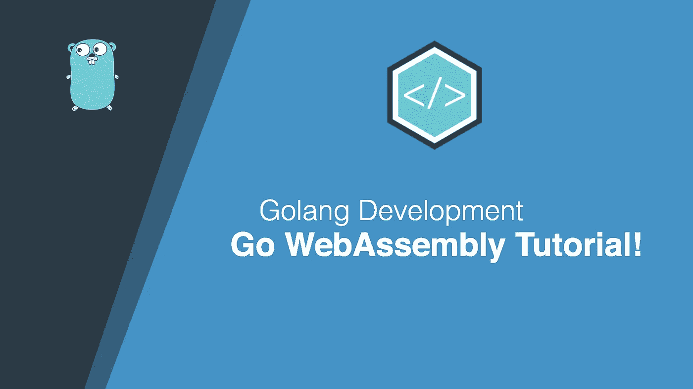
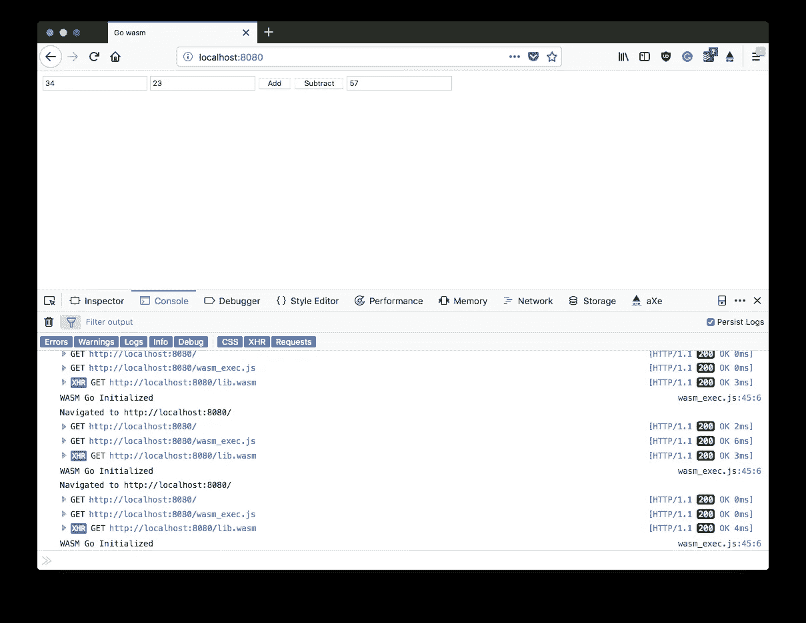

# Go WebAssembly —构建计算器教程

> 原文：<https://medium.com/hackernoon/go-webassembly-building-a-calculator-tutorial-70fff89db6a9>



欢迎大家！随着 Go v1.11 的发布，包括了一个 WebAssembly 的实验性移植，我认为看到我们如何编写自己的 Go 程序直接编译到 WebAssembly 会很棒！

因此，在本文中，我们将构建一个非常简单的计算器，让我们了解如何编写可以暴露给前端的函数，评估 DOM 元素，然后用我们调用的任何函数的结果更新任何 DOM 元素。

这将有希望向你展示为你的前端应用程序编写和编译你自己的基于 Go 的程序需要做些什么。

> *如果你还没有从开篇就猜到，那么为了让这个* [*教程*](https://hackernoon.com/tagged/tutorial) *正常工作，Go v1.11 将是必需的！*

# 视频教程

如果你想支持我和我的努力，那么看看这个教程的视频版本，并订阅我的频道！

# 介绍

那么这对 Go 和 Web 开发者来说到底意味着什么呢？嗯，它让我们能够使用 Go 语言编写我们的前端 web 应用程序，以及随之而来的所有很酷的特性，比如它的类型安全，它的 [goroutines](https://tutorialedge.net/golang/concurrency-with-golang-goroutines/) 等等。

现在，这不是我们第一次看到 Go 语言被用于前端。GopherJS 已经存在了很长一段时间，并且相当成熟，然而，不同之处在于它将 Go 代码编译成 JS 而不是 WebAssembly。

# 简单的例子

让我们从一个非常简单的例子开始，每当我们点击网页中的一个按钮时，它都会在控制台中简单地输出`Hello World`。我知道这听起来很令人兴奋，但是我们可以很快将它变成更实用、更酷的东西:

```
package main

func main() {
	println("Hello World")
}
```

现在，为了编译它，你必须设置`GOARCH=wasm`和`GOOS=js`，你还必须使用`-o`标志指定你的文件名，如下所示:

```
$ GOARCH=wasm GOOS=js go build -o lib.wasm main.go
```

这个命令应该将我们的代码编译成当前工作目录下的一个`lib.wasm`文件。我们将使用`WebAssembly.instantiateStreaming()`函数将它加载到我们的`index.html`页面中。注意——这段代码是从官方 Go 语言 repo 里偷来的:

```
<!doctype html>
<!--
Copyright 2018 The Go Authors. All rights reserved.
Use of this source code is governed by a BSD-style
license that can be found in the LICENSE file.
-->
<html>

<head>
	<meta charset="utf-8">
	<title>Go wasm</title>
</head>

<body>

	<script src="wasm_exec.js"></script>

	<script>
		if (!WebAssembly.instantiateStreaming) { // polyfill
			WebAssembly.instantiateStreaming = async (resp, importObject) => {
				const source = await (await resp).arrayBuffer();
				return await WebAssembly.instantiate(source, importObject);
			};
		}

		const go = new Go();

		let mod, inst;

		WebAssembly.instantiateStreaming(fetch("lib.wasm"), go.importObject).then((result) => {
			mod = result.module;
			inst = result.instance;
			document.getElementById("runButton").disabled = false;
		});

		async function run() {
			await go.run(inst);
			inst = await WebAssembly.instantiate(mod, go.importObject); // reset instance
		}

	</script>

	<button onClick="run();" id="myButton" disabled>Run</button>
</body>
</html>
```

我们还需要`wasm_exec.js`文件，可以在这里找到[。下载并保存在你的`index.html`旁边。](https://github.com/golang/go/blob/master/misc/wasm/wasm_exec.js)

```
$ wget [https://github.com/golang/go/blob/master/misc/wasm/wasm_exec.js](https://github.com/golang/go/blob/master/misc/wasm/wasm_exec.js)
```

此外，我们还有一个简单的基于`net/http`的文件服务器，也是从这里的[偷来的](https://github.com/golang/go/wiki/WebAssembly)，用来提供我们的`index.html`和我们的各种其他 WebAssembly 文件:

```
package main

import (
	"flag"
	"log"
	"net/http"
)

var (
	listen = flag.String("listen", ":8080", "listen address")
	dir    = flag.String("dir", ".", "directory to serve")
)

func main() {
	flag.Parse()
	log.Printf("listening on %q...", *listen)
	log.Fatal(http.ListenAndServe(*listen, http.FileServer(http.Dir(*dir))))
}
```

当你导航到`localhost:8080`一旦你启动了这个服务器，你应该会看到`Run`按钮是可点击的，如果你在浏览器中打开你的控制台，你应该会看到每次你点击这个按钮都会打印出`Hello World`！

太棒了，我们已经成功地编译了一个非常简单的 Go -> WebAssembly 项目，并让它在浏览器中工作。

# 一个更复杂的例子

好消息来了。比方说，我们想要创建一个更复杂的例子，它具有 DOM 操作、可以绑定到按钮点击的自定义 Go 函数等等。谢天谢地，这并不太难！

# 注册功能

我们将从创建一些我们自己的函数开始，我们希望将这些函数暴露给我们的前端。我今天感觉相当没有创意，所以这些将只是`add`和`subtract`。

这些函数接受一个类型为`js.Value`的数组，并使用`js.Global().Set()`函数将`output`设置为等于在我们的函数中完成的任何计算的结果。为了更好地衡量，我们还将结果打印到控制台:

```
func add(i []js.Value) {
	js.Global().Set("output", js.ValueOf(i[0].Int()+i[1].Int()))
	println(js.ValueOf(i[0].Int() + i[1].Int()).String())
}

func subtract(i []js.Value) {
	js.Global().Set("output", js.ValueOf(i[0].Int()-i[1].Int()))
	println(js.ValueOf(i[0].Int() - i[1].Int()).String())
}

func registerCallbacks() {
	js.Global().Set("add", js.NewCallback(add))
	js.Global().Set("subtract", js.NewCallback(subtract))
}

func main() {
	c := make(chan struct{}, 0)

	println("WASM Go Initialized")
	// register functions
	registerCallbacks()
	<-c
}
```

您会注意到，我们通过调用`make`并创建一个新的通道，对`main`函数进行了轻微的修改。这有效地将我们以前短暂的程序变成了长期运行的程序。我们还调用了另一个函数`registerCallbacks()`,它的行为几乎像一个路由器，但是它创建了新的回调函数，有效地将新创建的函数绑定到我们的前端。

为了实现这一点，我们必须稍微修改一下`index.html`中的 [JavaScript](https://hackernoon.com/tagged/javascript) 代码，以便在获取程序实例后立即运行它:

```
const go = new Go();
let mod, inst;
WebAssembly.instantiateStreaming(fetch("lib.wasm"), go.importObject).then(async (result) => {
	mod = result.module;
	inst = result.instance;
	await go.run(inst)
});
```

再次在您的浏览器中加载它，您应该会看到，无需按任何按钮，`WASM Go Initialized`就会在控制台中打印出来。这意味着一切都正常。

然后，我们可以开始从类似`<button>`的元素中调用这些函数，如下所示:

```
<button onClick="add(2,3);" id="addButton">Add</button>
<button onClick="subtract(10,3);" id="subtractButton">Subtract</button>
```

移除现有的`Run`按钮，并将这两个新按钮添加到您的`index.html`中。当您在浏览器中重新加载页面并打开控制台时，您应该能够看到这个函数的输出。

我们正缓慢但肯定地开始有所进展！

# 评估 DOM 元素

所以，我想下一步是开始评估 DOM 元素，并使用它们的值来代替硬编码的值。

让我们修改一下`add()`函数，这样我可以传入 2 个`<input/>`元素的`id`，然后将这些元素的值相加，如下所示:

```
func add(i []js.Value) {
	value1 := js.Global().Get("document").Call("getElementById", i[0].String()).Get("value").String()
	value2 := js.Global().Get("document").Call("getElementById", i[1].String()).Get("value").String()
	js.Global().Set("output", value1+value2)
	println(value1 + value2)
}
```

然后我们可以更新我们的`index.html`,得到下面的代码:

```
<input type="text" id="value1"/>
<input type="text" id="value2"/>

<button onClick="add('value1', 'value2');" id="addButton">Add</button>
```

如果您在我们的两个输入中输入一些数值，然后单击`Add`按钮，您应该有希望在控制台中看到两个值的连接。

我们忘记了什么？我们需要将这些字符串值解析为 int 值:

```
func add(i []js.Value) {
	value1 := js.Global().Get("document").Call("getElementById", i[0].String()).Get("value").String()
	value2 := js.Global().Get("document").Call("getElementById", i[1].String()).Get("value").String()

	int1, _ := strconv.Atoi(value1)
	int2, _ := strconv.Atoi(value2)

	js.Global().Set("output", int1+int2)
	println(int1 + int2)
}
```

你可能会注意到，我没有在这里处理错误，因为我觉得很懒，这只是为了展示。

现在尝试重新编译这段代码并重新加载您的浏览器，您应该会注意到，如果我们在两个输入中都输入了值`22`和`3`，它会在控制台中成功输出`25`。

# 操作 DOM 元素

如果我们的计算器不能在页面中报告结果，它就不会很好，所以现在让我们通过引入第三个`id`来解决这个问题，我们将把结果输出到:

```
func add(i []js.Value) {
	value1 := js.Global().Get("document").Call("getElementById", i[0].String()).Get("value").String()
	value2 := js.Global().Get("document").Call("getElementById", i[1].String()).Get("value").String()

	int1, _ := strconv.Atoi(value1)
	int2, _ := strconv.Atoi(value2)

	js.Global().Get("document").Call("getElementById", i[2].String()).Set("value", int1+int2)
}
```

最后，让我们更新我们的减法方法:

```
func subtract(i []js.Value) {
	value1 := js.Global().Get("document").Call("getElementById", i[0].String()).Get("value").String()
	value2 := js.Global().Get("document").Call("getElementById", i[1].String()).Get("value").String()

	int1, _ := strconv.Atoi(value1)
	int2, _ := strconv.Atoi(value2)

	js.Global().Get("document").Call("getElementById", i[2].String()).Set("value", int1-int2)
}
```

我们完成的`index.html`应该是这样的:

```
<!doctype html>
<!--
Copyright 2018 The Go Authors. All rights reserved.
Use of this source code is governed by a BSD-style
license that can be found in the LICENSE file.
-->
<html>

<head>
	<meta charset="utf-8">
	<title>Go wasm</title>
</head>

<body>

	<script src="wasm_exec.js"></script>

	<script>
		if (!WebAssembly.instantiateStreaming) { // polyfill
			WebAssembly.instantiateStreaming = async (resp, importObject) => {
				const source = await (await resp).arrayBuffer();
				return await WebAssembly.instantiate(source, importObject);
			};
		}

		const go = new Go();
		let mod, inst;
		WebAssembly.instantiateStreaming(fetch("lib.wasm"), go.importObject).then(async (result) => {
			mod = result.module;
			inst = result.instance;
			await go.run(inst)
		});

	</script>

	<input type="text" id="value1"/>
	<input type="text" id="value2"/>

	<button onClick="add('value1', 'value2', 'result');" id="addButton">Add</button>
	<button onClick="subtract('value1', 'value2', 'result');" id="subtractButton">Subtract</button>

	<input type="text" id="result">

</body>

</html>
```

# 结论



The finished product!

因此，在本教程中，我们设法学习了如何使用新的 Go 语言 1.11 版将我们的 Go 程序编译成 WebAssembly。我们创建了一个非常简单的计算器，它将函数从我们的 Go 代码暴露给我们的前端，还做了一些 DOM 解析和引导操作。

希望你觉得这篇文章有用/有趣！如果你有，那么我很乐意在下面的评论区听到你的意见。如果你希望支持我的工作，请随时订阅我的 YouTube 频道: [TutorialEdge](https://youtube.com/tutorialedge) 。

*原载于*[*tutorialedge.net*](https://tutorialedge.net/golang/go-webassembly-tutorial/)*。*