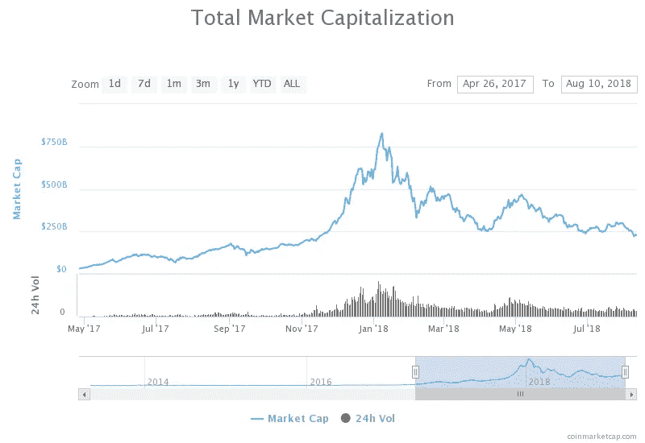
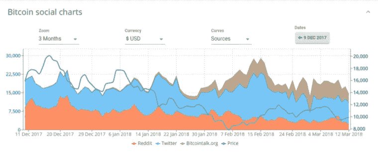
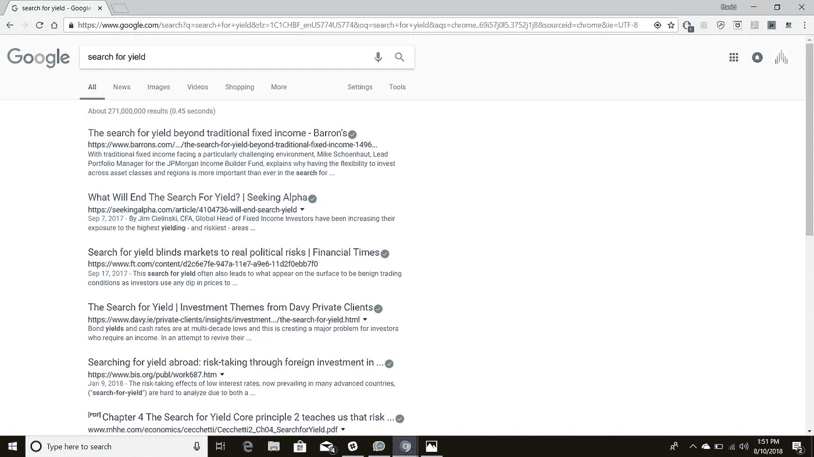
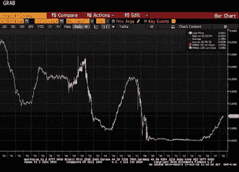
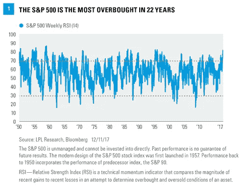
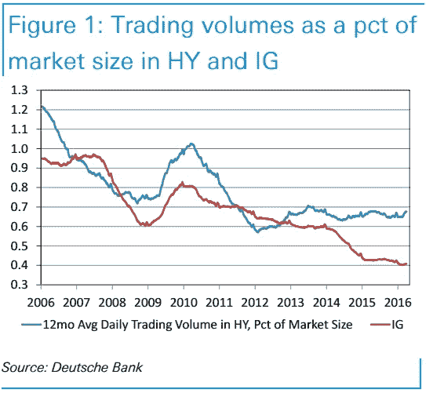

# 以 65 英里的时速开到 90 英里

> 原文：<https://medium.com/hackernoon/going-90-in-a-65-15e662018eb7>

如果你从事加密工作，你会知道“机构来了！!"在这个时间点上，我们都有一个相当敏锐的感觉，即 11 月 17 日至 1 月 18 日的市值上涨在很大程度上是由散户投资者的狂热推动的，所以本文不会解决这个问题。我将试图解决的是“为什么”我相信投资界和媒体对该资产类别有相当大的关注。

如上所述，过去一年，社交媒体和传统新闻对该资产类别进行了大量报道，显示出对相对较新且波动较大的新兴资产和技术的兴趣。这种关注当然很好，但是我被“为什么”所吸引。当这一资产类别的市值已从约 1 万亿美元降至今天的 2300 亿美元时，高盛、富达、野村、摩根士丹利、贝莱德和其它大型机构为何会审查并创造进入该市场的解决方案？为什么 EOS 和 Telegram 能够从投资者、散户和“机构”那里筹集到数十亿美元？所有这些关注来得太快太早了吗？

From Solume.io

## **太早太多关注？**

有几个可能的原因使得加密市场获得了投资界和媒体如此多的关注(并且在早期就有了这样的观点)。第一个潜在原因是，在过去 10 年里，经历了几次 QE 之后，传统固定收益市场的收益率下降了。第二个潜在的原因是公共股票市场的高估。花点时间在谷歌上搜索:“搜索收益率”，你就会明白我的意思了:

**QE 杀了电台明星？**

正如加思·弗里森(Garth Friesen)在谈到无风险资产供应的增加(T4)时所写的，他指出:“2008 年房地产市场危机后，全球央行通过购买大量政府证券，通过量化宽松(“QE”)拯救了金融市场。既然 QE 正在逆转，市场需要为所有债券寻找新的买家。新买家比美联储对价格更敏感，对购买低甚至负实际(经通胀调整)收益率的债券不那么热情。此外，政府供应量也在增加。由于减税和其他支出措施，预计 2019 年财政赤字将超过 1 万亿美元。增发将加剧供需失衡。

Bloomberg screenshot via Seeking Alpha

截至 2018 年 7 月**，3 个月期美国国债收益率自 2008 年以来首次突破 2%。就在 2015 年末，收益率曾短暂跌至零以下。**

**股票市场估值过高**

热情和关注的第二个潜在原因是股票市场估值过高。波士顿咨询集团(Boston Consulting Group)的研究证实了这一点:“**在 2017 年 10 月底至 11 月初的两周时间里，波士顿咨询集团调查了 250 名投资者，他们管理着约 5000 亿美元的资产，征求他们对全球宏观经济环境、股票市场以及他们投资或跟踪的公司持续创造价值的能力的展望和预期**。几乎四分之三的受访者是投资组合经理；63%集中在美国，而其他大多数投资于全球。

**总体而言，68%的受访者认为市场被高估了——平均高出 15 个百分点。**(参见附件 1。)这是去年调查中 29%的投资者认为市场被高估的两倍多。在 2017 年调查中自称看跌的人中，79%的人认为市场估值过高是他们悲观的原因。总体而言，超过三分之一的投资者(34%)看空未来三年的市场潜力，比 2016 年调查中自称看空者的比例(16%)增加了一倍多。

[持续不断的购买](https://www.marketwatch.com/story/stock-optimism-swells-as-sp-500-hits-most-overbought-level-in-22-years-2017-12-27)已经将估值推高到了不仅仅是拉伸的水平，而且是拉伸到了一个历史性的程度。正如 LPL 金融最近指出的那样，作为技术动力指标的相对强弱指数处于 1995 年以来的最高水平，这表明标准普尔 500 指数处于 22 年来最超买的水平。

**结论**

在大衰退之后，投资者多年来一直在寻找收益率，在德意志银行(Deutsche Bank)等投资机构，固定收益等传统资产类别已经枯竭:

正如 Matt Turner 在 2016 年的一篇文章中提到的那样:“华尔街的固定收益业务陷入了困境。收入下降，投资银行正在裁员。”

正如英国《金融时报》在 2018 年 1 月报道的那样:“美国各银行近日公布的第四季度业绩显示，投资银行面临持续压力，**尤其是在其交易业务的固定收益部门**。”

收益率被压缩，从交易中获得的收入受到严重影响。机构和投资者很可能需要一个“英雄”

我们看到股票市场也出现了同样的问题——大多数重要的资产管理公司认为目前的状况被高估了。我认为我们有一个双重问题:缺乏收益率工具，过多的资本追逐实际上可以获得的任何收益率。

根据 PitchBook 的数据，全球私募股权和风险投资基金的金库中有超过 10 亿美元的承诺资本。准确地说，截至 2017 年 6 月底，基金经理可动用近 1.107 万亿美元的承诺——1454 亿美元分配给风险投资，9615 亿美元分配给私募股权投资；这些是前所未有的金额。

但是，加密资产是“英雄”吗？为了增加一些轻松，有人可能会说这就像让一只小狗从外星人入侵中拯救世界一样——当然，完全可能，但从概率的角度来看——对这只小狗来说不太可能，也不公平。但就像那只小狗一样，加密资产对这个世界来说相对较新，它们需要找到自己的方式，需要指导和结构。我们现在可以实时看到这一点，社区中的许多人都在关注扩展、治理、托管……这样的例子不胜枚举。技术对现实世界影响的真实解决方案。这一资产类别需要时间来成熟，不能要求它成为解决所有问题的灵丹妙药，这些问题导致了大衰退，并随之而来。