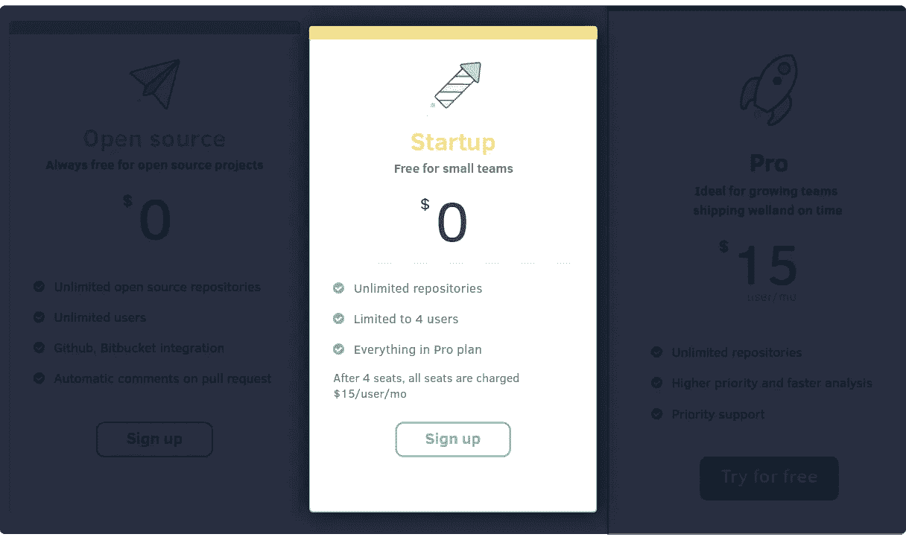

# 对软件开发的未来孤注一掷

> 原文：<https://medium.com/hackernoon/going-all-in-on-the-future-of-software-development-9db11ab5793f>

当我们开始 Codacy 时，我们最大的目标之一是帮助尽可能多的开发者更好地管理软件质量。我们将此作为目标，因为我们知道在没有数据点的会议上以及在*直觉驱动的*决策上，解决[技术债务](https://hackernoon.com/tagged/technical-debt)所花费的时间。

今天，我们希望更接近第一个目标:我们通过我们新的[启动计划](https://www.codacy.com/pricing)，为多达 4 名开发人员的团队提供**代码自由。**

# 我们为什么要这么做？

根据我们的经验，小型团队/公司的首要任务是尽快交付产品。他们这样做是为了确保能够抓住一个机会或一个里程碑，让他们进入下一个阶段。因此，软件质量比将正确的产品推向市场重要得多。

然而，当团队成长时，质量就成了瓶颈。团队开始看到生产中的抑制，因为积累的技术债务慢慢成为任何路线图的主题。此外，当团队开始招聘时，他们会看到不惜任何代价的速度只能让你到此为止，可持续性/可维护性是健康的长期项目的关键部分。在某些情况下，当公司没有足够早地解决这个问题时，团队甚至会失去关键人物，因为管理技术债务并不是快乐的长期来源。

很多时候，公司意识到这一点时已经太晚了。当质量瓶颈出现时，我们往往已经做出反应，而不是提前计划。在一个花费[1.7 万亿美元修复漏洞](https://www.tricentis.com/software-fail-watch/)和[1.1 万亿美元技术债务](http://servicevirtualization.com/report-software-failures-cost-1-1-trillion-2016/)的世界里，我们真诚地相信从一开始就关心质量是核心，并将成为竞争优势。

我们以这些信念为生活准则，我们向最多 4 人的团队免费展示我们的产品，展示我们新的创业计划。

这意味着您可以使用我们的产品来自动化和分析质量的任何数量的公共和私人回购免费和多达 4 个开发人员的工作。

# 为什么从商业角度来看 Codacy 有意义？

作为一家公司，随着越来越多的大公司成为我们的客户，我们逐渐明白，要真正发挥影响力，我们需要为未来的大公司服务。

## 我们希望这能在两个主要方面帮助我们。

第一种方式是口口相传。我们希望通过免费提供我们的产品，团队可以传播消息，让更多的开发者和组织使用我们的产品。

第二种方法是减少公司开发人员使用我们产品的障碍。我们希望，在每个大公司中，我们能够对几个较小的团队有用，然后这些团队可以从整合他们的分析和质量自动化集成中受益。这已经大规模发生了；我们只是让它更容易接近。

我们投入了很大一部分收入，因为我们当前的客户可以迁移到新的免费计划。但是，我们正在采取一种长期的方法，通过帮助新的令人兴奋的公司推出下一代赢得市场的产品，我们正在取得胜利。

# 下一步是什么？

如果您是我们的客户，并且只有 4 个座位或更少，您现在可以过渡到我们的新启动计划。如果您在过渡期间需要任何帮助，请联系我们。

我们希望收到您的来信。我们从我们的社区获得了持续的、友好的和建设性的反馈，并在此基础上建立了我们的公司。我们将继续倾听你们的声音，并确保我们按照你们的想法行动。

我们需要你帮忙传播消息。请做 [tweet](https://twitter.com/home?status=Codacy%20is%20now%20free%20up%20to%204%20seats!%20https%3A//www.codacy.com/pricing) ，发邮件，走远走广。

为您服务是我们存在的理由，我们很高兴能这样做。

💪

