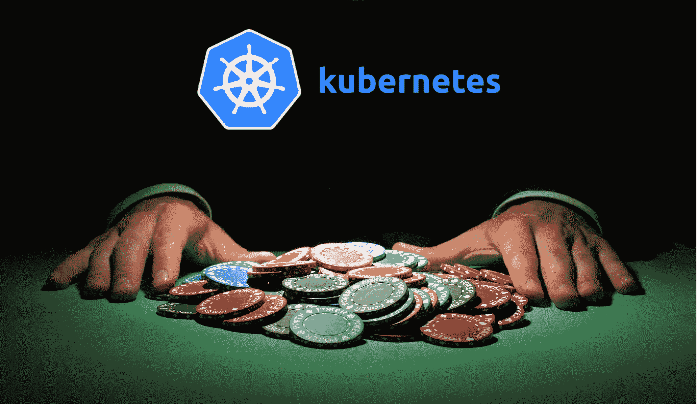
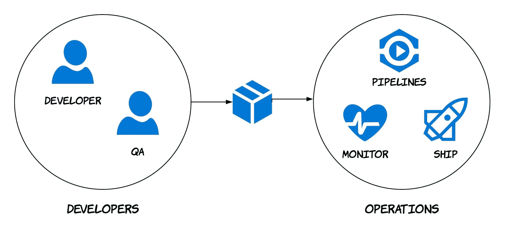
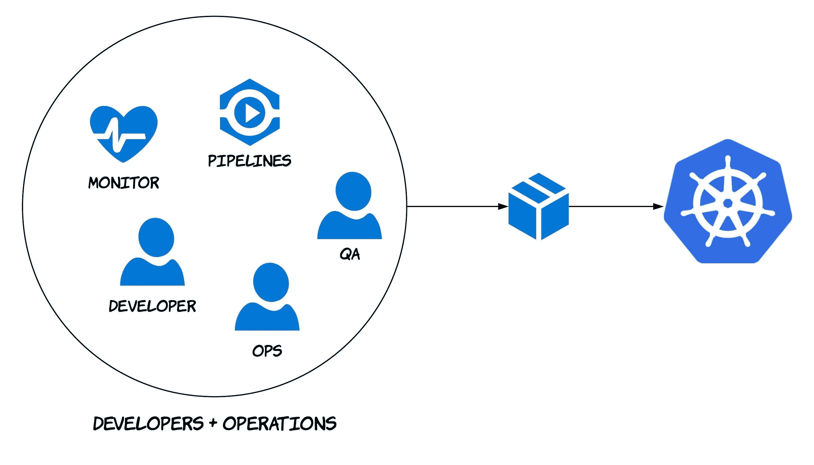

# 与 Kubernetes 一起全力以赴(第 1 部分)

> 原文：<https://medium.com/hackernoon/going-all-in-with-kubernetes-part-1-be0852a87ea2>

我曾经认为，当我们(carsguide)在我们的 AWS 基础设施上推出 Docker 容器，并逐步实现容器化时，我们会梦想成真，但事实上，我们已经完全采用了 Kubernetes——头先。从表面上看，我们有两种选择；要么冒险收获，要么什么都不做，留在“安全区”。我喜欢冒险，但说实话，我不确定我们是否准备好了 Kubernetes。事实证明我在某种程度上是错的。

传统上，这是许多软件团队中发生的事情；工程师建造东西，打包，然后交给运营部门，由运营部门管理、部署和运营管道。(我们的运营团队构建了所有当前的管道)。流程看起来有点像这样；

Most teams are split

我坚信应该给工程师自由，让他们按照自己的意愿去构建，按照自己的意愿去部署。工程师喜欢所有权，如果他们知道如何部署、运行和监控他们正在构建的东西，这会让工程师变得更加强大。

2018 年初，我们技术团队的几个人围坐在一张桌子旁，同意与一家名为 [devops 的咨询公司抖音](https://www.vibrato.com.au/)合作。最初的协议是调查可能的 CI/CD 工作流以及如何运行我们的堆栈。这种约定带来了一个选择；全押 Kubernetes 或保持安全，使用 docker/ECS。

> 长话短说，我们全押了库本内特。

几个关键原因；

*   我们正在建立一个新的微服务平台
*   基于上述原因的成本优化
*   工程师可以从头到尾建造它*和*并肩作战，它是工程的未来

What we really want our teams to be

在[之前的一篇文章](https://engineering.carsguide.com.au/monolith-applications-do-or-dont-fc1da6bf17b9)中，我谈到了为什么要使用微服务。概括地说；我们正在建立一个新的平台。所有这些平台都是围绕 Docker 容器上运行的微服务构建的。鉴于我们将拥有比目前更多的服务，我们需要一种快速简单的方法来部署和扩展每项服务，而无需配置 ALB、SSL 证书、自动扩展组、目标组、EC2 映像等开销。Kubernetes 使用每个服务中定义的代码为我们完成所有这些工作，它为我们编排服务并通过网络来实现这些工作。

这样想吧；一个应用可能只需要 10%的 CPU 或 10%的 EC2 内存，如果像我们这样在每个 EC2 上运行一个应用，这就是 90%的浪费。为了降低成本，我们需要在单个 EC2(节点)上编排许多容器。Kubernetes 解决了这一问题，它通过协调尽可能好地利用计算节点来做到这一点。

我们新的 Kubernetes staging 集群在 7 个 ec2 上运行，超过 95 个 pod(应用程序)运行 200 多个容器，负载平衡，具有高可用性。我们目前的分期超过 50 EC2s(目前 126(！！)EC2s 如果算上我们所有的代码库)。Kubernetes 每月应该节省数千美元。

我们目前的管道很复杂，大多数工程师不知道他们如何工作，或者如果他们想创建一个新的管道，他们应该如何开始。Kubernetes 让我们从每个服务存储库中的代码定义服务应该如何运行。

如果一个工程师希望一个服务有 5 个 pods，他们将自动缩放定义设置为 5，并推送到存储库。几分钟后，他们得到了 5 个豆荚。如果您想让 cron 作业运行，再次在代码中定义它们，push，几分钟后您的 cron 作业就会运行。Kubernetes 允许这种情况发生，一切都在代码中。

工程师能够在几个小时内创建管道、设置服务要求、如何扩展、需要什么容器并部署到暂存区。不再需要几个星期。

> 服务是用代码定义的，任何工程师都可以在不了解云提供商的情况下理解。GCP、AWS、Azure——没关系，不管在什么平台上运行，同样的代码都会完成同样的任务。

在我们的旅程中，我将继续写这篇文章。但是上面给了你我们决定尝试它的主要原因的见解。我打算介绍的一些内容；

*   我们用于 CI/CD 的工具
*   我们目前面临的问题(确实有一些)
*   日志记录和警报
*   你建造它，你拥有它

你已经开始了在 Kubernetes 上的旅程了吗？总是渴望听到别人对他们经历的看法。