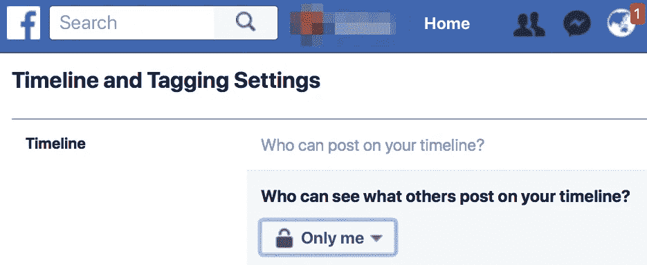
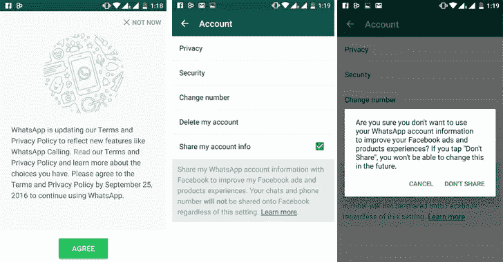
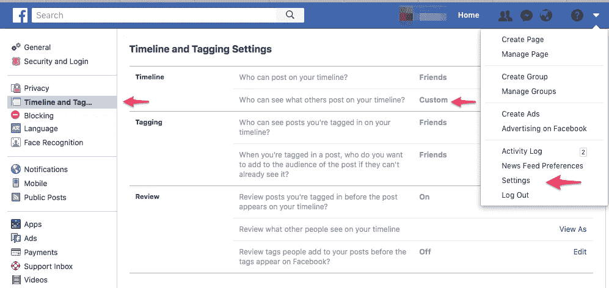
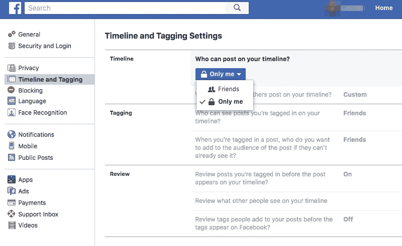
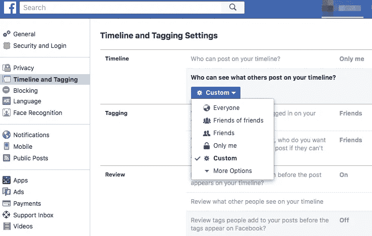
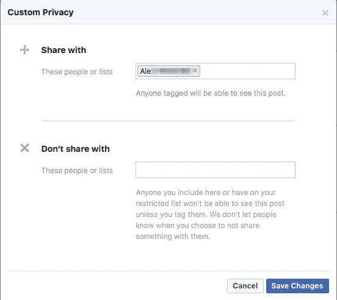

# 在社交媒体上反社会

> 原文：<https://medium.com/hackernoon/going-antisocial-on-social-media-f700eda0bb18>

过去几年，社交媒体一直在疯狂发展。他们帮助我们与世界各地的人们联系，并以我们从未想象过的方式分享他人的生活。社交媒体迅速取得压倒性成功的一个重要因素是它是免费的。但事实上，这些服务是有价格的，最近，我开始觉得价格可能太高了。

社交平台希望我们在一定程度上分享我们的隐私，以换取他们的服务。当我第一次报名时，这似乎不是什么过分的要求。只要他们没想到我的信用卡或财务细节，我就不认为我的生活对任何人有任何利益或价值。所以我心甘情愿地交出了我的隐私钥匙，就像其他数百万人一样。作为回报，我开始分享那些在社交平台上分享隐私和生活的人们的生活。

这似乎是一个双赢的局面。但事实是，一旦你的生活在网上，坏人就很容易发现你的一切。你值多少钱，你住在哪里，你的朋友，你的喜好，你的弱点，你的日常生活…以及如何利用这些数据来对抗你的兴趣。从简单的利用你的财务信息进行盗窃，到恃强凌弱、敲诈勒索、为恐怖主义招兵买马、盗用身份、操纵选举，以及我想都不敢想的事情。

问题是我一直觉得我太微不足道了，不应该成为这种犯罪的目标。总是发生在别人身上的事，不是我或者我的。

一年前，我的一个朋友失踪了。他的家人想尽一切办法寻找他，但警方找不到他的任何踪迹。这位朋友曾经在脸书非常活跃，有着深刻的评论和敏锐的智慧。所以接下来的一年，我会时不时地查看他的页面，希望他只是异想天开地离开了社交媒体。

最后，差不多一年后，有人在我朋友的脸书时间线上贴了一个新闻剪报。这是一份警方报告，其中谈到了抢劫，对受害者的致命伤害，警方对袭击者的追踪，他们的逮捕，以及他们带领警方到他们隐藏受害者尸体的地方。

受害者是我失踪的朋友。这是一场愚蠢的悲剧，因为他是一个乐于助人、慷慨大方的人，唯一的罪过是他富有，这是他作为一名企业家来之不易的成功的结果。

当我准备在他的脸书时间线上添加 RIP 评论时，我停顿了一下。我唯一希望看到我评论的人是我的朋友，但是他已经走了。不知何故，感觉不对劲。我朋友的时间线通常充满了他的个性，看到它充满了这些 RIP 评论是令人不安的。

但更让我担心的是，如果有人决定推测他的死因呢？那也是在他自己的时间线上。正如诗人所说:

> 亲爱的大人，好名声是男人和女人灵魂的直接宝石。偷我钱包的就是偷垃圾。这是什么，没什么:
> “这是我的，这是他的，成千上万的奴隶。但是他从我身上偷走了我的好名声
> ，抢走了我不能使他富裕的东西
> ，让我变得更加贫穷。

当然，这些评论只能由我的朋友添加为“朋友”的人发表。但是一个松散的评论就足够了。我们都见过社交媒体上发布的此类评论，以及它会如何发展。

也许人们说什么对他来说已经不重要了。没错，但看到毫无根据的指控不受质疑会伤害到他亲爱的人。所以这对我不起作用。

例如，几年前，我的另一个同学被发现死在家中。有谣言说他的尸体被警察发现了，情况很危险。这就是这个男孩，一个说话温和，温柔的灵魂。印度是一个非常保守的国家，甚至没有人再谈论他了。他的家人一定很难接受。

回到我朋友身边。他不是那种在战斗中退缩的人。在他活着的时候，任何敢于在他的时间线上张贴任何有争议的东西的人都会被迅速安置到位。但现在他走了，他朋友列表中的任何人都可以说他们想说的话，因为他不再为自己辩护了。

老实说，在他的时间表上还没有这样的评论。或许即使有人这么做了，他的朋友也会跳出来为他辩护。但正如一句老话所说，话一旦说出口就再也不能收回。

我必须承认，我不知道劫匪是谁，也不知道他们是否通过社交媒体跟踪并锁定了我的朋友。但有可能他们做到了。就我而言，这绝对是一个安全比遗憾更好的领域。

我的朋友对此无能为力，已经太晚了。

但是我们其他人可以，也许我们应该。理想的解决方案是利用社交媒体，同时不分享太多你的隐私。

事实上，我早就被脸书吓到了。在最初与脸书签约后，我搬回了印度，并换了电话号码。我从未给过脸书我的新印第安号码。然而过了一会儿，脸书开始给我发邮件，推荐我可能想成为“朋友”的其他脸书用户其中一半来自与我的印度电话号码相关的地址簿。我没有和脸书分享的那个。

脸书如何得到这些名字其实并不神秘。脸书几年前收购了 WhatsApp。一段时间后，他们发布了 WhatsApp 的更新。它包括一个隐藏的功能，默认情况下，WhatsApp 上的所有联系人都与脸书共享。消息传出后，我去了脸书，关掉了这个功能。但这是一个“马失前蹄”的例子。

WhatsApp 随后受到多国政府的质疑，并因未经授权与脸书共享数据被意大利政府罚款 300 万欧元。他们别无选择，只能移除该功能。我敢肯定，脸书并不真的介意罚款，因为所有这些数据对他们来说都是无价之宝。如果你错过了，我设法找出了 Whatsapp 更新如何确保默认情况下与脸书隐藏共享的参考。

When Facebook managed to steal my phone’s addressbook via a sneaky WhatsAppupdate.

自从那件事之后，我就再也不能信任脸书了。出于某种原因，其他社交网络不像脸书那样深入我的脑海。这包括脸书旗下的 WhatsApp，这是印度数百万人的首选即时通讯应用。

无论如何，我对脸书有点过于偏执，从平台上删除了我所有的照片和个人数据。从那以后，我再也没有在上面贴过任何东西，而且经常几个星期都不访问这个平台。我确实保留了我的脸书账户，部分原因是为了帮助那些丢失了我详细信息的朋友与我取得联系，部分原因是为了跟踪脸书发生的事件，以及脸书本身在做什么。

不幸的是，想要逃离社交网络的魔掌并不那么容易。我妻子在上面，但是不起作用。当我的孩子为了和朋友保持联系而转学时，她坚持要一个脸书账户，尽管她还未成年。尽管脸书官方不允许带孩子，但他们并没有努力去执行，因为这些孩子是他们未来的顾客。我的孩子开了一个账户，声称自己比实际年龄大。她所有的朋友都这样做，并上传他们自己和家人的照片。因为我的警告，她自己也不发太多。但她确实上传了一些东西，也许有一天会被某些人用来针对我们中的一个或两个。

当我们到达那座桥时，我们将不得不穿过它。

回到我身上，我有两个问题。我想改变谁可以看到我的脸书时间线上的内容。我想避免让我的朋友承担保护我名誉的责任，如果我出了什么事的话。

因此，我去了脸书，点击设置，然后点击时间线。

有两种可能性。

第一个有点极端，只允许“只有我”在我的时间线上发布。私人信息将是脸书任何人联系我的唯一方式。这让我觉得明显不合群。

并不是说在社交上反社会是不好的。事实上，我刚刚读到一项研究，称花更多时间在社交网络上的孩子比花更多时间在现实生活中的孩子更孤独、抑郁，更有可能出现精神问题。

第二个选择很有趣。通过选择“自定义”作为“谁可以看到其他人在您的时间线上发布的内容？我可以指定一个或几个朋友能够看到帖子。这意味着如果我消失了，这个朋友将是唯一一个可以看到我页面上的评论的人。如果他看到一条暗示作者真心关心我的评论，他可以用自己的脸书账户给他发信息，告诉他真实的情况。

这样，我的好友列表中的任何人都可以在我的时间线上发布他们想发布的任何内容。但是除了他们自己和我发布的内容，他们在我的时间线上什么也看不到。总之，投机评论只有投机者本人(以及我指定的朋友)才能看到。我喜欢这一点是投机者将没有线索，没有人可以看到他的评论，直到他看到没有人回应。真是太贴心了！

所以我继续前进，把这作为我的默认脸书设置，并在得到他的许可后，委托一个朋友作为我的时间线看守人。到目前为止，他是唯一一个可以在我的页面上看到评论的人(如有必要，联系评论者)。我页面的所有其他访问者只能看到我发布的内容(以及他们自己的评论)。有时，我会发表一篇文章，希望在我的页面上展开一场积极的辩论，让每个人都能看到我时间线上的所有评论。在这些情况下，我可以更改“谁可以看到其他人在您的时间线上发布的内容？”的设置敬“朋友”并在讨论结束后恢复到上述默认设置。

当然，有一个条件。脸书给的，脸书可以拿走。脸书的存在依赖于社会互动，如果他们发现太多人选择这种设置，他们可能会简单地取消这个选项。

俗话说，天下没有免费的午餐。或者自由的脸书。

保护我隐私的唯一方法就是删除我的脸书账户。然而，这样做有点极端，因为我将无法访问给我带来朋友去世消息的网络。

我的问题是我想要我的蛋糕，我也想吃它。

最近有一份有趣的报告指出，*“…社交媒体似乎以牺牲真相为代价系统地放大谎言，没有人——无论是专家、政治家还是科技公司——知道如何扭转这一趋势。”*

在这种情况下，我们可以预计未来几年还会有更多这种性质的战斗。这是我们向社交媒体放弃隐私以换取访问他们网络的代价。我们将不得不重新定义限制，比如当我决定对“谁可以看到别人在我的时间线上发布的内容”说“没有人”时但这很像在沙滩上画线。每划一条线，面簿就会刷掉沙子(改变规则)，循环往复，永无止境。

在某个地方，我的朋友一定在嘲笑这一切的疯狂。