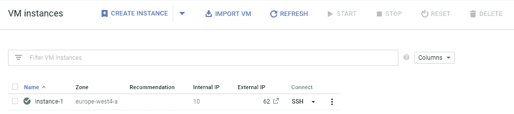
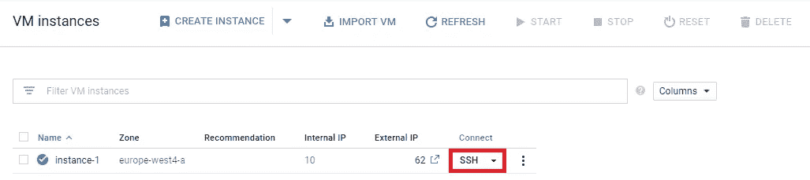
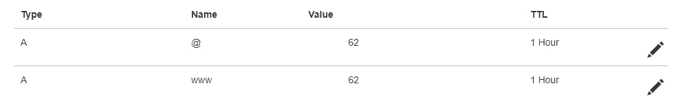

# 使用谷歌云计算引擎上线

> 原文：<https://medium.com/hackernoon/going-live-with-google-cloud-compute-engine-70542da89aa8>


在[之前的文章](https://hackernoon.com/trials-and-tribulations-of-google-cloud-hosting-a-tutorial-26395eb25636)中，我们看到了使用谷歌的应用[引擎](https://hackernoon.com/tagged/engine)上线是多么容易。我们还了解到，从长远来看，这样做的代价会有多大。对于初创企业和中小型企业来说，一个更简单、更便宜的解决方案是谷歌的计算引擎。

> **免责声明**:这个话题是针对熟悉或者不回避某个终端的开发者。

在讨论这个话题时，我最常听到的问题是:“App Engine 和 Compute Engine 有什么区别？”。一个过于简单的答案是，App Engine 提供开箱即用的魔法，而 Compute Engine 让您实现自己的魔法。

一个更深入的答案是:

*   App Engine 是一个**平台即服务**，您只需在其中部署代码，它就会自动处理其他更复杂的系统，比如扩展。
*   计算引擎是一个**基础设施即服务**，其中所有配置都由您(开发人员)提供。操作系统、服务器设置、扩展、SSL…所有这些都将手动处理。

对于所有的体力劳动，你确实有一些主要的好处，其中两个是:灵活性和成本。

请[阅读上一篇文章](https://hackernoon.com/trials-and-tribulations-of-google-cloud-hosting-a-tutorial-26395eb25636)以便创建您的 [Google](https://hackernoon.com/tagged/google) 云项目并安装 Google Cloud SDK。从现在开始，让我们再次假设我们是 example.com 的所有者。

转到您的`Google Cloud / Compute Engine / VM instances`部分并选择**创建实例**。从这里开始，您应该:

*   给你的实例起一个名字(**警告:**它不能轻易改变，所以给它起一个好名字)
*   选择一个区域——这决定了你的数据存储在哪里，以及你将拥有怎样的计算能力(详情[此处](https://cloud.google.com/compute/docs/regions-zones/))。请不要以为这一步会影响总成本…有些区域比其他区域更贵。
*   选择 CPU——这也会影响成本。在我们的例子中，我们将选择最小的(微 1 共享 vCPU，具有 0.6GB RAM，也称为*f1-微*)
*   选择操作系统—选择一个您熟悉/熟悉的操作系统(我会选择 CentOS 7)
*   还要确保你检查 HTTP，HTTPS 交通。稍后我们将添加我们自己的 SSL 证书。

您应该能够在**虚拟机实例**视图中看到您的实例，如下所示:



您将看到您的实例有一个内部 IP 和一个外部 IP。我们关心的是外部 IP，因为我们将把它添加到我们的注册商 DNS 管理器中，这样我们就可以将域名链接到该服务器。

然而，在我们这样做之前，我们需要确保我们保留了一个静态 IP。我们目前看到的是所谓的**短命** IP(意味着它不会持续太久)。

为此，转到`Google Cloud / VPC Network / External IP addresses`并点击**保留静态地址**:

*   给它一个名字，这样很容易记住它属于什么，我通常使用域名
*   选择一个 IP 版本(如果您不确定应该选择什么，请选择 IPv4 —区域类型),然后
*   **确保将它附加到您的虚拟机实例**。你得到一个静态的“免费”IP 作为你的帐户的一部分。其他静态 IP 地址如果没有连接到机器，则按小时计费。

回到`Google Cloud / Compute Engine / VM instances`，你会发现你可能有一个不同的外部 IP 地址。这个是静态的，我们可以将它添加到我们的注册器中。我们将在我们的服务器实际显示一些东西之后再做。

我们需要在服务器上安装一些东西，所以单击带有我们实例名称的表格中的 **SSH** 按钮:



根据您选择的操作系统，接下来的步骤会有所不同，但如果您选择了 CentOS，软件包管理器将会是 **yum** 。我们需要运行以下命令:

```
sudo yum install epel-release # the CentOS EPEL repository
sudo yum install nginx # our web server
sudo systemctl start nginx # to run nginx
```

此时，如果我们在浏览器中键入我们的静态 IP 地址，我们将看到默认的 Nginx 登录页面。到目前为止一切顺利，现在我们需要教它为我们自己的网站服务。我们将把它配置成一个静态 HTML 页面:

*   首先让我们创建一个文件夹来存放我们的站点

```
sudo mkdir -p /var/www/example.com
```

*   用一些随机内容创建一个*index.html*文件

```
echo "Hello World" > /var/www/example.com/index.html
```

*   我们还需要将这个文件夹的所有权从根用户更改为谷歌云用户。幸运的是，该用户存储在一个系统变量中，名为 *$USER*

```
sudo chown -R $USER:$USER /var/www/example.com
```

*   我们还应该更改这些文件夹的权限，以便系统可以读取它们

```
sudo chmod -R 755 /var/www/example.com #755 for folders
sudo chmod -R 644 /var/www/example.com/* #644 for files
```

*   创建一个 nginx 配置文件，它将在端口 80 上服务我们的站点。在这里，我们可以选择创建*站点可用的*和*站点启用的*文件夹，或者选择快捷方式，在 *conf.d* 文件夹中创建我们的文件。我们采用第二种方案。传统上，您会将配置文件命名为与您的域相同的名称，后跟*。conf* 分机，像这样:

```
sudo vim /etc/nginx/conf.d/example.com.conf
```

如果 VIM 不好用，不要担心，我们只需要把这个粘贴到它里面:

```
server {
    server_name localhost; #example.com www.example.com;

    location / {
        root  /var/www/example.com;
        index  index.html index.htm;
        try_files $uri $uri/ =404;
    }

    error_page  500 502 503 504  /50x.html;
    location = /50x.html {
        root  /usr/share/nginx/html;
    }
}
```

然后按 **ESC** 然后按 **:wq** 保存并退出文件(记住这个)。这是最基本的配置文件…你给它我们网站的根目录，服务器的名字，然后你就完成了。在我们将域名与服务器 IP 地址链接之前，*服务器名*将是*本地主机*，之后我们可以在这里写入实际的域名。

接下来，我们需要禁用 nginx 运行的默认页面，因此编辑 nginx.conf 文件，如下所示:

```
sudo vim /etc/nginx/nginx.conf
```

按下 *Insert* 键，这样您就可以编辑文件，找到 *http {}* 部分，并通过在每行前面添加#注释掉整个 *server {}* 块，然后保存并退出文件。

差不多了，我们只需要重启 nginx。

```
sudo systemctl restart nginx
```

打开浏览器选项卡，导航到服务器静态 IP 地址 aaaaaaaand:


为什么，我们做的一切都是对的……对吗？嗯，不…欢迎来到 SELinux 的奇妙世界。如果你使用的是没有 SELinux 模块的 Linux 发行版，比如 Ubuntu…你可能已经安装并运行了。我们这些使用 Cent OS 或其他红帽发行版的人被困在了这里。

SELinux 最初是由 NSA(是的，就是 NSA)和 Red Hat Software 创作的，后者提供了一种访问控制的安全机制。我们已经配置好了，但是 SELinux 不让 nginx 访问它们。要使它工作，只需运行以下命令:

```
sudo restorecon -v /var/www/example.com/index.html
```

请记住它，因为每次在这里添加新文件夹或文件时，您都需要运行它。至于为什么会这样，我把这篇文章留给你，这篇文章解释了 SELinux 的基础知识。

再次刷新页面，发现了！我们提供静态 HTML 页面。接下来，让我们将我们的域名与这台机器链接起来。

在[之前的文章](https://hackernoon.com/trials-and-tribulations-of-google-cloud-hosting-a-tutorial-26395eb25636)中，我提到我使用 [**GoDaddy**](https://www.godaddy.com) 作为我的域名注册商。不管你用的是什么，下一步应该是相似的。登录您的域名注册商，进入您的域名 **DNS 管理器**。假设您使用 IPv4 作为静态 IP，添加两个新记录:

*   Type: A，Host: @，指向:您的 VM 实例的外部(静态)IP
*   Type: A，Host: www，指向:你的 VM 实例的外部(静态)IP



Registrar DNS Records

上表中，*名*为*主机*，*值*为静态 *IP* 。如果你选择了 IPv6，你可以做同样的事情，但是不是用 **A** 记录，而是用同样的方式创建 **AAAA** 记录。

编辑您的服务器配置文件并添加正确的域名(当前是 localhost)

```
# edit config file
sudo vim /etc/nginx/conf.d/example.com.conf# update server_name from this
server_name localhost; #example.com [www.example.com;](http://www.example.com;)# to your domain name
server_name example.com [www.example.com;](http://www.example.com;)# make sure to restart nginx again
sudo systemctl restart nginx
```

DNS 更改可能需要一段时间才能传播，但一旦传播，您将能够使用自己的域名而不是静态 IP 来访问您的服务器。

剩下的就是创建一些 SSL 证书，这样一切都可以在 HTTPS 上运行，我们就完成了。最简单和免费的选择是使用 **certbot** 实用程序，它生成由[颁发的证书，让我们加密](https://letsencrypt.org/)。Certbot 还提供基于您的 web 服务器的实用程序(在我们的例子中是 nginx ),您可以像这样安装它:

```
# this assumes you've already installed the
# epel-release repository in the previous steps
sudo yum install certbot-nginx
```

如果在创建 VM 实例时已经检查了 HTTP 和 HTTPS，那么可以跳过这一步。否则，我们需要允许通过防火墙访问端口 80 和 443，因此运行以下命令:

```
# for systems with firewalld firewall
sudo firewall-cmd --add-service=http
sudo firewall-cmd --add-service=https
sudo firewall-cmd --runtime-to-permanent# for systems with iptables firewall
sudo iptables -I INPUT -p tcp -m tcp --dport 80 -j ACCEPT
sudo iptables -I INPUT -p tcp -m tcp --dport 443 -j ACCEPT
```

完成这些步骤后，我们可以要求 certbot 为我们的域和子域颁发 SSL 证书，如下所示:

```
sudo certbot --nginx -d example.com -d www.example.com
```

如果您是第一次运行它，certbot 会问您几个问题，其中一个问题与 HTTP 流量有关；具体来说，如果我们允许 HTTP 流量或只允许 HTTPS，我会选择:"`Secure - Make all requests redirect to secure HTTPS access`"

Certbot 会自动用新生成的 SSL 证书更新您的 nginx 配置文件。你可以在这里测试你的 SSL 证书的强度。这些是免费的，但需要每 3 个月更新一次。

有两种方法可以解决这个问题，您可以:

*   每 3 个月手动运行一次`certbot renew`(#无聊，#乏味，#难忘)或
*   创建一个系统 cron 作业来为您运行该命令

如果您创建一个 SSL 自动更新 cron 作业，建议您每天至少运行一次或两次该命令。在 CentOS 7 上，cronie 默认运行。

```
# verify croni is installed
sudo rpm -q cronie# install croni if necessary
sudo yum install cronie# check if crond service is running
sudo systemctl status crond.service# display help info about cron jobs
sudo cat /etc/crontab# open cron jobs file in default editor
sudo crontab -e# add cron job to update SSL every day at 2:00 AM
0 2 * * * /usr/bin/certbot renew --quiet# restart crond service after making changes to cron job
sudo systemctl restart crond.service
```

如果你想使用 nginx 作为反向代理(如果你在另一个端口上运行 NodeJS 实例)，你只需要编辑你的 *example.com.conf* 配置文件如下:

```
server {
    ...

    location / {
        proxy_set_header X-Forwarded-For $remote_addr;
        proxy_set_header Host $http_host;
        proxy_pass "[http://127.0.0.1:3](http://127.0.0.1:1337)000";
    }

    ...
    # SSL configs added by certbot
}
```

记下 *proxy_pass* 并添加运行 NodeJS 服务器的端口。顺便提一下，你可能应该通过 [PM2](https://www.npmjs.com/package/pm2) 或者类似的过程管理器来运行你的节点。

你现在有一个非常基本的网站运行在谷歌云计算引擎与 SSL 自动更新。

恭喜你，编码快乐！