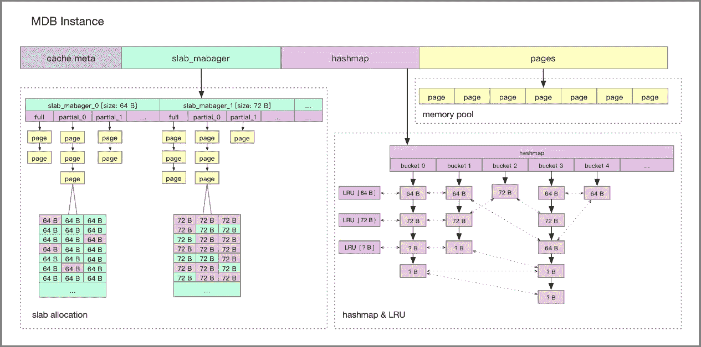

# 继续前行:NVM 缓存优化指南

> 原文：<https://medium.com/hackernoon/going-on-a-tair-an-alibaba-guide-to-nvm-caching-optimization-97f799675a44>

*阿里巴巴缓存技术团队关于如何将非易失性内存(NVM)部署到生产环境的最佳实践*

有效的数据存储在任何计算任务中都是必不可少的，但当你运行一个服务于数十亿消费者的多部门电子商务平台生态系统时，它是无可替代的。对于运营全球最大在线市场的阿里巴巴来说，这意味着开发自己的非易失性存储器(NVM)缓存服务包，统称为 Tair MDB，最初推出是为了支持天猫 6.18 在线购物节，然后进行优化以进行更广泛的推广。

为了诊断必要的改进，Tair 团队对系统进行了两次全链路压力测试，暴露了一系列问题，包括不平衡的写入和锁开销。今天，我们更仔细地看看阿里巴巴生产环境中的 NVM 基础，重点是在优化工作中发现的最佳实践。以及三个有助于确保长期可操作性的战略设计规则，相关领域的读者将发现 NVM 优化的丰富见解广泛适用于其他产品。

# NVM 的案例

在采用 NVM 时，Tair MDB 已经在阿里巴巴集团内部广泛部署。随着其用户空间网络协议栈和无锁数据结构的引入，单个单元的 QPS 极限已经超过了 1000 瓦口径。所有 Tair MDB 数据都存储在内存中，提高的单单元 QPS 限制使内存容量成为决定集群大小的最重要因素。

NVM 提供了更高的单个 DIMM 容量，同时也比 DRAM 便宜得多，这表明有可能突破单个单元内存容量的限制。

# NVM 进入生产环境:初步结果

端到端，在相同软件版本下使用 DRAM 节点数据的平均读写延迟水平，服务证明能够使用 NVM 正常运行，生产环境的压力远低于 Tair MDB 节点限制。在随后的章节中，将更详细地解释压力测试过程中遇到的问题以及解决这些问题的方法。

如前所述，单个 NVM 的最大 DIMM 容量高于 DIMM，这意味着相同 DIMM 容量的成本低于 DRAM。使用 NVM 来弥补不足的内存容量，可以大大减少 Tair MDB 容量集群的大小。如果将设备成本、电费和机架成本考虑在内，总体成本可降低 30%至 50%。

# 行动原则:NVM 实施指南

Tair MDB 使用 NVM 作为块设备，同时使用 PMem 感知的文件系统挂载(DAX 挂载)。在分配 NVM 空间时，第一步是在相应的文件系统路径中创建并打开文件，并使用 posix_fallocate 来分配空间。

## 首先要考虑的是:内存分配器

NVM 本质上是非易失性的。缓存服务 Tair MDB 将 NVM 识别为易失性设备，无需考虑原子性和崩溃后恢复，也无需显式调用 clflush/clwb 等命令将 CPU 缓存内容强制刷新回介质。

使用 DRAM 空间时，tcmalloc/jemalloc 等内存分配器是可选的。NVM 空间将文件(或字符设备)暴露给上层，因此首先要考虑的是如何使用内存分配器。开源程序 pmem[1]保护易失性内存管理库 libmemkind，以及类似 malloc/free 的易用 API。在大多数应用程序中切换时，这种模式提供了一个很好的选择。

Tair MDB 的实现没有使用 libmemkind[2]。为了解释这个选择，Tair MDB 内存布局将在下一节中介绍。

## 存储配置

Tair MDB 采用 slab 机制进行内存管理，它不会在使用时动态分配匿名内存，而是在系统启动时分配一个大内存。随后，内置的内存管理模块在这个大内存块中连续分布元数据和数据页，如下图所示:

Tair MDB 的内存使用分为以下几个部分:

缓存元数据:它存储元数据信息，比如片的最大数量，以及片管理器的索引信息。

Slab Manager:每个 Slab Manager 管理一个固定大小的 Slab。

Hashmap:全局哈希表的索引，使用线性冲突链处理哈希冲突，所有对键的访问都由 Hashmap 处理。

页面池:在启动时，页面池将内存分成页面，每个页面的大小为 1M。平板管理器从页面池中请求页面，并将它们格式化为指定大小的平板。

在启动时，Tair MDB 初始化所有可用的内存。因此，后续的数据存储部分不再需要操作系统动态分配内存。

使用 NVM 时，需要将相应的文件映射到内存中，以获得虚拟地址空间。内置的内存管理模块可以透明地使用这个空间。因此，在这个过程中，不需要再次调用 malloc/free 来管理 NVM 上的空间。

# 压力测试开始:问题暴露

部署 NVM 后，使用 100 字节的条目在 Tair MDB 上执行压力测试，产生以下数据:

引擎查看延迟:

客户查看 QPS:

如这些图表所示，基于 NVM 的读取 QPS 延迟大致相当于 DRAM 的延迟，而其写入 TPS 延迟大约是 DRAM 的三分之一。

## 分析

perf 结果表明所有的写性能损失都发生在锁上。这个锁管理的关键部分包括前面指定的内存布局中提到的页面写操作。在这种情况下，可能的原因是与 DRAM 相比，NVM 上的写入延迟更长。

在压力测试期间，pcm[3]用于查看 NVM DIMMS 的带宽统计数据，显示一个 DIMM 上的写入高度不平衡。在稳定状态下，该 DIMM 上的写入量超过其他 DIMM 的两倍。

上述内容的详细信息如下图所示:

在进一步探讨这些细节之前，下一节将概述用于 NVM 的 DIMM 放置策略。

## DIMM 放置策略

一个插槽配有四块 NVM DIMM，分布如下:

这种布局策略被称为 2–2–1。每个插座都配有 4 块 DIMM，分别属于 4 个不同的通道。使用多个通道时，CPU 会进行交错，以便更有效地使用内存带宽。在当前的放置策略和配置中，CPU 有一个 4K 单元，并在 DIMM 序列中交错。

## 诊断热点:不平衡的原因

根据内存交错策略，可以推断出所有写入都是在不平衡的 DIMM 上的单个区域中完成的，导致该 DIMM 比其他 DIMM 保留更多的写入。

这种情况下的下一个任务是识别导致写入热点的处理逻辑。一种简单的方法是定位可疑点并逐个排除它们。下面的部分描述了 Tair 团队用来确定处理逻辑的方法。

## 优化开始:定位热点

如上所述，写入热点会导致 NVM DIMM 访问不平衡。因此，优化的第一步是找到并处理写入热点，例如通过分散热点访问或将访问热点放入 DRAM。

Tair 团队使用 Pin 来寻找热点[4]。前面提到的 Tair MDB 通过对文件执行 mmap 来获得操作内存的逻辑地址。所以可以用 Pin 来抓取 mmap 的返回值，进一步获取 NVM 在程序内存空间的逻辑地址。然后，该团队继续使用 Pin 来清除所有操作存储器的编程指令，并计算从 NVM 映射到地址空间的每个字节的写入次数。

最后，确认书写热点的存在，并将其对应的区域建立为页面的元数据。该团队考虑了几个解决写入热点问题的选项，包括向每个 DIMM 添加填充和交错热点，通过 DIMM 将基本相似的热数据分组存储，以及将热点移回 DRAM。该团队的最终决定是将 slab_manager 和 page_info 移回 DRAM。修订后的结构如下:

通过这些更改，不平衡问题得到了有效解决，TPS 从 85w 提高到 140w，同时将引擎内写入延迟从 40us 降低到 12us。

## 解决过多的锁开销

当 TPS 在 140w 时，前面提到的 pthread_spin_lock 的开销仍然非常高。性能记录结果表明 pthread_spin_lock 使用了这个调用堆栈:

对 batch_alloc_item 的分析表明，初始化页面中的项目会将大量数据写入 NVM。这是大量时间被浪费的地方，因为写入 NVM 比写入 DRAM 慢。

按照 Tair MDB 的逻辑，只有在将页面链接到 slab_manager 时才需要加锁。因此，对该项目的初始化操作可以移出临界区。在这一发现之后，Tair MDB 代码中所有写入 NVM 的操作都进行了相应的筛选和优化。

优化后，pthread_spin_lock 的开销下降到正常范围，TPS 增加到 170w，而引擎内延迟为 9us。

## 优化结果

除了其他优化工作之外，平衡写入和锁粒度细化有效地减少了延迟，并将 TPS 提高到 170w，比之前的数据增长了 100%。介质的差异仍然比 DRAM 的写入性能低 30%。但是，由于缓存服务的特点是读多于写，这种不足不会显著影响整体性能。

# 通道发现:新的设计指南

基于他们的优化努力和生产环境试验，Tair 团队能够确定一组三个关键的设计规则来实现基于 NVM 的缓存服务。这些规则与特定的 NVM 硬件特性密切相关，这些特性会显著影响缓存服务的构建。具体来说，NVM 比 DRAM 密度更大、价格更低、延迟更高、带宽更小。它还存在不平衡的读写问题以及比读取延迟更高的写入延迟，并且当在相同位置重复写入时容易快速磨损。

## 第一条规则:避免写热点

Tair MDB 在实施 NVM 后遇到了写热点问题，写热点加剧了介质磨损，导致负载不平衡。在优化之前，写入压力正好落在一个 DIMM 上，反映出未能充分利用整个 DIMM 带宽。除了内存布局(以元数据和数据的混合存储为特征)，来自事务的访问也可能导致写入热点。

Tair 团队避免编写热点的方法包括:

通过将元数据移动到 DRAM 中来分离元数据和数据。元数据比数据更容易被访问。元数据的一个例子是前面提到的 Tair MDB 的 page_info。这使得 NVM 较高的写入延迟(与 DRAM 相比)对上层来说不那么不利。

在上层应用用于实现写入时复制的逻辑。在某些情况下，这可以减少指定区域的硬件磨损。对 Tair MDB 中的数据条目的更新不会就地更新先前的条目，而是在 hashmap 冲突链的头部添加一个新条目。这样的先前条目将被异步删除。

定期检查写入热点，并动态迁移到 DRAM 进行合并。对于访问上述事务导致的写热点，Tair MDB 定期检查并合并写热点，以限制对低层介质的访问。

## 第二条规则:减少对关键部分的访问

NVM 比 DRAM 具有更高的写入延迟。因此，当临界区包括对 NVM 的操作时，由于临界区的放大影响，上层的并发度降低。

前面提到的锁开销问题在 DRAM 上运行 Tair MDB 时不会出现，因为在 DRAM 上运行会自动假设这个关键部分的开销很低。然而，当使用 NVM 时，这种假设变得不真实。

使用新媒体的一个常见问题是，在以前的软件过程中有效的假设在新媒体中可能不再适用，因此必须改变程序来解决这一问题。在这种情况下，Tair 团队建议在缓存服务中使用 NVM 时，尽可能采用无锁设计(基于数据存储)。这限制了对临界区的访问，并避免了由更高的等待时间引起的级联连接效应。

Tair MDB 通过引入用户空间 RCU，使访问路径上的大多数操作都是无锁的，从而显著降低了 NVM 延迟对上层的影响。

## 第三条规则:实现一个合适的分配器

分配器是使用 NVM 的事务中的基本组件。分配器的并发性直接影响软件的效率，而分配器的空间管理决定了空间利用率。在使用 NVM 的缓存服务中，设计和实现适合特定软件环境的分配器至关重要。

Tair MDB 研究表明，适用于 NVM 的分配器必须提供以下功能和特性:

碎片整理:NVM 密度大，容量大。因此，在相同的碎片率下，NVM 比 DRAM 浪费更多的空间。分片完成机制的存在要求上层应用避免就地更新，并且分配器尽可能分配固定大小的空间。

threadlocal 配额:类似于上面讨论的减少对临界区的访问，从全局资源池分配资源的延迟将减少分配操作的并发性，除非存在 threadlocal 配额。

容量意识:分配器需要解释它们管理的空间，缓存服务必须相应地扩展它们管理的空间。因此，分配器必须具有相应的功能来满足这些需求。

实验表明，上述设计规则在实际应用场景中是可行和有效的，并且可以扩展到 NVM 实施可以证明有益的其他产品。

# 展望未来

如前所述，Tair MDB 仍然将 NVM 视为易失性设备，由于 NVM 的高密度和低价格，降低了服务的总体成本。展望未来，Tair 团队将寻求新的硬件和方法来利用 NVM 的非易失性，实现交易和其他上层服务。

(Original article by Fu Qiulei 付秋雷)

***如果你有兴趣为阿里巴巴的 Tair 工作做出贡献，该集团目前欢迎来自阿里巴巴招聘页面*** ***的*** [***的有兴趣的开发者申请。***](https://job.alibaba.com/zhaopin/position_detail.htm?trace=qrcode_share&positionCode=GP052397)

# 参考资料:

*[1]https://github . com/pmem*

*【2】https://github . com/memkind/memkind*

*【3】https://github . com/opcm/PCM*

*[4]https://software . Intel . com/en-us/articles/pin-a-dynamic-binary-instrumentation-tool*

*【5】*[*揭开技术！*](https://mp.weixin.qq.com/s?__biz=MzIzOTU0NTQ0MA==&mid=2247486968&idx=1&sn=6fcbbfdb9c053e3193beec526ee0fceb&chksm=e92930f7de5eb9e121421ad248248469f345c2c8ee61d6bceee8ae3b58520a94ad2e46e55c87&scene=21#wechat_redirect)*[*Tair，处理双 11 上千亿访问量的分布式缓存系统*](https://mp.weixin.qq.com/s?__biz=MzIzOTU0NTQ0MA==&mid=2247486968&idx=1&sn=6fcbbfdb9c053e3193beec526ee0fceb&chksm=e92930f7de5eb9e121421ad248248469f345c2c8ee61d6bceee8ae3b58520a94ad2e46e55c87&scene=21#wechat_redirect)*

**【6】持久内存编程:生态系统的当前状态**

**(http://storageconference.us/2017/Presentations/Rudoff.pdf)**

**【7】持久记忆:做过的事，即将到来，预期长期**

**(https://blog . linuxplumpersconf . org/2015/OCW/system/presentations/3015/original/plumbers _ 2015 . pdf)**

# *阿里巴巴科技*

*关于阿里巴巴最新技术的第一手深度资料→脸书: [**【阿里巴巴科技】**](http://www.facebook.com/AlibabaTechnology) 。Twitter:[**【AlibabaTech】**](https://twitter.com/AliTech2017)。*