# 使用亚马逊网络服务(AWS)实现无服务器化——现代方法

> 原文：<https://medium.com/hackernoon/going-serverless-with-amazon-web-services-aws-the-modern-approach-245fa9203f47>

> 这是两个博客系列中的第二个博客，使用亚马逊网络服务(AWS)
> 
> [1。传统方法*🚶*](/@cwidanage/going-serverless-with-amazon-web-services-aws-the-traditional-approach-fb45a7cc5dc2)
> 
> 2.现代方法*🚴*

Jump out, Think Serverless!

在本系列的第一篇博客[使用 Amazon Web Services (AWS)实现无服务器—传统方法](/@cwidanage/going-serverless-with-amazon-web-services-aws-the-traditional-approach-fb45a7cc5dc2)中，我讨论并演示了通过 AWS 控制台手动部署一个非常基本的无服务器应用程序*的过程。如果您浏览过那个博客，或者您曾经这样部署过您自己的无服务器应用程序，您可能已经知道在传统途径中这样做的痛苦。*

让我快速回顾一下，我们到目前为止所做的工作。

我们正在为一个简单的*联系我们*的静态网站构建后端。

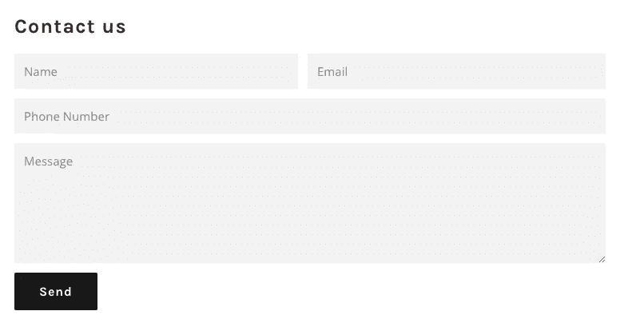

Contact Us form

## **痛苦的故事**

我们首先尝试在 AWS 控制台中编写一个简单的 lambda 函数，它由 API 网关事件触发。后来，我们想在我的函数中使用一些第三方 NodeJS 库，我们必须在我的本地计算机中编写 lambda 函数，并通过 AWS 控制台以 zip 格式上传。

通过遵循最佳实践，我们甚至为我的 lambda 函数创建了一个 AWS IAM 角色，该角色只为该函数启用必要的权限。

我们可以从 lambda 控制台本身创建一个 API 网关端点，但是必须重新访问 APIG 控制台来应用一些技术。

听起来已经很痛苦了，对吧？🤕

这只是故事的开始。

**额外痛苦 1:更改现有代码**

让我们假设我们想要更改我的函数的代码，以包含更多的验证。

在 AWS 控制台中完成这一更新非常容易！😉

一旦你上传了这个函数，Lambda console 就会解压缩它，并在仪表盘中向我们展示一个可编辑的代码。我们只需编辑我们的代码，然后点击大橙色的**保存**按钮。🤠

**额外的痛苦 2:添加新的第三方库/依赖关系**

假设，我们想要添加一个新的第三方库来为我们的 lambda 函数添加更多的功能。(我们想在我们的示例用例中添加 [*验证 js*](https://validatejs.org/) )

真扫兴。你不能在 Lambda 控制台中这样做。😦

现在，我正退回到本地计算机中的代码。我必须手动安装我的节点模块，并用依赖项重新打包代码。

不对不对！！因为我以前在 AWS 控制台中编辑过这段代码，所以现在我在本地有一个过时的版本。必须回到 Lambda 控制台来复制或下载最新的代码。😣

**额外的痛苦 3:将 lambda 与更少的 AWS 资源相关联**

到目前为止，我们的 lambda 只想与 DynamoDB 对话。现在，我们希望我们的 lambda 也能与 S3 对话(假设我们为联系我们表单添加了文件上传功能)。现在过程如下，

*   导航到 S3 控制台并创建一个存储桶
*   **阅读 S3 的 javascript SDK 文档，因为我们不知道它是 API。**
*   向现有代码添加必要的补丁以处理文件上传。
*   通过 AWS lambda 控制台上传代码，点击大橙色**保存**按钮。

好吧！😫。现在我的 lambda 可以上传到 S3 了！！

但是当我测试我的设置时，当我试图将我的内容上传到 S3 时，我遇到了一个大错误。

Lambda fails to access S3

**原因？**

我遵循我的旧编程书籍中的最佳实践，最初只给 Lambda 必要的权限。现在我的拉姆达不能和 S3 说话了。

所以我必须编辑分配给 lambda 的 IAM 角色，通过添加新的权限来与 S3 对话。

This is someone who just started Serverless development on traditional approach

在这篇博客中，让我向您展示一种更方便的方法来开发无服务器应用程序，而无需经历如此痛苦的过程。我想把这个过程作为**无服务器开发的现代方法来介绍。**

# 🚴*现代方法—适马*

[适马](https://sigma.slappforge.com/)是一个现代的、功能丰富的基于浏览器的 IDE，由来自[斯里兰卡](http://srilanka.travel/)的[工程师团队](https://www.slappforge.com/)开发，他们在[开发企业集成解决方案](https://www.adroitlogic.com/)的过程中经历了上述痛苦的过程。我想介绍一下作为无服务器开发的现代方法的[适马](https://sigma.slappforge.com/)，因为它解决了开发人员在开发无服务器应用程序时必须面对的大部分棘手问题。

只需通过以下步骤来实现我们在[*中遇到的使用亚马逊网络服务(AWS)实现无服务器的相同用例——传统方法*](/@cwidanage/going-serverless-with-amazon-web-services-aws-the-traditional-approach-fb45a7cc5dc2) 和**亲自体验打造 SLApps(无服务器应用)**的简化流程。

## 步骤 1 —创建新项目

通过给出名称、描述和 AWS 位置来创建项目，以部署资源。

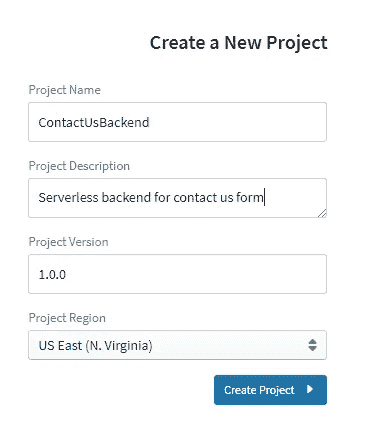

Creating a new Project in Sigma

一旦你创建了一个新项目，适马将向你展示主编辑器视图。

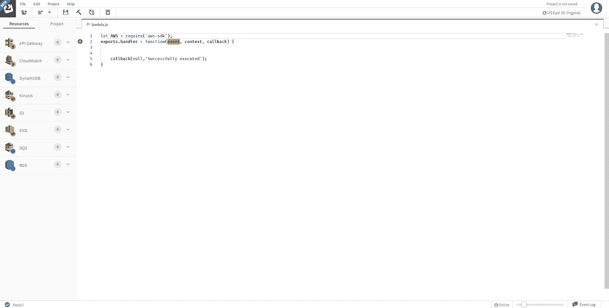

Sigma main editor view

当您第一次加载编辑器视图时，您会注意到一些在其他编辑器中看不到的东西。

1.  前面带有数字标记的 AWS 资源列表。
2.  Lambda 函数处理程序中的红色警告

## 前面带有数字标记的 AWS 资源列表。

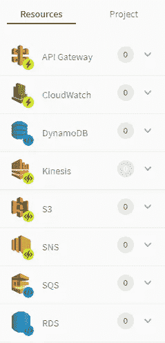

Currently supported AWS resources in SIgma

这是适马目前支持的 AWS 资源列表。然而，这并不意味着你不能在适马代码中使用其他 AWS 资源。这些只是目前支持的超级资源，我们正在努力增加这个列表。

**这些资源有什么特别的？**

您可以将这些资源拖放到您的编辑器中！是的，你没看错。

> 拖放！！拖放！！拖放！！

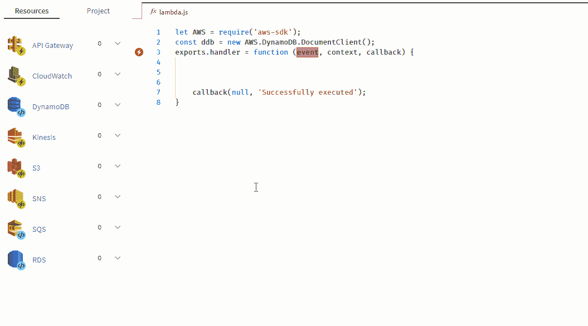

Drag and Drop resources to editor

数字标记表示当前项目中已经使用的同一类型的唯一资源的数量。一旦您在项目中创建了一个资源，这个计数将会增加，并且这些资源将会显示在一个子列表中，在这个子列表中，您可以在需要时直接使用相同的资源(无需重新配置)。

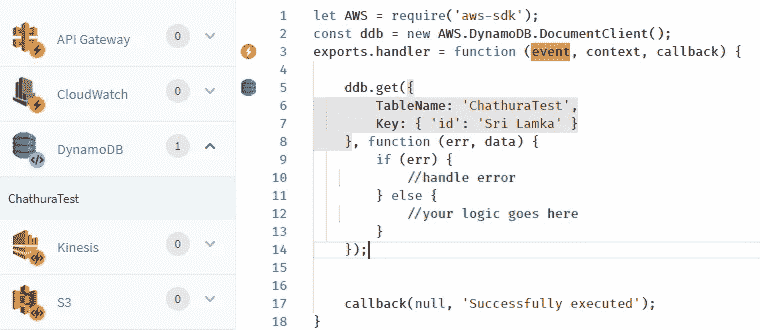

Resource List with usage

哦！非常糟糕，我打错了[斯里兰卡](http://srilanka.travel/)的名字。

我可以用两种方法纠正这个错别字。

1.  点击左上角的蓝色 DynamoDB 图标，在 UI 中进行修改。

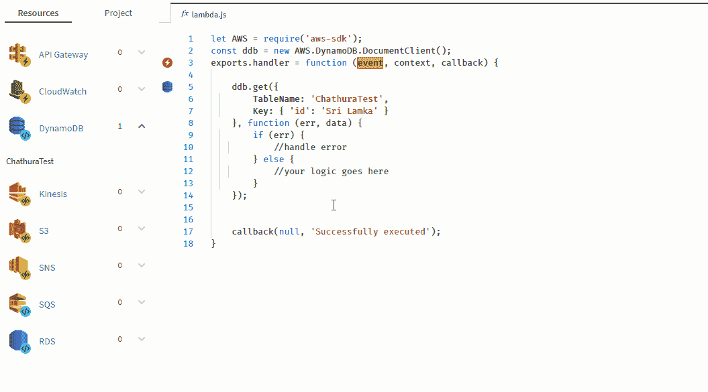

Editing the generated Code by UI

2.就像我们通常做的那样。代码中的变化会自动反映在 UI 中！！

Editing the generated code in the editor

## 步骤 2 —创建 DynamoDB 表

对于我们在本系列的第一篇博客中详细解释的用例，[使用 Amazon Web Services (AWS)实现无服务器—传统方法](/@cwidanage/going-serverless-with-amazon-web-services-aws-the-traditional-approach-fb45a7cc5dc2)，我们想要创建一个名为 *contact_us* 的新 DynamoDB 表，使用 *email* 作为分区键，使用 *date* 作为排序键。

因为我们希望保存每个 contact_us 条目日期，所以让我先在代码中声明该变量。

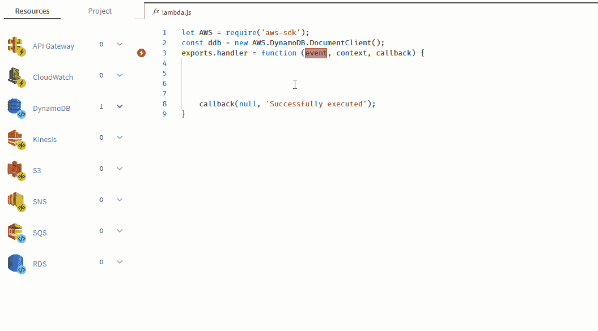

Declaring date variable

你注意到了，对吗😎。我们在适马 IDE 中内置了智能代码建议。

让我继续创建新的 DynamoDB 表。

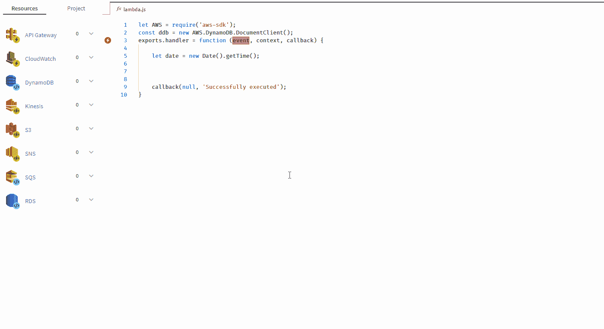

Creating a new DynamoDB table

**搞定！！！**我们已经创建了一个表，甚至我们已经**生成了代码**来在同一个表上执行 *put 操作*。我们不会像你在传统方法中所做的那样，强迫你离开你的代码，从而扰乱你的编码节奏。我们简化了创建和使用资源的流程！

你又注意到了，对吗😎。智能代码建议甚至可以在资源弹出窗口中使用！！

## Lambda 函数处理程序中的红色警告

在 Lambda 函数处理程序中，我们仍然有所谓的红色警告。

Warning in the lambda handler

正如我们所知，为了执行一个 lambda 函数，我们必须用一个事件来触发它。通过这个红色警告， [sigma](https://sigma.slappforge.com/) 提醒我们，我们的 lambda 仍然没有附加事件。

让我们继续解决这个问题吧。在我们的用例中，我们将使用 API 网关事件(POST 请求)来触发这个 lambda。

## 步骤 3 —创建一个 API 网关端点并将其添加为触发器

这样做与我们对 DynamoDB 所做的非常相似。继续拖拽就好！

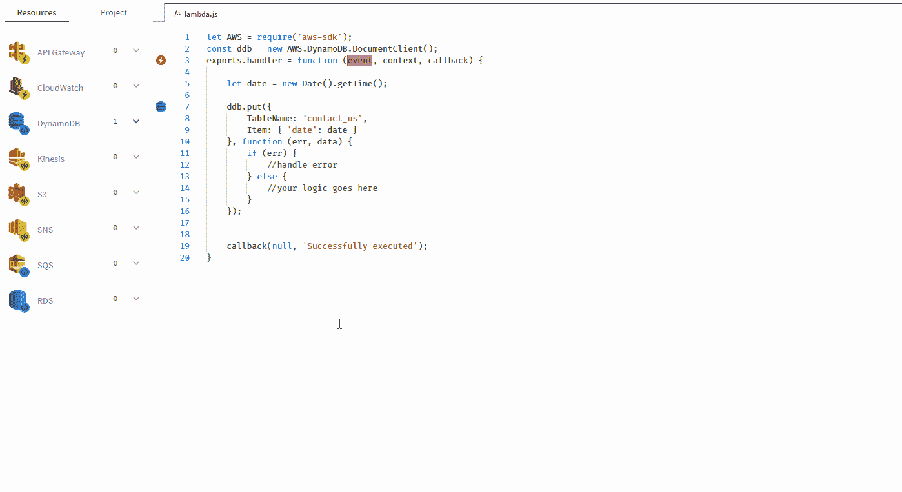

Creating an API gateway trigger

只需点击几下鼠标和键盘，我就完成了下面的任务列表。

1.  创建了一个名为*的 API 联系我们端点。*
2.  向接受 POST 请求的端点(/contact)添加了资源。
3.  在该端点上启用 CORS。(记住，我们必须在传统方法[中导航回 API Gatway 控制台](/@cwidanage/going-serverless-with-amazon-web-services-aws-the-traditional-approach-fb45a7cc5dc2)，才能做到这一点)
4.  用阶段名 *prod 部署我的 API。*
5.  添加我新创建的 API 作为 lambda 函数的触发器。

通过这一步，我刚刚完成了我的联系我们表单后端的第一个**版本**！！

等等…我们刚刚碰到关键词 ***版本*。**我来给你介绍一下[适马](https://sigma.slappforge.com/)的下一大特色。

**版本控制内置于适马 IDE 中。适马与 Github(T21)紧密集成，Github 是最流行的基于网络的托管服务，使用 git 进行版本控制。你可以直接将你的项目提交给 github，只需点击几下鼠标。**

A person who never expected this much of features from a browser based IDE which is still in beta

**第四步——将第一个版本提交给 github**

我们有所有必要的工具来操作我们的项目，整合到一个单一的工具栏在适马。

Sigma toolbar

让我们点击保存按钮，将我们的项目提交给 Github。

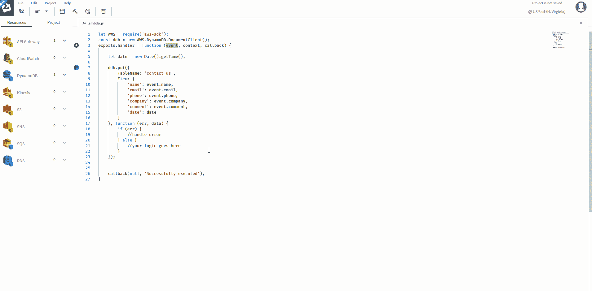

Committing the code to Github

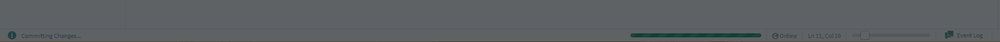

Sigma, silently doing it’s job for you

到目前为止，我们通过虚拟创建资源(DynamoDB 表、API 端点、Lambda 函数)在浏览器中构建无服务器应用程序。现在是时候在 AWS 中部署我们的项目了。

## 步骤 4——在 AWS 中部署项目

为了将项目部署到 AWS，我们只需单击工具栏中的 deploy 按钮。

然后，适马将向您显示一个更改列表，这些更改将在您的 AWS 帐户上执行。

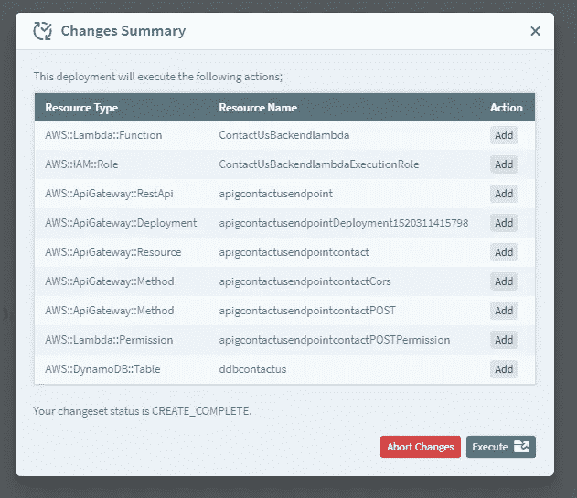

List of changes that are going to be done by Sigma on your AWS account

您甚至可以在执行部署时查看详细的日志。

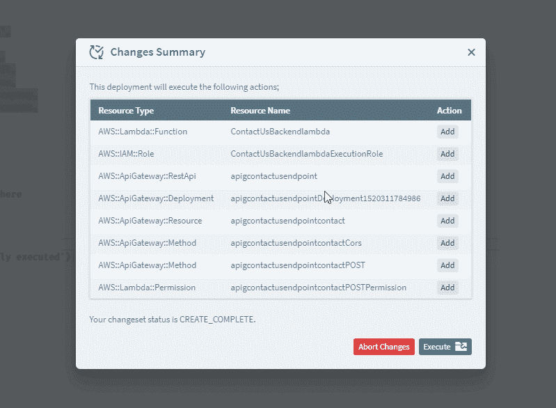

Deployment Logs

部署完成后，适马将向您展示该过程的摘要。

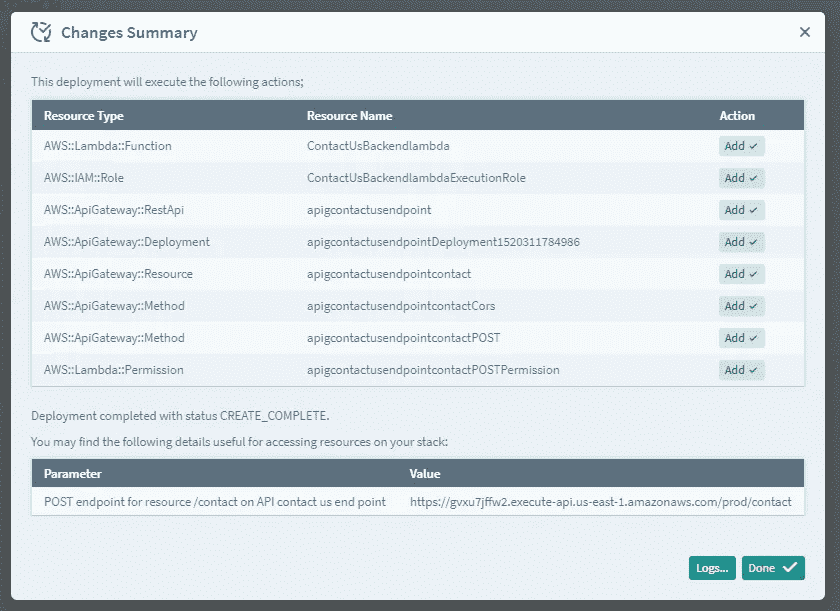

Sigma deployment summary

适马的部署摘要甚至包括部署的 API 网关端点的 URL！！

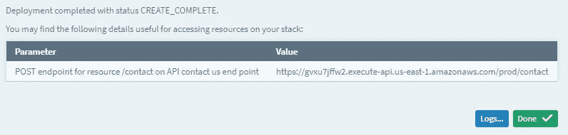

URL of the deployed API gateway endpoint

所以我们已经完成了无服务器应用程序的第一个版本。我们的应用程序现在在云上运行！！

They just deployed a serverless application developed by modern approach (Sigma)

让我给你看看更多关于适马的有趣的事情。

## 自动导入/注入 AWS 库。

让我们仔细看看我们的代码。

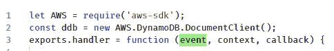

A close look at your code!

好的，等等…我们从来没有输入代码的前两行。

谁干的？😳

谁为 AWS 库添加了 imports 并为我创建了 DynamoDB 文档客户端？

适马为你做了这一切！！每当您将资源拖放到代码编辑器时，适马会自动导入所需的 AWS 库并创建相应资源的实例。

## 添加第三方库

根据我在[用亚马逊网络服务(AWS)实现无服务器化——传统方法](/@cwidanage/going-serverless-with-amazon-web-services-aws-the-traditional-approach-fb45a7cc5dc2)中解释的用例，我们希望在借助名为 [*validate js*](https://validatejs.org/) 的第三方库持久化之前验证传入的请求。

只需点击几下鼠标，您就可以轻松地将依赖项添加到适马项目中。

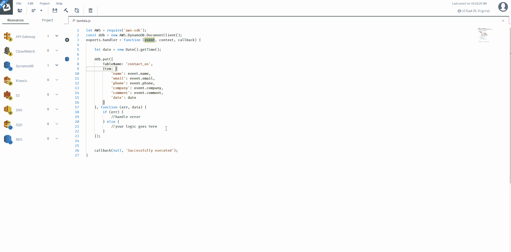

Adding dependencies in SIgma

就是这样。现在，您可以在项目的任何 JS 文件中使用新添加的依赖项了！！！

这只是对无服务器开发的**现代方法**的简单介绍。

# 让我们回过头来，看看我们用现代方法实际上解决了哪些痛点。

## 更改现有的 lambda 代码

与传统方法[不同，在传统方法](/@cwidanage/going-serverless-with-amazon-web-services-aws-the-traditional-approach-fb45a7cc5dc2)中，您必须编辑本地代码并将代码包重新上传到 AWS，而在现代方法中，您只需在浏览器中完成所有工作，并在需要时单击鼠标即可重新部署。

## 添加第三方依赖关系

只需点击**搜索点击**向您的项目添加新的依赖项。不再需要，**下载解压缩 *npm 安装*重新压缩上传点击保存**添加库。

## **与更多 AWS 资源关联**

还记得当我们想要连接新的 AWS 资源时，我们必须如何更新 Lambda 角色吗？**现代方法**为您实现自动化！。适马保证只给你的 lambda 附加必要的权限。适马了解最佳实践，并会为您提供最佳实践😊。

## 没有更多宝贵的时间花费在 AWS 文档上

适马自动为你生成 API 调用。适马甚至为你进口附属品！只需在 UI 中填充一些字段，其余的就不用管了。只需担心您的应用程序逻辑！

所以这是我在帖子结尾对传统方法的承诺。

> 忘记**资源供应**和**代码**，只关注**应用逻辑**。

## 了解更多关于适马的信息

Think Serverless!

# 行动呼吁

*   **拍手。**欣赏并让别人发现这篇文章。
*   **评论。**分享一下你对这篇文章的看法。
*   跟我来。[chat hura wid anage](/@cwidanage)**接收类似文章的更新。**
*   ****保持联系。** [LinkedIn](https://www.linkedin.com/in/cwidanage/) ， [Twitter](https://twitter.com/cwidanage)**