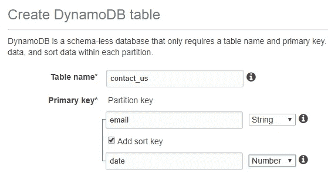

# 使用亚马逊网络服务(AWS)实现无服务器化——传统方法

> 原文：<https://medium.com/hackernoon/going-serverless-with-amazon-web-services-aws-the-traditional-approach-fb45a7cc5dc2>

> 这是亚马逊网络服务(AWS)无服务器博客系列的第一篇博客
> 
> 1.传统方法*🚶*
> 
> [2。现代方法*🚴*](/@cwidanage/going-serverless-with-amazon-web-services-aws-the-modern-approach-245fa9203f47)

在这篇博客中，我将利用 AWS 无服务器组件，从头开始开发一个非常基本的示例无服务器应用程序。在继续之前，让我们看一下几个术语。

# 云计算

> 没有云，只是别人的电脑！

这个说法(*玩笑*)在一定程度上是真的。但是云计算提供了更多的优势，这些优势是其他人的电脑所无法预料的，

1.  自助式资源调配:无论何时您需要资源，只需点击几下鼠标
2.  弹性:扩大或缩小您的资源规模节省资金和时间
3.  按使用付费
4.  工作负载弹性:您不必担心冗余。大多数时候，服务供应商会替你承担这个负担！

简而言之，当谈到云计算时，你不必担心基础设施。继续担心**资源供应**，**您的应用程序逻辑** & **代码**。

# 无服务器计算

无服务器计算可以被视为云计算的一种新变体或新执行模式，在这种模式下，后端和处理单元即服务(BaaS 和 FaaS)。

我们举一个 AWS 世界的例子。使用传统云计算，当我们想要进行处理时，我们必须调配 EC2 实例，并保持该实例全天候运行。同时，无论我们是否使用它，我们都必须为这个实例付费。除此之外，我们必须应用安全补丁，自己更新操作系统，以使我们的实例远离安全威胁。但是随着无服务器系列的新处理单元 Lambda 的引入，事情发生了巨大的变化。有了 lambda，我们只需担心我们的代码，忘记负载平衡、安全补丁甚至高可用性。

所以在无服务器计算中，我们甚至不用担心资源供应，我们只需要担心我们的**代码** & **应用逻辑**。

# 让我们通过一个示例用例来实现无服务器

## 联系我们表单的后端

静态网站可以托管在 google drive 甚至 github 等服务上，不需要任何成本。但是当我们想要添加一个简单但必要的动态组件时，这个优势就变得无用了，比如网站的*联系我们*表单。要么我们必须在后端运行一个服务器来收集*联系我们*数据，要么我们必须购买一个服务来简化我们联系我们表单的后端。不管我们的网站有多少流量，也不管有多少人愿意联系我们，这两种选择每个月都要花费我们固定的费用。

我们需要在后端有以下组件，以支持上述场景。

*   从联系我们页面接受 AJAX 调用的 REST 端点。
*   处理单元验证和接受传入的请求。
*   保存响应的数据库。

为了解决上述需求，我将选择以下 AWS 服务来实现我的后端无服务器联系我们。

由于示例用例的简单性，我们甚至可以放弃 Amazon Lambda，直接将 API Gateway 接受的 REST 有效负载持久化到 DynamoDB。但是为了完整性，让我们假设我们必须在请求有效负载上执行**复杂的**验证。(API gateway 也可以配置为对有效负载执行简单的验证，但是让我们假设我的验证需求比 APIG 的功能要复杂得多😸)

在这篇博文中，让我向你展示传统的、最慢的和最困难的实现这个解决方案的方式。

# 🚶传统方法—使用 AWS 控制台

## 步骤 1 —创建 DynamoDB 表

您可以通过单击**服务**DynamoDB 开始创建表格

Creating the DynamoDB table

然后，AWS 将带您到 DynamoDB 仪表板，在那里您将看到一个创建表的选项。

Table name & Partition key are mandatory fields

## 选择分区键和排序键

在 DynamoDB 中，当我们创建一个新表时，我们可以配置我们期望从表中获得的读/写吞吐量。在 AWS DynamoDB 世界中，我们用读/写容量单位来度量这个吞吐量。

> 一个**读取容量单位**表示对于大小最大为 4 KB 的项目，每秒一次非常一致的读取，或者每秒两次最终一致的读取。
> 
> 一个**写容量单位**表示对于大小不超过 1 KB 的项目每秒写一次。

让我们假设 DynamoDB 的一个分区最多能够提供 3000 个读容量单位或 1000 个写容量单位。然后，如果我们请求每个表有 5000 个读容量单位和 1000 个写容量单位，AWS 后端将根据下面的公式创建 DynamoDB 分区。(这只是基于 DynamoDB 规范的假设，实际创建的分区对用户是不可见的)

这类似于拥有 3 个可以容纳数据的存储桶。每当我们向表中写入一个条目时，DynamoDB 会根据我们选择的分区键将其存储在上述 3 个分区中的一个分区中。**分区键的目标是仔细选择它，以便我们的数据在分区之间均匀分布。**

在分区内，条目将根据我们在配置时选择的*排序键*进行排序。

因此，在我的示例用例中，我将选择 *email* 作为我的分区键，这对每个人来说都是唯一的。在分区中，我将按日期对条目进行排序。然而，在 DynamoDB 中，拥有一个*排序键*是可选的。我将让我的表的读/写容量单位保持默认值(5 & 5)。因此，在 AWS 服务器中将只创建一个分区来支持我的 *contact_us* 表。

设置好所有必要的参数后，点击**创建**开始表格创建过程。

## 步骤 2 —编写 AWS Lambda 代码

让我们通过点击**服务导航到 Lambda 控制台 Lambda 创建功能**

Creating a lambda Function

为了创建一个 lambda，我们需要给出一个惟一的名称并指定一个运行时环境。因为 lambda 将代表您访问您的其他 AWS 资源，所以您需要为 Lambda 分配一个角色，该角色具有足够的权限来访问相关的 AWS 资源。

Name, Runtime & Role are mandatory to create a lambda

最佳实践是分配一个角色，这样我们只为 lambda 函数分配必要的权限。

在我的例子中，这个函数只需要在 DynamoDB 上执行一个 *putItem* 操作的权限。

## 为 Lambda 函数创建角色

通过遵循 [AWS 文档](https://docs.aws.amazon.com/IAM/latest/UserGuide/id_roles_create.html)，您可以轻松创建具有以下权限的角色(或使用现有角色)。

*   dynamodb:PutItem
*   日志:创建日志组
*   日志:创建日志流
*   日志:上传事件

## 编写 Lambda 代码

最初，我将编写没有任何验证或额外逻辑的函数。因为我最初不打算使用任何第三方库，所以我可以直接在 AWS lambda 控制台中编写代码。

> **Lambda** 服务已经为 **Node.js** 预装了 **AWS SDK**

现在，让我们假设我想在持久化请求之前对其进行一些验证。(如开始所述，这就是在这个简单用例中使用 lambda 的全部目的，而不是直接从 API Gateway 调用 DynamoDB)。

因为 lambda 控制台的内置 IDE 不支持添加第三方库，所以现在我必须在我的计算机上本地编写我的 lambda 函数，并通过 lambda 控制台将代码上传为 zip 文件(捆绑了必要的依赖项)。

## 在本地创建 Lambda 包

我将从初始化一个新的 nodejs 项目开始，并通过节点包管理器添加必要的依赖项。

即使在这种情况下，也没有必要将 AWS-SDK 作为依赖项添加到我的节点项目中。我使用 [validate.js](https://validatejs.org/) 以最小的努力验证传入请求中的字段。

现在，我的代码如下所示，包括请求验证。

现在我的本地目录结构如下所示。

Directory structure of Lambda Node project

为了将它部署为 lambda 代码，我必须创建一个包含该文件夹中所有内容的 zip 文件，并通过 Lambda 控制台上传。为了做到这一点，我现有的 lambda 函数的*代码输入类型*应该从 ***编辑代码内联*** 切换到 ***上传一个. ZIP 文件*** 。

Switching the Code Entry type of lambda function

说到这一点，我们有了一个全功能的后端，剩下的唯一任务就是通过 API 公开这个后端，这样我的 Lambda 函数就可以从 *Contact Us* HTML 表单外部触发。

让我们继续创建一个 API 网关资源来触发这个 lambda 函数。

## 步骤 3 —创建 API 网关触发器

您可以轻松地从 Lambda 控制台创建 API，而不必导航到 API 网关控制台。

然而，在我的例子中，应该对生成的 API 做一些调整，为此，我必须通过单击新创建的 API 快速跳转到 API 网关控制台。

Tweaking generated API

在这里，我关闭了 lambda 代理集成(你可以在这里阅读 lambda 集成类型)并为我的 API 端点启用了 CORS。

在应用这些更改之后，我必须重新部署我的 API 来应用这些更改。

Deploying API

现在，您可以使用您选择的任何 HTTP 客户端测试您的 API，并将这个后端与您的 HTML 联系我们表单集成。

这是开发无服务器应用程序的传统方法，我希望你已经意识到，有了无服务器计算，你可以忘记**资源供应**，只关注**代码** & **应用程序逻辑**。

在下一篇博客文章中，让我们看看如何用现代方法开发一个无服务器应用程序，其中我们忘记了**资源供应**和**代码(是的！**😇 **)** 而只关注**应用逻辑**。

# 行动呼吁

*   **拍手。**欣赏并让别人发现这篇文章。
*   **评论。**分享一下你对这篇文章的看法。
*   **跟我来。**[Chathura wid anage](/@cwidanage)**接收类似文章的更新。**
*   ****保持联系。** [领英](https://www.linkedin.com/in/cwidanage/)，[推特](https://twitter.com/cwidanage)**