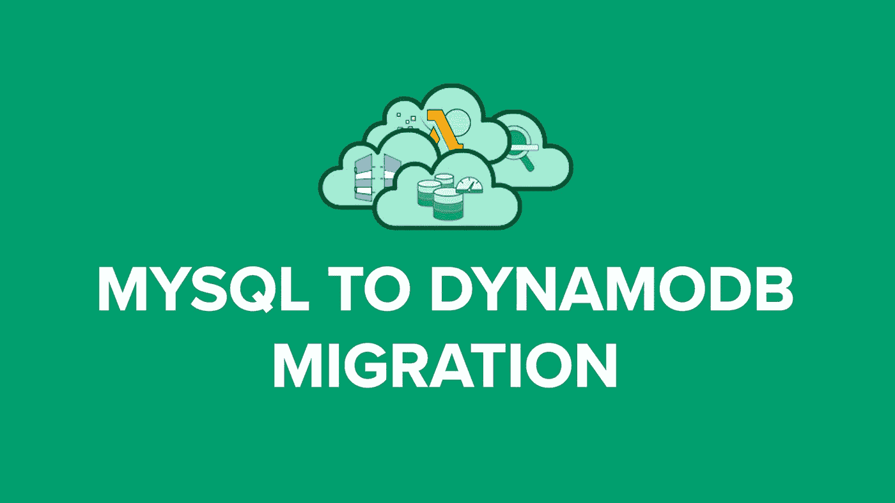

# 用 AWS DynamoDB 在两周内实现无服务器化

> 原文：<https://medium.com/hackernoon/going-serverless-with-aws-dynamodb-in-under-two-weeks-50140dd8f24b>

下面是我们如何在不到两周的时间内从 MySQL 切换到无服务器 DynamoDB。

大约三年前，我们创建了一个 SaaS 产品或软件即服务产品，我们需要每天处理 50 GB 的数据和 200 多万次读/写操作。

事后看来，我们知道关系数据库不是这个项目的正确选择。尽管如此，我们还是很不情愿使用 NoSQL，因为我们没有 NoSQL 的专家。我们没有真正给 NoSQL 一个严肃的想法(一个大错误)。

我们选择 MySQL 作为我们的数据库。该项目上线后没几天，我们就开始发现一些问题，比如频繁的数据库锁定。因此，作为合乎逻辑的下一步，我们在 Amazon RDS 上将我们的数据库服务器升级到更强大的硬件。那有一点帮助。但是，随着我们用户群的增加，我们又开始看到同样的问题。

下一个选择是复制。因此，我们将数据库升级到了多 AZ 环境，并添加了一些读取副本。这在我们再次看到同样的问题之前，帮助我们又运行了这个项目几个星期。

我们遇到了大麻烦。我们的应用程序经常停止运行。页面加载通常需要几秒钟，我们的客户很失望。自然的结果是，我们开始失去顾客。现在，我们正在认真考虑使用 NoSQL 数据库(迟做总比不做好，嗯？).

我们比较了不同的 NoSQL 数据库，如 MongoDB、Cassandra 和 DynamoDB。MongoDB 和 Cassandra 都要求我们提供服务器基础设施和软件，并且有一个陡峭的学习曲线。我们手头的时间真的很少，因为我们每天都在失去客户。因此，像 DynamoDB 这样的无服务器 NoSQL 数据库是我们的最佳选择。

我们几乎不用两周时间就从 RDS 上的 MySQL 迁移到了无服务器的 DynamoDB。这包括从头开始学习 DynamoDB。DynamoDB 运行得非常好，到现在已经三年了，我们没有遇到一个数据库问题。

从那时起，对于我们的每个项目，我们都更喜欢使用 DynamoDB，而不是其他任何数据库。几乎没有学习曲线，而且作为一个无服务器数据库，也没有基础设施开销。因此，如果您选择 NoSQL 数据库，我强烈推荐使用无服务器的 NoSQL 数据库。而且，选择 DynamoDB 作为无服务器 NoSQL 数据库，您永远不会出错。

如果你是 DynamoDB 的新手，我会在我的新在线课程 [AWS DynamoDB -完整指南](https://www.udemy.com/dynamodb/?couponCode=DYNAMODB_MD)中详细讨论这一点，并带你进行动手实验。这是一个关于 DynamoDB 的综合在线课程，你将从头开始学习 DynamoDB。本课程采用动手操作的方式。我将带您浏览几个实践指南，演示 DynamoDB 与不同的 [AWS](https://hackernoon.com/tagged/design) 服务的集成。最后，我们将构建功能全面的跨平台 web 应用以及移动应用(iOS 和 Android 应用),支持社交媒体登录，并提供跨设备和平台的统一用户体验。

 [## AWS DynamoDB -完整指南(建立 18 个以上的实际演示)

### 主亚马逊 DynamoDB，NoSQL 自动气象站数据库。学习使用 Node.js REST API 将 DynamoDB 与 Web 和移动应用程序集成

www.udemy.com](https://www.udemy.com/dynamodb/?couponCode=DYNAMODB_MD) 

如果你对掌握完整的 AWS 无服务器架构感兴趣，那么考虑我的 [AWS Lambda 和无服务器架构 Bootcamp](https://www.udemy.com/aws-lambda-serverless-architecture/?couponCode=SLS_MD) 。这个 25 个多小时的课程可能是你掌握 AWS Lambda 和无服务器的唯一课程。

如果你喜欢这篇文章并认为它有用，请分享、评论并发表👏有几次。。。也许它会激励一些人开始学习这些新东西！

**订阅我的**