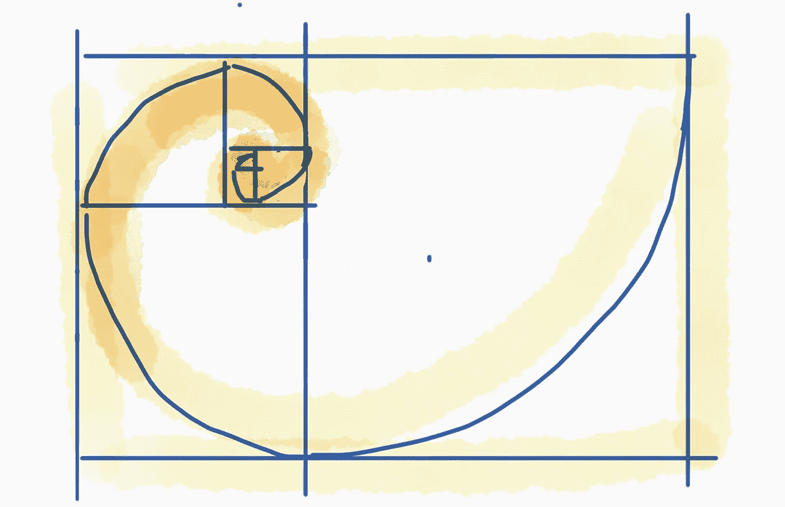
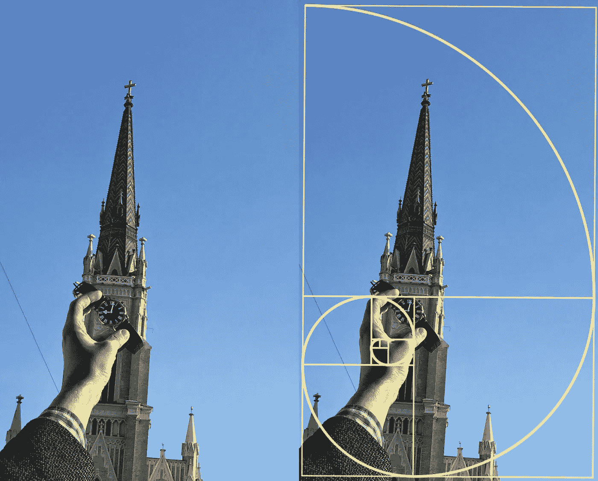
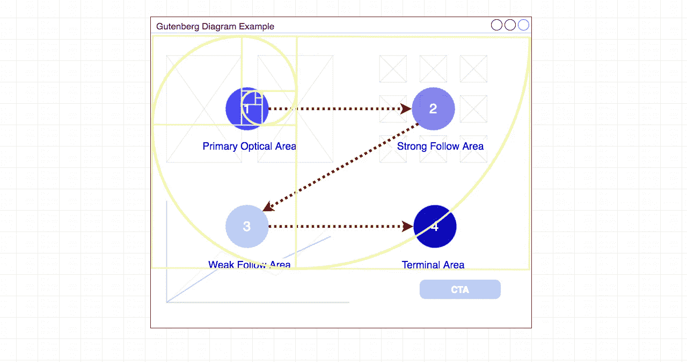

# 版面设计中的黄金比例

> 原文：<https://medium.com/hackernoon/golden-ratio-in-layout-design-e18c4a3b503>

*如何创建让用户赏心悦目的软件布局？使用斐波那契数列，结合数学和艺术，获得完美的像素效果。*

在你的[设计](https://hackernoon.com/tagged/design)作品中，有一个常见的数学比例，它在自然界中很常见，可以用来创造令人愉悦的、看起来自然的构图。它被称为[黄金分割比例](https://hackernoon.com/tagged/golden-ratio)，黄金分割，斐波那契螺旋或斐波那契数列。

The Golden Ratio or Fibonacci spiral

这种构图[广泛应用于艺术](https://www.google.rs/search?q=golden+ratio+in+art&rlz=1C5CHFA_enRS707RS710&source=lnms&tbm=isch&sa=X&ved=0ahUKEwjqiZf574XbAhXlNpoKHcecCr4Q_AUICigB&biw=1440&bih=731)和摄影。但最重要的是，这个比例是自然界中常见的模式。如[松果形状](https://www.google.rs/search?rlz=1C5CHFA_enRS707RS710&biw=1440&bih=731&tbm=isch&sa=1&ei=Ftv5WpCJMK6LmwWRiKP4DA&q=pinecone+golden+ratio&oq=pinecone+golden&gs_l=img.3.0.0i19k1j0i8i30i19k1l2.170426.185110.0.185960.34.18.0.0.0.0.412.1989.0j6j2j1j1.10.0....0...1c.1.64.img..25.9.1870.0..0j0i30k1j35i39k1j0i67k1j0i10i30k1j0i10i19k1.0.Ih8_mTxdi7A#imgrc=_)，葵花籽，天气模式等。

Golden ration in photography composition

设计一个软件需要考虑很多方面。有大量的书籍和文章都与创造令人惊叹的用户体验的最佳实践相关。一个方面是完全致力于视觉组成。该软件必须有一个愉快的视觉吸引力。如果它是赏心悦目的，更有可能的是用户会下意识地喜欢它。更重要的是，如果构图合适，眼睛自然会停留在重要的东西上。

> 如果构图正确，眼睛自然会停留在重要的东西上

我们可以做很多事情来下意识地将注意力吸引到我们的行动号召或软件的任何其他部分。我喜欢在布局构图中使用黄金分割，因为它自然地强调了其他 UX 技巧。把斐波纳契螺旋放在你的屏幕上，开始布局规划。将最重要的信息放在螺旋的中心。中间的这些组件会在第一眼就抓住用户的注意力。这个原理在下面的古腾堡图中非常有效。

古腾堡图描述了我们的眼睛在与我们的应用程序或内容交互时遵循的一般模式。这种模式表明，我们的眼睛会以一系列水平运动的方式扫过页面。每次扫描开始时都离左边缘稍远一点，然后向右边缘移近一点。整个运动是眼睛从主要区域移动到终端区域。这条路径被称为“读取重力”。

Gutenberg diagram in combination with the Fibonacci spiral

重要的元素应该放在阅读重力的路径上。最重要的信息应该放在主要的光学区域。正如你所看到的，主要光学区域正好位于斐波那契螺旋的中心，这使得它成为用户注意该区域的最佳位置。强大的关注区域也应该包含有用的数据，以便用户保持关注。终端区通常是为 CTA 保留的——注意力集中的地方。

如果你采用这种方法，它将提高你的设计一个百分点，甚至更少。但是细节很重要。这个百分比可能正好给你的产品增加足够的价值，让用户喜欢它。在 *meh* 和 *wow* 反应之间只有一线之隔，所以你会想尽可能多地使用技巧，包括这个小技巧。干杯！

# 想了解更多？

学习如何将你的想法转化为成功的业务。

这本书为你提供了创建一个成功企业的整个过程的全面指导。它旨在为你展示整个[商业计划](https://treasureroadmap.com/)，让你的起步更加容易。整个过程归结为它的要点，使步骤简单易懂。

如果你遵循我在这本书里揭示的公式，很有可能你可以通过把一个[想法变成一个成功的生意](https://treasureroadmap.com/)来谋生。

 [## 宝藏路线图——如何将你的想法转化为成功的业务——企业家的最佳书籍…

### 如果你选择遵循我在这本书里揭示的公式，很有可能你可以通过转行谋生…

treasureroadmap.com](https://treasureroadmap.com/) 

点击下面的图片获取您的免费图书摘要:

