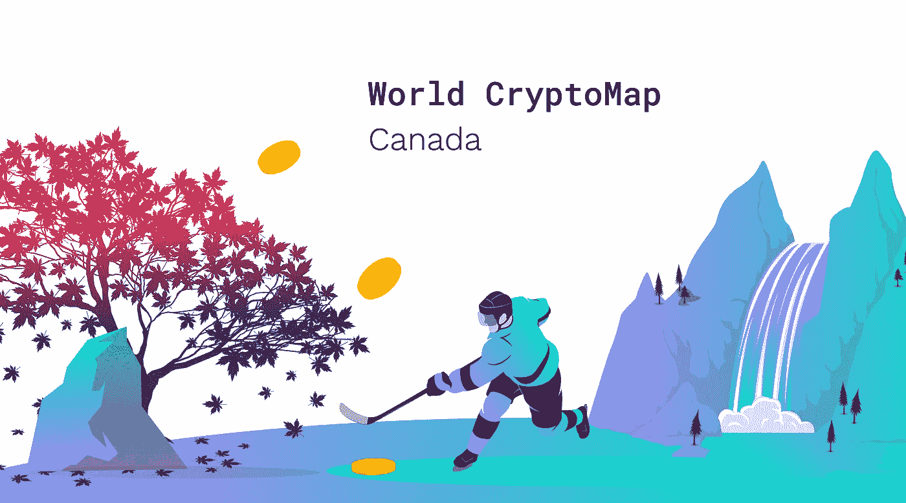

# 良好的采矿环境、以太坊遗产、政府倡议:是什么推动了加拿大的密码产业

> 原文：<https://medium.com/hackernoon/good-mining-climate-ethereum-legacy-government-initiatives-what-drives-crypto-industry-in-canada-7ab4ffad40c6>

当您搜索引领加密运动的国家时，加拿大出现在第一批结果中。QuadrigaCX 和以太坊等创新的加拿大倡议取得了巨大的成功。一看它的股市就知道，这个国家正在搞世界上第一个**。与此同时，政府正在试图弄清楚如何使用* [*区块链*](https://hackernoon.com/tagged/blockchain) *来监控交易。**

**我们希望我们的 WorldCrypto Map 能够帮助您了解当今加拿大的加密现状。**

**准备好开始旅程了吗？我们去观光吧！**

# *拥抱创新*

*这里有一个很好的例子来说明加拿大对加密的渴望。该国现在有了世界上第一个证券交易所加密货币柜台，将由 TMX 集团运营。最初，比特币和[以太坊](https://hackernoon.com/tagged/ethereum)将在平台上提供，如果以后有需求，将增加额外的虚拟货币。或者用“何时”而不是“如果”会更好？此举被视为行业发展的突破，因为它迫使投资者真正将加密货币纳入他们的战略。*

*此外，加拿大一些最大的银行允许他们的客户用借记卡或信用卡购买加密货币。例如，道明银行表示，它允许此类活动，“只要商家被授权接受 Visa、Mastercard、Interac 或 Visa 借记卡，并且交易不被认定为欺诈”。*

# *所以以太坊是…加拿大？*

*其实以太坊不是在那里诞生的。但一些人认为，多伦多对区块链创新的热爱部分源于多伦多是 Vitalik Buterin 的家乡。尽管年轻的天才们几年前就从那里搬走了，他的项目仍然是镇上的话题。*

*最近，加拿大政府已经到了建立以太坊区块链探索者的程度。简而言之，它正在推出一个分散的平台，这应该有助于它使财务信息对公众透明。在试验中，国家研究委员会(NRC)将使用加拿大制造的建立在区块链[以太坊](http://www.globalnews.ca/tag/ethereum)上的产品来实时发布资助和拨款的数据。以下是[发布在 NRC 网站](https://www.nrc-cnrc.gc.ca/eng/stories/2018/blockchains.html)上的关于该项目的官方声明:*

*"*区块链技术被许多创新专家誉为未来之路。在最简单的层面上，区块链是公共分类账，记录许多用户共享的交易。**

# ***魁北克矿业透视***

*魁北克正考虑在全省范围内停止该地区的采矿作业。似乎海外矿业运营商的涌入和电力需求的增加已经让这个法裔加拿大人的省份不堪重负。魁北克是北美电费最低的地区之一，气候适宜降低制冷成本，政治稳定。目前，魁北克已经决定暂停加密货币开采，以给立法者时间“考虑通过一项规则，更好地为该地区的这些类型的企业制定建设许可”，魁北克市政区域委员会主任罗伯特·德马莱说。*

# ***加密货币监管即将到来***

*无论好坏，加拿大的比特币和加密货币法律一直相当宽松。但是事情会改变的。加拿大政府发布了新法规的官方草案。该文件将虚拟货币交易所视为货币服务企业(MSB)。这种分类要求他们报告所有超过 10，000 加元(7700 美元)的交易。此外，了解你的客户(KYC)的限额将定为 1000 加元(770 美元)，这意味着交易者不能进行更大数额的交易，除非他们提供了个人信息(姓名、地址、电话号码、职业等)。).不是每个人都对这种发展感到高兴，因为可能很难保持每笔超过 10，000 美元的交易的细节。官员们表示，这项措施的重点是防止洗钱，并将对该国的国际声誉产生积极影响。*

# *关于隐密处*

*Crypterium 正在开发一个移动应用程序，它将把你的硬币和代币变成钱，你可以像使用现金一样轻松地使用它们。
在世界各地购物，在任何 NFC 终端用硬币和代币支付，或通过扫描二维码支付。在网上商店购物，支付您的账单，或者只是在几秒钟内可靠地跨境汇款，而且只需几分之一便士。*

*在[http://crypterium.com/](http://crypterium.com/)了解更多信息*