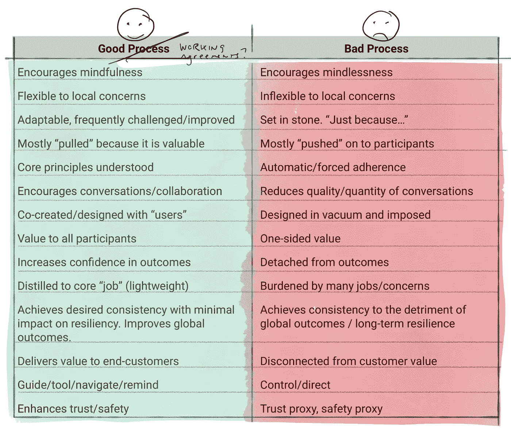

# 好的过程与坏的过程

> 原文：<https://medium.com/hackernoon/good-process-vs-bad-process-bb8425c085c8>

忙着新生儿，但还在琢磨，[发微博](https://mobile.twitter.com/johncutlefish)，写一些 [thinky 的帖子](https://hackernoon.com/beyond-outcomes-over-outputs-6b2677044214)(毫无疑问是受睡眠不足的影响)，偶尔做做[短小，高保真的播客](https://anchor.fm/john-cutler/)。

昨晚的瞌睡清单…过程什么时候算“好”？

# 好流程(是)|坏流程(是)

鼓励正念 |鼓励无念

**对当地问题灵活** |对当地问题不灵活

**适应性强，经常受到挑战/改进** |一成不变。“只是因为…”

**主要是“拉”出来的，因为它很有价值** |主要是“推”给参与者的

**了解核心原则** |自动/强制遵守

**鼓励对话/协作** |降低对话的质量/数量

**与“用户”共同创作/设计** |真空设计并强加

**对所有参与者的价值** |片面价值

**增加对结果的信心** |与结果无关

**提炼出核心“工作”(轻量级)** |被许多工作/事务所累

**实现所需的一致性，对弹性的影响最小。改善全球结果。|** 实现一致性，但不利于全球结果/长期弹性

**向最终客户交付价值** |与客户价值脱节

**引导/工具/导航/提醒** |控制/直接

**增强信任/安全** |信任代理，安全代理