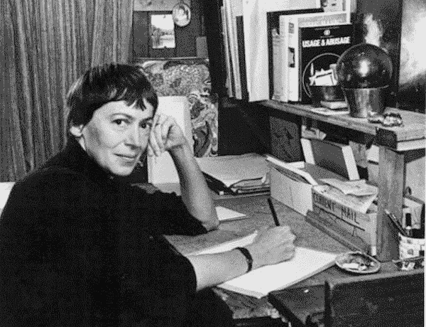

# 再见，厄休拉·K·勒·古恩

> 原文：<https://medium.com/hackernoon/goodbye-ursula-k-le-guin-1ed924832aca>

当我在查普曼大学(Chapman)第一次开始教写作时，我渴望开始我的“新事业”，我得到了乌苏拉·莱金的书*驾驶飞船*，我从书中学到的东西以及我作为 MFA 候选人的阅读给我留下了深刻的印象，其中包括许多非美国作家和历史文学。我为我的第一堂科幻小说写作课制定了教学大纲，并写了《乌苏拉》,问她是否有任何建议，让我能最好地将她的文章融入…