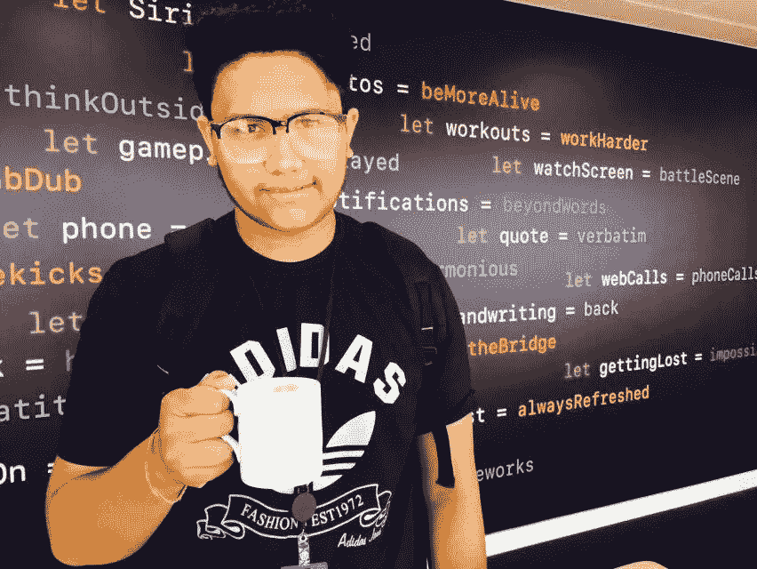
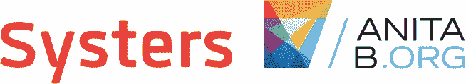

# 谷歌代码-2017 年系统体验

> 原文：<https://medium.com/hackernoon/google-code-in-2017-experience-with-systers-8afa67c2e7ad>

我介绍自己是第 12 届标准学生，在印度拉贾斯坦邦斋浦尔出生并长大，我自己 Vatsal Kulshreshtha，17 岁，是一名 **Google Code-In 2017** 参与者。

我是苹果 iOS 应用程序开发人员，2017 年 7 月，苹果邀请我去印度班加卢鲁参加培训。我还为我妈妈在斋浦尔的珠宝店制作了一个在线购物应用程序。我在视频编辑、动画、设计领域也有一些经验。

我对[编码](https://hackernoon.com/tagged/coding)的兴趣是在我 10 年级的时候培养起来的，当我父亲送给我一台 Mac 电脑来编码和制作应用程序时，我非常高兴。2017 年 10 月，表哥哥哥给我介绍了[谷歌](https://hackernoon.com/tagged/google)码入(GCI)。

而现在，谷歌代码输入即将结束，令人怀念。这个平台已经让我进入了这种情绪的深度。重温过去几周的记忆，我想分享我在系统组织和谷歌代码方面的美好经历

什么是 Google Code-In？

Google Code-in (GCI)是由 Google Inc .主办的年度编程竞赛，允许大学预科学生完成各种合作开源组织(如 Systers)指定的任务。

# **我的旅程**

在谷歌宣布了参加 2017 年 GCI 奥运会的组织名称后，我只是滚动了一下名单，就看到了 Systers 组织，这是唯一一个会给 iOS 相关任务的组织。我想那时我明白了，我也可以成为这样一个令人敬畏的社区的一部分。GCI 最好的部分是，任何人都可以参与，即使他/她不知道如何编码，因为所有组织都有与文档/培训、推广/研究、用户界面、质量保证相关的任务。

2017 年 11 月 28 日，晚上 10:30 比赛开始，我的重点是只为一个组织做任务，即 Systers。从我十几岁开始，我就想为世界上的妇女和女孩做些事情，而技术和系统是我为妇女和女孩做些事情的最好平台。

## 什么是[系统](https://www.google.com/url?q=https://www.google.com/url?q%3Dhttps://anitab.org/systers/%26amp;sa%3DD%26amp;ust%3D1515950510416000%26amp;usg%3DAFQjCNHTaE1PD4cL8nHqp7tLLw1ckxFmZQ&sa=D&ust=1515950510423000&usg=AFQjCNEx0vTmvqhcq6jihIENCeoZTeOYbg)？

安妮塔·博格在 1987 年创建了 Systers，当时她和其他 12 名女性为“系统”中的女性推出了一个小型电子邮件列表。她的目标是“增加计算机科学领域的女性人数，并使女性工作的环境更有利于她们继续参与该领域。”

Systers 为从事计算机技术的女性提供了一个私人的、安全的在线论坛。我们的成员通过建立联系、分享建议和经验以及在各种项目上进行合作来获得支持。我们欢迎所有年龄的女性，无论她们处于学习还是职业的哪个阶段。

我们正在谷歌代码中工作的项目-在 2017 年。

## 通电

PowerUp 是一个女性赋权教育手机游戏应用程序，将允许年轻女孩通过浏览其化身的生活来了解生殖健康和自尊！

Github 库链接；

[启动安卓系统](https://www.google.com/url?q=https://www.google.com/url?q%3Dhttps://github.com/systers/powerup-android%26amp;sa%3DD%26amp;ust%3D1515950510418000%26amp;usg%3DAFQjCNGdlL-vFXSdp6NotNGShLti2WTRUQ&sa=D&ust=1515950510424000&usg=AFQjCNGPflkZu14ZcXlyUTk9O5Nqm7YaHQ)

[启动 iOS](https://www.google.com/url?q=https://www.google.com/url?q%3Dhttps://github.com/systers/powerup-iOS%26amp;sa%3DD%26amp;ust%3D1515950510418000%26amp;usg%3DAFQjCNG6vERI_WUlzBHTpTylacJOSyZhRg&sa=D&ust=1515950510424000&usg=AFQjCNFygbUIoV3v8LlCtvwaJPgeb2o9bA)

开始时，我对 Java 有一点了解，我意识到我也可以开始做一些与 android 相关的任务来学习更多关于 Java 的知识。有一次，我的一个 android 任务获得批准，我意识到我应该做更多的 android 相关的任务，为此系统导师给了我很多支持，我面临一些与 git 命令相关的问题，但我的导师总是在那里帮助我走出这些艰难的局面。

2017 年 12 月 2 日，我在 Systers 社区的领导人名单中看到了我的名字，这是对我的自我激励。在 Google Code-In 中，也有一些非常有趣的任务与设计、研究、文档相关，比如为 avatar 设计服装，为 PowerUp 制作营销活动，为此我为一个营销网站制作了一个模拟，我还做了一个任务，发现 PowerUp iOS 和 PowerUp Android 之间的不一致之处，并制作一个文档，这对我来说是一个非常有趣的任务，我还为 PowerUp 和 Systers 组织制作了视频、动画和信息图。我接受每一个任务，对我来说都是一个新的挑战，这就是为什么我到目前为止能够为系统组织完成 60 多项任务。

没有系统导师，这是不可能的，他们在每个阶段都支持我。每当我感到虚弱，想放弃一项任务时，他们总是在那里指导和鼓励我学习新的东西。他们对社区里的每一个人都倾注了他们的爱和关怀。作为一名青少年，我想每个青少年都希望自己的工作得到赞赏，我从所有的导师和父母那里得到了很多鼓励和赞赏，这提高了我的道德水平。

通过参加 2017 年 GCI，我学到了很多新东西，比如，现在我对 android 开发很熟悉，我学到了很多关于 GitHub 和 git 命令的知识，我认为很多新人都不能很快理解，在 GCI 期间，我通过加入 Systers 开源 Slack 社区帮助了很多人/参与者。没有导师，这一切都是不可能的。

Systers 是爱因斯坦的名言“知识的唯一来源是经验”的真实化身，今天我感到幸运的是能够真诚地感谢所有人给了我宝贵的建议和经验，这些建议和经验在过去的 7 周里被证明是非常有帮助的。我真的很感激你对我的信任，给了我这个机会去完成各种任务。

我还有很长的路要走，但是我已经离我以前的位置很远了，这完全归功于所有的会员。