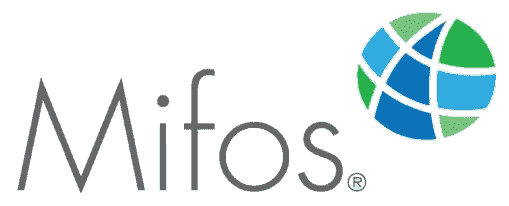

# 谷歌代码-2018 年体验

> 原文：<https://medium.com/hackernoon/google-code-in-2018-experience-e28d1acbf1fa>

嗨！我的名字是 Abhi Kulshrestha，目前正在攻读 12 级，属于印度拉贾斯坦邦斋浦尔。我是一个既外向又内向的男孩！但这就是让我与众不同的地方。

为了进入一些 IT 领域，我试图创造许多机会，其中之一是 2018 年的**谷歌代码。**

## 什么是谷歌代码？

[Google](https://hackernoon.com/tagged/google) Code-in 是 Google 为大学预科学生(13-17 岁)举办的年度竞赛，让他们了解[开源](https://hackernoon.com/tagged/open-source)组织。谷歌代码给学生一个机会，让他们向自己感兴趣的领域迈出第一步。

它是如何工作的？

所以，一个受尊敬的学生需要选择一个由谷歌选择的组织。参与者应该选择一个与他/她特定领域相关的相应能力的组织。我是一个天生的 iOS 开发人员和 Android 开发人员，对 Swift 和 Java 语言有很好的了解。

这些任务分为:-设计、质量保证、代码、拓展/研究人员文档/培训。

**我如何了解 GOOGLE CODE-IN？**

所以是关于 Google Code 的——2017 年我受参加 Google Code 的表哥哥哥 [Vatsal Kulshrestha](/@vatsalkulshreshtha) 影响的时候——2017 年。Google Code——2017 年已经结束，所以我决定参加 Google Code——2018 年。我决定学习更多关于 Google code-in 的知识，并提高我的技能。

我开始做一些 UI 设计，视频编辑，图像编辑，图像设计，以及许多其他需要让我完美适应谷歌代码的东西——在 2018 年，直到日期到来。

# 我的整个旅程

谷歌代码——2018 年看似遥远，其实很近。**如果我们说？镜子** **中的物体比它们看起来更近。**对！？时间过得很快，我真的不知道 GCI 2018 奥运会什么时候就要开始了。

所以是时候进入我的命运并继续前进了。我为 GCI 勒紧腰带。我的机器已经准备好了，我已经为油门做好了一切准备，我等待的那一天已经到来。现在，这是分析我并可能赢得比赛的时候了！

因此，开始时，我严格分析了每个组织，并选择了适合的组织。

随着比赛的开始，我瞄准了组织机构。该组织完全基于他们从未知晓的应用 PocketCode。在只完成了一项任务后，我找不到任何适合我能力的任务，仅仅是这个组织不适合我。

我有点沮丧，因为我对自己有更高的期望。所以我休息了一段时间来适应这种情况。我开始时的动机是期望最少，工作更多。从这里，我事实上的旅程开始了！

我再次选择了我的新组织，即 **DIAL** (数字影响联盟)，它基本上有三个子组织 MIFOS、LIBREHEALTH 和 USHAHIDI。我坚定地支持 Mifos 计划，当我的 5-7 项任务仅在一天之内就被成功审核时，我的信心也增加了。我对为 Mifos 做贡献很感兴趣，所以我做了。11 月 26 日，我的名字出现在领袖榜上。对我来说这是一件非常愉快的事。随着 Mifos 的巨大反响，我也为 LibreHealth 做了贡献，不多但也有一些。

**关于米福斯**

Mifos 是 DIAL 的子组织。Mifos 基本上是一个非盈利的倡议，目的是建立一个 30 亿马里人的家庭，使每个穷人和没有银行服务的人都有机会获得为自己和家人创造更好生活所需的资金。主要动机之一是通过将穷人和没有银行账户的人与他们应该接受的服务联系起来，从世界上消除贫困。

Ed Cable 在作为社区管理者支持了社区几年后，准备帮助社区团结起来，指导 Mifos 的下一阶段。

Mifos 试图通过金融科技银行、neobanks 和其他许多移动货币提供商引入无银行账户的人来解决这个问题。

**我学到了什么？**

Google Code-in 是我迄今为止最好的体验。它教会了我一切。都是从基础到进阶。它教会我:—

1.  **如何为开源做贡献？**

2.**如何使用 GITHUB？**

3.**如何帮助别人？**

4.**如何寻求帮助并努力工作直到成功**

5.来自每个伴侣的许多不同的帮助和回答等等。

___________________________________________________________________

如果没有导师们，这是不可能的，他们在每个阶段都帮助我，每当我遇到与任务相关的问题时，我都比以前好得多，谢谢你们！爱德华·凯布尔、奇拉格·古普塔、勒霍恩、罗比·奥康纳，以及所有支持和鼓励我到最后的人。

Google Code-in 是一次很棒的经历，它教会了我许多新的东西，这些东西肯定会在未来对我有所帮助。人们在社区聊天中给了我很多帮助，我也尽我所能帮助其他人，通过搜索和了解更多。

我很高兴能为 DIAL 做贡献，它在我低落的时候鼓励了我，在我最需要的时候增强了我的信心。我还要感谢我的父母和所有在 GCI 2018 全程支持我的人。

我的命运之旅从这里开始。**千里之行始于足下，**而谷歌码——2018 年是我走向命运的第一步。**还有很长的路要走。我完全投入到我的工作中。这次旅行对许多人来说可能是一个小小的成就，但对我来说意义重大。**