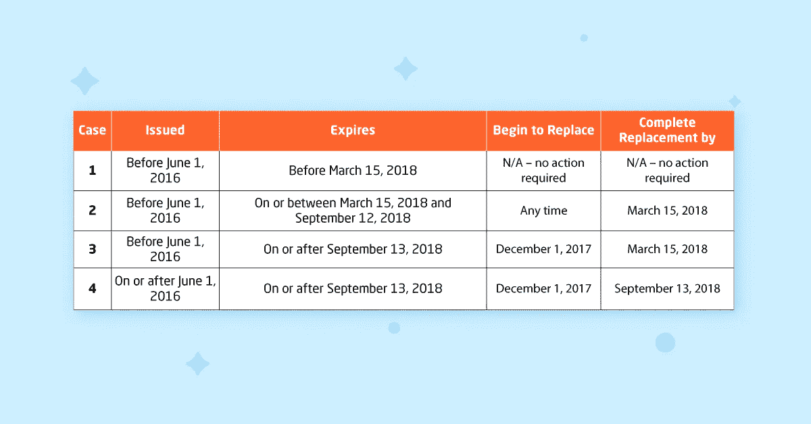
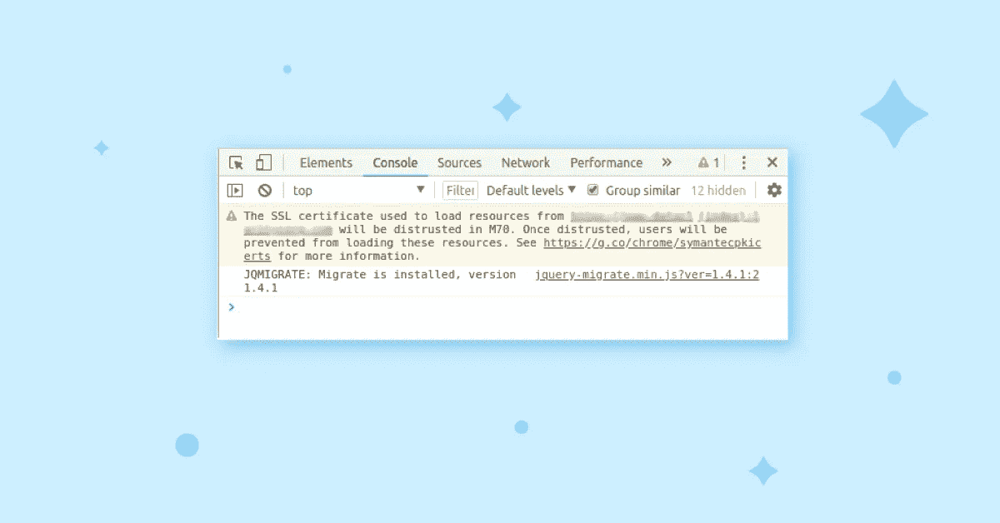

# 谷歌不信任赛门铁克 SSL 证书。为什么重要？

> 原文：<https://medium.com/hackernoon/google-distrust-of-symantec-ssl-certificates-why-is-it-important-9a5bb35a35f5>

在计划于 2018 年 4 月 17 日发布的 Google 66 中，谷歌计划不信任 2016 年 6 月 1 日之前发布的所有赛门铁克颁发的 SSL 证书。对此应该做些什么？

事实证明，赛门铁克 SSL 证书不符合[行业标准指南](https://cabforum.org/baseline-requirements/)。此外，赛门铁克将颁发证书的权利委托给了几家组织(即 Thawte、GlobalSign、GeoTrust、RapidSSL 和 Equifax ),这些组织不对某些可疑的 SSL 申请人进行必要的背景调查。在 2017 年 9 月 11 日发布的帖子中，[谷歌宣布计划在 2018 年 10 月 23 日前不信任所有赛门铁克 SSL 证书](https://security.googleblog.com/2017/09/chromes-plan-to-distrust-symantec.html)。

这 13 个月的宽限期是为了让赛门铁克进行一些内部清理，重建他们的基础设施，并处理合规性问题。在赛门铁克的[回复帖子中，该公司同意了提议的条款，宣布了 SSL 证书更换的时间表，并为其客户提供了如何处理这种情况的说明。](https://knowledge.symantec.com/support/ssl-certificates-support/index?page=content&id=SO29611)

来源——[Symantec.com](https://knowledge.symantec.com/support/ssl-certificates-support/index?page=content&id=SO29611)。

这对普通互联网用户意味着什么？你必须检查你的网站是否受到谷歌不信任的影响。这很容易做到:

*   在您网站的页面上按 F12 检查 HTML 代码。
*   如果您的证书有问题，将会显示警告。
*   如果你遇到这样的警告，只需用可信的认证机构发布的证书替换有问题的证书，谷歌不会对你进行任何进一步的处罚。

这意味着影子企业的证书很可能不会被审查，而合法企业主则没有什么可担心的。

由于 [Chrome 66 应该在 2018 年 4 月 17 日](https://www.chromium.org/developers/calendar)发布，你还有一段时间更换证书，然而时间已经不多了。一旦 Chrome 70 在 2018 年 10 月 23 日左右发布，任何从之前的基础设施发布的赛门铁克 SSL 证书都将失效。确保你是安全的！

最初，这个故事被发布在我公司的博客上—[https://it svit . com/blog/Google-distrust-Symantec-SSL-certificates-important/](https://itsvit.com/blog/google-distrust-symantec-ssl-certificates-important/)