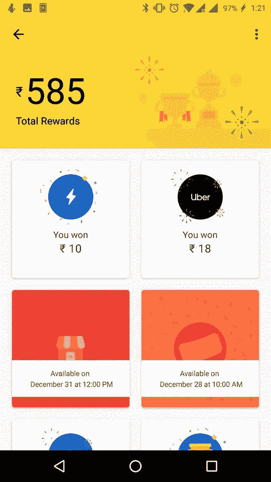
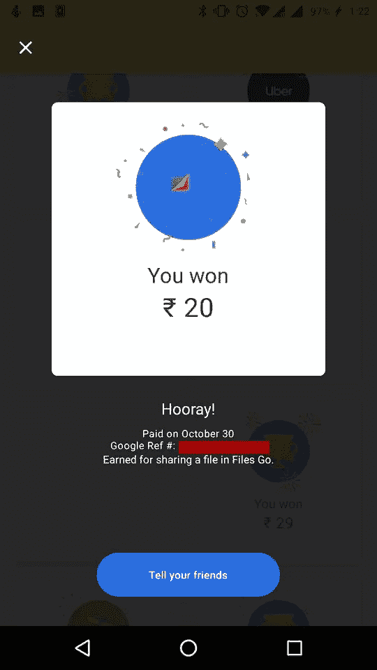
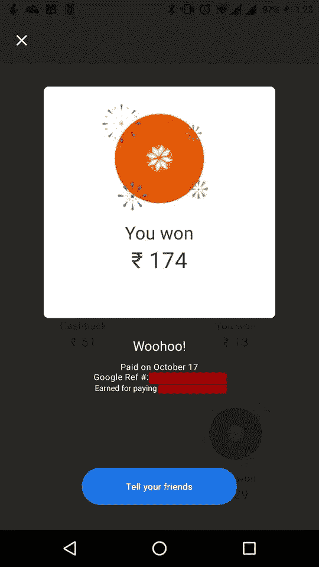
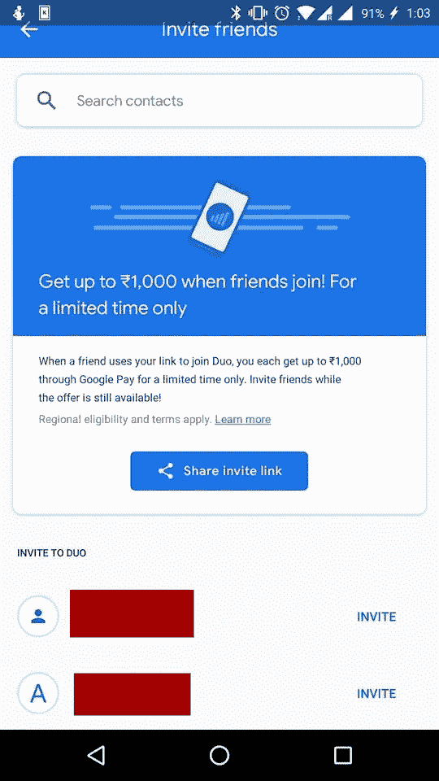

# 谷歌实际上是在通过贿赂进入印度应用市场

> 原文：<https://medium.com/hackernoon/google-is-literally-bribing-its-way-in-to-the-indian-app-market-4408f4aba9a2>

印度有大约 13 亿人口，占世界人口的 17%,对世界各地的公司来说是一个有利可图的地方。与世界上人口最多但市场封闭的中国不同，印度给予外部竞争者更多的自由。

但这也带来了市场的大量竞争。那么在这么大的市场，有这么多竞争对手，怎么竞争呢？做出伟大的产品？做极端量的营销？或者干脆贿赂消费者！这就是谷歌的目的。

印度本身就是一个难以攻克的市场。它拥有巨大的智能手机市场和快速增长的互联网业务。这主要是由于印度电信巨头 Reliance Jio 提供的极其便宜的互联网订阅价格。无论如何，印度是一个很难盈利的市场，因为与世界其他地方相比，印度人在在线服务上的花费很少。

这是因为印度的人均收入很低。引用世界银行的话，“虽然印度 2011 年的人均年收入为 1410 美元，是世界上最穷的中等收入国家之一，但北方邦(人口比巴西还多)仅为 436 美元，印度最穷的邦之一比哈尔邦仅为 294 美元”。(来源维基百科)

因此，应用开发者不能指望通过直销获得太多利润。在这里，数量很重要，因为更多的观众会带来更多的广告收入，也会有更多的数据卖给广告商。谷歌位于数据和广告生态系统的顶端。

问题是谷歌希望印度人使用的许多应用程序已经在市场上占有一席之地。因此，当谷歌想要在印度推出其支付平台时，它做了一些荒谬的事情，以获得对本土 PayTM 应用的优势。它开始贿赂顾客。

谷歌推出了一款名为 Tez(现在的 Google Pay)的印度制造支付应用。与西方的支付应用不同，谷歌的 Tez 利用了统一支付接口(UPI)，这是一个由印度国家支付公司开发的即时实时支付系统。该系统允许银行账户之间的即时交易。

这开启了一种新的获取和保留客户的方法。对于用户进行的每一笔交易，他们都会收到一张金额不等的刮刮卡作为奖励。这将立即存入用户的银行账户。

应用程序为用户提供免费或打折试用，或者根据以后可以使用的服务提供推荐奖励的日子已经一去不复返了。谷歌现在可以用真金白银贿赂你了。结果是惊人的。我认识的几乎所有人都改用 Tez(现在的 Google Pay)进行快速转账。虽然奖金正在枯竭，因为现金奖励的机会已经大大减少了(从每笔交易百分之百的现金奖励，到目前十几笔交易中的一次)。

All the rewards I won

印度版本的 Google pay 现在已经有超过 5000 万的安装量，正在成为本土 PayTM 的一个强有力的竞争对手。但是谷歌并没有止步于 Google Pay 的应用程序现金计划。它现在正在将这一功能扩展到其他应用程序。它正在利用 Google Pay 应用为使用其他 Google 应用提供现金奖励。

Look ma! I am rich!!

谷歌曾用它在 Google Pay 上为使用其文件应用程序传输文件的用户提供刮刮卡。用户可以获得多达三张刮刮卡，用于与谷歌文件应用的其他用户共享文件。这些刮刮卡将奖励双方用户高达 50 卢比(约 0.7 美元)的现金奖励。

现在，谷歌正在使用同样的方案邀请人们加入谷歌的语音和视频通话平台 Google Duo。这一次，邀请并让朋友加入的用户将获得高达 1000 卢比(约 14 美元)的奖励。作为回报，加入者也会得到同样的报酬。

这就提出了这样一个计划背后的道德问题。对于一家资金雄厚的公司来说，这仅仅是为建立未来的广告和数据收集基础的投资，从长远来看，这将给他们带来金钱。但这也在蚕食规模较小的企业。

到目前为止，应用程序用户只能兑换同一平台上的设施，但谷歌支付真金白银可能会彻底改变这一等式。用户显然会喜欢可以在任何地方使用的奖励，而不是在希望用奖励留住他们的平台上。而金钱显然是最万能的奖励。

没有什么可直接提供的小玩家无法与这样的计划竞争。谷歌正在用原始资金购买用户群。它指望印度在未来几年实现增长。随着人均收入的增加，谷歌新兴生态系统的支出也会增加。

另一方面，新玩家几乎总是要求至少在几年内盈利。他们现在不能玩用钱获取用户群的长期游戏，也许十年后才能得到回报。即使他们想玩谷歌的游戏，他们也没有一个可以提供金钱利益的支付平台。

因此，尽管谷歌的所作所为并不违法，但也不完全合乎道德。谷歌是在不违反任何法律的情况下购买其统治地位的方式，并在此过程中埋葬竞争对手，不给他们公平的竞争机会。