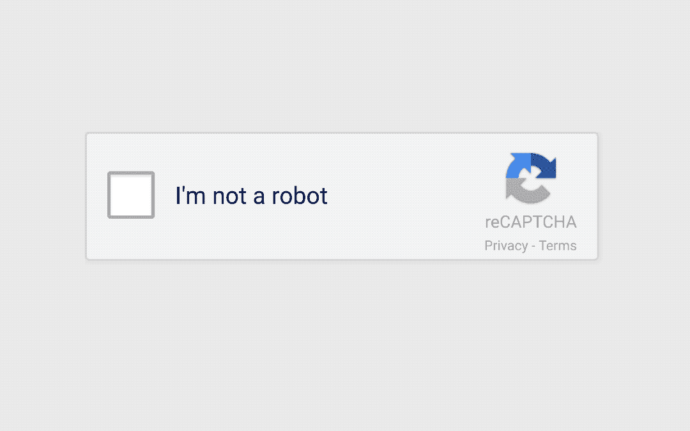

# 谷歌在利用你

> 原文：<https://medium.com/hackernoon/google-is-using-you-recaptcha-hcaptcha-human-protocol-d911ff51a494>

如果你在过去的十年里一直在互联网上，你一直在为谷歌做志愿者工作。每次你碰到那些神奇的单词时，你都要打卡:“我不是机器人。”

当然，这个小工具通常不会相信你的话——它会显示一个图像网格，并要求你识别店面、汽车、街道标志或狗，以证明*你不是机器人。你点击提交就打卡下班了。*

正如 [hCaptcha](http://hcaptcha.com) 创始人 Eli-Shaoul Khedouri 解释的那样:**“大多数人没有意识到，每次他们登录网站‘点击汽车’，他们都在帮助训练谷歌的自动驾驶汽车项目。”**

用户在登录他们的网上银行或虚拟体育网站时，每天会提供数十亿个答案和数据点，网站充当主机，谷歌从中获益。用户和网站所有者的努力没有得到任何回报。

看起来 hCaptcha 的创始人在玩恶作剧。

他们构建了一个新的僵尸检测小工具，功能类似，但增加了一个不错的好处:**网站所有者和最终用户因他们在交易中的角色而获得报酬。**

几周前，我写了[一个真正的解决方案:使用脸书获得报酬](https://hackernoon.com/a-real-solution-get-paid-for-using-facebook-77b78d0a3c34)，我认为脸书用户应该为他们创造内容(和价值)的角色获得报酬。为什么脸书因为主持而获得所有的利益(广告收入)？

谷歌和 reCAPTCHA 并没有什么不同。获得如此大的工作量是一个令人印象深刻的辉煌壮举——尤其是免费的——但这对最终用户或网站所有者来说并不公平。

好消息是你可以为此做些什么: [HCaptcha](https://hackernoon.com/tagged/captcha) 现在在其网站上提供 reCAPTCHA 的替代者，[hcaptcha.com](https://hcaptcha.com/)。

仍然没有更公平的脸书版本。

*Andrew J. Chapin 是* [的联合创始人&CEO*Benja*](http://benja.co)*负责人*[*Benja Coin*](http://benjacoin.com)*token 项目，著有*[*Art of the Initial Coin Offering*](https://www.amazon.com/Art-Initial-Coin-Offering-Crypto-Token-ebook/dp/B075RRWGT1/ref=as_li_ss_tl?ie=UTF8&qid=1510782200&sr=8-1&keywords=art+of+the+initial+coin+offering&linkCode=sl1&tag=p02bbf-20&linkId=c4fe0973e4335f975fcab74b1f62ad7e)*，以及* [*直觉机器*](https://www.intuitionmachines.com/) *的团队成员(本帖中有提及)。今年 11 月，安德鲁正在为* [*名运动员跑纽约市马拉松，以结束老年痴呆症*](https://give.caringkindnyc.org/index.cfm?fuseaction=donate.participant&participantID=33993) *。*