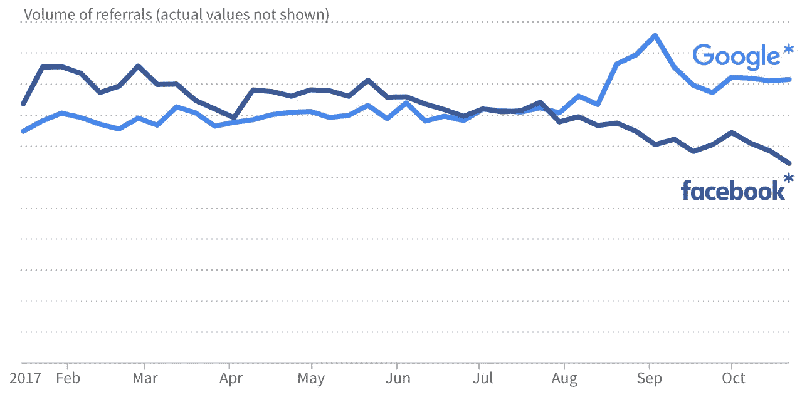
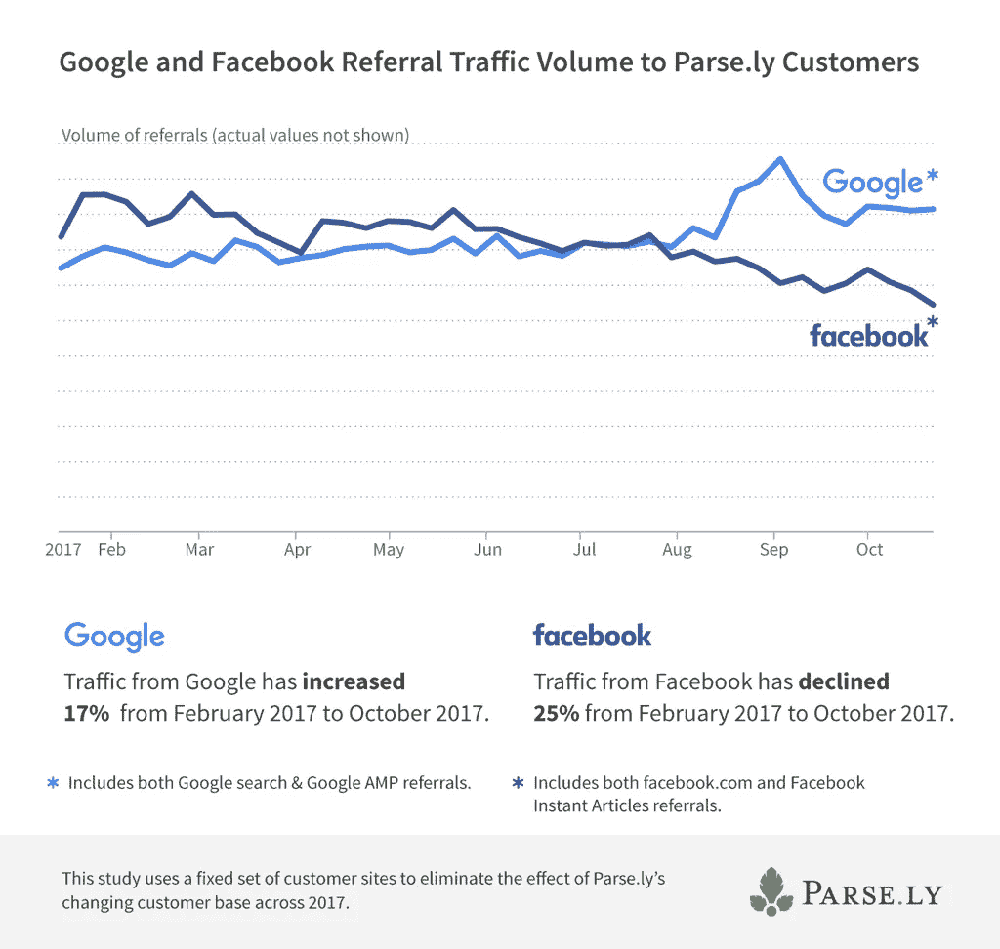
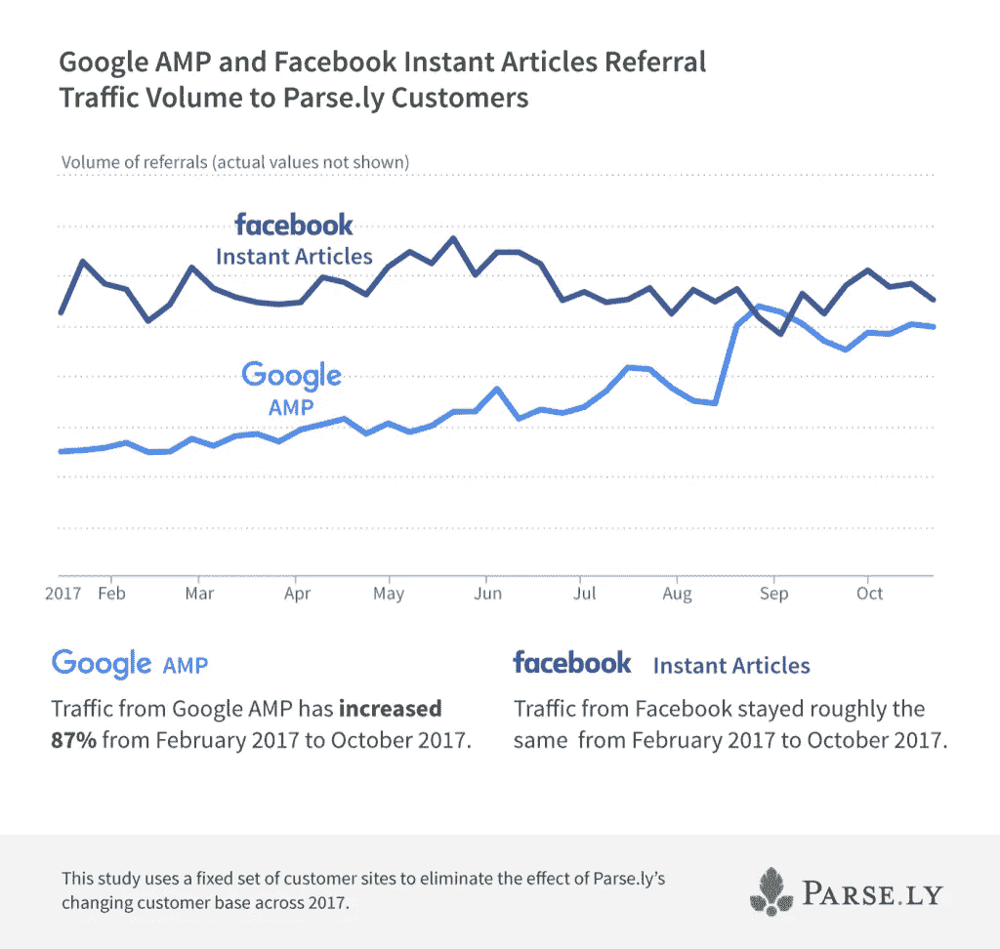

# 谷歌将脸书挤下推荐流量榜首

> 原文：<https://medium.com/hackernoon/google-knocks-facebook-off-the-referral-traffic-top-spot-21854c24165d>

大约四年前，在所有出版商中，社交流量盖过了搜索流量。我所说的“社交流量”主要是指“[脸书](https://hackernoon.com/tagged/facebook)”。

那个时代似乎已经过去了。据实时分析平台 Parse.ly 的数据显示，[谷歌](https://hackernoon.com/tagged/google)再次荣登榜首:

康拉德·李[在 Parse.ly 博客](https://blog.parse.ly/post/6663/facebook-declines-google-grows-news-audiences/)上写道:

> [……]经过六个月的稳步下降，我们现在宣布下降幅度很大，并且确实影响到了我们大多数的出版商。对比 2017 年 2 月至 2017 年 10 月的数据，我们见证了脸书转诊量下降了 **25%。**

Lee 将这种变化归因于算法的变化，并提供了一些关于驱动它的因素的推测。他在数据中看不到他建议的大部分内容的明确证据，除了一点:脸书专注于加载时间更快的网站。这说明了什么？即时文章的推荐量似乎在上升:

> 8 月 2 日，脸书宣布该算法将优先选择页面加载时间短的文章。脸书的即时文章程序是专门为解决移动页面加载时间而设计的。尽管从 2 月到 10 月，脸书的整体推荐量下降了 25%，但下面的图表显示，脸书即时页面的流量保持稳定。

## 脸书淡化新闻业的动机

我自己的推测——这只是推测，尽管是有根据的推测——是总体下降是两件事的结合。有脸书的既定战略，让公司依赖脸书的交通，然后拒绝有机到达，迫使他们付费。我们在整个行业以及其他地方清楚地看到了一种模式。

然而，正如我去年在[媒体之声播客](http://voices.media/journalism-lecturer-adam-tinworth-tragedy-platform-dependency/)上建议的那样，我非常确定[语境崩溃](https://www.theguardian.com/technology/2016/apr/19/facebook-users-sharing-less-personal-data-zuckerberg)是这里的一个因素。一年多来，脸书一直担心个人分享的减少。鼓励这种做法的一个方法是减少订阅源中的新闻数量，突出更多的个人帖子。人们被他们在提要中看到的例子所引导。

当你把脸书因错误信息和超党派新闻(所谓的“假新闻”)而面临的严重政治压力加入这个等式时，我认为我们可以有把握地假设，脸书开始认为出版商带来的麻烦比他们值得的要多。这当然可以解释最近在世界一些地方进行的实验，即[将所有文章推送到一个单独的 feed](/@filip_struharik/biggest-drop-in-organic-reach-weve-ever-seen-b2239323413) 。

简而言之，我不认为脸书的交通会回到我们曾经拥有的样子——而且我们得到的交通将需要比以前更大的流量。

这对出版商意味着什么？

*   依赖脸书增长的商业模式已经死了，除非你买得起这种增长
*   出版商将需要重新关注搜索引擎优化——尤其是那些社交优先的出版商
*   所有出版商都应该更加关注直接的受众参与和发展，作为对算法转变的对冲

我预计后两者将是我 2018 年工作的主要组成部分。

__

*我的下一期* [*SEO 记者*](https://www.journalism.co.uk/vocational-skills-study/seo-for-journalists-a-practical-guide-to-getting-your-work-found/s43/a554202/) *课程将于 2 月 28 日开课。当然，它将会更新以反映过去几个月里搜索引擎的最新变化。我很想在那里见到你。*

*最初发表于* [*一个人&他的博客*](https://www.onemanandhisblog.com/archives/2018/01/goole-traffic-higher-facebook.html) *。*