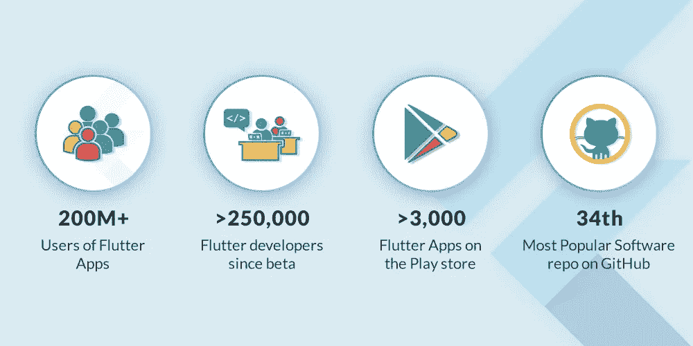
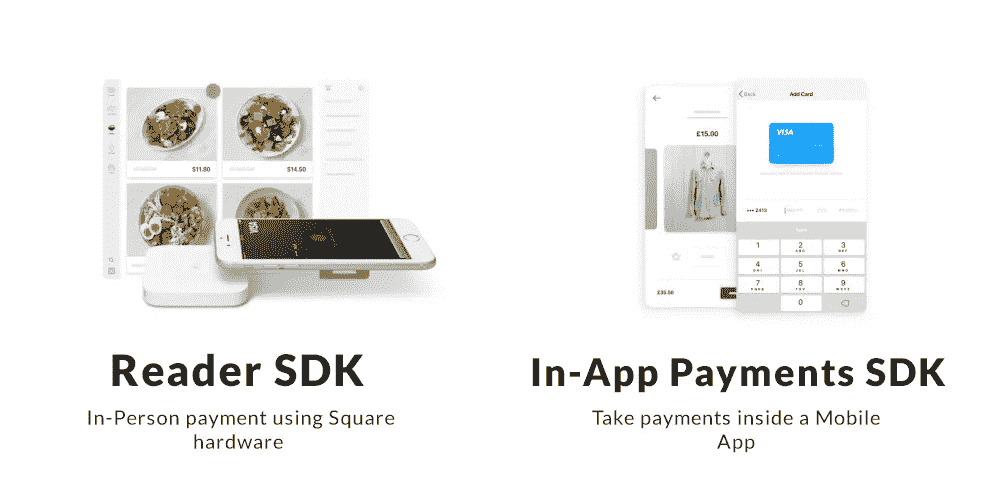

# 谷歌推出超越移动应用开发的 Flutter 1.0

> 原文：<https://medium.com/hackernoon/google-launches-flutter-1-0-which-goes-beyond-mobile-app-development-75009a730585>

谷歌终于在 2018 年 12 月 5 日伦敦的现场活动上发布了 Flutter 版本。

它是一个快速、强大的跨平台应用程序 UI 框架，帮助开发人员从单一代码库创建有吸引力的原生移动应用程序用户体验。

自从 2017 年 3 月首次发布以来，Flutter 一直是大多数开发人员社区的热门话题。虽然很少有人说 Flutter 只是谷歌的一个小实验产品，该公司甚至没有认真对待。

但是，在伦敦最近的 Flutter live 活动之后，谷歌展示了他们对 Flutter 的认真程度，证明了所有反对者都是错的！

事实上，相当多的开发者已经将 Flutter 确立为他们理想的跨平台[移动应用开发](https://www.zealousys.com/)工具。再加上 Flutter 的采用率是业界前所未见的！

不仅如此，现在有许多[品牌在他们的移动应用中采用了 Flutter](https://flutter.io/showcase) ，这证明该框架不仅值得利用，而且其效率比以往任何时候都高。

然而，如果你错过了观看现场直播，这个博客将带你浏览他们发布的所有公告。

# 在 Flutter 2018 现场活动期间发布的公告

## 1 — Flutter 1.0 现已面向所有人推出

自从谷歌发布 Flutter preview 2 以来，稳定发布的 Flutter 1.0 版本就一直是这家科技巨头的优先选择。现在，它终于可以供大家使用了。

第一个稳定版本提供了下面提到的各种高级支持:

添加到现有应用中
谷歌地图
UI 本地化为 50 种语言
Pixel-完美的 iOS 支持
平台视图
网络浏览器

## 2 — Flare 集成

Flare 是二维旗舰产品，现已集成到 Flutter 中。这是一个工具，帮助开发人员制作和出口 2D 矢量设计以及动画的权利，从颤振本身。
这意味着，它将设计人员和开发人员带到同一个平台上来构建移动应用程序。

## 3 —省道 2.1

虽然您必须了解包含在以前版本的 Flutter 中的 Dart 编程语言。那么现在，谷歌也升级了谷歌 Dart 编程语言的版本，发布了 Dart 2.1。

Dart 的最新版本有望成为比以前更强大的语言，并且它还具有编译时检查功能，能够处理高性能和低代码量。

## 4 —颤振的材料成分

谷歌的 Flutter 团队和 Material Design 团队相互合作，增加了一个可重复使用的小部件设计，该设计具有 Android Material Design 和苹果 Cupertino 的设计组件。

## 5-平方积分

Square 是美国最大的支付解决方案之一，现在已经通过两个插件集成到 Flutter 中——应用内购买 SDK 和阅读器 SDK。

Image Credit: [Squareup](https://squareup.com/us/en/flutter)

在 Flutter 中，用户现在可以使用 Reader SDK 进行当面支付，而通过应用内支付 SDK，开发者可以在他们的移动应用内添加支付功能。

这意味着，拥有移动应用的企业可以利用这一功能提升其以支付为中心的产品。

## 6 —与 CodeMagic 的合作伙伴关系

无代码构建，一个普遍采用的开发系统现在与 CodeMagic 合作集成到了 Flutter 中。

通过这种新的合作关系，开发者现在可以轻松地开发移动应用程序，创建其版本，并从 Flutter 的构建系统中将其发布到应用程序商店。

## 7 —通过 HummingBird 嵌入多个平台

虽然它仍在开发中，但谷歌已经宣布，Flutter 将通过蜂鸟从移动设备转向网络和可穿戴设备。

蜂鸟是谷歌的最新项目，专注于将 Flutter 带到不同的地方。它基本上采用 Dart 代码，并将其编译成 JavaScript，从而允许代码在任何现代浏览器上运行。

此外，谷歌的团队也在努力建立一个插件系统，这将使 Flutter 很容易嵌入到现有的网络应用程序中。

然而，这并不是结束。该团队还致力于将 Flutter 引入除网络和可穿戴设备之外的许多其他平台，包括 MacOS、ChromeBook 和 Windows。事实上，他们在现场活动中也展示了同样的情况。

# 结论

总的来说，随着上述功能的发布和 Hummingbird 的发布，现在很明显 Flutter 确实是一个强大而稳定的工具，有望在未来使跨平台应用程序开发过程变得更少。

而且不说别的，还是值得关注的。