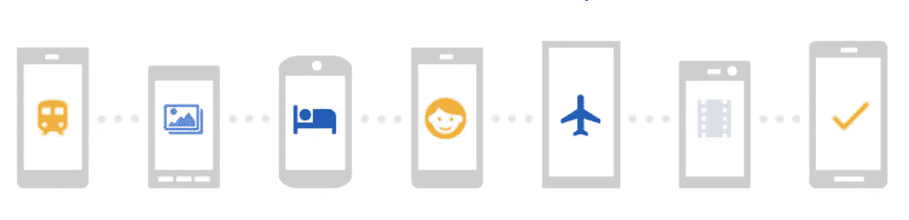

# 谷歌 RCS 并不是要对抗 WhatsApp

> 原文：<https://medium.com/hackernoon/google-rcs-is-not-trying-to-fight-whatsapp-a35ced0d1871>

## 但无论如何，他们可能最终会反抗

谷歌 [上周](https://www.theverge.com/2018/4/19/17252486/google-android-messages-chat-rcs-anil-sabharwal-imessage-texting)宣布“冻结”他们的 Allo messenger 应用程序的开发，专注于他们的原生短信替代品，现在被称为谷歌聊天。

# **RCS，还是僵尸**

这个“聊天”应用程序，以前被称为 Google Messages，将支持 RCS 标准,移动行业 10 多年来一直大力支持该标准，但没有足够的实际推动力来实现它。谷歌的声明并没有改变这种情况:由于相对缺乏吸引力，他们基本上已经停止了 Allo，但没有新的迹象表明这种新的聊天应用程序更有可能为 RCS 带来成功。

我不会讨论这种成功背后的原因，因为有很好的分析可以很好地完成这项工作。我更愿意建议阅读 Bubbley 院长去年对 RCS 的看法，这不仅仍然适用，而且提醒我们他自己三年前的分析今天仍然有效:

 [## 电信和 OEMS:你应该忽略 GSMA 的“高级信息”，RCS 和“通用配置文件”

### 最多有两个这样的问题——并引入新的问题。尽管如此，移动运营商应该继续…

disruptivewireless.blogspot.com](http://disruptivewireless.blogspot.com/2017/02/telcos-oems-you-should-ignore-gsmas.html) 

Tsahi Levent-Levi 也就此写了一篇很棒的文章。其中一个有趣的焦点是 RCS 如何缺乏端到端加密(这来自于对电信运营商的监管约束，电信运营商必须能够向当局提供合法的侦听，这与 e2e 加密不兼容)，而目前大多数现有的消息传递解决方案都提供这种功能。如果“普通”用户对端到端加密有市场需求，这是很有争议的，但是鉴于当前的时代精神，提供一种比现有产品更不安全、更不关心隐私的新通信服务是错误的:

 [## RCS 现在谷歌消息。消费者信息的下一步是什么？* BlogGeek.me

### 聊天不会给运营商带来短信的辉煌。The Verge 上周发布了一条独家新闻，说所有人都出去了…

bloggeek.me](https://bloggeek.me/rcs-now-google-messages/) 

所以总而言之，很明显，RCS 与 WhatsApp 甚至 iMessage 竞争的机会并不好。这就是为什么我想为这个讨论提供一个小附录，看看为什么谷歌的目标不是打败 [WhatsApp](https://hackernoon.com/tagged/whatsapp) (或者他们是这么认为的)。

# **谷歌的真正目标**

当我说谷歌的 RCS 不想与 WhatsApp 竞争时，是因为我不认为他们期望在个人通信方面产生相关影响。是的，他们正在提供这样一个频道期望拥有的所有功能，在某种程度上，他们这样做是为了满足运营商的期望，运营商相信他们会让人们重新使用他们的通信服务，并为生态系统带来“平衡”。

但是谷歌真正想要的是加强他们的核心业务:广告。因为广告业务就是将品牌(和公司)的信息传递给潜在客户。

这种“广告”功能正是 RCS 将通过其解决方案的一个关键元素带给 Google 的:载波聚合中心。

# **谷歌的 RCS 中心**

Google 的 RCS 解决方案有三个部分:

*   **安卓手机中的聊天应用**。这是他们想要控制的一块，因为这不仅会让他们对消息渠道有更多的控制，还因为这将有助于减少 Android 碎片，并成为获得另一个关键部件:拨号器的垫脚石。(实际上，他们正在尝试与运营商达成另一项协议，以获得这一权利。[我在之前的一篇帖子](https://hackernoon.com/google-duo-puts-the-last-nail-in-viltes-coffin-9a748b7d1bf5?source=linkShare-9ce67d1c0b9-1525020582)中谈到了这一点。但很明显，他们没有意识到这一点，因为主要的安卓制造商三星没有在他们的手机上安装谷歌应用。来自上周 The Verge 文章:*三星手机也将支持使用三星应用*聊天。
*   **[**Jibe RCS-云服务平台**](https://jibe.google.com/jibe-platform/) 这样运营商就可以在他们的网络中进行简单而廉价的 RCS 设置。有些运营商会使用，有些不会(我能想到有些运营商已经在自己的 RCS 基础设施上投入了大量资金，很难证明转而使用不同的解决方案是合理的)。**
*   **以及**RCS Hub**，用于允许运营商之间的互连。**

**最后一点非常重要，因为 RCS(以及任何其他基于运营商的通信服务)的一个大问题是互操作性。**

# ****互操作性的问题****

**互操作性意味着确保从运营商 A 的用户发送到运营商 B 的用户的消息能够工作，从 A 的服务器和基础设施移动到 B 的服务器和基础设施。在互联网时代，这听起来似乎是一件显而易见的事情，但在运营商的世界里，一些流量交换对收费和结算有要求，当复杂的标准利用几十年的遗留系统时，情况就不是这样了。**

**互操作性一直是阻碍一些服务成功的一个大问题。例如，它适用于彩信，即“M [多媒体信息系统”](https://en.m.wikipedia.org/wiki/Multimedia_Messaging_Service)，这是短信的一种演变，允许发送照片(以及许多其他没有人使用的复杂内容，如幻灯片)。花了几年时间才能够在同一个国家的运营商之间成功发送照片，直到今天，当我使用它在国际上发送照片时，我仍然会小心翼翼。许多因素影响了它的失败(包括定价)，但是不良的互操作性带来的不可靠性是最重要的。**

**如果您认为世界上的每个运营商都必须确保与世界上其他运营商的互操作性，那么这就成了一个指数级的问题。这些是很多测试。**

# ****作为解决方案的枢纽****

**但谷歌可以在这方面提供帮助，成为世界上每个运营商连接的枢纽，确保一旦连接到枢纽，事情将与其他运营商合作。**

**诚然，谷歌的 Hub 可以是一个很大的简化。但这也让谷歌处于一个非常有趣的位置。因为这个枢纽成为了世界上所有运营商及其客户使用 RCS 联系的起点。**

**如果你是一家希望使用 RCS 联系客户的企业(这可能意味着你是一种神秘的动物，但我们将在后面讨论)，不需要与所有可能的运营商整合，只需连接到谷歌听起来很棒。如果你从谷歌购买广告，你可能已经和谷歌有了业务关系，所以这也不错。**

# **谷歌不在乎 P2P，它想要 A2P**

**这是谷歌实际上没有试图“拥有”RCS 服务，甚至是应用程序的关键。他们可以把这个问题留给运营商或设备制造商(尽管他们也更愿意拥有这个问题)，只要他们能控制这个中心。**

**对于广告业务来说，网络中心是最有价值的部分，因为它可以访问和控制全球的整个“RCS 库存”。如果世界上每个运营商都支持 RCS，并且世界上每个 Android 设备都支持聊天应用程序(无论是谷歌的还是其他任何人的),这将是一个相当大的库存。**

**正是这一规模使得 [GSMA 预测 2021 年 A2P RCS 业务](https://www.gsma.com/futurenetworks/rcs/universal-profile/)将达到 740 亿美元。但这将是由谷歌控制的业务，谷歌将与运营商分享收入，是的，但将是持有最大份额的单个公司。**

**他们并不关心用户可能不会真正使用 RCS 进行个人消息传递(P2P——个人对个人),只要它成为所有设备中可用的默认预安装入口点。它可能是手机中一个不需要的功能，但对于企业来说，它仍然是一个有价值的收件箱。**

**人们可能仍然使用 WhatsApp 互相聊天，但会通过聊天应用程序获得银行通知，并与他们的客户服务进行互动。**

****还是他们会？****

# ****但是机会还是很少****

**问题是，即使所有安卓手机上都有这个应用程序，并且 RCS 服务通过谷歌的 hub 连接到所有运营商，也不会显著提高 RCS 成为商业通信相关渠道的机会。**

**从用户的角度来看，风险在于**一个实际上只用于接收业务通信的收件箱很容易变成垃圾文件夹**。在我处理客户对通信应用程序的态度的个人经验中，我看到在短信渠道被滥用于营销通信的国家，人们会关闭短信通知，并完全忽略该“应用程序”。我记得一位客户在向我们展示他通过短信收件箱收到的垃圾邮件数量时，刚刚意识到他收到了他女朋友两周前发来的短信。他之前没有意识到这条信息的存在，因为他只希望通过 WhatsApp 进行“真正的”交流。对于企业来说，垃圾邮件文件夹不是一个好的销售渠道。**

**从设备的角度来看，只要苹果不支持 RCS，它就不会是一个通用的解决方案。考虑到 iPhones 也倾向于瞄准高收入人群，对于许多企业来说，无法达到这个基数使它成为一个真正糟糕的解决方案。企业可以进行双重集成，为 Android 用户提供 RCS 通道支持，为 iPhone 用户提供 iMessage 通道支持，但是如果他们可以用一个解决方案支持所有设备，那么投资这种复杂性值得吗？这种单一的解决方案可能来自竞争对手。**

**从竞争对手的角度来看，有两个不同的方面需要考虑:**

*   **相对较大的企业可能会有自己的应用程序，并能够通过这些程序进行商业沟通。像 [Intercom](https://www.intercom.com) 这样的平台可以很容易地添加到现有的应用程序中，并在 Android 和 iPhone 应用程序中创建一个通信通道(还有 Web！)这将使其处于业务控制中。为什么要投资整合 Google RCS？**
*   **没有应用程序的小企业将受益于与客户沟通的共享渠道。但是，当他们可以使用实际上更普遍的渠道时，为什么必须与谷歌合作来接触用户子集，或者等待 RCS 真正像承诺的那样普遍？**

**这将是谷歌的主要竞争对手。因为**谷歌可能没想到会用 RCS 跟 WhatsApp 打，但在这个市场**上，他们将不得不和 [**WhatsApp 争夺业务**](https://www.whatsapp.com/business/) **。有趣的是，这是一个竞争对手——脸书——也在广告业，它可能也与这一领域的客户有关系。****