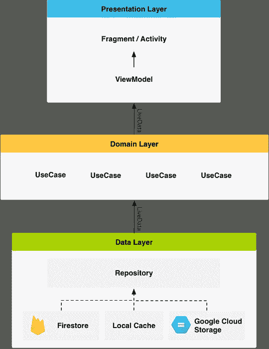
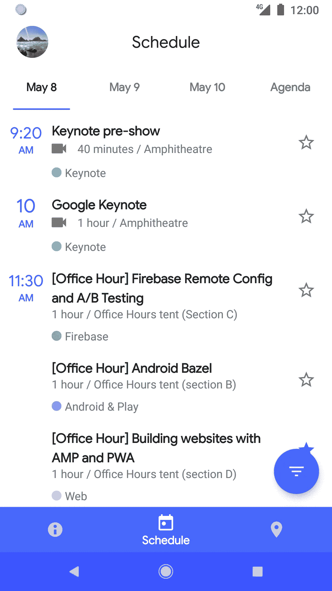

# 谷歌发布 I/O App 2018 源代码

> 原文：<https://medium.com/hackernoon/google-releases-source-code-for-i-o-app-2018-7461e1025b81>

谷歌在事件发生数周后发布 [I/O 事件](https://events.google.com/io/) Android 应用的源代码已经成为一种传统。

这个年度发布是为了展示应用程序开发的最佳实践。开发者可以看看代码，更好地理解谷歌在 [Android 应用开发](https://www.vtnetzwelt.com/mobile-app-development)方面的最佳实践。

# 应用架构

谷歌的 I/O 2018 应用程序代表了应用程序的完全重写。该应用程序已从 ContentProvider+SyncAdapter 架构转移到架构组件。

这是谷歌 Android 团队目前对开发 Android 现代应用程序的建议。谷歌已经使用[科特林](https://kotlinlang.org/)来重写应用程序。

这是该应用架构的总体概述

存储库层用于处理数据操作。数据来自不同的数据源

–用户数据存储在云 Firestore 中(远程或本地缓存)

–用户设置和首选项存储在共享首选项中

–远程存储会议数据，并读取和存储在内存中

存储库模块负责处理所有的数据操作。

[Dagger2](https://github.com/google/dagger) 用于依赖注入。

[Espresso](https://developer.android.com/training/testing/espresso/) 用于基本仪器测试，而 [JUnit](https://junit.org/junit5/) 和 [Mockito](https://site.mockito.org/) 用于单元测试。

# 重火力点

[Firebase 平台](https://firebase.google.com/)现在已经成熟，Firebase 技术的使用现在已经增加。以下是 I/O 2018 中使用的 Firebase 组件——

## FIREBASE CLOUD FIRESTORE

它是谷歌所有用户数据的来源

## FIREBASE 云函数

Firebase 云函数用于运行后端代码。预订功能、检查用户状态、检查空间可用性都依赖于云功能。

## FIREBASE 云消息传递

云消息用于通过 ping-and-fetch 模型通知应用程序会议数据的任何变化。

## FIREBASE 远程配置

远程配置用于以轻量级方式通知用户有关 WiFi 信息、会议日程等。

# 科特林

谷歌选择在 Koltin 从头开始重写应用程序，以带来现代的 Android 架构。使用 Kotlin 进行重写是一个简单的选择，因为

–kot Lin 的语法富有表现力、简洁而强大

–支持安全特性，包括可空性和不变性

–使用 Android Ktx 扩展增强功能

# 材料主题化

在 I/O 2018 上，材料设计团队宣布了材料主题化，这使应用程序能够定制材料设计，以实现产品品牌的更多个性化。

由于该应用程序是在材料主题化之前发布的，所以他们不能使用所有的新组件，但设法偷偷摸摸地使用了一些，包括一个新的底部应用程序栏和嵌入的浮动动作按钮。

**该 app 在** [**Github**](https://github.com/google/iosched) **上面向开发者开放。**

> 在我们的网站上了解更多信息— [VT Netzwelt](https://www.vtnetzwelt.com/blog/google-releases-source-code-for-i-o-app-2018/)