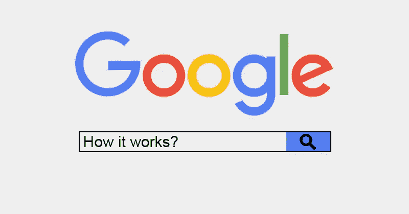
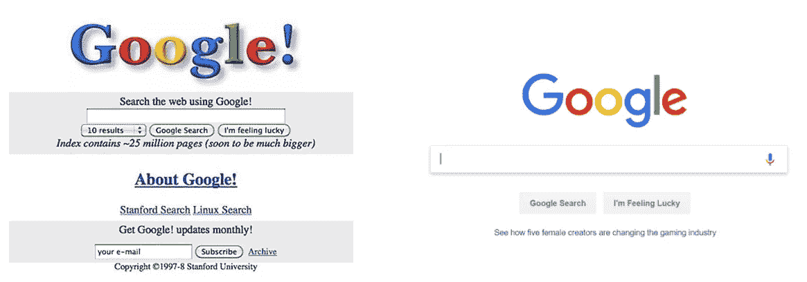
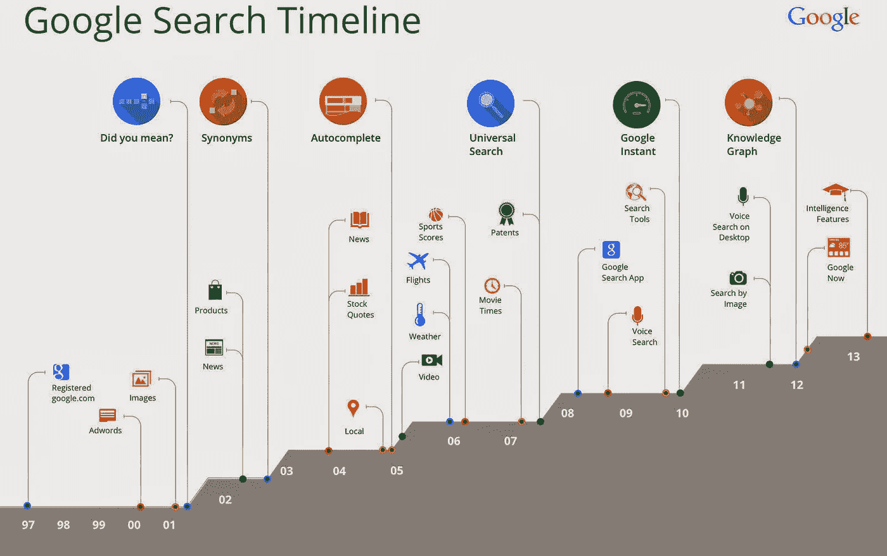
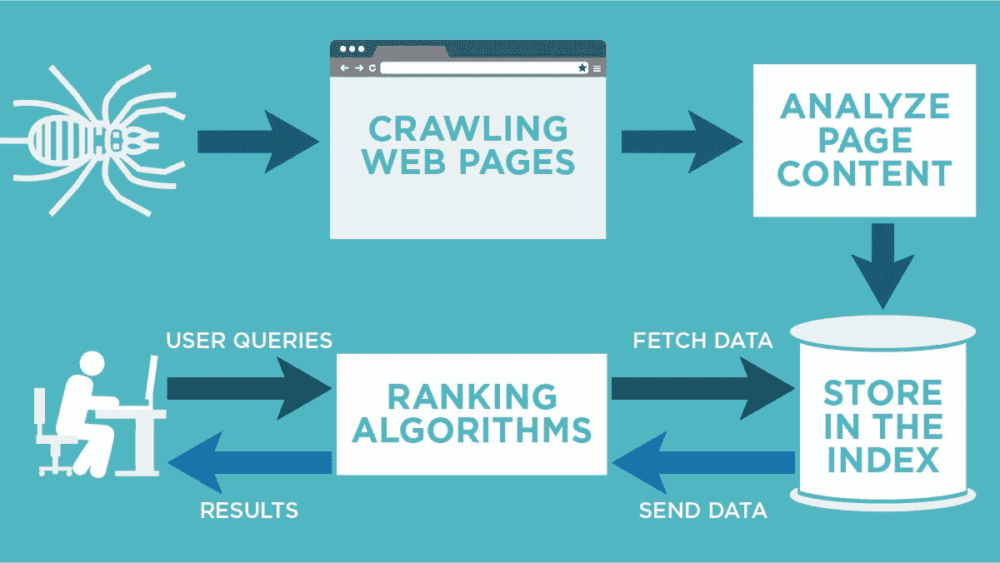
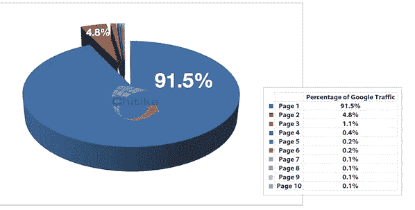
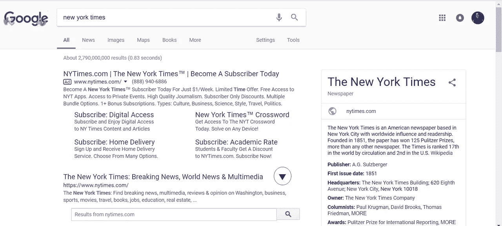
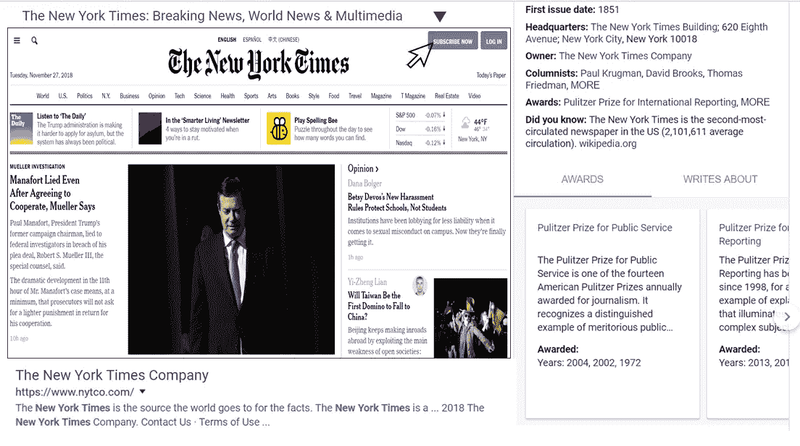
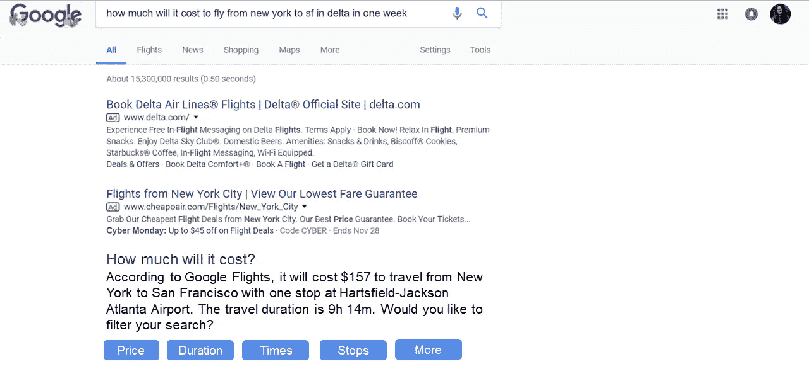

# 谷歌搜索——硕士论文如何变成价值 700 亿美元的想法

> 原文：<https://medium.com/hackernoon/google-search-how-a-masters-thesis-became-an-idea-worth-70-billion-c4c386e0ea17>

你们大多数人可能知道的是，你现在知道和使用的谷歌搜索始于拉里·佩奇和谢尔盖·布林 1996 年的一篇硕士论文，这篇论文彻底改变了人们看待搜索引擎的方式。然而，大多数人不知道的是，他们最初的想法不是对网站进行排名，而是对网站上的注释进行排名。

> 与布林合作的 Winograd 的一个创意页面似乎比其他页面更有前途:创建一个人们可以在网站上进行注释和评论的系统。但是佩奇越想注释，事情就越乱。你怎么知道谁可以发表评论，或者谁的评论是你最先看到的？为此，他说，“我们需要一个评级系统。"
> 
> 让一个人来决定收视率是不可能的。首先，它本来就不切实际。此外，人类不可靠。只有算法——精心设计、高效执行并基于可靠的数据——才能提供公正的结果。佩奇意识到这样的数据已经存在，没有人真正使用它。他问布林，“为什么我们不用网络上的链接来做这件事？”
> 
> —史蒂文·利维的《在广场》

***注:以下所有引文，除非另有说明，同样出自《在丛中》。***

而 Googol 这个被念错的名字[就是这样诞生的！](https://allthatsinteresting.com/google-name)

他们为这个想法工作了一年，然后给它起了个名字[“back rub”，这是一个搜索引擎，它利用进入网站的链接](http://infolab.stanford.edu/~backrub/google.html)，以一种给每个网页一个“排名”的方式。布林作为数学上的对手，开发了扫描网页的数据挖掘系统，佩奇开发了使用这些信息对网页进行排序的算法([命名为 Page rank——这个“页面”来自他的名字](https://www.quora.com/Is-PageRank-named-after-Larry-Page-or-is-that-just-a-coincidence)，而不是一个网页“页面”，这是一个轻微但非常值得的虚荣心)。如果缺少其中任何一个组件，最初的搜索引擎都不会工作。

现在，将近 20 年后，谷歌仍然使用 PageRank 作为其 200 个组件之一，通过它来评估网页，给它一个分数。其他的一些是[关键词使用，域名年龄，域名历史，国家 TLD 扩展，TF-IDF 等等。](https://backlinko.com/google-ranking-factors)

# 谷歌是如何从左图变成右图的

Evolution of Google from 1998 to 2018

以下是谷歌如何从一个拥有 2500 万页面、列出前 10 个链接的搜索引擎发展到一个[索引超过 18 亿页面](https://tekeye.uk/computing/how-many-websites-are-there)并列出超过 10 亿个充满文本、图像、视频和其他内容的搜索结果的搜索引擎的时间表。

Timeline of Google Search — Could find only till 2013

然而，旅程既不容易也不迅速。在我开始阅读史蒂文·利维的《在广场》之后，我明白了谷歌解决了一个多么大的问题——让 20 多亿人的生活变得更加轻松。现在，如果你在谷歌上输入“休斯顿·贝克”，你会得到一位美国学者的链接，他的名字是( [*继续，试试 i*](https://www.google.com/) *t* )。然而，大约 18 年前，情况并非如此。这个新生的算法不理解名字和关键词之间的区别。我在下面概述了谷歌克服的 1000 多个问题中的 3 个。

## 1.索引快一点，妈的！

How Crawling and Indexing Works

让我们假设，上帝保佑，今天印度钦奈发生了大地震。第一直觉是去谷歌上了解发生了什么和伤亡情况。然而，如果谷歌显示的不是新闻，而是最好的旅游景点，会怎么样呢？真是亵渎神明。

> “但随着网络的不断发展，谷歌增加了更多的机器——到 1999 年底，有 80 台机器参与了爬行(当时共有近 3000 台谷歌计算机)——出现问题的可能性大大增加了。尤其是自从谷歌决定购买其工程师称之为“廉价设备”之后。

到 2000 年，网络像杂草一样生长。每年都有数十亿的新页面被添加到语料库中。但是如果引擎不能抓取它们又有什么用呢？了解到严重性，工程师们建立了一个系统，[实现了“检查点”，这是一种在服务器或硬盘发生灾难时索引保持其位置的方法。但新系统走得更远——它使用了一种不同的方式来处理磁盘集群，更类似于并行处理的计算风格，而不是谷歌使用的“分片”技术。](https://en.wikipedia.org/wiki/Application_checkpointing)

Sanjay Ghemwat 和他的团队重建了整个文件系统。

## 2.Audrey Fino —为什么我看不到自己的名字？

我们都经历过。我们喜欢在搜索引擎上输入我们的名字，就像一个孩子打开圣诞礼物一样好奇。但是一个基于反向链接和关键词的算法如何区分一个名字和其他东西呢？

Haven’t we all been there?

> 一次不成功的搜索成为了传奇:2001 年的某个时候，阿密特·辛格哈尔得知人们在搜索框中输入“奥黛丽·菲诺”这个名字时搜索结果很差。谷歌不断返回赞扬奥黛丽·赫本的意大利网站。(Fino 在意大利语里是罚款的意思。“我们意识到这实际上是一个人的名字，”辛哈尔说。但是我们没有系统中的智能。"

甚至在那个时候，超过 8%的 T2 搜索是一个名字。那么，你将如何设计新的信号来更巧妙地从查询中识别姓名，并将它们从网络语料库中挖掘出来？Singhal 和他的同事从他们几乎总是做的地方开始:用数据。为了改善搜索，谷歌对白页进行了许可，允许它使用数百本厚新闻纸的大部头书中包含的所有信息，这些内容除了名字(以及地址和电话号码)什么也没有。

谷歌的搜索引擎吸取这些名字并进行分析，直到它理解了什么是名字以及如何在系统中识别它。

## 3.热狗——煮小狗还是香肠三明治？

I couldn’t resist!

热狗会让沸腾的小狗或香肠三明治变得高贵吗？*这是个愚蠢的问题。甚至一个(非心理变态的)5 岁小孩也知道这个意思。谷歌很聪明，明白“热”意味着“沸腾”，“狗”意味着“小狗”。但它在上下文和组合方面做得不好。*

> “谷歌的同义词系统理解狗和小狗相似，沸水是热的。但它也得出结论，热狗和沸腾的小狗是一样的。这个问题在 2002 年末得到了解决，这是基于哲学家路德维希·维特斯坦根关于词是如何被语境定义的理论的突破

这意味着，通过抓取和索引数十亿个页面，谷歌可以理解哪两个词看起来彼此更接近。“热狗”经常与“面包”、“香肠”和“棒球”一起出现。经过数百万次的尝试和点击，它终于明白如何处理这样的查询。

为了让引擎变得更智能，辛哈尔意识到他必须学会掌握“打破僵局”的艺术。一个**二元模型**或**二元模型**是来自[记号](https://en.wikipedia.org/wiki/Token_(parser))的[串](https://en.wikipedia.org/wiki/String_(computer_science))的两个相邻元素的序列，这些记号通常是字母、音节或单词。他不得不告诉系统“纽约”实际上是一个实体，但这不同于“纽约时报”，后者是一个独立的实体。

# 谷歌搜索的未来——我的想法

谷歌在网站索引、排名和显示信息的方式上发生了巨大的转变。以下是我对搜索引擎的三个想法:

## 1.一站式目的地

我的两点看法是，谷歌搜索已经从一个搜索引擎转变为一个一站式的目的地来寻找答案。这里有一些关于点击搜索结果中各种链接的人的百分比的统计数据。

Stats on % of people who visit different pages on Google

据说 67%的人会点击前 5 个链接。95%的人会点击前 10 个链接。这使得其他数百万页面上的链接只有 5%的机会被点击。这证明了人们想要立即得到满足——他们可以从谷歌的主搜索引擎结果页面(SERP)中得到满足。

知道了这一点，我会设想未来人们不需要点击任何链接，而是在主页上展开每个结果并执行操作。

Simple prototype of how it could look like — with an ‘expand’ option present

Simple (and shabby) prototype of what happens after clicking on ‘expand’

## 2.背景卓越

人们已经开始搜索复杂的问题，他们希望谷歌能为他们提供答案。凭借其围绕自然语言处理的资源和人才，我设想未来谷歌甚至可以回答如下问题。

Currently the results from Google Search

How it could look like in the future

## 3.只是思考，不要打字

想象一个你不再需要打字的世界。真是松了一口气。你所要做的就是*思考*，你面前的设备明白这一点。听起来太牵强？恐怕不行。研究人员现在已经在这项技术上工作了 5 年多，并且有一些非常令人信服的原型，如[这个](https://www.youtube.com/watch?v=RuUSc53Xpeg)和[这个](http://fortune.com/2014/02/10/this-wearable-device-reads-your-brain-waves-is-there-a-market-for-it/)来表明他们正在取得进展。

How AlterEgo works (like magic)

我可以想象未来谷歌将这些设备商业化，将它们转换成一种非侵入性的(并且看起来不可笑)设备，这样人们就可以购买它们并控制他们的谷歌搜索，甚至用它来控制他们的手机。

*******************************************************************

***谷歌可能一开始是一个显示链接的搜索引擎。然而，20 年来它发展迅猛，将其触角延伸到其他领域，如*** [***自动驾驶汽车***](https://waymo.com/)*[***疾病预防***](http://www.verily.com/)*[***网络安全***](https://en.wikipedia.org/wiki/Chronicle_(company))*我只看到它在进一步发展，让我们的生活变得比我们想象的更容易。***

************************************************************************

****如果你觉得这个有用，做* [***关注我***](/@poojabalasubramani) *获取更多文章。你知道你可以*👏*不止一次？试试吧！*💓我喜欢写社会问题、产品、科技行业以及我在美国读研究生的经历。这里是我的 [***个人博客***](http://poojabalasubramani.wordpress.com/) ***。******

***和我联系的最好方式是通过**[***insta gram***](https://www.instagram.com/thecuriousmaverick/)*和* [***脸书***](https://www.facebook.com/pooja.balasubramani?ref=bookmarks) *。我在那里分享一些有趣的内容。想了解更多我的职业生活，可以查看我的*[***LinkedIn***](https://www.linkedin.com/in/soundarya-balasubramani/)*。快乐阅读！****