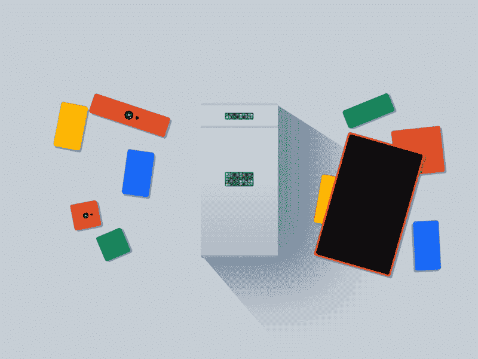
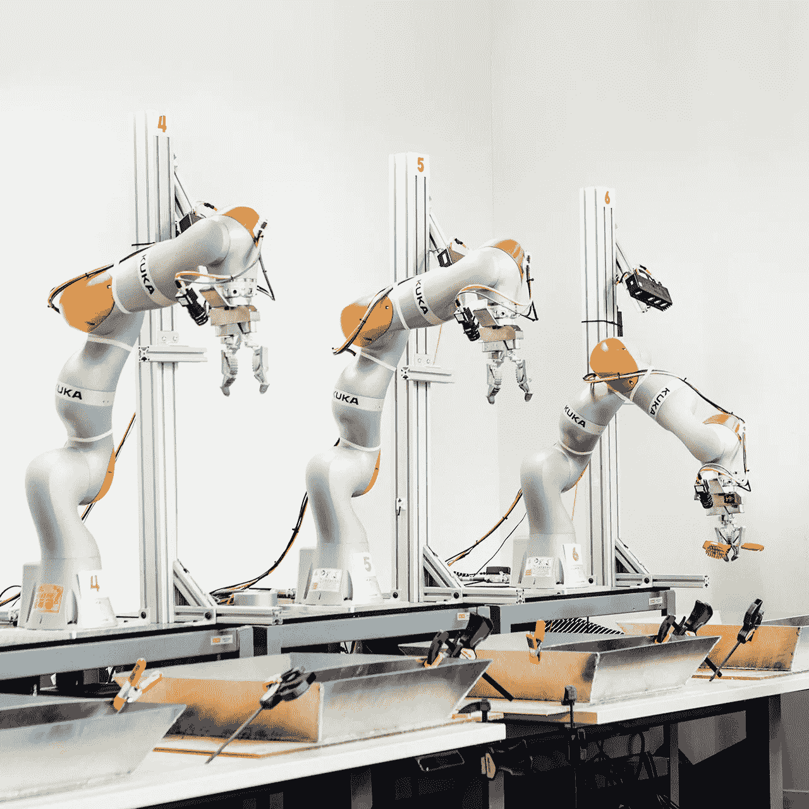
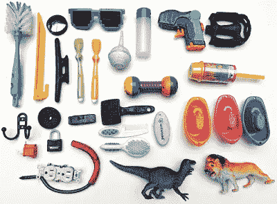
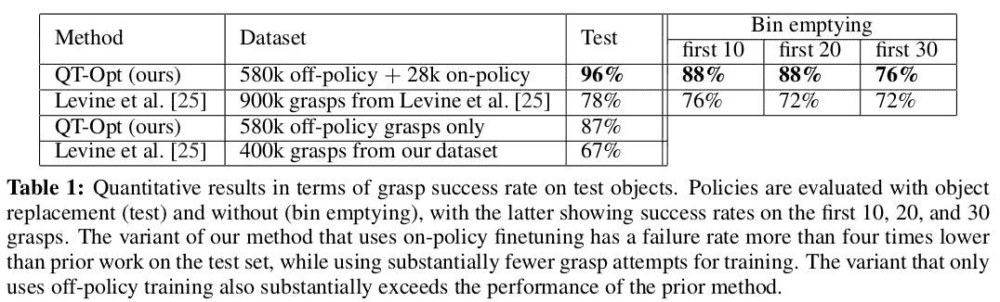
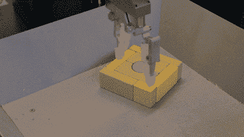
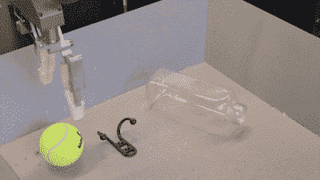

# Google X 在机器人领域使用视觉的深度强化学习

> 原文：<https://medium.com/hackernoon/google-xs-deep-reinforcement-learning-in-robotics-using-vision-7a78e87ab171>

## #3 [研究论文](http://ai.googleblog.com/2018/06/scalable-deep-reinforcement-learning.html)讲解

[谷歌](https://hackernoon.com/tagged/google)因其尖端技术和项目而闻名，包括自动驾驶汽车、Project Loon(互联网气球)、Project Ara 等等。但是很多研究都是在幕后进行的，这产生了一些有趣的研究论文，这些论文给了我们对这些有趣实验的了解和洞察力。鼓励我们自己复制实验，并进一步突破极限。

Project Ara | [Source](https://www.google.com/url?sa=i&rct=j&q=&esrc=s&source=images&cd=&cad=rja&uact=8&ved=2ahUKEwj6qaLEuvnbAhWTWysKHfOvCdkQjRx6BAgBEAU&url=https%3A%2F%2Fdribbble.com%2Fshots%2F1507631-google-project-ara-animation&psig=AOvVaw0SsdIcgwRdLXIVXgxI4yoH&ust=1530375170666411)

由 [GoogleX](https://x.company/projects/) 发起的[学习](https://hackernoon.com/tagged/learning)机器人项目已经发布了 [**QT-Opt:基于视觉的机器人操作**](https://arxiv.org/abs/1806.10293) 的可扩展深度强化学习，即试图掌握抓取不同形状物体的简单任务。旨在复制一些常见的人类活动。

[Source](https://ai.googleblog.com/) (**Look at robot no. 6 learning stuff**)

而且成功率惊人。

这个实验使用了 7 个机械臂，在 4 个月的过程中运行了 800 个小时来抓取放在它们面前的物体。每台都使用分辨率为 472x472 的 RBG 相机(上图为)。基于视觉的闭环控制系统基于机器人操作的一般公式，即马尔可夫决策过程(MDP)。

Same objects with Different Colours | [Source](https://ai.googleblog.com/)

为了提高效率，使用了偏离策略的强化学习，它能够从几小时、几天甚至几周前收集的数据中学习。

**Qt-Opt** 算法结合两种方法设计:

1。 **L** [**大规模分布式优化**](https://ai.googleblog.com/2016/10/how-robots-can-acquire-new-skills-from.html) *(使用多个机器人更快地训练模型，使之成为大规模分布式系统)*

2。深度 [**Q-learning**](https://en.wikipedia.org/wiki/Q-learning) 算法( *RL 技术用于学习策略，告诉代理在何种情况下采取何种行动)*

# 什么是 Qt-Opt？

QT-Opt 是大规模分布式优化和 Q-学习算法的结合，产生了支持连续动作空间的**分布式 Q-学习算法**，使其非常适合机器人问题。

为了使机器人在最初的尝试中不会变得疯狂，模型最初是用离线数据训练的，这不需要真实的机器人，并提高了可扩展性。

对于这种情况，该策略获取一幅图像，并返回手臂和手爪在 3D 空间中应该如何移动的序列。

# 结果

结果给出了令人难以置信的 96% *的抓取成功率*。

[Source](https://arxiv.org/abs/1806.10293)

这个模型学到了许多复杂的、近乎人道的新事物。

1。当砖块彼此靠得太近，没有空间容纳抓取器时，策略会在抓取之前将砖块与其余部分分开。

[Source](https://ai.googleblog.com/)

2。抓取器中的对象不属于数据集的一部分，但它会自动重新定位抓取器以进行另一次尝试。

[Source](https://ai.googleblog.com/)

我鼓励你阅读研究论文以获得更多见解。

**在 Medium 和 Twitter 上关注我**了解更多**# research paper explained**通知。

如果你对这篇论文有任何疑问，或者想让我解释你最喜欢的论文，请在下面评论。

**鼓掌吧…分享吧…并再次鼓掌。**

# 你会喜欢的以前的故事:

 [## DeepMind 惊人的混搭 RL 技术

### #1 研究论文解释

hackernoon.com](https://hackernoon.com/deepminds-amazing-mix-match-rl-techique-a6f8ce6ac0b4)  [## “TensorFlow”里的“Tensor”是什么鬼？

### 我不知道…

hackernoon.com](https://hackernoon.com/what-the-hell-is-tensor-in-tensorflow-e40dbf0253ee)