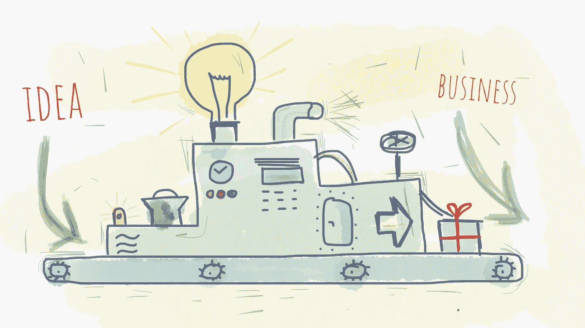
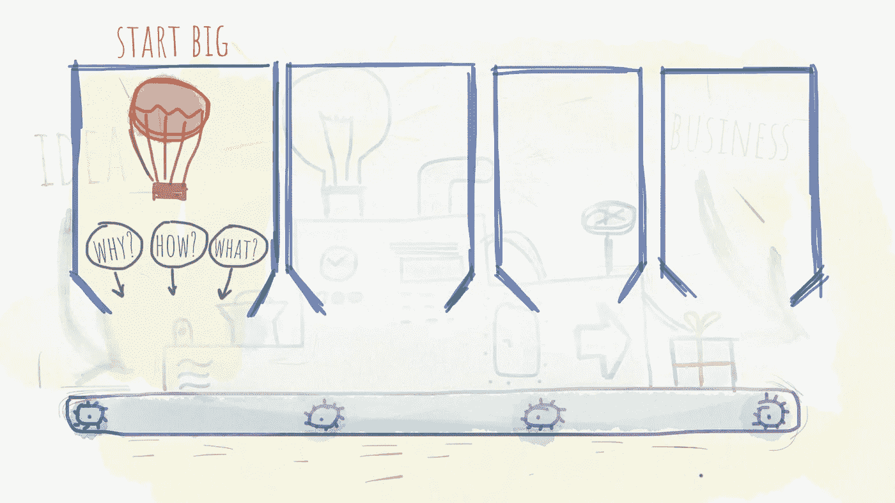
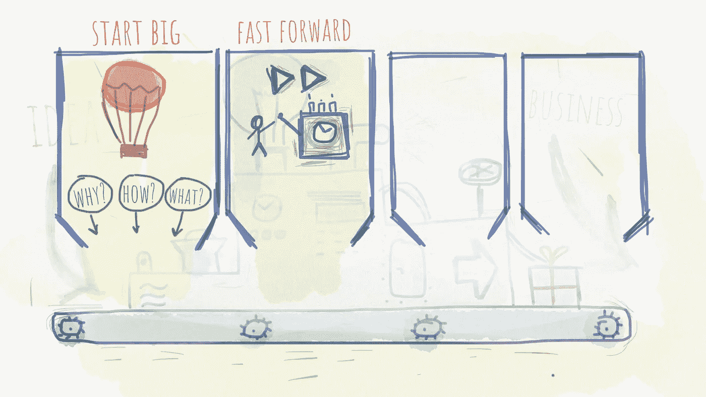
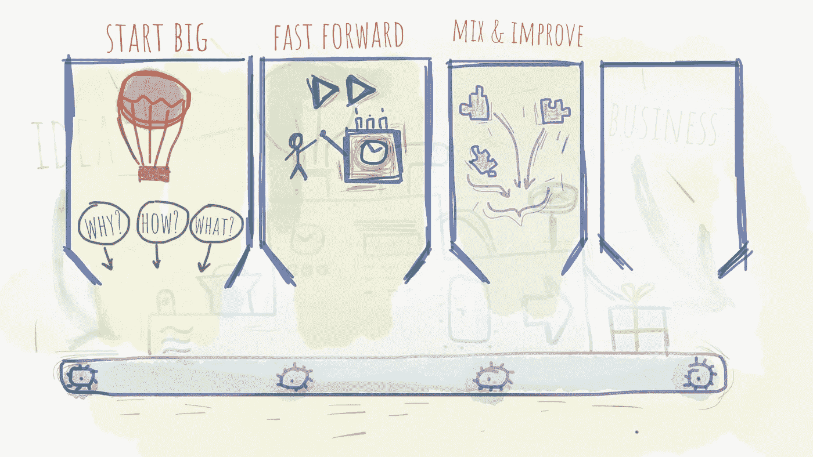
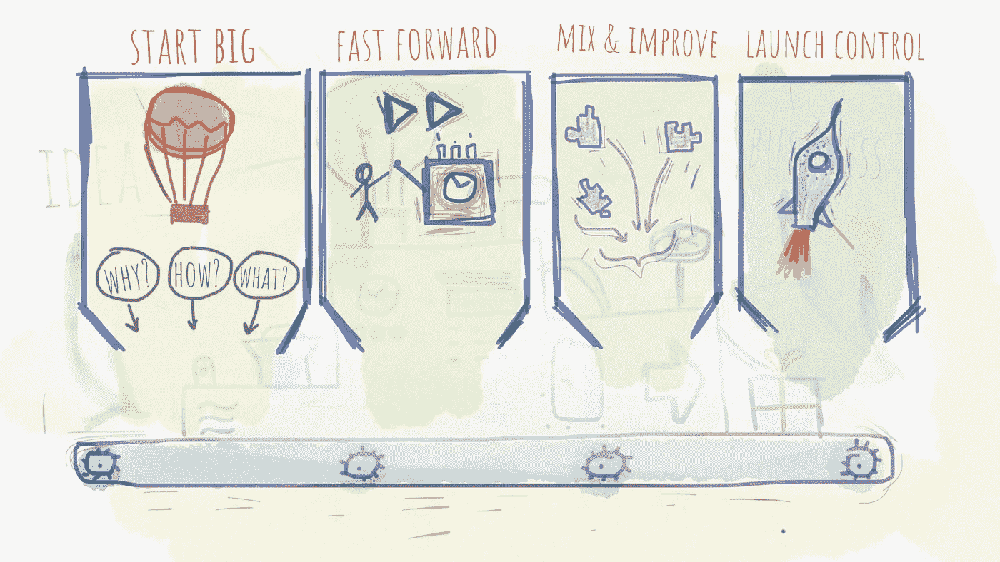

# 有主意了吗？将其转化为可行的业务

> 原文：<https://medium.com/hackernoon/got-an-idea-translate-it-into-a-viable-business-8be076d3e17f>

*介绍我的终极产品开发清单，它帮助我和我的商业伙伴创造了最先进的产品和服务。*

我喜欢和我的朋友以及 T2 的商业伙伴谈论想法。一个好主意是每一个伟大开始的种子。但并不是每个想法都能变成可行的产品或业务。部分原因是糟糕的假设和假说。一个糟糕的商业计划也可能会把想法推向一个不理想的结果。

这篇文章是我最终的[产品开发](https://hackernoon.com/tagged/product-development)清单。它包含一个可操作项目的列表，这些项目增加了成功创造一个伟大的产品或服务的可能性。我和我的许多朋友分享了这份清单，他们是企业主，也是我的商业伙伴。他们今天都做得很好，部分原因是这个列表在这个过程中帮助了他们。

# 1.开始做大

每次起步都需要一点点推动。你对自己的宠物项目、副业或想要出售的实物产品有一个很好的想法，但你不知道从哪里开始？好消息是每个开始看起来都是这样。没有人醒来时脑子里有一个完整的总体规划。为了打败拖延症，我建议从大处着手。给自己一点背景，让自己进入适当的精神状态。想象一下你的产品看起来怎么样，你的买家使用起来感觉如何棒。想象力的力量经常被低估。想象或自我暗示是一种原则，在这种原则下，被诱导到潜意识中的肯定或重复指令会将欲望转化为物质或金钱上的等价物。这同样适用于那些不相信自己目标的人。他们的消极信念变成了一种叫做“不幸”的现象。所以要敢于相信。允许自己享受这种心态带来的财富。

## 为什么，怎样，什么

创建商业计划的目的是消除与你的产品或服务相关的不确定性:

1.  目的不确定性—“**为什么是**？”,
2.  这意味着不确定性—“**如何**？”和
3.  结局的不确定性—“**什么**”。

在我看来，首要的是**目的不确定性**(“为什么？”).你为什么想要创造你将要创造的东西？正如[西蒙·西内克所说](https://www.ted.com/talks/simon_sinek_how_great_leaders_inspire_action)——总是从**为什么**开始。问问自己为什么要构建这个特性。随之而来的核心价值是什么？对你有什么好处？只有一小部分企业主能够回答“为什么？”问题。因为很难。因为它需要根据你的业务的基本原则进行推理，而不是通过类比进行推理。你的“为什么？”应该代表你所信仰的东西。例如，如果你拥有一个学习平台，你相信每个人都能够学习一项新技能。此外，你认为每个有技能的人都可以将知识转移给其他人。这种态度肯定会吸引那些也相信自己能学或能教的学生和老师。这使得你们三个成为一个有着相似信仰的团体的一部分。成为同一个团体或部落的一员有助于建立信任。信任会影响客户的决策。那些决定将对你有利，因为现在你属于同一个部落。

> 分享你的信仰->吸引有相同信仰的人->相同的信仰建立一个部落->部落建立信任->信任驱动决策->决策控制行为

永远追求你所信仰的事业和事情。这种方法会给你带来一些结果，比如名声或金钱，有时两者兼而有之。同样，通过这样做和宣传你的信念，你会吸引那些相信你的人。因此，你的产品将证明你和你的客户所相信的。这是一个成功企业的先决条件，所以一定要花些时间弄清楚你的“为什么？”。

> 人们不买你做什么，他们买你为什么做。

去掉**意味着不确定性**(“如何？”)将揭示构建您想要构建的产品所需的工具和技能。瞥一眼你的最终产品是一回事。了解构建它的工具是一个完全不同的方面。想法是好的，想法是燃料，但当涉及到构建你脑海中想象的或你的直觉告诉你的东西时，那往往是真正具有挑战性的。“怎么做”的答案问题将表明您是否有足够的资源来构建产品。如果你没有，你将知道雇佣谁或者获得什么工具和技能。例如，如果你正在开发一个科技产品，你必须成为产品的设计师，或者知道该雇佣谁来完成这项任务。设计架构，并确定您认为最适合该任务的技术。另一方面，如果是实物产品，调查一下你需要什么样的机器，谁可以成为你的供应商，或者有没有你可以联系或雇佣的制造公司。

**结局不确定**(“什么？”)代表对最终产品缺乏信心。拥有强烈的愿景和坚定的信念会帮助你消除最终的不确定性。从最后开始，尝试想象最终产品以及用户将如何从中受益。这会给你一个目标，如果你足够详细地定义它，并充满激情地接近它，当熵开始起作用并开始打乱你最初的计划时，这将是你的驱动力。同样，你正在构建的产品证明了你的信念。请记住这一点，设计它的目的是帮助那些相信你的人。在你去除了目的和手段的不确定性之后，定义你想要建立的东西就容易多了。“什么”的答案问题应该是帮助客户找到“为什么”的工具。

# 2.使用你的时间机器

商业计划的一部分是设想你的目标。为了做到这一点，你必须想象三年、五年或十年后你的企业会是什么样子。

## 快速进带

仅仅浏览一下你的业务、产品或服务是不够的。你应该设想所有的细节。我是说所有人。产品、包装、面料的手感或数码产品的布局、开心的顾客的表情、你的产品帮助他们的成功故事，以及你达到目标后的表情。

你可能知道，解决我们过去已经面临的问题要容易得多。经验让我们更加自信，因为我们知道我们有克服面前障碍的技能。但是当我们对未来毫无经验时会发生什么呢？当我们从未创业时，如何创业？你能获得的最接近经营企业的体验就是想象它已经发生了。正如我之前所说，想象力和自我暗示的力量经常被低估。但是根据我的经验，自我暗示真的很管用。如果你设想你的成功有这么多的细节，如果你在脑海中重复整个场景这么多次，你会说服你的大脑它已经发生了。当这种情况发生时，你已经对即将实现的目标有了很好的体验。

完成一个产品并不是路的尽头。与其说是这样，不如说派对才刚刚开始。你必须说服用户，你的产品正是他们所需要的。所以你最好做好准备，因为这是产品采用过程中最重要的阶段之一。

## 盒子上有什么

我们每天都会使用很多工具和产品。即使我们不用它们，我们也能想象它们的样子和工作原理。但是，我们很可能已经记不清产品购买时的包装是什么样子了。这是因为现在，我们专注于使用它所享受的好处，而套餐不再重要。但是当我们购买它的时候，包装是非常重要的。这个包装说明了我们使用它会得到什么好处。这个包装让我们在所有同类产品中选择了它。这个包装让我们对这个产品感兴趣。当然，不一定非得是盒子。如果是数码产品，它可能是你网站的登陆页面。

不要误解我，“盒子上有什么”练习不是关于包装视觉设计的。这是问你自己，你将如何向用户描述你的产品，你将如何确保他们明白他们将变得有多棒。因为你是在销售你的产品，所以记住“顾客视角”是很好的。这描述了潜在客户的行为以及他们的想法和困境。当客户偶然发现您的产品时，他/她会采取以下措施:

1.  注意到包裹
2.  问“这是什么？”
3.  疑惑“我为什么要在乎？”
4.  想要被说服
5.  需要证明[ [*](https://www.amazon.com/Brand-Gap-Distance-Business-Strategy/dp/0321348109) ]

正确回答这些问题，你的产品就会出现在他们的购物车里。

## 了不起

人们购买你的产品或服务不是因为它很棒，他们购买是因为他们想成为一个更好的人，因为他们想在生活中拥有的价值，成为更好的自己。焦点是他们和他们的了不起。所以，一定要想象你的产品或服务会让别人变得很棒。这是每一个成功的产品、服务或业务的关键。如果你有能力让别人的生活变得更容易，这种价值就会转化为金钱上的等价物。价值等于金钱，如果你提供好的价值，潜在的客户会为你的价值买单。确保清楚地说明产品的价值。如果没有清楚地说明好处，他们很可能会坚持他们已经拥有的。

## 属国

除了其他事情，你应该考虑什么可能会阻止你。可能会有很多与您的业务相关的依赖性。如果是数字产品，您可能会依赖您的服务提供商(即 AWS)或软件中使用的框架(即 Vue.js)。另一方面，实物产品可能取决于你的原材料供应商(即纺织品制造商)。无论哪种方式，你都应该围绕一些可靠和成熟的东西来建立你的业务。在业务的任何阶段，您都不希望遇到应用程序宕机的情况。此外，材料短缺会阻碍我们的生产，并造成不必要的交货延迟。无论如何，你应该明智地选择你的供应商。此外，你应该有一个应急计划或 B 计划，以防事情变糟。

## 探测障碍物

类似于快进部分，你应该试着找出你将来可能面临的潜在障碍。但不是用悲观的语气。把这个练习看作是对你的业务的预防性维护。预测你潜在的失败，以便领先一步，并在它发生之前准备好行动。大多数时候，我们倾向于走一条快乐的路，一条“蓝天日”的路。但是请记住，风暴每隔一段时间就会发生，通过提前识别障碍，你将为它做好准备

# 3.负责任地偷窃

老实说，大多数产品都是将旧工具用于新用途。有一些真正创新的产品。光是他们的才华就足以让他们在竞争中脱颖而出。

无论哪种方式，如果您正在寻找一个颠覆性的解决方案或渐进式改进，您应该遵循以下步骤:

## 重新混合和改进

当你开始设计你的产品或服务时，想想类似问题的现有解决方案。有人已经花了很多时间和金钱来解决一个问题。不管投入多少时间和精力，这个解决方案可能并不完美。每个解决方案都有其好的部分和不好的部分。找出好的，并将它们整合到你的产品中。找出不好的，避免让他们在身边。当然，我不是在说服你成为一个模仿者。你应该使用好的解决方案的想法并改进它。混合不同的解决方案会激发你的想象力，让你发现现有解决方案的中断点。这些渐进的改进将使你在竞争中领先。你将拥有同等的特性和竞争优势，因为你把它做得更好了。

我不喜欢类比推理，但除非你试图彻底创新，否则这通常是获得最佳解决方案的捷径。

## 素描

现在，你已经爱上了你试图解决的问题。此外，潜在解决方案的轮廓开始显现。现在是深入细节的好时机。我们头脑中都有某种愿景，而且这种愿景似乎是完整的。直到你试着向别人解释所有的细节，甚至大声地向自己解释，它才显得完整。

通过勾勒出你的解决方案，你将被迫为你的想法注入活力，即使你认为它还没有准备好(但实际上它已经准备好了)。通过把它写在纸上，它变得栩栩如生，因为它不再只是你想象的一部分，它变得真实。为了完成整个画图，你必须弄清楚每一个细节，即使你到现在都没有想过它们。这样，在你开始建造它之前，在你花一分钱在产品上之前，你就会面临障碍。你不得不同意这是一个极其廉价的原型，具有极高的投资回报率。再一次，你甚至在它发生之前就已经生活在其中，在即将成为现实的事情中获得经验。

> 勾画出你的解决方案是你能得到的最便宜的原型。

传达你的愿景可能需要一段时间。你花了很多时间思考你的产品或服务，在此期间，你一次一章地构建你的故事，以随机的顺序一点一点地完成整个拼图。但是当你被要求和别人分享你的想法时，你必须使用很多词汇。作为人类，我们的输入输出语言交流非常有限。我们只能在一分钟内说出有限的一组信息，而且，在合理的语速下，我们可以听到很多句子。而那种信息共享是**顺序的**，因此**受限**。然而，我们的眼睛比耳朵能接收更多的信息。这就是为什么我喜欢勾画一个产品或服务的愿景。纸上的草图可以承载大量的信息。我们的眼睛可以立即向大脑提供如此多的关于用途、质地、尺寸、实用性、可用性等信息。而且信息流在**平行**运行，比我们的耳朵**快**那么多。

## 故事板

之前，您已经为您的解决方案创建了几个草图。现在是考虑用户发现您的解决方案时必须采取的步骤的好时机。从头开始—用户打开浏览器，或打开您的应用程序。为了达到期望的结果，需要执行哪些步骤、点击或轻拍？需要采取多少步骤？这个想法是用足够多的细节勾画出你的产品或服务的整个旅程，这样每个人都在整个产品中达成一致。

> 故事板将帮助你创造整个产品——一个普通的产品，增加了顾客有一个令人信服的购买理由所需要的一切。

故事板就像一本漫画书——一组用户与你的产品互动的场景。故事板将帮助你了解用户到达你想要的位置有多复杂。通过这种方式，您可以识别缺失的步骤或过时的步骤。

例如，您开发了一款采用尖端技术的新电视，具有迷人的像素密度，画面与现实难以区分。然后，您开始构建故事板，当用户走进商店时就是开始。顾客买了电视并带回家。但问题是，盒子装不下门洞。也装不下后备箱。你如此专注于打造最好的产品，却没有考虑到运输。此外，用于壁挂支架的螺钉不包含在包装中，用户必须返回商店。即使电视很棒，如果你没有意识到产品交付过程中的所有事情，整体体验也会很糟糕。然而，这些情况可以通过绘制完整的故事板来避免。

## 试验

在向公众发布之前，一个好主意是与一小部分人分享完整的体验，以便获得早期反馈。这群人可能是你的朋友，你的订户或现有客户。在产品开发的整个过程中，我们倾向于感情用事，因此会有偏见。这可能导致我们意识到我们的产品有缺陷，但我们决定看看另一边。与你信任的一小组人一起测试整个产品将有助于你获得有价值的、无偏见的反馈。当然，当人们开始指出一些缺陷或建议时，不要感到不安，他们只是想帮忙。记下反馈，并在草图和故事板过程中反复重申。

# 4.启动状态检查

你已经完成了大部分艰苦的工作。现在，你可以专注于那些微小的细节，以确保一切都是正确的。

## 20:80 法则

我们都知道[帕累托法则](https://en.wikipedia.org/wiki/Pareto_principle)，或者 20:80 法则。对许多事件来说，大约 80%的结果来自 20%的原因。在这种情况下，您应该问自己是否可以构建更少的内容，同时仍然保留产品的功能和质量。我们都想打造完美的产品或服务。所有这些细节都会夸大最终成本。但有时你应该克制自己不要超支，因为价格也会太高。理想情况下，你应该在成本和取悦客户的细节数量之间取得平衡。你不希望成本太高，但也希望有那种令人惊叹的效果。

## 里程碑

每次发射都必须有一个计划好的日期和时间。因为行星的相对位置，在特定的时间和日期发射火箭是很重要的，以达到最短的路径。同样，推出你的产品应该符合市场。研究一下什么时候对你的产品需求量最大，竞争对手什么时候推出产品，等等。时机非常重要，所以要记住这一点。

此外，这是一件好事，你有一个里程碑，因为它会帮助你战胜拖延症。当最后期限到来时，你将不得不努力工作以赶上“倒计时”时刻。否则，发射可能会被无限期推迟。所以，做一下调查，打开你的日历，选择一个日子。

# 用知识武装自己

这篇文章只是触及了商业发展的皮毛。经营企业还有很多其他方面，但这是一个很好的起点。为了进一步阅读，我建议阅读关于[如何获得好想法](https://momcilodakic.com/2018/06/07/ideas-are-like-sneezing/)、[如何验证你的想法](https://momcilodakic.com/2018/02/27/user-centered-design-principle-works-like-magic-i-e-how-to-delight-the-user-and-deliver-the-right-message/)、[如何建立强大的品牌](https://momcilodakic.com/2018/09/07/building-a-brand-should-be-part-of-your-product-roadmap/)、[如何写广告](https://momcilodakic.com/2018/11/29/how-to-write-an-amazing-advertising-copy/)、[如何建立路线图](https://momcilodakic.com/2018/07/16/how-to-build-a-roadmap-in-3%C2%BD-steps/)和[如何为你的产品定价](https://momcilodakic.com/2018/06/28/everybody-sells-how-to-set-the-right-price/)。

这里重要的是要知道你可以成功地建立你梦想的事业。唯一阻碍你的是你自己。我相信你能实现你的梦想，那么你为什么不相信自己呢？无论你相信你**能**还是**不能**，你都绝对正确。

最后，这里是这篇文章的总结，一份激发你创业抱负的备忘单:

1.  为什么要打造这个产品？你相信什么？
2.  你打算如何建造它？
3.  你的产品到底是什么？
4.  你能想象你的成功吗？它看起来怎么样？
5.  你产品的盒子上有什么？你将如何吸引你的顾客？
6.  你打算如何让你的用户变得令人敬畏？
7.  你怎么能失败呢？你能预测什么样的障碍？
8.  有你喜欢的类似产品吗？你能做得更好吗？
9.  你能描述一下你产品的所有细节吗？
10.  客户体验是什么样的？是一个完整的产品吗？
11.  你能通过缩小产品范围来降低成本吗？
12.  你什么时候发布它？

你能做到的。祝你好运！

# 想了解更多？

学习如何将你的想法转化为成功的业务。

这本书为你提供了创建一个成功企业的整个过程的全面指导。它旨在为你展示整个商业计划，从而使你的起步更加容易。整个过程归结为它的要点，使步骤简单易懂。

如果你遵循我在这本书里揭示的公式，很有可能你可以通过把一个[想法变成一个成功的生意](https://treasureroadmap.com/)来谋生。

 [## 产品管理书籍-创意到商业-宝藏路线图

### 如果你选择遵循我在这本书里揭示的公式，很有可能你可以通过转行谋生…

treasureroadmap.com](https://treasureroadmap.com) 

点击下面的图片获取您的免费图书摘要:

