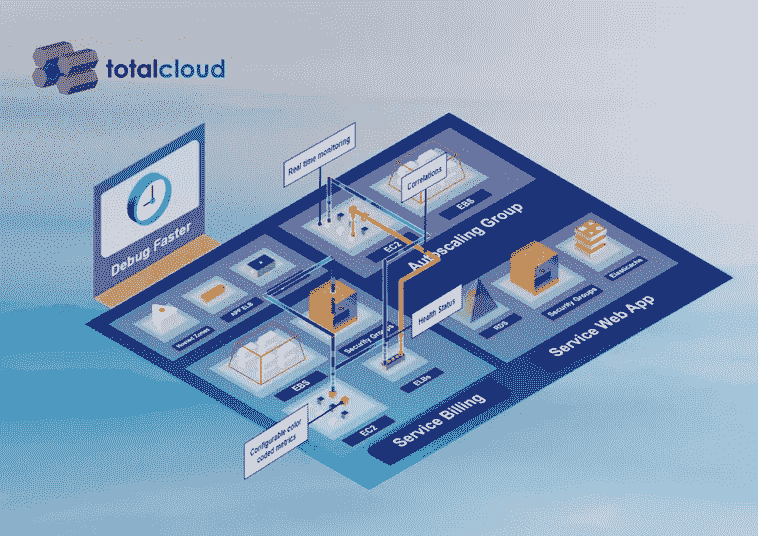

# 使用交互式可视化云监控，在不到 5 分钟的时间内管理 AWS

> 原文：<https://medium.com/hackernoon/govern-aws-your-way-in-under-5-minutes-using-interactive-and-visual-cloud-monitoring-8a2ab35907de>

作为一名 IT 经理或团队领导，当您想到“AWS 云治理”时，您想到的第一个词是什么是“控制”这个词吗？您是否使用静态报告来实施规则、持续监控、微观管理和审计政策和流程，以控制云的使用？！考虑到云是一个如此动态的环境，您认为这是治理 AWS 的正确方式吗？

不。正确的词是“可见性”，因为将太多的控制带入您的 IT 会产生流程瓶颈，增加上市时间，带来灵活性，并最终由于团队的不感兴趣或沟通不畅而导致盲点。另一方面，创造可见性和使用可视化云监控为您提供了克服上述挑战的超能力。

> ***让您的 IT 团队能够了解其所有资源，无论这些资源位于云中的哪个位置，这一点至关重要。这意味着您可以预测、了解、让您的团队知道基础架构中正在发生的事情，并使其他人能够及时采取行动而不会感到疲劳。***

# 想象一下:

在一次定期审计中，大型 it 基础架构团队的团队领导 Alex 观察到当前 AWS 账单周期中反复出现的峰值。在按项目和资源对 AWS 成本进行分割后，他发现它来自 DevOps 工程师 Bob 的帐户。据 Alex 所知，Bob 在两个月前的一个实验项目中使用了几个 EC2 实例。在一次聊天中，Bob 向 Alex 保证，他已经在项目结束时丢弃了这些实验资源。但是亚历克斯拒绝承认。

为了说服 Alex，Bob 站出来展示他账户的 EC2 控制台，向他保证他确实已经丢弃了所有的实验资源。经过大量的调试和根本原因分析，手动从一个控制台跳到另一个控制台，他们发现有未使用的 elb 和独立的 EBS 链接到这些实验实例。这些孤立的资源是罪魁祸首。

由于 Alex 的工作是将所有有问题的资源放在最前面，并确保账单金额不超过分配的预算限制，因此他被迫为 Bob 和他的其他团队成员建立一个组织流程，以避免将来出现这种情况。尽管 Alex 知道这个过程可能会阻碍团队的灵活性和生产力。

> *伙计们，这是云缺乏可见性的明显例子。*

如果我们告诉您，Bob 和 Alex 可以使用单一云可见性平台，在不到五分钟的时间内解决他们的问题和需求，您会相信我们吗？方法如下:

使用跨职能的可视化云监控控制台，实现整体 AWS 治理。

> 通过一个可视化界面，Bob 和 Alex 可以全面了解资源的支出和使用情况。

# 底线:一个可视化界面，完整的云可见性

如果您看到上面的 GIF，Bob(开发团队)和 Alex(开发团队负责人)都能够在不到五分钟的时间内使用单一平台解决他们的问题和需求！

想了解更多关于 TotalCloud 上下文监控和成本分析器的信息，请阅读我们的热门博客:

> [情境云监控的沉浸式可视化:打破孤岛壁垒](https://blog.totalcloud.io/index.php/2018/01/09/immersive-visualization-contextual-cloud-monitoring/)
> 
> [利用 TotalCloud 可视化成本分析器最大限度节省 AWS 成本的游戏计划](https://blog.totalcloud.io/index.php/2018/01/10/aws-cost-savings-totalcloud-visual-cost-analyzer/)

*原载于 2018 年 2 月 27 日*[*blog . total cloud . io*](https://blog.totalcloud.io/govern-aws-interactive-visual-cloud-monitoring/)*。*

