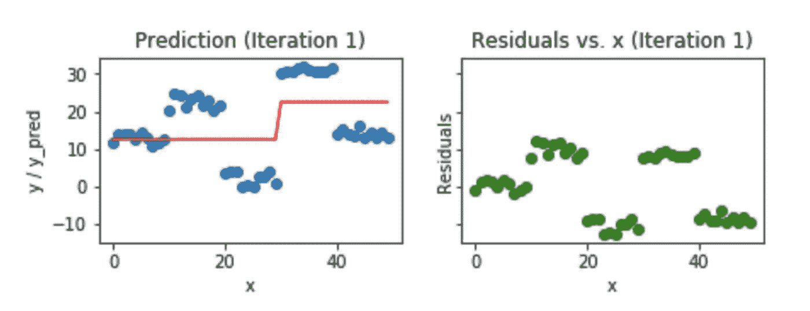
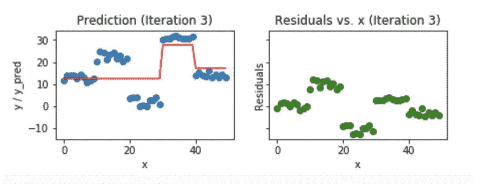
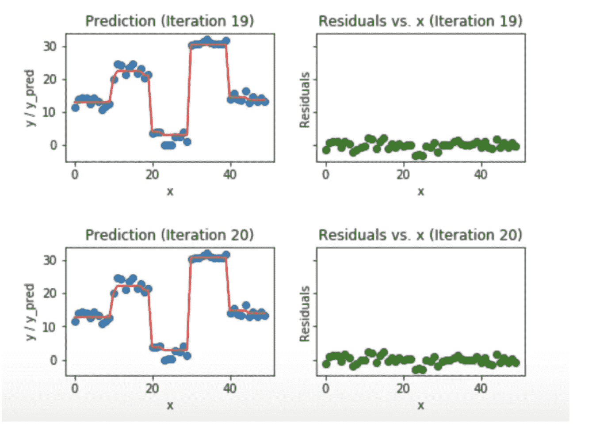

# 梯度增强和 XGBoost

> 原文：<https://medium.com/hackernoon/gradient-boosting-and-xgboost-90862daa6c77>


从我们结束的地方开始，让我们继续讨论不同的 boosting 算法。如果您还没有阅读解释 boosting 和 AdaBoost 的前一篇文章，请看看。

链接:[https://medium . com/@ grohith 327/boosting-algorithms-AdaBoost-gradient-boosting-and-xgboost-f 74991 CAD 38 c](/@grohith327/boosting-algorithms-adaboost-gradient-boosting-and-xgboost-f74991cad38c)

## 梯度提升:

继续，让我们来看看另一种增强[算法](https://hackernoon.com/tagged/algorithm)，梯度增强。梯度提升也是一种提升算法(咄！)，因此它也试图从一群弱学习者中创建一个强学习者。该算法类似于自适应增强(AdaBoost ),但在某些方面有所不同。在这种方法中，我们试图将助推问题视为一个优化问题，即我们采用一个损失函数并试图优化它。这个想法是由[利奥·布雷曼](https://en.wikipedia.org/wiki/Leo_Breiman)首先提出的。

## 如何将梯度推进解释为优化问题？

我们采用一个弱学习者(在前面的例子中是决策树桩),在每一步，我们添加另一个弱学习者来提高性能并建立一个强学习者。这减少了损失函数的损失。我们迭代地添加每个模型并计算损失。该损失表示误差残差(实际值和预测值之间的差异),并且使用该损失值来更新预测以最小化残差。

让我们一步一步地分解它。



在第一次迭代中，我们采用一个简单的模型，并试图拟合完整的数据。从上图可以看出，地面真实模型的预测值是不同的。误差残差绘制在图像的右侧。损失函数试图通过添加更多弱学习器来减少这些误差残差。新的弱学习者被添加以集中于现有学习者表现差的领域。



三次迭代后，您可以观察到模型能够更好地拟合数据。这个过程反复进行，直到残差为零。



经过 20 次迭代后，模型几乎完全符合数据，残差下降到零。

```
# Gradient Boosting 
from sklearn.ensemble import GradientBoostingClassifierclf = GradientBoostingClassifier()
# n_estimators = 100 (default)
# loss function = deviance(default) used in Logistic Regression
clf.fit(x_train,y_train)
clf.predict(x_test)
```

**XGBoost(极限梯度提升):**

XGBoost 席卷了数据科学竞赛。XGBoost 似乎是用于赢得数据科学竞赛的分类器/预测器集成的一部分。为什么会这样呢？XGBoost 为什么这么厉害？

XGBoost 类似于梯度增强算法，但它有一些锦囊妙计，使它脱颖而出。

XGBoost 的特性有:

*   对树木的巧妙惩罚
*   叶节点的成比例收缩
*   [牛顿助推](https://en.wikipedia.org/wiki/Newton%27s_method_in_optimization)
*   额外随机化参数

在 XGBoost 中，树可以具有不同数量的终端节点，并且用较少证据计算的树的左权重收缩得更厉害。牛顿推进使用牛顿-拉夫森近似法，该方法提供了比梯度下降更直接的到达最小值的路线。额外的随机化参数可用于降低树之间的相关性，如前一篇文章所述，分类器之间的相关性越小，我们的分类器集成就越好。一般来说，XGBoost 比梯度增强快，但是梯度增强具有广泛的应用

```
# XGBoost 
from xgboost import XGBClassifier
clf = XGBClassifier()
# n_estimators = 100 (default)
# max_depth = 3 (default)
clf.fit(x_train,y_train)
clf.predict(x_test)
```

## 结论

这些树提升算法已经获得了巨大的欢迎，并且出现在几乎所有 kagglers 的指令库中。我希望这两篇文章能够让您对这三种算法有一些基本的了解

## 参考:

[](/mlreview/gradient-boosting-from-scratch-1e317ae4587d) [## 从零开始的渐变提升

### 简化复杂的算法

medium.com](/mlreview/gradient-boosting-from-scratch-1e317ae4587d) 

[https://brage . bib sys . no/XM lui/bitstream/handle/11250/2433761/16128 _ full text . pdf](https://brage.bibsys.no/xmlui/bitstream/handle/11250/2433761/16128_FULLTEXT.pdf)