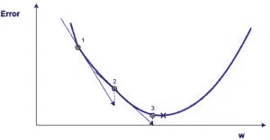
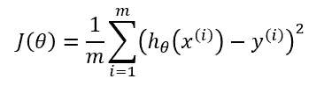
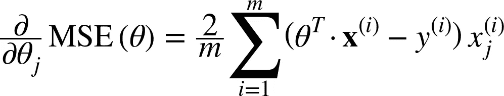
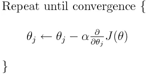
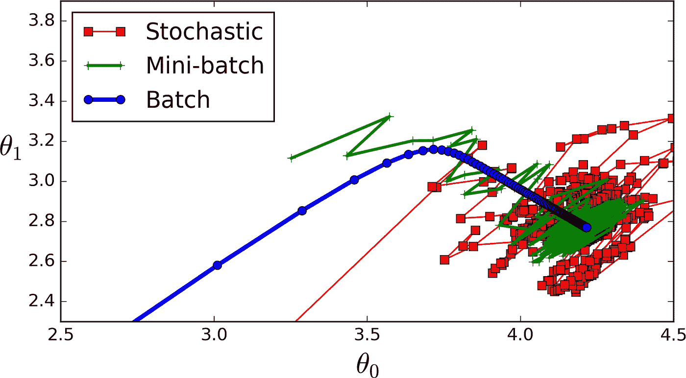

# 梯度下降:你需要知道的一切

> 原文：<https://medium.com/hackernoon/gradient-descent-aynk-7cbe95a778da>

## 梯度下降是机器学习中最常用的学习算法，这篇文章将向你展示几乎所有你需要知道的东西。


几乎每个机器学习模型都使用的算法是什么？是**梯度下降**。算法有一些变化，但本质上，这是任何 ML 模型学习的方式。没有这些，曼梯·里就不会有现在的地位。

在这篇文章中，我将用一点数学知识来解释梯度下降。老实说， **GD** (梯度下降)本来就不涉及很多数学(*这个我以后再解释*)。我将会用类比来代替基础数学的大部分复杂性，有些是我自己的，有些来自互联网。

以下是我要复习的内容:

*   **GD**的点:解释整个算法是什么。
*   **不同类型的 GD 算法**:查看 GD 中的不同变化。
*   **代码实现**:用 Python 写代码演示 GD。

这是我关于机器学习的“你需要知道的一切”系列的第一篇文章，其中，*我*为*你*做关于一个 ML 主题的研究。然后，我将我所学到的一切浓缩到一个帖子里，供你消费，并希望从中学习。

所以，如果你想了解最新消息，你可以[在这里](/@SuryanshWrites)和 [Twitter](https://twitter.com/SuryanshTweets) 上关注我。另外，如果你有任何问题，发微博给我。正如你可能从我目前(发表这篇文章时)的关注中知道的，我一定会回复的。

我们开始吧！

# 1.全球动力局的重点

G 梯度下降需要一个代价函数(代价函数有很多种[类型](https://stats.stackexchange.com/questions/154879/a-list-of-cost-functions-used-in-neural-networks-alongside-applications))。我们需要这个成本函数，因为我们想最小化它。最小化任何函数都意味着找到该函数中最深的谷。请记住，成本函数用于监控 ML 模型的预测误差。因此，最小化这一点，基本上意味着尽可能获得最低的误差值，或者提高模型的精度。简而言之，我们在调整模型参数(权重和偏差)的同时，通过迭代训练数据集来提高精确度。

所以，GD 的整个观点是**最小化成本函数**。

算法的核心是获得最低误差值的过程。类似地，这可以被看作是，走进一个山谷，试图找到**黄金**(最低误差值)。当我们在这里时，我肯定你想知道如果你只能看到你周围的谷，我们如何在一个有许多谷的函数中找到最深的谷？我不打算讨论解决这个问题的方法，因为这超出了这篇文章的范围(对初学者来说)。然而，只要知道有办法解决这个问题。

接下来，为了找到成本函数中的最低误差(最深的谷)(相对于一个权重)，我们需要调整模型的参数。但是我们对它们做了多少调整呢？进入微积分。利用微积分，我们知道函数的斜率是函数对某个值的导数。*这个斜坡总是指向最近的山谷！*

在这里(图中)，我们可以看到成本函数(名为“误差”，符号为“J”)与一个重量的关系图。现在，如果我们计算成本函数相对于这一个权重的斜率(让我们称之为 dJ/dw ),我们就可以得到我们需要移动的方向，以便达到局部最小值(最近的最深的谷)。现在，让我们想象我们的模型只有一个重量。



Cost Function “J” plotted against one weight.

> **注意**:当我们迭代所有的训练数据时，我们不断为每个权重增加 dJ/dw。由于成本根据训练示例不断变化，因此 dJ/dw 也不断变化。然后，我们将累计值除以训练样本的数量，得到平均值。然后，我们使用(每个权重的)平均值来调整每个权重。
> 
> **另请注意**:本质上，成本函数仅用于监控每个训练示例的误差，而成本函数对一个权重的导数是我们需要移动该权重以最小化该训练示例的误差的地方。您甚至可以不使用成本函数来创建模型。但是你必须对每个重量(dJ/dw)求导。

现在我们已经找到了我们需要轻推重量的方向，我们需要找到**轻推重量多少**。这里，我们使用**学习率。**学习率被称为超参数。一个**超参数**是你的模型所需要的一个值，而我们对此却知之甚少。这些价值观大多可以通过反复试验来学习。超参数**没有**万能**。**这个学习率可以认为是一个，“*朝着正确的方向前进，*”其中方向来自 dJ/dw。

这是针对一个重量绘制的成本函数。在一个真实的模型中，我们对*所有*的权重做*所有*的上述操作，同时迭代*所有*的训练示例。即使在相对较小的 ML 模型中，您也将拥有不止 1 或 2 个砝码。这使得事情更加难以想象，因为从现在开始，你的图表将会有我们大脑无法想象的尺寸。

回到我之前说的那一点，“老实说，GD(梯度下降)本质上并不涉及很多数学(*我稍后会解释这个*)。”嗯，是时候了。

# 1.1.关于渐变的更多信息

对于成本函数，GD 还需要梯度 dJ/dw(成本函数相对于单个权重的导数，对所有权重进行)。这个 dJ/dw 取决于你对成本函数的选择。有许多[类型的成本函数](https://stats.stackexchange.com/questions/154879/a-list-of-cost-functions-used-in-neural-networks-alongside-applications)(如上所述)。最常见的是均方误差成本函数。



其对任何重量的导数为(该公式显示了线性回归的梯度计算):



这是 GD 所有的数学。看到这里，你就可以知道，GD 并不涉及太多的数学。它涉及的唯一现成的数学是乘法和除法，我们以后会讲到。这意味着，您对成本函数的选择将影响您对每个权重梯度的计算。

# 1.2.学习率。

我们上面谈到的一切，都是教科书。你可以打开任何一本关于 GD 的书，它会解释一些类似于我上面写的东西。甚至每个成本函数的梯度公式都可以在网上找到，而不知道如何自己推导它们。

然而，大多数模型的问题在于学习速度。让我们看看每个权重的更新表达式(j 的范围从 0 到权重的数量，θ-j 是权重向量中的第 j 个权重，k 的范围从 0 到偏差的数量，其中 B-k 是偏差向量中的第 k 个偏差)。这里， *alpha* 是学习率*。*由此，我们可以知道，我们正在计算 dJ/dTheta-j(权重θ-j 的梯度),然后我们在该方向上迈出大小为α的一步。因此，我们沿着梯度向下移动。要更新偏差，用 B-k 代替θ-j。



如果这个步长α太大，我们会超过最小值，也就是说，我们甚至不能在最小值着陆。如果 alpha 太小，我们将需要太多的迭代才能达到最小值。所以，阿尔法需要*恰到好处*。这让很多人困惑，老实说，我也困惑了一段时间。


将来我会写一整篇关于学习率α的文章。

# 1.3.摘要

嗯，就是这样。这就是动力局的全部。让我们用伪代码来总结一切:

> **注**:这里的权重是矢量。在更大的模型中，它们可能是矩阵。这个例子只有一个偏差，但是在更大的模型中，这些可能是向量。

*   对于 i = 0 到训练样本数:

1.  针对每个权重和偏差，计算第 I 个训练示例的成本函数的梯度。现在，您有了一个向量，其中包含每个权重的梯度和一个包含偏差梯度的变量。
2.  将计算出的权重梯度添加到一个单独的累加器向量中，在迭代完每个训练示例后，该向量应包含多次迭代后每个权重梯度的总和。
3.  像权重一样，将偏差的梯度添加到累加器变量中。

*   现在，在迭代完所有训练示例后，执行以下操作:

1.  将权重和偏差的累加器变量除以训练样本的数量。这将给出所有权重的平均梯度和偏差的平均梯度。我们称之为更新的累加器( **UA** s)
2.  然后，使用下面显示的公式，更新所有权重和偏差。代替 dJ/dTheta-j，您将使用 UA(更新的累加器)用于权重，UA 用于偏差。对偏差做同样的处理。


这只是*的一次* GD 迭代。

从头到尾重复这个过程，重复一定次数。这意味着对于 GD 的 1 次迭代，您迭代所有的训练示例，计算梯度，然后更新权重和偏差。然后对一些 GD 迭代进行这样的操作。

# 2.不同类型的 GDs

GD 有 3 种变体:

1.  **Mini-Batch-GD**:这里，我们不是迭代所有的训练样本，每次迭代只对单个训练样本进行计算，而是一次处理 **n 个**训练样本。对于非常大的数据集，这是一个很好的选择。
2.  **random—GD**:在这种情况下，我们使用**只使用一个，而不是使用和循环每个训练示例。**关于这一点，有几点需要注意:

*   对于每一次 GD 迭代，您都需要调整训练集，并从中选择一个随机的训练示例。
*   因为，你只使用一个训练例子，你到达局部极小值的路径会非常嘈杂，就像一个喝多了酒的醉汉。

3. **Batch — GD** :这就是我们刚才在上面几节讨论的。循环每个训练示例，香草(基本)GD。

这是一张比较 3 个到达本地最小值的图片:



# 3.代码实现

本质上，使用 Batch GD，这就是你的训练代码块的样子(在 Python 中)。

```
def train(X, y, W, B, alpha, max_iters):
    '''
    Performs GD on all training examples, X: Training data set,
    y: Labels for training data,
    W: Weights vector,
    B: Bias variable,
    alpha: The learning rate,
    max_iters: Maximum GD iterations.
    ''' dW = 0 # Weights gradient accumulator
    dB = 0 # Bias gradient accumulator
    m = X.shape[0] # No. of training examples for i in range(max_iters):
        dW = 0 # Reseting the accumulators
        dB = 0
        for j in range(m):
            # 1\. Iterate over all examples,
            # 2\. Compute gradients of the weights and biases in w_grad and b_grad,
            # 3\. Update dW by adding w_grad and dB by adding b_grad,
         W = W - alpha * (dW / m) # Update the weights
         B = B - alpha * (dB / m) # Update the bias

    return W, B # Return the updated weights and bias.
```

如果这看起来仍然有点混乱，[这里有一个我做的小神经网络](https://github.com/Frixoe/xor-neural-network/blob/master/XOR-Net-Notebook.ipynb)，它学习预测对 2 个输入执行 XOR 的结果。

## 就是这样！你现在应该对梯度下降有了很好的理解。如果你仍然有一点困惑，有一些问题[，发微博给我。](https://twitter.com/SuryanshTweets)

## [关注我](/@SuryanshWrites)随时更新我的帖子。祝您愉快！