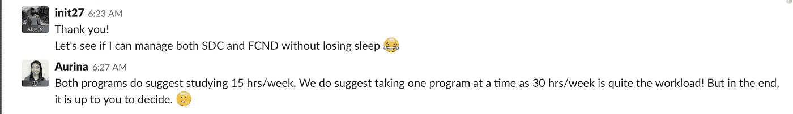
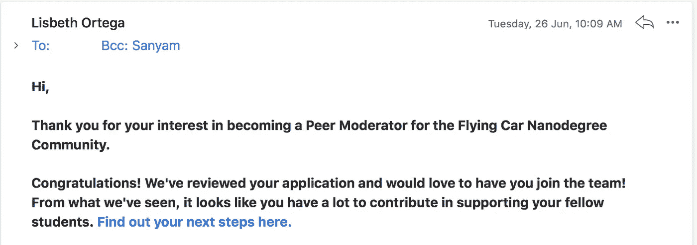

# 飞行汽车纳米学位毕业

> 原文：<https://medium.com/hackernoon/graduating-the-flying-car-nanodegree-term-e8fc9c722bc3>

## 一个月来我学习道路的更新

Photo by [Nghia Le](https://unsplash.com/@lephunghia?utm_source=medium&utm_medium=referral) on [Unsplash](https://unsplash.com?utm_source=medium&utm_medium=referral)

当我写这篇文章的时候，我在等着见 Sebestian Thrun，然后我们会和 Larry Page 讨论我关于小鹰传单的酷想法。

我也可能会做一次试飞。

> 编辑:早期的飞行汽车纳米学位是两个术语的纳米学位。它被改成了一个术语 Nanodegree，意思是:我现在正式成为了一名飞行汽车工程师。😎

如果你认为这是我的成就，这都不是真的。这是我昨晚的梦，一点也不接近我的现实。

自从我公开分享我的[机器学习之路](https://hackernoon.com/my-machine-learning-path-cb6edab4630)已经一个月了，这篇文章将分享一个巨大的里程碑。

[今年情人节，我被飞行汽车 Nanodegree](https://hackernoon.com/diary-of-a-flying-car-engineer-0-112b0747418a) 的先驱批录取，过去的几个月刚刚过去。

这是我旅程的写照:

# 梦想

*   我一直非常大声地谈论我的飞行汽车梦，我是 Udacity 的粉丝。所以我不得不报名参加第二届。我不得不这么做。
*   我的期望很现实——没有会飞的汽车。暂时也不会有。
*   但是，如果这个宇宙有哪怕一个可能的模拟，他们将会存在。我绝对不会错过这个机会。
*   TL；大卫:我希望更多地了解事物是如何飞行的，而不仅仅是如何制造一辆会飞的汽车

接受挑战！

# 挑战

*   对我来说，最大的挑战是时间。
    我在追求[无人驾驶汽车纳米学位](https://hackernoon.com/a-self-driving-new-year-33284e592f35)，谷歌印度奖学金，现在又在追求飞行汽车 nd！不用说，我也是一名全日制大学生。
*   在同一时间，我还试图做一个[快速人工智能马拉松](https://hackernoon.com/fast-ai-machine-learning-lecture-1-notes-3ca45cec4235)。
*   我希望在卡格尔开始练习。
*   我说过我是整批学生中最年轻的吗？
*   我希望把我醒着的所有时间都用来学习，如果不是更多的话。我做了那件事，但是我仍然没有时间。

# 小路

这条路充满了太多的起伏。我接受了相当大的挑战，没有借口，我在许多目标上失败了。

*   经常几晚睡不着觉。
*   我开始写我的飞行汽车之路。
*   我甚至被邀请在 Udacity 博客上写作，因为我的博客做得很好
*   我放了几个我很得意的帖子:
    - [飞行汽车工程师日记#0](https://hackernoon.com/diary-of-a-flying-car-engineer-0-112b0747418a)
    - [四轴飞行器作为测试平台](https://hackernoon.com/quadcopter-as-the-flying-car-test-platform-diary-of-a-flying-car-engineer-1-d2e735d8e32e)
    - [四轴飞行器部件讲解](https://hackernoon.com/building-a-quadcopter-components-explained-diary-of-a-flying-car-engineer-2-c9410b52fe61)
    - [四轴飞行器物理讲解](https://hackernoon.com/quadcopter-physics-explained-468ee44ba40b)
    - [ReaderBot:事件驱动聊天机器人](https://hackernoon.com/readerbot-an-event-driven-chatbot-for-medium-a8a055ef1f6a)
*   然而，由于个人问题，我有 3 个星期没看讲座，我跟不上，我失去了那个机会。
*   我没能按时完成我的[快速 AI 马拉松](https://hackernoon.com/fast-ai-machine-learning-lecture-1-notes-3ca45cec4235)。(我还在后面)
*   我没能按时完成我的 PyTorch 博文。(也在这后面，没有借口)
*   没有借口，我接受了挑战，以双倍的速度回来了。
*   最后，我于 2018 年 6 月 30 日毕业。

# 结果

*   加入 4 个月后，我毕业了！还保留着先锋批次徽章。
*   我学到了很多我肯定会学到的东西。
*   感谢这个令人惊叹的社区，我认识了很多很多令人惊叹的人。我是最年轻的新手，所以我有很多东西要学。

*   想象一下，4 周前:我对航空、飞行控制器或无人机一无所知。
*   现在，我被认为足够适合成为 Slack/Flying 汽车社区的管理员——一名同行版主。
*   我也快要完成我的自动驾驶汽车了！

# 飞行汽车纳米度(早期术语 1)

真正的交易。

这是整个球场 50 英尺的全景:

第一学期包括十七堂课和四个专题。就我个人而言，我喜欢高质量的产品。说到视频制作，我认为他们是教育界的佼佼者。

数学！纳米学位非常非常重数学。如果你是一个数学爱好者，你在这里会更舒服。
编程也是，很有挑战性。

Udacity 提到纳米学位高级，我相信那是最难的纳米学位。该代码包括实现算法，和数学！以及更多关于物理学的知识。我真希望我在学校期间是个更好的学生。

## 期限:

*   **简介**:自主飞行及基础知识介绍。
*   **路径规划**:路径规划入门及以后:从网格上的 A*到现实世界的 3D 规划。
*   **控制**:车辆动力学、控制架构(串级 PID 控制器)、全 3D 控制。
*   **传感器融合与估计**:估计、传感器(GPS、IMU 等)介绍。)和扩展/无迹卡尔曼滤波器。

# 项目:

链接到我的 Github:[https://github.com/init27/](https://github.com/init27/)

# 后院传单项目

我们使用事件驱动编程来创建一个基本的飞行控制器。

这是非常基本的，我认为这是小菜一碟-我错了。

我的解决方案:[https://github.com/init27/Flying-Car-ND-Backyard-Flyer](https://github.com/init27/Flying-Car-ND-Backyard-Flyer)

# 路径规划

我们从 2D 世界中的 A*搜索算法开始，到使用随机采样图的 3D 运动规划。

这个项目是后院飞行器项目的延续，我们通过三维城市环境编码路径规划！

我的解决方案:[https://github . com/init 27/Flying-Car-nano degree-Project-2-3D-Motion-Planning](https://github.com/init27/Flying-Car-Nanodegree-Project-2-3D-Motion-Planning)

# 控制

数学！

这些讲座中的数学简直让我做噩梦！这一部分有着最艰难的教训和计划。

讲座从车辆动力学开始。

教的重点是:
- PID 控制器。
-应用于无人机的串级 PID 控制器。

这个讲座太难了，他们最终放松了要求，让我们只提交 C++实现，不再需要提交 Python。

## 项目:

该项目包括实现和调整一个用于无人机轨迹跟踪的串级 PID 控制器。

我的解决方案:[https://github . com/init 27/Flying-Car-nano degree-Project-3-Control-of-a-3D-quadrator](https://github.com/init27/Flying-Car-Nanodegree-Project-3-Control-of-a-3D-Quadrotor)

# 传感器融合和估计

这分为:

*   评估入门。
*   传感器。
*   卡尔曼滤波器。
*   全球定位系统。

# 项目:

我们开发了在 CPP 模拟器中使用的控制器的估计部分。

我们必须通过各种场景:
-实现更好的速率陀螺姿态集成方案
-预测步骤应该包括 Rgb 质数矩阵的正确计算，以及状态协方差的适当更新。
-实施磁力计更新。
-实施 GPS 更新。

我的解决方案:[https://github . com/init 27/Flying-Car-nano degree-Project-4-Building-an-Estimator](https://github.com/init27/Flying-Car-Nanodegree-Project-4-Building-an-Estimator)

# 社区

我是第一批。不用说，我会被许多了不起的人包围。

我需要花一点时间来提及所有那些了不起的人，他们给了我很大的启发，让我接触到在我十几岁的大学校园里根本看不到的思想和心态。

他们中的许多人比我的年龄更有经验！

安库尔·考尔:
他有一个很酷的 AUV hacks 网站:[http://www.allthatido.com](http://www.allthatido.com)

Aysin Tasdelen :
她是伊斯坦布尔大学的讲师，我们正在竞争纳米学位批次。(我输了，输得很惨)。在这个过程中，她给了我极大的帮助和指导。

贝恩德·里特伯格:

一位应用物理和空中机器人工程师:10 个获胜的团队被宣布参加第一轮 200 万美元的[波音 Gofly 竞赛](https://www.theverge.com/2018/6/14/17460360/go-fly-prize-boeing-finalists-drone-vtol-jetpack)，为一个人开发一种小型个人垂直起降飞机，能够飞行 20 英里。Hist 团队是进入第二轮的获胜者之一！！！

[布莱恩·林林:](https://www.linkedin.com/in/bringley/?lipi=urn%3Ali%3Apage%3Ad_flagship3_search_srp_top%3BIHoxWT2FSiGIYepoNjVV4w%3D%3D&licu=urn%3Ali%3Acontrol%3Ad_flagship3_search_srp_top-search_srp_result&lici=Axh9Jn3MR%2BGo8b4rvVx9bg%3D%3D)
另一个研究员！我明显感觉完全不在这个地方。一定要看看他的惊人之作。

[Darien Martinez Torres:](https://www.linkedin.com/in/darien/?lipi=urn%3Ali%3Apage%3Ad_flagship3_search_srp_people%3BqM4zK1XjTqiochfIIE%2FQAQ%3D%3D&licu=urn%3Ali%3Acontrol%3Ad_flagship3_search_srp_people-search_srp_result&lici=c3qVdFw4Q5SLHWAeRwsUlA%3D%3D)
职业软件工程师。他和所有其他提到的人是同一类人。也是首批毕业的少数人之一。(自从我对代码感兴趣以来，他已经有了多年的经验！)

[裘心洁:](https://www.linkedin.com/in/xinjieqiu/)

一个斯坦福学者！我有一个来自斯坦福的同学。Xinjie 是深度学习数据科学家，他会讲数学和代码！他的讨论真的有一种额外的神奇元素。

此外，还要特别感谢塔克·邓恩 :
我们的学生体验领导者。感谢他的推文、不断更新和参与讨论，我们不仅跟上了课程进度，还了解了行业新闻、招聘情况和活动！

最后提一句:
我的室友， [Rishi K Bhalodia](https://www.linkedin.com/in/rkbhalodia927/) 。众所周知，我是一个非常内向和古怪的人，我只和有限的人交往。然而，我们是一个伟大的团队。这个人让我相信有一天我们会在印度造一辆会飞的汽车，如果没有一家雇佣公司的话——我们会成为印度的领导者。

# 我的下一步是什么？

我需要修正我错过的所有目标

*   完成快速 AI 马拉松。
*   完成我的 PyTorch 博客。
*   完成 SDCND 术语(我快完成了)。我也在用计算机视觉纳米学位作弊。

我不会马上追求第二学期，我正在失去先锋徽章，但我觉得我想探索更多关于 DL，ML。稍后，我将回到这个话题。

> 编辑:(回复:)第二学期已经被 Udacity 取消了，尽管我希望晚些时候参加，但这不会发生。我现在是一名自豪的飞行汽车工程师。

一旦我有了更多的知识，我已经“建造”了一些东西，或者向 kaggle 提交了一个实际上做得很好的东西。

但我向你保证，我会在死前驾驶飞行汽车。是的，我希望活得长久😎

注意:

*   在我大一和大二的时候，我是 AUV:自主水下航行器团队的一员。
*   我花了第三年的时间学习自动驾驶汽车和自动飞行器。

空气、水和土地都完成了。关于接下来会发生什么，我会随时更新我的旅程。

再说一遍，我不是专家。我几乎没有触及表面，但我充满热情和乐观，这是我的旅程，与你分享；未过滤。

另外，当我写这封信的时候，我正在等我去台湾的班机。我被亚洲大学选为为期两周的人工智能培训项目的研究员。

哦，我多么希望我有我的德洛林！

你的，飞行汽车工程师和邻居 Noob。

*如果你觉得这很有趣，想成为我学习道路的一部分，你可以在 Twitter 上找到我* [*这里*](http://twitter.com/bhutanisanyam1) *。*