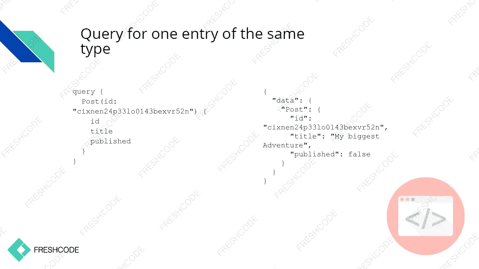

# Graphcool 框架分析及其用例

> 原文：<https://medium.com/hackernoon/graphcool-framework-analysis-and-its-use-case-319173a9aea4>

# Graphcool 框架简介

Graphcool 是一个用于生产就绪的无服务器 GraphQL 后端[开发](https://hackernoon.com/tagged/development)和发布的框架。它[在 2017 年 10 月成为开源](https://blog.graph.cool/introducing-the-graphcool-framework-d9edab2a7816)。Graphcool 包括 GraphQL 数据库映射、实时订阅和灵活的权限系统。

## GraphQL 和 Graphcool 背景

Graphcool 基于 GraphQL，我们稍微讨论一下。

GraphQL 是一种查询语言规范，由脸书于 2015 年推出。GraphQL 提供了比 REST 更灵活的后端通信可能性。使用 REST，您可以获得许多端点来处理资源，但是 GraphQL 只有一个端点，而您的需求在查询本身中描述。

GraphQL 的名字表明它以图形的形式表示数据。(GraphQL 的主要思想，实际上包含在它的名字中，是以图形形式表示数据)这里是一个[脸书](https://hackernoon.com/tagged/facebook)的例子。假设您想要检索一条包含所有评论和作者信息的消息。

*   使用 REST API，您需要发送几个查询来获取消息、它的注释和作者的数据。
*   使用 GraphQL API，您可以通过一个后端回复来检索这些数据，因为您可以确定在查询中需要哪些数据。

点击了解更多关于 GraphQL [的信息。](https://medium.freecodecamp.org/so-whats-this-graphql-thing-i-keep-hearing-about-baf4d36c20cf)

为了让客户理解他或她可以从 GraphQL 后端查询哪些数据，使用了用 GraphQL 模式定义语言编写的模式。scheme 是一个数据模型，它描述了应用程序中的数据类型以及它们之间的关系。GraphQL 模式定义是表示 GraphQL 模式的最短方式。

语法是由官方的 GraphQL 规范定义的。模式定义有时被称为 IDL(接口定义语言)或 SDL(模式定义语言)。博客中应用程序的 GraphQL 方案可以这样表示。

GraphQL 只是一个规范，所以为了使用它，您将需要一个规范实现的服务。您可以创建自己的服务或使用 GraphQL 后端即服务(BaaS)，如 Graphcool。

Graphcool 负责保存您的数据，并为您的应用程序提供一个 GraphQL 端点。你只需要确定 Graphcool 方案，它就会自动生成数据查询和编辑的函数。

如果您的应用程序需要实时更新，您可以使用 GraphQL 订阅。Graphcool 还为业务逻辑提供数据存储、第三方认证集成和服务器功能，因此它是一个真正通用的应用程序解决方案。

## Graphcool 用法

基于 Graphcool 的开发方式有两种:本地和基于云的。

Graphcool Cloud 现在已经上线 2 年了，为项目启动提供了几种可能性。

1.  共享集群使用按需购买模式，并允许根据您的需求自动扩展。
2.  私有集群类似于共享集群，但是基于您自己的基础设施和 AWS 帐户。

得益于 Graphcool 框架，Graphcool 可以在个人电脑上启动。因此，开发过程加快了，包括自主开发和 CI 管道集成。今天我们将报道当地的发展。

# Graphcool APIs

Graphcool 为您的数据模型提供自动生成的 CRUD API。它还提供实时 API，使用 GraphQL 订阅和专用 API 进行文件管理。Graphcool 的主要优势是基于您为服务选择的数据模型自动生成 CRUD API。

这个 API 提供了过滤、排序和分页的特性。

每个 Graphcool 服务都提供了基于 GraphQL 订阅的实时 API，它允许对系统事件做出及时的反应。请记住，默认情况下，每个 Graphcool 服务都提供了两个不同的 API 接口:

1.  简单 API 负责直观的 CRUD 操作和数据建模。
2.  中继 API 符合中继方案的要求。

两个 API 都转向同一个数据库！

## Graphcool 查询结构

这就是对所有相同类型条目的查询及其响应的样子。该查询由查询名称(在本例中为 all)和您希望检索的字段列表组成。响应以对象数组的形式返回，对象的键是查询中指定的字段。

这样，您可以通过节点 ID 获得某个条目。指定模型类型，括号中是所需的节点 ID，并列出字段。响应将包含必要类型的对象。

也可以通过唯一字段获取某个节点。我们通过唯一字段进行搜索，而不是节点的 ID。

以下是数据组织的论据:

*   字段排序。排序依据: <field>_ASC/ <field>_DESC。指定字段和排序顺序。</field></field>
*   过滤。
*   传呼。

这些论点可以结合起来。

目前，这些参数的使用有一些限制:

*   无法通过几个字段或相关字段请求响应。
*   返回数据对象的最大数量是 1000。

## Graphcool 过滤

过滤值得特别注意。Graphcool 可以通过所需节点本身以及相关节点过滤数据。逻辑运算符和/或扩大过滤的可能性。Graphcool 可以使用 in/lt/LTE/gt/GTE/contains/starts with/ends with 运算符及其否定。

对于每种字段类型，都有特定的过滤器，文本类型示例允许您查看大多数过滤器。当然也有局限性。数组和 JSON 过滤还没实现。

## 创建、更新和删除节点

为特定类型创建的每个新节点都会被分配一个新的 ID。必须指定所有没有默认值的必填字段，其他字段是可选参数。查询响应可以包含新创建的节点的所有字段，包括 ID 字段。

更新节点的操作类似，但是查询数据应该包括节点 ID。

嵌套突变可能用于创建和更新节点。因此，一个查询允许您创建或更新所有相关节点。目前，最大嵌套级别是 3。如果需要更高的嵌套级别，则需要创建新的查询。

要删除节点，您需要指定节点 ID。遗憾的是，目前不支持嵌套和级联删除。

# Graphcool 模板

Graphcool 支持一个模板系统来加速开发。客户端可以立即使用通过控制台添加的新模板。

模板通常不需要任何修改，但是，可以很容易地进行任何必要的调整来适应您的方案。模板的源代码被添加到您的工作目录中。目前，官方模板的列表并不长，以下是其中的一些:

*   电子邮件的认证模板-密码，谷歌，脸书，认证 0
*   消息模板:mailgun、ses、push(推送通知)或 twilio(短信)。

还有非官方的模板。

# Graphcool 认证

基于令牌的模板用于 Graphcool 中的身份验证。为您的应用程序启用了 rootToken 的使用。

使用授权系统，可以很容易地创建权限规则并将其与身份验证集成。Graphcool 提供了一个非常灵活的基于功能的认证系统。

使用 Graphcool，您可以识别需要认证的 API 操作。执行操作的 HTTP-query 应该在其授权头中拥有有效的身份验证令牌。否则，查询将因无效权限而中止。

# Graphcool 权限

graphcool.yml 中描述了权限。在权限块中，您可以列出需要哪些类型的权限。可以对操作和操作之间的关系进行限制。

要设置限制，您需要定义哪个操作限于某个节点。接下来，确定操作适用的用户类型(授权或未授权)。您可以选择将应用限制的某些节点字段，并标识特定的限制规则。

权限基于过滤系统。只需为每个字段指定必要的值。使用 Graphcool，这样的查询将获得当前用户的 user_id 和正在检查的当前帐户的数据。

# Graphcool 的利与弊

我们来总结一下 Graphcool 的优缺点。

显然，有一些缺点:

*   Graphcool 生成的 MySQL schema 相当具体。这些表之间没有关系。这些关系包含在具有相关节点 id 的表中。在 MySQL 容器初始化时，Graphcool 为元数据(项目 ID 和主要数据、用户特性、关系、webhooks、一些用户数据)创建一个数据库。在部署应用程序时，会创建一个单独的数据库，并使用生成的 ID 进行命名。它包含在 graphcool.yml 中指定的表。除了包含所述节点的表之外，还有用于节点关系的表。

*   由于缺少关系，级联删除是不可能的。
*   这个项目对于开源来说是相当新的，文档也有很多不尽如人意的地方。
*   IDE 中没有支持语法的插件。唯一值得庆幸的是 Intellij IDEA 插件支持 GraphQL。

现在是优势的时候了:

*   发展速度极高。只需定义方案，剩下的工作由 Graphcool 来完成。
*   Graphcool 可以利用用 JavaScript 和 TypeScript 编写的解析器，从而扩大了它的潜力。
*   有一个强大的过滤功能，让您不费吹灰之力就能获得必要的返回数据。
*   Graphcool 可以处理云存储中的文件。
*   模板提高了开发速度，并提供了尝试过的解决方案。
*   学习曲线低。了解如何使用 GraphQL 创建方案，就可以开始工作了。

由于 Graphcool 是基于 GraphQL 的，所以它们共享了大多数优点和缺点。在某些方面，Graphcool 正在变得更好，但仍有很长的路要走。

# 项目利用

在我们的研究过程中，我们决定在一个实际项目中使用 PostgraphQL 来实现这个框架，以比较这些技术。

创建了项目的主要节点和 CRUD 操作，实现了授权和高级共享系统(根据用户角色和组共享基础设施对象)。开发后端花了 3 天时间。

由于 Graphcool 拥有开箱即用的嵌套突变和灵活的过滤系统，因此不需要创建定制的解析器，一切都只使用框架的功能来实现。

# Graphcool vs Postgraphql

*   自定义端点。Graphcool 几乎没有限制，允许使用 JS。PostgraphQL 受到数据库的限制。
*   CreateOrUpdate。Postgres 里有 Upsert，但是在 PostgraphQL 里不能用。在 Graphcool 中，它是开箱即用的。
*   嵌套突变。PostgraphQL 不创建或更新相关节点，它只能通过单独的查询来完成。
*   原始 SQL 查询。目前，Graphcool 不能为 GraphQL 方案映射数据库方案。
*   过滤。Graphcool 提供了广泛的设置，可以比较行、日期、数组，而 PostgraphQL 只能比较键或值。
*   自动化。Graphcool 拥有 createdAt/updatedAt 字段、关系操作的自动触发器。同样的操作需要在 PostgraphQL 中手工执行。
*   计算字段。到目前为止，Graphcool 不支持计算字段。它们只能通过单独的解析器来支持。
*   级联删除。由于数据库的特殊性，Graphcool 不支持级联删除。
*   数据聚合。Graphcool 不支持根据您的需求聚合数据的内部数据库功能。

# 结论

如你所见，Graphcool 是一个有趣而强大的框架。然而，由于它最近才成为开源的，它仍然有一些问题正在通过开发者和用户的合作得到解决。

这项工作将继续确保其他数据库的支持、数据聚合和级联删除。

作为一名开发人员，我认为 Graphcool 最适合中小型项目和快速原型开发，因为它提供了许多开箱即用的功能(嵌套变异、灵活的过滤系统、模板、JS/TS 上编写的自定义变异)，并且不需要深入的 SQL 知识。

# 最后的话

我需要提到的是，我是这篇文章的合著者。原文链接可点击此处[https://freshcodeit . com/blog/2017/12/26/graph cool-framework-analysis-and-practical-cases/](https://freshcodeit.com/blog/2017/12/26/graphcool-framework-analysis-and-practical-cases/)。

请务必点击此链接查看 FreshCode IT 公司网站【https://freshcodeit.com/，在他们的博客上可以找到很多精彩的文章。

感谢阅读。