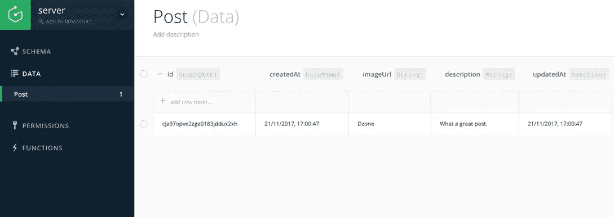
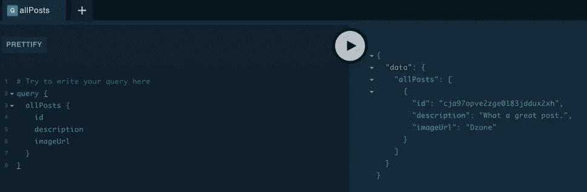
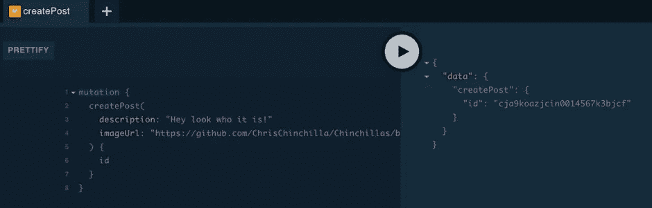

# Graphcool，GraphQL 后端开发框架

> 原文：<https://medium.com/hackernoon/graphcool-the-graphql-backend-development-framework-9f9a4f4d6ade>

我在柏林遇到了 Graphcool，他们组织并赞助了[社区聚会](https://www.meetup.com/graphql-berlin)，我采访了他们的首席执行官 Johannes Schickling，询问他们公司打算解决什么问题以及如何解决。

# 一个 GraphQL 后端开发框架

Graphcool 帮助您为基于 [GraphQL](https://dzone.com/refcardz/an-overview-of-graphql) 的应用程序创建和管理数据库后端，为您的数据提供权限、映射、订阅、管理 UI 和 [CRUD API](https://www.graph.cool/docs/reference/graphql-api/query-api-nia9nushae) 。您可以在 AWS 上使用他们的托管解决方案，或者使用 Docker 容器进行自托管。

例如，这个 GraphQL 类型定义定义了一个简单的文章:

```
type Post @model { 
id:ID! @isUnique # read-only(managed by Graphcool) 
createdAt: DateTime! # read-only(managed by Graphcool) 
updatedAt: DateTime! # read-only(managed by Graphcool) description:String! 
imageUrl:String! 
}
```

在一个快速的`graphcool deploy`命令之后，Graphcool 将其表示为:



然后，您可以使用 [Graphcool playground](https://github.com/graphcool/graphql-playground) (使用`graphcool playground`命令)来尝试直接与您的应用程序和底层数据交互的查询。



从这里，您可以使用提供的 API 端点并将应用程序连接到它。这意味着您可以从一个端点切换到另一个端点，例如，模拟开发、试运行和生产环境。

在幕后，Graphcool 将您的数据存储在 SQL 数据库中。这是用于托管集群的 [AWS Aurora](https://aws.amazon.com/rds/aurora/) 和用于基于 Docker 安装的 [MySQL](https://hub.docker.com/r/mysql/mysql-server/) 。模仿基于 ORM 的框架，如 Rails 和 Laravel， [Graphcool 支持迁移](https://www.graph.cool/docs/reference/database/migrations-paesahku9t)，允许您随时更改 GraphQL 模式。该过程与部署初始模式相同，并且适用许多与迁移相关的原则，例如，如果已经有数据，删除或更改字段类型可能会很棘手，并且要考虑这会如何影响您的应用程序。

还有一些其他的功能我没有提到，所以听听采访，读读[文档](https://www.graph.cool/docs/)，看看 Graphcool 如何融入你的下一个项目。

*最初发表于*[*【dzone.com】*](https://dzone.com/articles/graphcool-the-graphql-backend-development-framewor)*。*