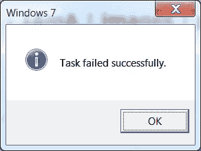

# GraphQL:三年来的经验和教训

> 原文：<https://medium.com/hackernoon/graphql-3-years-in-and-lessons-learned-34e8cd3fcfdd>


早在 2016 年末，我写了一篇名为 [GraphQL:生产一年后的提示](https://hackernoon.com/graphql-tips-after-a-year-in-production-419341db52e3)的文章。从那时起， [GraphQL](https://hackernoon.com/tagged/graphql) 开始提供原生订阅，Relay 变得如此之好，你可以用 Relay Modern 替换 [Redux，在这个过程中，我学到了一些巧妙的技巧。我也犯了很多错误。回顾我的 GraphQL 之旅，以下是我想改变的。](/@matt.krick/replacing-redux-with-relay-47ed085bfafe)

# 1.从一开始就使用数据加载器

DataLoader 是一个简单漂亮的小缓存。它不是缓存整个 GraphQL 响应，而是缓存在解析函数中使用的数据库查询。我推迟了在我的应用程序中实现它，因为担心这是一个过早的优化。男孩，我错了。回过头来看，我应该早一点做这件事。除了性能大幅提升之外，它还通过标准化从数据库中获取数据的方式简化了我的解析功能。代码越少=我写 bug 的空间越小。唯一的缺点是缓存不是为订阅而设计的。为了解决这个问题，我编写了自己的小(100 LOCs)附加包，名为[数据加载器-仓库](https://github.com/mattkrick/dataloader-warehouse)。它不是为每个订阅者缓存数据，而是为您提供了为每个发布缓存数据的选项，本质上是将 O(n)操作转化为 O(1)，这很好。

# 2.订阅负载中的突变片段

如果你有一个实时应用(谁没有呢？都 2018 年了！)您可能已经编写了一些 GraphQL 订阅来保持页面上所有数据的新鲜，而不需要令人讨厌的重新获取。我在 GraphQL 中犯的最大错误是我如何组织我的订阅。一开始，我为我的应用程序中的每个页面视图建立了一个订阅，但这意味着每当前端改变时，我的后端也必须改变。接下来，我尝试将每个实体的订阅分为 CRUD 类型，例如 CreateTaskSubscription、UpdateTaskSubscription、DeleteTaskSubscription。这很糟糕，有两个原因:我有 3 倍多的代码要维护，而且我仍然不得不写代码，因为有时我需要知道*它是如何更新的。例如，是删除了单个任务，还是删除了用户，从而触发了对 DeleteTaskSubscription 的 10 次调用？*

最后，我得出了一个我称之为混合策略的东西。它的工作原理是首先将突变载荷分解成一个片段。

```
fragment UpdateTaskMutation_task on UpdateTaskPayload {
  task {
    dueDate
  }
}
```

然后，利用 GraphQL 的强大功能，我将该片段包含在我的变异和订阅中:

```
mutation UpdateTaskMutation($task: Task!) {
  updateTask(task: $task) {
    error {
      message
    }
  ...UpdateTaskMutation_task
  }
}

subscription TaskSubscription {
  taskSubscription {
    __typename
    ...CreateTaskMutation_task
    ...DeleteTaskMutation_task
    ...UpdateTaskMutation_task
  }
}
```

因为订阅共享变异片段和处理程序，**我保证如果变异有效，订阅也会有效**。要了解更多信息，请参见[graph QL 订阅的混合策略](https://hackernoon.com/the-hybrid-strategy-for-graphql-subscriptions-dd5471c45755)。

# 3.有效负载中的错误

在上面的代码示例中，您可能注意到我在对`updateTask`的响应中包含了一个错误对象。这又回到了那个永恒的问题，“如果我在失败中成功了，那我成功了吗？”



错误也是如此。我过去常常抛出它们，但这使得很难弄清楚错误是我抛出的还是意料之外的。如果我抛出它，我希望在客户端错误消息中使用它，但是如果它是意外的，我希望一个通用的“服务器错误”消息来隐藏血淋淋的细节。通过以一次成功一次失败的心态编写每一个突变，我可以用通用消息替换任何抛出的错误。我还可以扩展返回的 error 对象，让它尽可能地有帮助，因为没有什么比遇到错误却不知道如何修复更让我讨厌一个 app 了。为了跟踪人们看到了什么错误，您甚至可以在返回错误时[向您的异常跟踪器](https://github.com/ParabolInc/action/blob/3fcf5ef90417a4cb2330884a3e9e1db587677853/src/server/utils/sendAuthRaven.js)发送一个警告。我在[处理 GraphQL 错误的权威指南](https://itnext.io/the-definitive-guide-to-handling-graphql-errors-e0c58b52b5e1)中写了一大堆关于这个主题的文章。

# 4.简化文件夹层次结构

在我最初的帖子中，我提倡将你的查询按照实体类型分成文件夹。从那时起，我的应用程序从中型发展到大型，层次结构并没有随之扩展。一些变异文件增长到超过 1000 个 loc，看起来很痛苦。现在，我提倡一个更扁平的 4 个文件夹的层次结构:[每个文件夹对应一个查询、突变、订阅和类型](https://github.com/ParabolInc/action/tree/3fcf5ef90417a4cb2330884a3e9e1db587677853/src/server/graphql)。每个文件包含一个查询(或类型),生活变得简单多了。当然，还有更多的文件，但只要给自己一个 IDE，它会在你输入的时候自动导入，你就再也不需要翻遍文件夹了。唯一的例外是 Connection 和 Edge 类型——我用一个助手创建它们，并将它们从与基本类型相同的文件中导出。

# 5.你可能需要一个界面

样板建议是对相关的事物使用接口，对不相关但有公共字段的事物使用联合(不管这意味着什么)。在实践中，我多次尝试使用联合，但总是将它们重构为接口。事实上，我的整个应用程序中唯一的联合是我的订阅有效负载(因为它们是许多变体的混合物)。因为接口可以共享字段，所以您的查询会更清晰，因为您可以在对特定类型进行分段之前提取共享字段。此外，随着数据结构变得越来越复杂，您可以对它们进行子类化，这将变得非常有用。

例如，假设我有一个`Vehicle`，它要么是一个`Car`，要么是一个`Truck`。每个`Vehicle`都有一个`Engine`，但是一个`Car`有一个`CarEngine`，一个`Truck`有一个`TruckEngine`:

```
*const* vehicleFields = () => ({
  engine: {
    type: Engine
  }
}

*const* Vehicle = *new* GraphQLInterfaceType({
  fields: vehicleFields
})

*const* Car = *new* GraphQLObjectType({
  fields: () => ({
    ...vehicleFields(),
    engine: {
      type: CarEngine
    }
  })
})

*const* Truck = *new* GraphQLObjectType({
  fields: () => ({
    ...vehicleFields(),
    engine: {
      type: TruckEngine
    }
  })
})
```

*旁注:通过对我的共享字段进行 thunkifying，它使得模式更改变得相当容易。*

现在，我可以用非常简洁的方式编写我的查询，而不需要额外的片段。例如，如果卡车发动机只是一个带有辅助动力装置的汽车发动机，我可以用一个片段获得我需要的一切，而不是必须在`Engine`和`Truck`上都进行片段化。

```
vehicle {
  engine {
    horsepower
  }
  ... on Truck {
    bedSize
    engine {
      APU
    }
  }
}
```

虽然这里看起来不太像，但是这个让你的应用中的组件片段更干净。这也意味着中继生成的流类型尽可能准确，这让我免于自寻烦恼。您可能会问自己，如果两种类型几乎相同，为什么不使用超集，并保留一些字段为空？这是我避免接口的策略，它为我服务了一段时间，直到它不再服务。给你足够的时间，你的类型*将*进化到你需要连接它们的程度。一个好的经验法则是，如果你知道前进的最佳路径，花额外的时间做好它，如果你不知道，选择最快的路径。对我来说，这意味着从一开始就构建界面。

# 6.使用您的模式来生成类型

如果您使用 typescript 或 flow，您很可能会发现自己构建的类型看起来很像您的模式片段。对于中继人员来说，您已经为您创建的每个片段获得了[定制的流类型](https://facebook.github.io/relay/docs/en/new-in-relay-modern.html#flow-type-generation),但是这些不包括枚举和查询输入变量之类的东西。对于这样的事情，我使用[gql 2 ts](https://github.com/avantcredit/gql2ts)([gql 2 flow](https://github.com/joarwilk/gql2flow)的继承者)来生成通用类型。您甚至可以在节点服务器上使用这些类型，这在编写更复杂的解析函数时非常有用。这个单一的事实来源是一个巨大的好处，因为现在当你扩展一个接口时，你不必记得扩展你的流类型。

# 展望未来

有了这些建议，我希望你能设法避免一些让我陷入的耗时陷阱。GraphQL 仍然是使用的一大乐趣，这在很大程度上是因为围绕它的不断增长的、活跃的社区。这里还有很多我没有涉及的最佳实践，包括模式拼接、内部模式、使用 GraphQL 传输 OT/CRDT 变更、持久化查询等。如果你自己发现了一些整洁的模式，或者认为我的一些是胡扯，一定要让我知道！