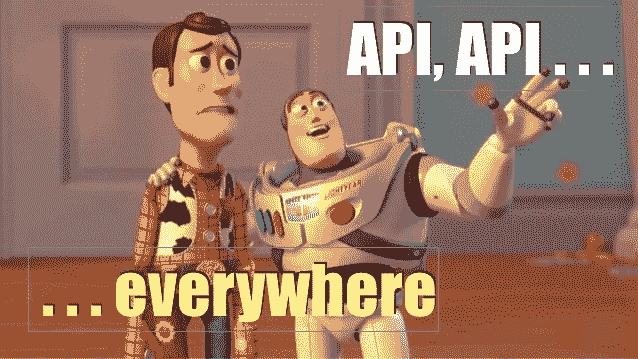

# 后端开发的 GraphQL APIs

> 原文：<https://medium.com/hackernoon/graphql-apis-for-backend-devs-bba579e72eba>

From SOAP to REST and probably GraphQL

在我的软件开发生涯中，我构建并使用了大量的 web 服务。通常，它们是通过构建的服务器端应用程序使用的。NET，我做过的最大的项目之一是一个平台，在这个平台上，我们合并了来自不同来源的大量数据，并在 web 界面上向用户显示结果(是的，当时我在一家经纪公司工作)。

## SOAP Web 服务—与 XSD

几乎所有这些 web 端点都使用 SOAP，并且它们很容易查询，因为我们总是从我们的合作伙伴那里得到一个模式(XSD)文件。接收 XSD 是一个非常好的开始，因为客户端是由工具为您生成的。另一方面，这不是最好的解决方案，有时我们不得不手动更改生成的代码，因为客户端和服务器之间的堆栈不同。这可能会导致升级到新版本时出现问题，因为您可能会覆盖这些更改，所以我们不得不花一些时间来比较源代码控制中的更改，最后我们手动进行升级，一个更改一个更改。c#中生成的代码使用分部类，因此理论上您需要做的任何更改都可以在生成的代码之外完成。但是我仍然记得一些情况，当变化如此之大，以至于我们不能在另一个文件中完成它。

XSD code generation in action

## REST——松散耦合的 web 服务

但是没有什么比得上我们第一次使用 REST 端点。这家公司为他们新的*闪亮的尖端 API 做了广告。一切看起来都很好，直到我们开始真正建立我们的。NET 客户端。想象一下，有 5 或 6 个端点，每个端点返回几十个，也许几百个参数，有几层嵌套。你不得不一个接一个地写那些样板属性，浏览例子，想知道哪个是数组，它是否可以是一个 int 或者保留为 string 等等。*

然后他们问你为什么需要 3 个月才能连接到他们的新 API？*啊啊啊……*

所以 XSD 在第一天就帮了你很多:让你的客户端快速进入运行状态，然后再担心将来的升级和版本控制。大多数时候，我们会消耗比所需多得多的数据。我不记得花时间删除了我们不需要的字段，以使过程更轻松。而在 REST 端，有许多代码需要编写，这很重要，因为在那里出错，所有的反序列化都会失败。事实上，通过只添加需要的字段，我们最终可以得到更灵活的客户端，但是这是一个容易出错的过程。

SOAP 仍然将客户机和服务器与模式生成耦合在一起，而 REST 实现了真正的松散耦合，只是我们还没有为此做好准备(至少在后端)。因为这个问题是真实的，像 [SWAGGER](https://swagger.io/) 这样的项目出现了，它把你的 api 翻译成其他客户端可以自动使用的开源 DSL。最近，为 REST 端点提供某种 SDK 和 API 的情况越来越多，这需要额外的努力，但这是朝着正确方向迈出的一步，因为客户端可以更快地连接到您。但仍有许多公司缺乏这种理解。

## 输入 GraphQL

现在当你听说 GraphQL 时，你读到的主要内容是你可以选择可以从服务器返回的列。这对于构建您的移动和 web 客户端来说有多棒，而不需要创建几个 REST 端点，因为它们需要不同的字段来操作和显示。如果你浏览以 GraphQL 为要求的工作，你会看到几乎所有的前端和移动开发。那才是真正受欢迎的地方。

后端开发呢？如果您正在为您的产品构建外部 API，GraphQL 会是一个合理的选择吗？从带有 Swagger 的 REST API 切换到 graph QL API 有什么优势吗？

## GraphQL 模式

对于作为 API 构建者和消费者的我来说，创建 GraphQL API 最重要的好处是模式和它为您提供的所有现成的版本控制工具。

GraphQL 提供了一个现成的模式，包括标量和复杂类型(由其他复杂类型或标量类型组成)、查询、突变(也是一些特殊类型)和许多其他元素，可以帮助您定义 API。

在下图中(截图来自 Twitter API 的 https://www.graphqlhub.com[——非官方)你可以看到一个 Tweet 对象，由一些标量类型组成，如 String、Int、ID 和一些对象类型，如 TwitterUser 或 Retweet。](https://www.graphqlhub.com)

TwitterAPI defined at GraphQLHub.com seen in a Graphiql UI

当行业从 SOAP 转向 REST 时，需要一段时间来理解这个新概念。协议上不再公开任何方法，但是模式是关于创建端点和公开这些端点周围的数据。REST 是关于使用统一资源标识符以及如何将 HTTP 动词转换成动作。这条路同样适用于向 GraphQL 的过渡。就像我说的，当你第一次读到它的时候，你会发现你可以在客户端选择你的专栏。然后你发现它有一个带类型的模式，这是 REST 的一大优势。或许在那之后，或者再多走几步，你就会意识到，为了构建一个 GraphQL API，一切都是为了将数据视为图形。当您开始定义一个新的模式时，它不是关于公开方法或创建端点，它实际上是关于如何连接您的数据，因为它总是这样。

## 这是一路向下的图表

让我们举一个简单但足够复杂的例子来解释这个概念:书籍和作者。在 REST 架构中，您将构建两个端点，一个用于作者，一个用于书籍。考虑一下 GraphQL 模式，很明显会有两种类型:Author 和 Book，以及一个公开这两种类型的查询。但是这些对象是密切相关的，因为一个作者写了一本或多本书。因此，在作者类型上，我们将添加一个图书列表。

authors query — an author has a list of books

甚至，作者和书之间的关系是 n 对 n 的，因为一本书可以有多个作者。这正是我们的例子，《起源:140 亿年的宇宙进化》这本书是由两位作者写的:尼尔·德格拉斯·泰森和唐纳德·戈德史密斯。这意味着我们将向我们的图书类型添加一个作者列表，并且我们的图表中已经有一个循环。

现在我们在一个查询中就有了完整的信息:我们有作者和他的书，如果我们需要信息，我们还可以包括一本书的所有作者。因此，它不再与端点和 URI 有关，而是与数据和数据节点之间的连接有关。在我们的 GraphQL 查询中，我们可以清楚地看到我们的类型之间的关系。

*感谢阅读。顺便说一句，如果你来自罗马尼亚的雅西，你可以加入我的免费的* [*GraphQL。6 月 5 日举行的 NET Core 研讨会*](https://www.meetup.com/Microservices-Iasi/events/249451432/) *。作为一个工作坊，名额有限，但如果有更多的人感兴趣，我们可以进行第二轮。*

[*您也可以注册我的软件开发者感兴趣的简讯。NET 技术*](https://mailchi.mp/c6f9b64a7def/dotnet-newsletter) *。我计划从 2018 年 6 月开始，每月发送两次。*