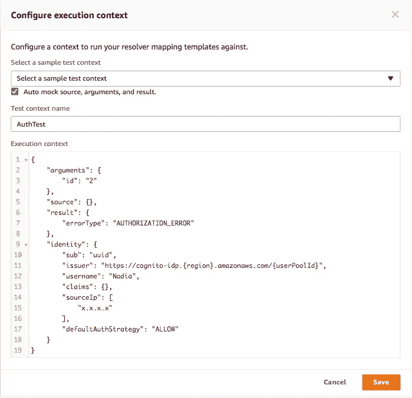

# 使用 AWS AppSync 对多个数据源进行 GraphQL 授权

> 原文：<https://medium.com/hackernoon/graphql-authorization-with-multiple-data-sources-using-aws-appsync-dfae2e350bf2>

*我最近在 React Amsterdam 上做了一个关于运行 GraphQL at scale* *的* [*演讲，涵盖了生产中出现的一些不同的用例及技术。其中一个场景与使用多个数据源以级联方式*](https://youtu.be/smBND2pwdUE?t=19535) *进行* [*授权有关，这也是本文的出发点。这是一个有点高级的主题，所以如果你刚刚开始，我建议从更多的介绍性信息开始*](https://youtu.be/smBND2pwdUE?t=20332) [*这里*](https://docs.aws.amazon.com/appsync/latest/devguide/security.html#fine-grained-access-control) *和* [*这里*](https://www.youtube.com/watch?v=etax3aEe2dA) *。*

授予对 GraphQL 中数据的访问权可能是一个棘手的问题，随着该技术被更广泛地采用，多种策略和新兴的最佳实践开始涌现。 [GraphQL](https://hackernoon.com/tagged/graphql) 为您提供了强大的技术来对用例实施不同的授权控制，例如:

*   完全公开的 API
*   对 API 部分的私有和公共访问
*   私有和公共记录，在运行时对字段进行检查
*   一个或多个用户可以写入/读取记录
*   一个或多个组可以写入/读取记录
*   每个人都可以阅读，但只有记录创建者可以编辑或删除

从根本上讲，在任何系统中实现访问控制时，必须存在一些关于谁或什么可以访问资源的元数据。定义这一点的经典方法是使用巴特勒兰普森的[访问控制矩阵](https://en.wikipedia.org/wiki/Access_Control_Matrix)，其中授予的权限是由资源和参与者(可以是用户、角色、组等)组成的行和列的交集。).当直接与数据库交互时，这种“授权元数据”往往是该系统的一部分，访问控制在连接时或运行时执行。在以 GraphQL API 为前端的服务架构中，存在一个间接层，代表调用者进行数据库交互。GraphQL 还允许在字段级别对查询返回的部分结果进行授权。虽然这一开始看起来令人望而生畏，但实际上您最终会得到强大的控件，这些控件允许您将授权数据存储在一个资源上、一个单独的数据源中，或者混合/匹配控件的组合。您甚至可以在不同级别进行级联检查，以满足您独特的业务需求。

本文展示了如何使用 GraphQL 技术通过 [AWS AppSync](https://aws.amazon.com/appsync/) 进行授权，但是这些策略也可以应用于定制的 GraphQL 解决方案。虽然 AppSync 有一个被称为“数据源”的第一类概念，但这种概括可以应用于 GraphQL 解析器，因为它们使用这个位置来获取数据。使用上面关于执行访问控制检查的描述，您可以在下图中看到如何通过在资源
(数据库记录的“作者”列)上存储用于授权的元数据，并在调用 GraphQL 解析器时通过请求线程化调用者的身份信息来执行条件检查。在这里阅读更多。


虽然许多访问控制场景可以使用单个数据源，但是一些授权用例需要使用多个数据源。例如，在 AppSync 中，您可能会这样做，因为您希望在将数据读取或写入 DynamoDB 表之前，首先在 Lambda 函数中执行一些逻辑，或者可能是首先执行查找，例如只允许您的“朋友”读取您的数据(一对多检查)。

GraphQL 通过在您的字段上使用解析器、遍历应用程序图、从不同的数据源获取数据并在适当的时候执行授权检查来实现这一点。


对于许多高级场景，您可以将这种技术与 AWS AppSync 的[内置细粒度访问控制结合使用。例如，虽然细粒度的访问控制允许您在解析器中执行条件逻辑，如用户或组检查，但嵌套解析器和聚合上下文允许您使用来自父对象的结果来执行此逻辑。为了演示这一点，我们将从一个简单的用例开始。](https://docs.aws.amazon.com/appsync/latest/devguide/security.html#fine-grained-access-control)

# 嵌套解析器

在 [AWS AppSync 细粒度访问控制示例](https://docs.aws.amazon.com/appsync/latest/devguide/security-authorization-use-cases.html)中，授权元数据被直接存储在资源上(比如一个名为“所有者”的表中的一个项目的属性)。出于演示的目的，假设这些是单独的表，我想读取“数据”表中的数据，但首先对“验证”表中的数据运行授权检查，该表列出了谁是“数据”表中某项的“所有者”。只有“Auth”表中列出的“Owner”有权读取“Data”表中的相应信息(每个表中的 id 都有一个隐式关联)。下图是表格布局，其中包含一些记录和您希望逻辑检查如何工作的伪代码。


在这个布局中，用户 Nadia 可以访问“数据”表中的项目 1 和 3，而 Shaggy 可以访问项目 2。要使用单独的数据源，可以将想要检索的数据“嵌套”在 GraphQL 类型中，该类型从单独的数据源获取授权元数据，并在查询中遍历对象图。执行这种嵌套的 GraphQL 模式示例如下。

```
type AuthCheckData { id: ID! data: Data}type Data { id: ID! title: String content: String}type Query { getData(id:ID!): AuthCheckData}
```

在上面的 GraphQL 模式中， **getData** 查询将调用针对 **Auth 表**的解析器，并返回类型 **AuthCheckData** 。然后在 **data:Data** 字段上设置的解析器将访问其父字段返回的数据，以执行授权检查。流程图如下。


**getData** resolver 请求模板相当标准——它实际上只需要对 Auth DynamoDB 数据源运行一个 **GetItem** ,没有其他参数:

```
{ 
  "version": "2017-02-28", "operation": "GetItem", "key": { "id": $util.dynamodb.toDynamoDBJson($ctx.args.id), }}
```

响应模板只是传递数据:

```
$util.toJson($context.result)
```

因为返回的是整个结果，所以来自 **Auth** 表(在本例中为 **Owner** )的任何属性都将被返回，并可用于子字段，以便通过 **$context.source** 对象(别名为 **$ctx.source** )在解析器模板中使用。

这就是事情变得有趣的地方。在 **data: Data** 上设置一个解析器，并再次使用一个 **GetItem，**，但是现在使用解析器请求模板中带有 **$ctx.source.id** 的父级的 ID:

```
{ "version" : "2017-02-28", "operation" : "GetItem", "key" : { "id" : { "S" : "${ctx.source.id}" } }}
```

这一点很重要，因为您实际上是在确保来自父检查的授权元数据与您正在执行验证的数据相匹配，这只是传递到 GraphQL 查询中的一个参数。现在，如果**所有者**(在来自 Auth 表的 **$context.source.Owner** 中可用)等于当前用户，您可以过滤**数据:数据**解析器的响应模板中的结果，只返回数据表中的值，如下面的解析器响应模板所示:

```
#if ($context.source.Owner == $context.identity.username) $util.toJson($ctx.result)#else $utils.unauthorized()#end
```

此时，可以运行对 **getData(id:1)** 或 **getData(id:3)** 的 GraphQL 查询，如果 Nadia 登录，她将看到她的数据。该查询类似于以下内容:

```
query {
  getData(id:1){
    data{
      id
      title
      content
    }
  }
}
```

如果 Nadia 运行一个 **getData(id:2)** 的查询，她将得到一个未授权的消息，但是如果 Shaggy 运行那个查询，他将看到数据，因为他在 Auth 表中被列为所有者。


# AWS Lambda 授权器

假设您有更复杂的授权、令牌验证业务逻辑，或者您需要与 AWS AppSync 尚不支持的数据源进行交互。但是，如果授权检查通过，您希望从 DynamoDB 表返回结果。您可以使用与之前相同的架构，但是这一次，让 **getData()** 解析器在第一层访问中使用 AWS Lambda 函数来执行授权，并将结果传递给 DynamoDB 解析器。

要设置它，使用前面的相同模式，但是现在添加一个 AWS Lambda 函数的新 AppSync 数据源。如果你不熟悉在 AWS AppSync 中设置和使用 [Lambda 函数，先看看这个教程](https://docs.aws.amazon.com/appsync/latest/devguide/tutorial-lambda-resolvers.html)。在 AppSync 中使用 Lambda 函数之前，您需要先创建它，对于本例，使用 Node 中编写的以下函数。JS:

```
'use strict';exports.handler = (event, context, callback) => {
    console.log(event);

    let valid = allow(event);

    switch(event.field) {
        case "getData":
            var id = event.arguments.id;
            if (valid) {
                callback(null, {id: event.arguments.id});
            } else {
              let result = {};
              result.errorMessage = "Error with the authorization";
              result.errorType = "AUTHORIZATION_ERROR";
              callback(null, result);
            }
            break;
        case "addData":
            // Write similar authorization check here
            callback(null, event.arguments);
            break;
        default:
            callback("Unknown field, unable to resolve" + event.field, null);
            break;
    }
};function allow(event) {
    const allowedKeys = ["abcdef", "ghijkl"];
    const allowedUsers = ["Nadia", "Caesar"];
    const allowedIps = ["192.168.0.1"];

    if (allowedUsers.includes(event.identity.username))
      return true;
    else if (allowedKeys.includes(event.request.headers.x-api-key))
      return true;
    else if (allowedIps.includes(event.identity.sourceIp))
      return true;
    else
      return false;
}
```

上面的代码有一个 **allow()** 函数，它授权来自一组用户、API 密钥或 IP 地址的请求。如果其中任何一个匹配，那么将允许授权。例如，如果一个客户端传入一个有效的 API 密钥，在一个白名单 IP 地址列表中，或者是一个有效的用户列表中的一个，那么访问将被授予。[您可以在这里](https://docs.aws.amazon.com/appsync/latest/devguide/resolver-context-reference.html)看到线程化到 AppSync 请求的上下文对象中的身份对象的完整列表。如果调用 GraphQL API 的客户端没有通过这些检查，那么 Lambda 将返回一个**ERROR type**of**AUTHORIZATION _ ERROR**。这是一个虚构的例子，但重点是您可以在 Lambda 中执行自定义授权逻辑，并将数据获取调用级联到其他解析器，这是您接下来要做的，而不需要将所有内容都放在 Lambda 函数中。

更改 **getData(): AuthCheckData** 上的解析器以使用这个 AWS Lambda 数据源。解析器请求模板需要指定被调用的 GraphQL 字段，以及标识和参数:

```
{
    "version" : "2017-02-28",
    "operation": "Invoke",
        "payload": {
        "field": "getData",
        "identity" : $utils.toJson($context.identity),
        "arguments":  $utils.toJson($context.arguments)
    }
}
```

然而，与前面的场景不同，在前面的场景中，您从父节点传递了 **$context.source.Owner** 并在子节点中进行授权检查，Lambda 直接返回 **result.errorType** ，您可以检查 **getData()** 本身的解析器响应模板:

```
#if ($context.result.get("errorType") == "AUTHORIZATION_ERROR")
  $util.unauthorized()
#else
  $util.toJson($context.result)
#end
```

使用这样的模式，您实际上是将所有的验证逻辑“包装”在父解析器 **getData()** 中，以便子解析器严格地专注于数据获取，并且关注点的分离更加清晰。现在，字段 **AuthCheckData:data** 上的解析器请求模板仍然使用 **$ctx.source.id** 在“数据”表上查找数据源(因为这是 Lambda 在有效授权情况下返回的内容)，但是响应模板只是:

```
$util.toJson($ctx.result)
```

这个模式的优点是父解析器， **getData()** ，本质上“包装”了授权逻辑，只有通过有效性检查时才调用子解析器返回数据。

# 只让我的朋友阅读

授权的另一个非常常见的用例是，一个实体允许几个其他实体以一对多的方式访问一个资源。在社交媒体应用中，这可能被声明为“仅允许 Nadia 的朋友查看她的信息”。使用 DynamoDB 进行建模的典型方式是使用一个“友谊表”在访问实际记录之前进行检查。友谊表会有一个由用户 ID 和朋友 ID 组成的组合键。


在 DynamoDB 中创建一个“朋友”表，主键为**用户名**，排序键为**朋友**。两者都使用字符串。为了方便起见，还添加了一列**有效**，以便您可以快速切换到某人不再是朋友(您也可以随时删除该行)。将该表添加为 AWS AppSync 数据源，并编辑您的模式，使查询类型为 **friendGetData(id:ID！，朋友:串串！)**如下图。

```
type Query {
  getData(id: ID!): AuthCheckData
  friendGetData(id: ID!, friend: String!): AuthCheckData
}
```

这个想法是用户可以访问一个记录，如果他们碰巧是某人的朋友。为了简单起见，我们将传入一个记录的 ID，我们希望像以前一样从同一个**数据**表中接收该记录，但是首先根据新的**朋友**表进行友谊检查。 **friendGetData()** 的请求模板如下所示:

```
{
    "version" : "2017-02-28",
    "operation" : "GetItem",
    "key" : {
        "Username" : { "S" : "${ctx.identity.username}" },
        "Friend" : { "S" : "${ctx.args.friend}" }
    }
}
```

如果你是这个人的朋友，这将从你的表中返回有效的属性。像上一个例子一样，我们将授权逻辑保留在顶级解析器的响应模板中，以保持职责分离。然而，与前两种情况不同的是，“ **Friend** ”表没有主键“ID ”,所以它不会在源对象中自动传递。由于我们希望在调用子解析器时使用作为参数传递的 **id** 在“**数据”**表中进行键查找，我们还将其添加到响应模板中的上下文对象:

```
$util.qr($context.result.put("id", "$context.arguments.id"))
#if ($context.result.get("Valid") == "TRUE")
  $util.toJson($context.result)
#else
  $util.unauthorized()
#end
```

现在，我们可以像在其他示例中一样，通过 **$context.source.id** 来访问 **id** 。如果运行查询:

```
query friend {
  friendGetData(id:1 friend:"Nadia"){
    data{
      title
      content
    }
  }
}
```

这对 Nadia 是朋友的登录用户来说运行成功。

# 突变

到目前为止，所有的例子都涵盖了概念上的查询，我想展示 GraphQL 为您提供的操纵授权模式的控件。您也可以将这些技术应用于突变，但是有一个细微的区别，您可能需要在解析器的请求管道中执行条件检查，而不是在响应上执行过滤器。您控制这一点的方式将非常特定于用于您的变异的数据源实现。

例如，AWS AppSync 支持几个数据源，包括 Amazon DynamoDB，它支持可以由数据库引擎本身评估的[条件表达式](https://docs.aws.amazon.com/amazondynamodb/latest/developerguide/Expressions.ConditionExpressions.html)。回想一下本文中展示的模式，其中一个展示了如何将授权元数据从父级传递到子级并做出决策，而不是将所有授权决策“包装”在父级解析器中。如果您的设计使用第一种技术，那么您将无法对数据库操作的响应应用授权逻辑，因为写操作已经发生了。相反，您需要使用数据库引擎的执行标准以及从父解析器传递的元数据。在带有 AppSync 的 DynamoDB 解析器中，您可以向解析器请求模板添加类似以下内容的内容:

```
"operation" : "UpdateItem",
"condition" : {         
  "expression" : "contains(Edit,:canEdit)",
  "expressionValues" : {             
  ":canEdit" : { "S" : "${context.source.canedit}" }
  }
}
```

上面使用了父解析器的所有者，并且在运行时，如果**的属性 canedit** 被传递给子解析器。[这里可以找到几个例子](https://docs.aws.amazon.com/appsync/latest/devguide/security-authorization-use-cases.html#writing-data)。当然，也有可能您的数据库实现不支持这些功能，对这些类型的运行时评估没有性能，或者您的模式设计只是将授权逻辑分离到父类中，在这种情况下仍然可以使用其他方法。

# 额外收获:嘲笑和测试

在构建授权方案时，模拟场景并为多个用户或组测试不同的流程，以了解授权规则在生产中实际上是如何运行的，这可能会很棘手。对于任何将数据返回给客户端的系统，您都应该考虑实现模拟和仿真技术来进行授权。AWS AppSync 为此提供了一些不同的[工具](https://hackernoon.com/tagged/tools)。首先，AppSync [支持完整的测试和调试流程](https://docs.aws.amazon.com/appsync/latest/devguide/test-debug-resolvers.html)，允许您模拟 GraphQL 请求&响应上下文。您可以使用它来查看不同场景下的行为，以及在解析器中传递或接收的信息。例如，如果我从 AppSync 控制台编辑 **getData** 解析器，并选择**选择测试上下文**按钮，我可以创建一个模拟上下文对象来模拟用户以及任何响应。使用前面的 Lambda 解析器，我将传入 **AUTHORIZATION_ERROR** 结果来模拟一个未授权的请求:



按下控制台中的**测试**按钮将评估请求对象，包括字段和身份信息，以及执行任何条件检查。如果逻辑导致将被打印到屏幕上的未授权请求:


在模仿你的数据之后，你还可以从 AppSync 控制台的**查询**页面运行这个“直播”，它可以从亚马逊 CloudWatch 日志中[直播结果。但是不要止步于此，控制台还允许您使用 Amazon Cognito 用户池中的有效用户帐户登录，以执行真正的授权检查:](https://docs.aws.amazon.com/appsync/latest/devguide/test-debug-resolvers.html#debugging-a-live-query)


您可以使用它来针对用户帐户、组、声明或身份上下文对象的其他属性测试条件规则。

# 摘要

这些只是使用 GraphQL 和现有的 AWS AppSync 授权用例及技术的几个例子。一般来说，安全控制可能是一个复杂的主题，因此最好看一看所有选项，并在可能的情况下，从简单的开始，只在您的业务需求发生变化时添加更多选项。

*Richard Threlkeld(*[*@ undef _ obj*](https://twitter.com/undef_obj)*)在*[*AWS Mobile*](https://aws.amazon.com/mobile/)*工作，是推出*[*AWS app sync*](https://aws.amazon.com/appsync/)*和*[*AWS*](https://github.com/aws/aws-amplify)[*Amplify*](https://github.com/aws/aws-amplify)的团队的一员

本文表达的所有观点均为我个人观点。