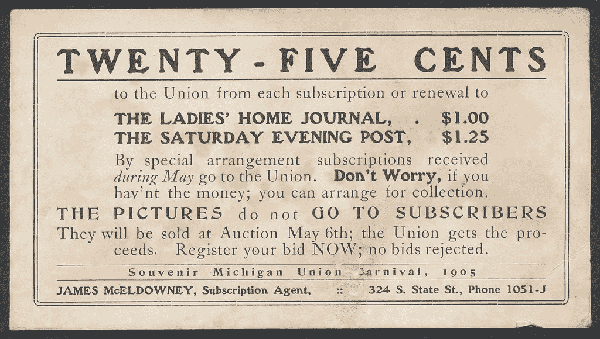
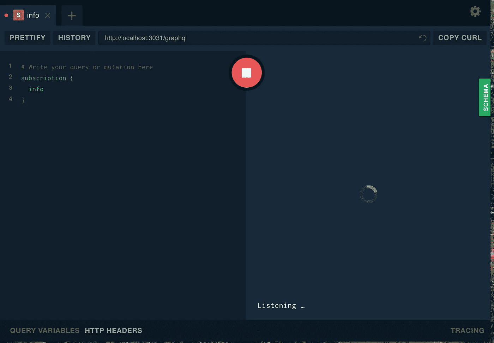
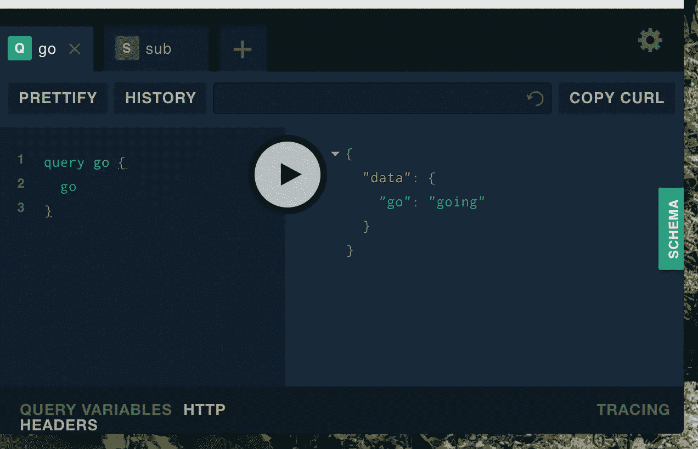
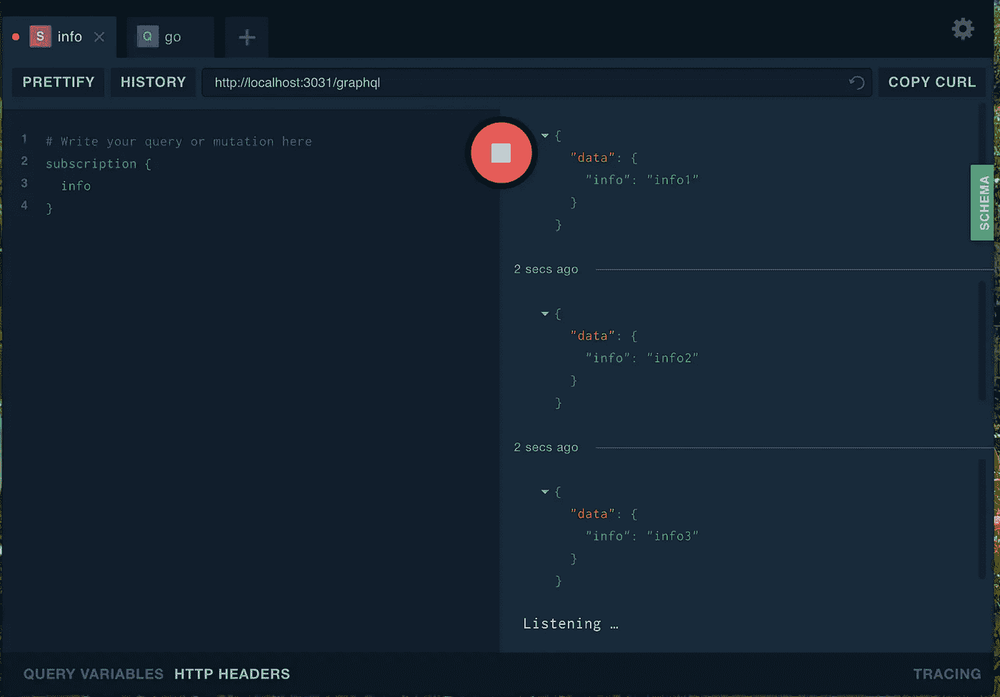

# 使用 Apollo 2 的 GraphQL 订阅

> 原文：<https://medium.com/hackernoon/graphql-subscriptions-using-apollo-2-3eb3184768c4>

我的一个兼职项目涉及围绕通用象棋接口()编写一个 [GraphQL API](https://wehavefaces.net/graphql-shorthand-notation-cheatsheet-17cd715861b6) 。我最初开发了一个模拟实现，不久前[写了一篇文章](https://medium.freecodecamp.org/wrapping-an-streaming-i-o-interface-in-graphql-931650dafd3b)。它使用的是 Apollo 第一版的客户端/服务器堆栈，在第二版中[做了很大的改变。最大的变化之一是订阅接口和实现，我花了很多时间才让它工作起来。部分问题是文档不是很完整，而是很分散。这篇文章将涵盖订阅服务的最基本的实现和使用它的客户端代码。](https://www.apollographql.com/docs/apollo-server/migration-two-dot.html)

# 入门指南

GraphQL 服务器将基于 [ApolloServer](https://www.apollographql.com/docs/apollo-server/) ，在这种情况下，它将使用 Express 服务器作为中间件。订阅将使用一个 [WebSocket](https://en.wikipedia.org/wiki/WebSocket) ，它连接到一个普通的 HTTP 服务器(正如我们将看到的，也是由 ApolloServer 管理的)。

有两个客户端:GraphQL Playground 和一个供 Mocha 在 GUI 之外测试 API 的客户端。为了简单起见，我将把 Mocha 客户机代码保存在与服务器代码相同的文件夹中。我也用巴别塔，这样我就不用考虑迈克尔·杰克逊的剧本等等。

记住这一点，下面是要安装的软件包:

*   阿波罗链接，阿波罗链接 http，阿波罗链接 ws，阿波罗服务器快递
*   巴别 cli，巴别核心，巴别预设环境
*   graphql，graph QL-工具
*   订阅-传输-ws
*   茶，摩卡

我将在本文末尾提供一个工作代码库的链接。

# 服务器

这个服务器是我能做的最简单的:

在第 12 行**创建了一个 ApolloServer，并传入了一个模式和解析器。第 17** 行**上的 [applyMiddleware](https://www.apollographql.com/docs/apollo-server/essentials/server.html#middleware) 调用在第 9** 行**上创建的 express 应用中通过。最后，创建一个 http 服务器来处理订阅服务的 web socket 接口，这是在**第 22 行**上创建的。**

## 该模式

该模式非常基本: **go** 将返回一个字符串确认，但是在后台它将触发一个方法，向订阅者发送发布通知。订户通过**信息**订阅 API 进行订阅。

我们可以在 resolvers.js 中看到这是如何工作的:

我特意简化了解析器。例如，来自 PubSub 的 asyncIterator 方法相当复杂(例如，它支持过滤器和认证)。既然已经[有据可查](https://www.apollographql.com/docs/apollo-server/features/subscriptions.html)，这里就不深究各种选项了。上面的解析器所做的只是向所有订阅者发布一个**信息主题**，将**信息**对象作为订阅的主体进行传递(**行 10** )。

# 客户

正如我提到的，我将使用两个客户端进行测试。一个是内置的 Prisma Playground，这是一个由 ApolloServer 自动提供的服务(仅供参考:[你可以在生产中关闭这个功能](https://www.apollographql.com/docs/apollo-server/features/graphql-playground.html#Configuring-Playground))。

## 操场测试

为了测试，我将在 Chrome 中打开 Playground，位于[http://localhost:3031/graph QL。](http://localhost:3031/graphql.)在 Playground 中，你可以打开多个标签。首先，我将订阅**信息专题**:

播放此命令时，您将在右窗格中看到“Listening …”响应，如上所示。现在您已经订阅了。

在操场中打开另一个标签，查询 **go:**

这发回了一个“正在进行”的响应，所以一切正常。现在，返回到 subscription 选项卡，您将看到发布的输出:

# 使用摩卡/茶进行测试

在设置客户机时有很多样板文件，所以我创建了一个实用程序文件来处理查询和订阅操作。它叫做 fetch.js:

fetch.js 代码引入了许多相互依赖的模块。对于测试操作，我使用 [apollo-link](https://www.npmjs.com/package/apollo-link) ( **第 6 行)**来处理服务器之间的接口(顺便说一下，它必须正在运行😉)和测试的 GraphQL 操作。这里实际上有两个接口:一个通过 HTTP 处理查询和变异请求(第 21–27 行)，另一个通过 web 套接字订阅主题(第 29–37 行)。

大部分来自于[文档](https://www.apollographql.com/docs/link/index.html#standalone)，但是你必须安装一些额外的模块，我之前没有提到:

*   节点获取(通过 **npm -g** 全局安装)
*   《华盛顿明星报》
*   gql

**节点获取**模块实现了正在成为标准的 HTTP [获取 API](https://developer.mozilla.org/en-US/docs/Web/API/Fetch_API) 。 **ws** 模块是 Node 的 WebSocket 实现(还有其他的)，而 **gql** 是一个模板文字标签，你可以在这里阅读更多关于[的内容。](https://github.com/apollographql/graphql-tag)

测试本身非常简单:我们首先**订阅**，然后**开始**:

**hander** 对象(传递给第 26 行的 **subscribe** 方法)接收发布通知。当接收到最后发布的消息时，测试过程终止(**第 15 行)**。

# 结论

您应该浏览提供的链接，因为还有很多关于 GraphQL 订阅的内容我无法在本文中介绍。我还包括了一些相关的链接，如下。包含以上代码的完整 github 库可以在 [**这里**](https://github.com/JeffML/Apollo2Sub) 找到。尽情享受吧！

*   [教程:GraphQL 订阅(服务器端)— Apollo](https://dev-blog.apollodata.com/tutorial-graphql-subscriptions-server-side-e51c32dc2951)
*   [GraphQL](https://dev-blog.apollodata.com/tutorial-graphql-subscriptions-server-side-e51c32dc2951)[apollographql/graph QL-subscriptions:实现 Node.js 的 graph QL 订阅的小模块](https://github.com/apollographql/graphql-subscriptions)
*   [Apollo Server 2.0 上的 SSL 订阅问题#1338](https://github.com/apollographql/apollo-server/issues/1338)
*   [apollographql/阿波罗-服务器](https://github.com/apollographql/apollo-server/issues/1338) [阿波罗-链接-ws |阿波罗链接](https://www.apollographql.com/docs/link/links/ws.html)
*   [graph QL | Apollo Link 的可组合网络](https://www.apollographql.com/docs/link/index.html)
*   [阿波罗客户端|阿波罗客户端](https://www.apollographql.com/docs/react/api/apollo-client.html#ApolloClient.subscribe)