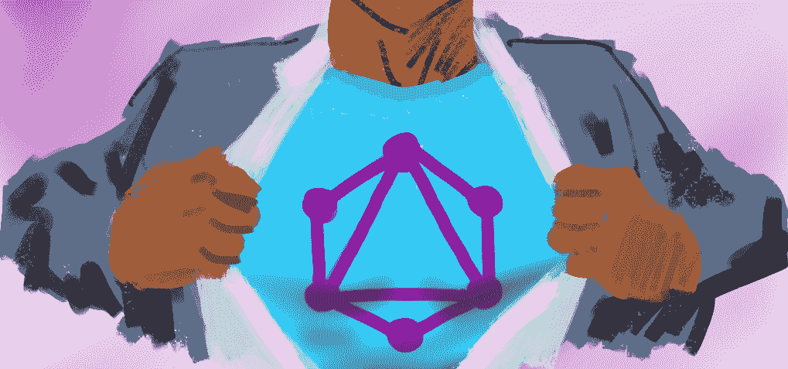

# GraphQL 订阅与实时查询

> 原文：<https://medium.com/hackernoon/graphql-subscriptions-vs-live-queries-1578a8ac1e92>



从 GraphQL 服务器获取实时数据有两种常见方式:订阅和实时查询。订阅看起来像这样:

```
subscription {
  eventX {
    *selection*
  }
}
```

实时查询如下所示:

```
@live
query {
  *selection*
}
```

[订阅和直播查询有什么区别](https://github.com/facebook/graphql/issues/284)？什么时候你会使用其中一个还是另一个？让我们从理论和实例上比较一下订阅和实时查询。

# 类似

## 可预测的响应流:是

两者都是请求/流操作，其中服务器以客户机请求文档指定的形式，用 GraphQL 响应流来响应客户机请求。一个警告:一些实时查询实现发送差异，而不是整个有效负载。

## 灵活的传输/协议:是

两者都可以使用各种传输/协议组合。

示例传输:TCP、WebSocket、UDP、SSE、HTTP 长轮询。

示例协议:MQTT、Socket.io、Redis、AMQP、RSocket。

我们有意在[规范](https://facebook.github.io/graphql/June2018/#sec-Subscription)中保留这一点，因为传输不可避免地会因组织和用例而异。然而，特定的传输/协议组合不太可能只服务于一种操作而不服务于另一种操作。

## 有状态服务器和反应式基础设施:是

对于订阅，我们需要某种发布订阅系统。对于无法满足轮询需求的实时查询系统，我们需要反应式数据源(比如让您跟踪查询的数据库)，以及配套的编程模型(比如 [Rx](http://reactivex.io/) )。在这两种情况下，服务器都需要存储每个操作执行请求，订阅底层的源流，并维护一个返回到客户端的长期连接的索引。简而言之，你需要某种实时网关。当客户端断开连接时，服务器还负责回收每个客户端的内存/连接。

## 保证，按顺序，恰好一次:否

这两种操作都不包括对非功能性网络交付能力的限制或保证，例如有保证的有序交付(尽管 TCP 在传输层提供这些)。例如，如果您通过 UDP 实现 GraphQL 响应流，并且响应负载在传输过程中被丢弃，则您是否选择重新发送被丢弃的负载与操作类型无关。

## 缓冲、节流:否

任何长期存在的连接都容易受到破坏。对于像聊天记录这样的用例，断开连接后重新同步客户端和服务器之间的状态是很重要的。有时，这可以通过检测服务器上的断开连接，在客户端重新联机时缓冲有效负载并重放它们来实现。其他时候，服务器可能会向客户端发送过多的数据；客户端和服务器可能同意某种流量控制协议。

这两个公共特性可以独立于操作类型被支持或忽略，甚至在操作类型中也是如此。例如，假设您有两个订阅:

```
subscription a { 
  superImportantMessage {
    message
  }
}subscription b { 
  poke {
    poke
  }
}
```

服务器可能支持其中一个订阅的脱机缓冲，但不支持另一个订阅。这是完全有效的，而不是我们应该在规范中锁定的东西。

# 差异

## “按需”直播

通过添加指定的 live 指令，可以将普通查询转换为实时查询。相反，您可以忽略 live 指令，将 live 查询视为普通查询。例如，如果 WebSocket 服务器不可用，可以通过 HTTP 查询。相反，订阅操作不能被轮询，也不能在实时和请求/响应模式之间切换。个人认为这就是活查询的超能力。

## 规格

订阅是 GraphQL 操作，在[规范](https://facebook.github.io/graphql/June2018/#sec-Subscription)中定义。规范中没有正式定义实时查询。相反，它们是由查询操作的特殊指令指定的。特定的指令可以随实现而变化，例如:@live、@fb_live、@live_query。

## 声明和客户合同

[订阅观察事件，直播查询观察数据](https://youtu.be/BSw05rJaCpA?t=579)。客户端可以使用订阅操作关键字来指示订阅操作:

```
subscription {
  eventX {
    *selection*
  }
}
```

当我们执行上面的操作时，我们告诉服务器，“每当 eventX 发生时，执行*选择*并将结果发送给我”。

要执行实时查询，客户端需要包含一个在客户端和服务器之间预先协商好的指令，比如“@live”。

```
@live
query {
  *selection*
}
```

当我们执行上面的操作时，我们告诉服务器，“立即评估[选择]，然后每当[选择] *将产生不同的响应*时，就给我发送一个新的有效负载”。换句话说，实时查询响应流应该类似于对长期查询的无限快速和廉价的轮询，同时丢弃重复的响应。

## 规模成熟

脸书从 2015 年开始在内部开发 GraphQL 订阅[，并使用它来支持全球范围的功能，如实时评论和流媒体反应。对实时查询的支持是后来才出现的，据我所知，还没有达到订阅的规模。在脸书之外的成熟组织中，例如，](https://graphql.org/blog/subscriptions-in-graphql-and-relay/) [AppSync](https://aws.amazon.com/appsync) ，Apollo 和 Prisma，他们在大规模操作订阅方面似乎比实时查询更有经验。当然，这可能会随着时间的推移而改变。

## 服务支持

有很多支持 GraphQL 订阅的库和服务，比如前面提到的 [AWS AppSync](https://aws.amazon.com/appsync) 。 [Hasura](https://hasura.io/) 支持订阅和实时查询，Apollo 客户端可以通过其内置的[轮询特性](https://www.apollographql.com/docs/react/essentials/queries.html#refetching)近似实时查询的行为。

# 今天和明天的实时查询

您在生产中使用实时查询吗？你愿意吗？我们应该在规范中添加实时查询吗？如果是的话，我们应该说他们什么？