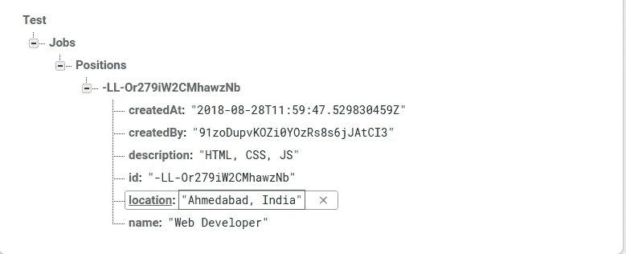

# 使用 GoLang 在 5 分钟内准备好您的 GraphQL 服务器

> 原文：<https://medium.com/hackernoon/graphql-with-golang-6e8da2054c25>


在脸书将其开源后，GraphQL 在过去几年中一直是一个热门词汇，所以我用 Node.js 尝试了 GraphQL，我完全同意关于 GraphQL 的所有讨论，它的优点和简单性。

最近，我在 Node.js 的新项目中使用了 Go-lang，并决定使用 Go-lang 来尝试 GraphQL。Go-lang 没有太多的库选项，但我已经尝试了这 4 个库。[雷霆](https://github.com/samsarahq/thunder)、 [graphql](https://github.com/graphql-go/graphql) 、 [graphql-go](https://github.com/graph-gophers/graphql-go) 、 [gqlgen](https://github.com/99designs/gqlgen) 。我不得不说，在我尝试过的所有库中，gqlgen 赢得了所有的地盘。

[在撰写本文时，gqlgen](https://github.com/99designs/gqlgen) 仍处于测试阶段，其最新版本为 [v0.4.4](https://github.com/99designs/gqlgen/releases/tag/v0.4.4) ，并且正在快速发展。你可以在这里找到他们的路线图。现在 99designs 正式赞助他们，所以我们将会看到这个令人敬畏的开源项目更快的发展速度。vektah 和 [neelance](https://github.com/neelance) 是这个的主要贡献者，neelance 之前也写过 [graphql-go](https://github.com/graph-gophers/graphql-go) 。

所以让我们深入研究一下库语义，假设你有基本的 graphql 知识。

# **亮点**

正如他们的标题所说

> 这是一个用于在 golang 中快速创建严格类型的 graphql 服务器的库。

我认为这是一个库最有前途的地方，你永远不会在这里看到，因为它使用了严格类型化的方法。

除此之外，它还使用了**模式优先的方法**:所以你可以使用 graphql [模式定义语言](http://graphql.org/learn/schema/)来定义你的 API，并且拥有自己强大的代码生成工具，可以自动生成你所有的 graphql 代码，你只需要实现接口方法的核心逻辑。

> 该版本现已被弃用。请关注这篇文章，了解最新的更新。

[https://medium . freecodecamp . org/deep-dive-into-graph QL-with-golang-d3e 02 a 429 AC 3](https://medium.freecodecamp.org/deep-dive-into-graphql-with-golang-d3e02a429ac3)

# 密码

因为这是一种模式优先的方法，所以让我们快速定义一个模式。我们以一个求职论坛为例。

现在库提供了 codegen 命令`gqlgen init`,它将为项目文件生成所有需要的文件

*   gqlgen . yml—gqlgen 配置文件，用于控制生成的代码。
*   generated . go——graph QL 执行运行时，生成的大部分代码
*   models _ gen . go-构建图形所需的生成模型。通常你会用你自己写的模型覆盖这些。对输入类型还是很有用的。
*   resolver.go —这是您的应用程序代码所在的位置。generated.go 将调用这个来获取用户请求的数据。

根据 docs stats，如果您不提供模型定义，它将自动生成模型，但在大多数情况下，您将编写自己的模型，因为您将对数据类型进行更细粒度的控制，并且您可以在需要时使用第三方结构(如您可以使用 AWS 或任何其他库的结构进行凭据、配置等)。

所以让我们覆盖生成`gqlgen.yml`文件:

这里我们给出了所有模型的路径。在`schema.graphql`文件中，我们已经定义了一个自定义标量`Timestamp`，所以我们需要告诉 graphql 如何封送和解封它们。

这里是我们的`models.go`文件，上面所有的结构都在这里定义:

现在，如果你已经注意到我们没有为`Timestamp`定义任何结构，只是为时间戳定义了编组和解组方法。所以这个库会处理这个问题，你只需要写这两个方法。

另一个需要注意的重要事情是，我们还没有为输入(`NewJob`和`NewApplication`)定义一个结构。因此，正如库所承诺的，它将根据`gqlgen.yml`文件中给定的配置在`models/inputs.go`中自动生成，并通知您不要编辑该文件。

现在，让我们来看看最重要的文件，那就是`generated.go`，它有所有神奇的代码，显然它有一个很长的文件，但是让我们来看看需要的代码。

snippet from generated.go

gqlgen 生成的另一个文件是`resolver.go`,您可以在这个文件中放置所有的逻辑。以下是自动生成的存根文件(对注释、格式和软件包更改进行了少许编辑)

现在你需要做的就是用这些方法写出你的逻辑。

我正在编写一个示例方法，在 Firebase 实时数据库的帮助下创建和获取所有作业。为了这篇文章的长度，你可以在这里找到来减少数据库代码。

现在让我们尝试一下，点击服务器，运行第一次变异

```
$ go run server/server.go
```



正如我们所看到的，在 Position 的节点下创建了一个作业(如数据库层中所配置的)，我们在 graphql 中也获得了相同的响应，并且具有新创建的 id。

现在让我们测试查询:


但是等等，哇！我们出错了。不要惊慌，因为 graphql 不知道如何从一个`CreatedBy` userId 中获取`CreatedBy`用户对象，所以我们需要为当前声明`panic(**“not implemented”**)`的对象实现解析器方法。

所以现在再次点击查询:


一切正常。

# 现在怎么办？

本文只是给出了一个如何在 golang 中实现 graphql server 的基本演示(我知道代码和结构可能会有很多变化)。这个代码在 [Github](https://github.com/ridhamtarpara/go-graphql-example/tree/feat/blog-1) 上。我将很快撰写文章来添加 Golang gqlgen 服务器 CORS、验证、认证和配置。直到那时快乐编码。

第 2 部分即将推出！