# 探索数据结构:图及其遍历算法

> 原文：<https://medium.com/hackernoon/graphs-in-cs-and-its-traversal-algorithms-cfee5533f74e>

绝大多数感兴趣的算法都是对数据进行操作的。因此，在算法的设计和分析中，有一些特殊的组织数据的方法起着关键的作用。由此，我们可以说数据结构只是组织数据的简单方式。

它们或者是线性的**或者是非线性的**。数组和链表是线性数据结构的例子。另一方面，图和树是非线性数据结构的形式。

*   例如，一种常见的数据结构是**列表**或**数组**，它们是有序的值序列。这里有一串数字:0，1，1，2，3，5，8，13。列表的概念并不局限于一种语言，它也用于日常生活中的编程之外——愿望列表、购物列表等等。

算法是逻辑执行问题的方法。它们不同于数据结构。如果算法工作得更快或更有效(使用更少的时间、内存或两者)，那么它们通常“更好”。

但是在本文中，所有的内容都是关于查看非线性数据结构:图

# 钻研图表

图是一个系统，其中从任意点 A 到另一个任意点 b 可能有多种方式。

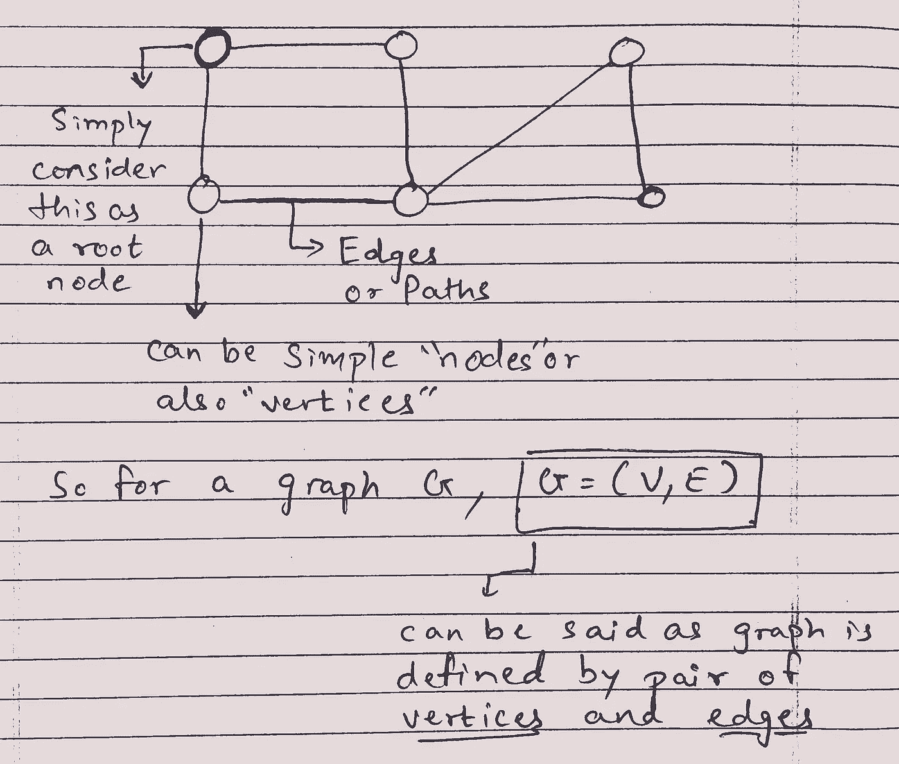

一个图通常被定义为一对集合(V，E)。v 是一组称为顶点或节点的任意对象，E 是一组成对的顶点，我们称之为边或(更少)弧。在无向图中，边是无序的对，或者只是两个顶点的集合。我一般写 **u v** 而不是{u，v}来表示 u 和 v 之间的无向边。

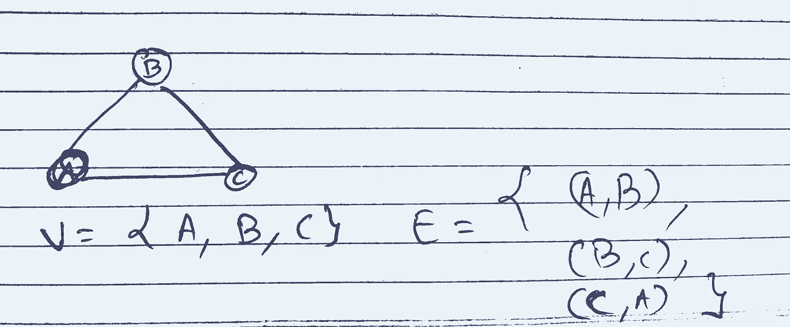

在有向图中，边是有序的顶点对。在本文中，我将使用 **u → v** 而不是(u，v)来表示从 u 到 v 的有向边，反之亦然。

图也可以是无向的或有向的，循环的或非循环的(大部分是有向的)，或者加权的。

# 遍历图形

为了访问作为连通分量的每个节点或顶点，使用了基于树的算法。通过遍历图中的所有顶点，对检查时仍未访问的每个顶点执行算法，可以很容易地做到这一点。

两种算法通常用于图的遍历:深度优先搜索(DFS)和广度优先搜索(BFS)。

## 深度优先搜索算法

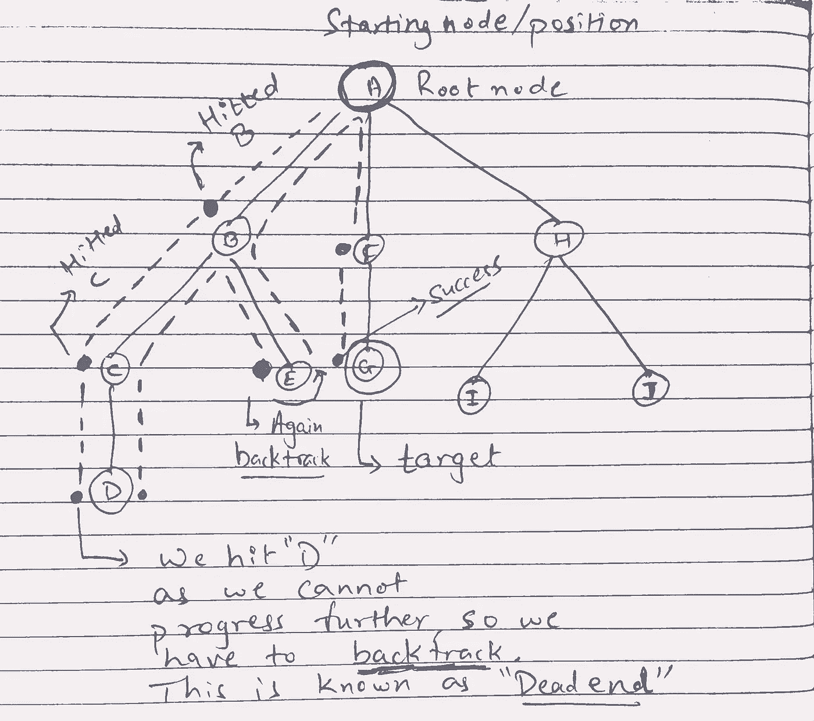

Visualizing DFS traversal

> 深度优先搜索(DFS)是一种用于搜索[图](https://brilliant.org/wiki/depth-first-search-dfs/(https://brilliant.org/wiki/graphs/))或[树](https://brilliant.org/wiki/trees-basic/)数据结构的[算法](https://brilliant.org/wiki/algorithm/)。该算法从树的根(顶部)节点开始，沿着给定的分支(路径)尽可能远地前进，然后回溯，直到找到未探索的路径，然后探索它。该算法一直这样做，直到整个图都被探索完。
> 
> 计算机科学中的许多问题都可以用图来思考。比如分析网络、绘制路由、调度、求生成树都是图的问题。为了分析这些问题，像深度优先搜索这样的图搜索算法是有用的。- [来源](https://brilliant.org/wiki/depth-first-search-dfs/)

最简单的伪代码是:

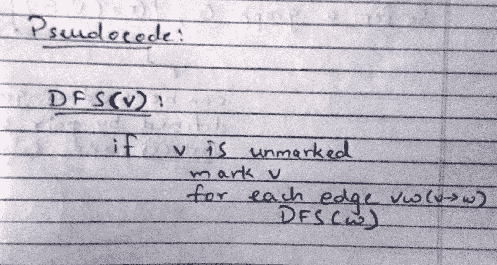

深度优先搜索是许多人在解决迷宫等问题时自然使用的一种常见方法。

首先，我们在迷宫中选择一条路径(为了这个例子，让我们根据我们事先制定的一些规则来选择一条路径),并沿着它走，直到我们走进死胡同或到达迷宫的尽头。如果给定的路径不起作用，我们回溯并从过去的交叉点选择一条替代路径，并尝试这条路径。

要把这个变成一个图遍历算法，我们基本上是用“邻居”代替“孩子”。但是为了防止无限循环，我们只想访问每个顶点一次。就像在 BFS 一样，我们可以使用标记来跟踪已经访问过的顶点，这样我们就不会再次访问它们。此外，就像在 BFS 一样，我们可以使用这种搜索来构建具有某些有用属性的生成树。

```
dfs(vertex v)
    {
    visit(v);
    for each neighbor w of v
        if w is unvisited
        {
        dfs(w);
        add edge vw to tree T
        }
    }
```

**下面是使用递归的 Python 实现:**

这是关于 DFS 如何工作的基本概述。如果你想深入研究，在互联网上和媒体上都有一些很棒的资料。

## 广度优先搜索(BFS)算法

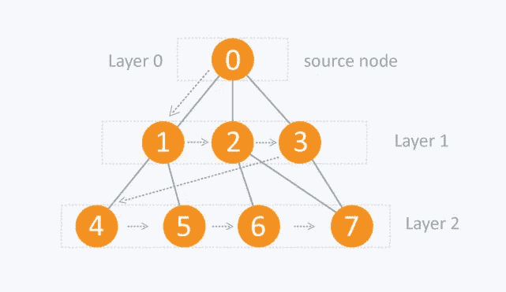

它从树根(或图中的某个任意节点，有时称为“搜索关键字”)开始，在移动到下一个深度级别的节点之前，探索当前深度的所有邻居节点。

这里唯一的问题是，与树不同，图可能包含循环，所以我们可能会再次来到同一个节点。为了避免多次处理一个节点，我们使用一个布尔访问数组。为简单起见，假设所有顶点都可以从起始顶点到达。

我们在 BFS 所做的是一个简单的逐步过程:

1.  从一个顶点 **S** 开始。设这个顶点在所谓的…“0 级”。
2.  找到从这个起始顶点 **S** 可以立即到达的所有其他顶点，也就是说，它们只有一条边之遥(相邻的顶点)。
3.  将这些相邻的顶点标记为“级别 1”。
4.  由于图中的循环或环，您可能会回到同一个顶点。如果发生这种情况，您的 BFS 将花费 **∞** 时间。因此，您将只去那些没有将“级别”设置为某个值的顶点。
5.  标记当前顶点的父顶点，即访问当前顶点的顶点。对级别 1 的所有顶点执行此操作。
6.  现在，找到所有那些离“级别 1”上的顶点只有一条边的顶点。这些新的顶点集将位于“级别 2”。
7.  重复这个过程，直到你用完图表。\

看这个—[https://www.programiz.com/dsa/graph-bfs](https://www.programiz.com/dsa/graph-bfs)

**使用队列的 Python 实现**

## 有向和无向图

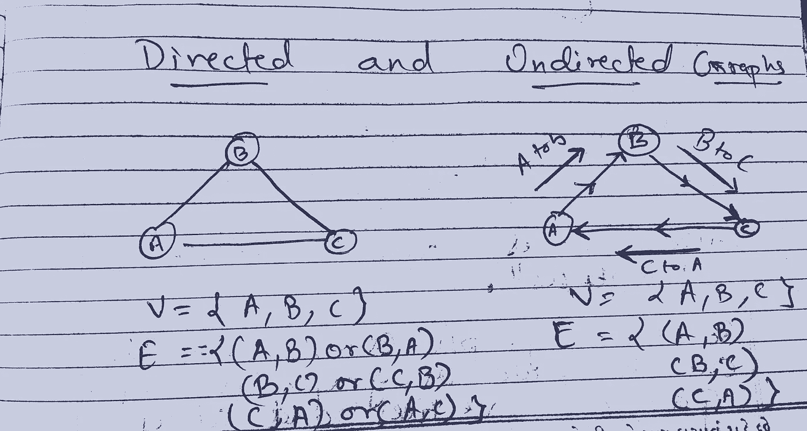

*无向图*是边没有方向的图。边缘( *x* 、 *y* )与边缘( *y* 、 *x* )相同。也就是说，它们不是有序的对，而是无序的对——即两个顶点的集合{ *x* ， *y* }(或者在[循环](https://en.wikipedia.org/wiki/Loop_(graph_theory))的情况下是 2-多重集)。没有回路的无向图的最大边数是*n*(*n*1)/2。

对于无向图中的任意边`u`和`v`，我们称 u 为 v 的邻居，反之亦然。一个节点的度是它的邻居数。在有向图中，我们有两种邻居。对于任何有向边 **u — > v** ，我们称 u 为 v 的前趋，v 为 u 的后继。

## 循环和非循环图

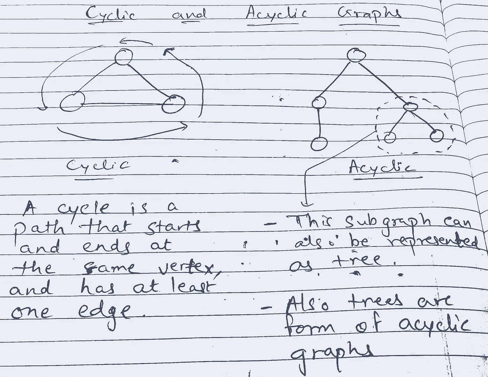

在图的许多性质中，有两个对于许多应用是重要的:连通性和非循环性。两者都基于路径的概念。

循环图是至少包含一个[图循环](http://mathworld.wolfram.com/GraphCycle.html)的图。**还要记住，循环图不能是树的形式，因为树的节点只能通过 DFS 或 BFS(遍历方法)访问一次。**

无环图是没有圈的图(一个圈是一个完整的回路)。当沿着图从一个节点到另一个节点时，您将不会两次访问同一个节点。

## 什么是有向无环图？

有向无环图是指有方向但没有环的无环图。

> 树是有向无环图的一种形式

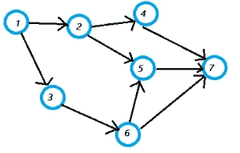

Source — [http://www.statisticshowto.com/directed-acyclic-graph/](http://www.statisticshowto.com/directed-acyclic-graph/)

上图的各个部分是:

*   [**整数**](http://www.statisticshowto.com/integer/) =顶点的集合。
*   **顶点集** = {1，2，3，4，5，6，7}。
*   **边集** = {(1，2)，(1，3)，(2，4)，(2，5)，(3，6)，(4，7)，(5，7)，(6，7)}。

有向无环图有一个**拓扑排序**。这意味着节点是有序的，因此起始节点的值低于结束节点的值。如果一个 DAG 具有包含所有节点的有向路径，则它具有唯一的拓扑排序；在这种情况下，排序与节点在路径中出现的顺序相同。

在[计算机科学](http://web.cecs.pdx.edu/~sheard/course/Cs163/Doc/Graphs.html)中，dag 也被称为*等待图*。当 DAG 用于检测死锁时，它说明资源必须*等待*另一个进程继续。

**我们如何检测图中的循环？**

事实证明，深度优先搜索算法特别擅长检测循环的原因是因为它在查找后向边缘方面很有效。我们将在本文后面研究 DFS 算法

## 邻接矩阵和邻接表表示

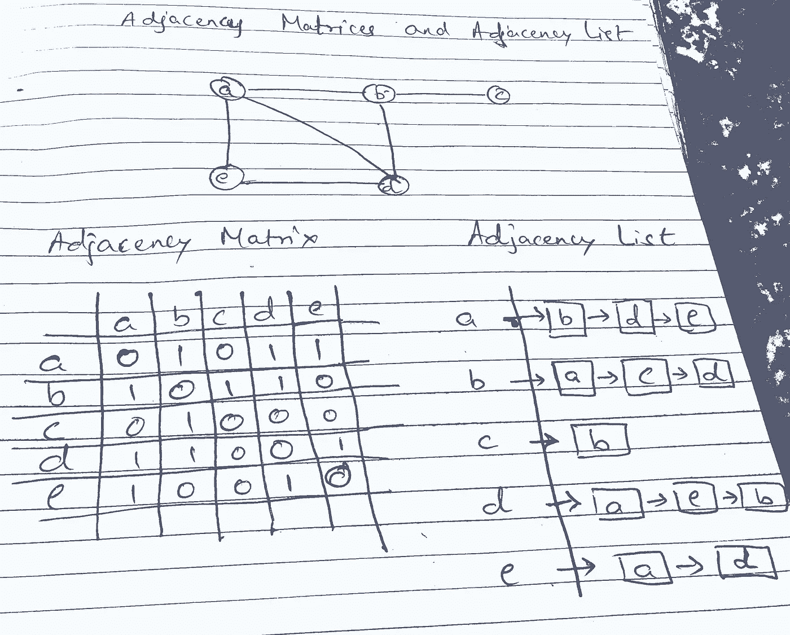

Consider this graph as example for understanding adjacency lists and adjacency matrices

如果图中有许多边，则使用边列表或邻接表来表示图来执行图算法会很麻烦。为了简化计算，图可以用矩阵来表示。这里将介绍两种常用于表示图形的矩阵。一种是基于顶点的邻接，另一种是基于顶点和边的关联。

给定一个邻接矩阵，我们可以在θ(1)时间内确定两个顶点是否由一条边连接，只需查看矩阵中合适的槽即可。我们也可以通过扫描相应的行(或列)来列出一个顶点在θ(V)时间内的所有邻居。

**从上面给定的图像中理解邻接矩阵…**

让我们来理解邻接矩阵是如何从上面给定的图像中构造出来的。为了简单起见，我只讨论了顶点“a”的情况。同样适用于所有顶点。

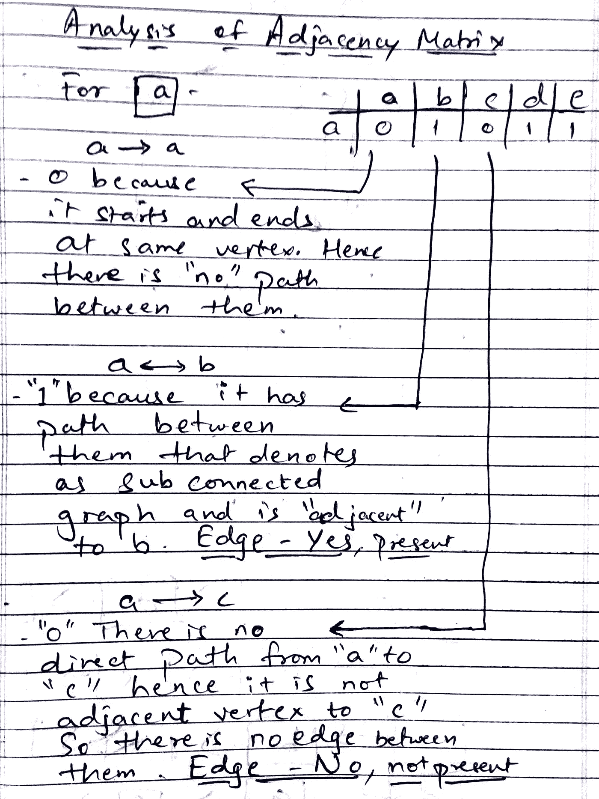

由于篇幅所限，我没有包括对 ***a → d*** 和 ***a → e.*** 的分析，因为从图像中我们可以得出结论，a → d 和 a → e 分别有一条边。

邻接表呢？

邻接表数据结构应该立刻让你想起带链接的哈希表；这两种数据结构是相同的。

邻接表是一个链表数组，每个顶点一个链表。每个链表存储相应顶点的邻居。

**为例** `**a**` **顶点有边通向邻居为例** `**b,d and e**` **。所以它各自的链表包含通过边连接的顶点。**

> 提醒→对于无向图，每条边(u，v)存储两次，一次在 u 的邻居列表中，一次在 v 的邻居列表中；对于有向图，每条边只存储一次。

## 加权图

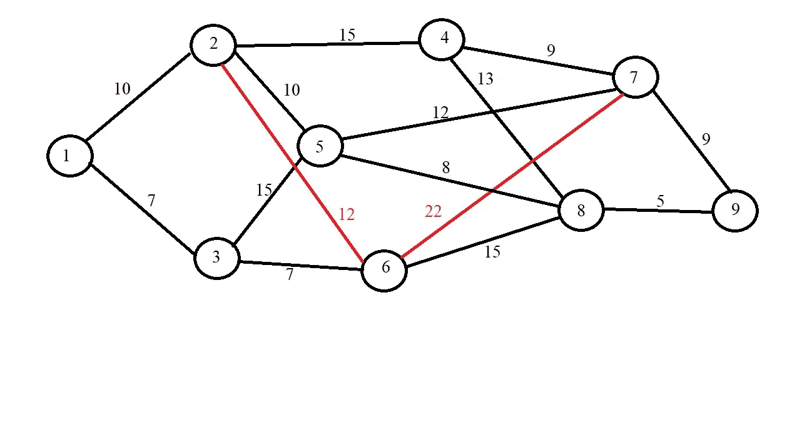

Weighted graph. Source — [https://cs.stackexchange.com](https://cs.stackexchange.com)

加权图(或称加权有向图)是一个图(或称二向图),它的边都有编号。这些数字被称为重量或成本。对这种图的兴趣是由许多现实世界的应用激发的，例如在运输或通信网络中寻找两点之间的最短路径，或者[**旅行推销员问题**](https://en.wikipedia.org/wiki/Travelling_salesman_problem) **。**

## 现实生活中的图表示例

谷歌地图——这只是一个大图！其中**边代表街道，顶点代表十字路口。**

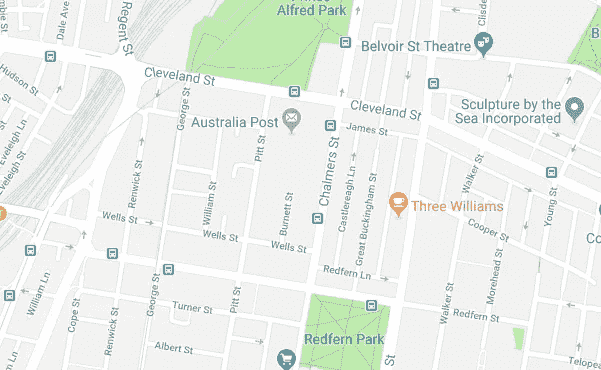

图论是互联网的基础。它在网络代码中被大量使用(构建路由表等)，但它出现在各种场合，如构建互联网搜索引擎或社交媒体平台。

## 对于深入研究树，这篇文章是我选择的首选之一—[https://medium . freecodecamp . org/all-you-need-to-know-about-tree-data-structures-BCE ABC 85490 c](https://medium.freecodecamp.org/all-you-need-to-know-about-tree-data-structures-bceacb85490c)

# 最重要的事实:

*   所有的树都是图。不是所有的图都是树。
*   树是一种图，只有当它是连通的。例如，由顶点 A 和 B 组成的没有边的图不是树，尽管它是一个无环图。
*   单个顶点也被认为是树(没有圈，空连接)。所以两个不相连的顶点组成了两棵树的森林。
*   树是一种特殊的图，在那里从来没有多条路径，对于 A 和 B 的所有可能组合，从 A 到 B 总是只有一条路。


Shot — [https://dribbble.com/shots/3152667-Astronaut-Glove](https://dribbble.com/shots/3152667-Astronaut-Glove)

资源:

[](https://brilliant.org/wiki/depth-first-search-dfs/) [## 深度优先搜索(DFS) |卓越的数学和科学维基

### 深度优先搜索(DFS)是一种用于搜索图形或树数据结构的算法。算法从根开始…

brilliant.org](https://brilliant.org/wiki/depth-first-search-dfs/) [](https://www.geeksforgeeks.org/) [## 极客论坛|极客的计算机科学门户

### 极客的计算机科学门户。它包含写得很好，很好的思想和很好的解释计算机科学和…

www.geeksforgeeks.org](https://www.geeksforgeeks.org/) [](https://www.khanacademy.org/computing/computer-science/algorithms/) [## 算法|计算机科学|计算|可汗学院

### 我们与达特茅斯学院教授汤姆·科尔曼和德文·巴尔科姆合作教授计算机科学导论…

www.khanacademy.org](https://www.khanacademy.org/computing/computer-science/algorithms/) [](https://www.hackerearth.com/practice/algorithms) [## 线性搜索教程和笔记|算法|黑客地球

### 关于线性搜索的详细教程，提高你对算法的理解。也尝试练习问题来测试&…

www.hackerearth.com](https://www.hackerearth.com/practice/algorithms) 

[http://www.cs.uiuc.edu/~jeffe/teaching/algorithms](http://www.cs.uiuc.edu/~jeffe/teaching/algorithms)