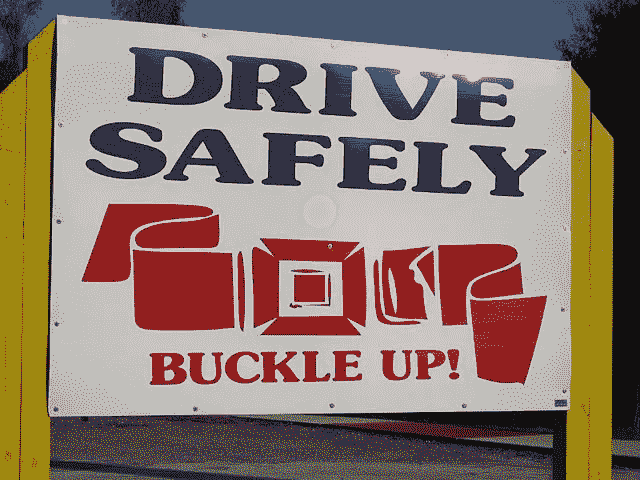

# 伟大的工程师会练习防御性沟通

> 原文：<https://medium.com/hackernoon/great-engineers-practice-defensive-communication-4a53efe06e70>

多年来与我共事的优秀工程师总是有一个共同点——他们更喜欢精确的沟通。我也是。

优秀的工程师会要求需求和规范被准确地表达出来，然后确保它们完全符合所有的标准。但是伟大的工程师会防御性地交流。

> 我不是指“这不是我的错”这种防御性的，我是指防御性驾驶。

作为一名工程师，将[工程](https://hackernoon.com/tagged/engineering)思维应用到你周围发生的几乎所有事情中是非常自然的——我们实际上已经看到这在非工程学科中产生了巨大的结果，如销售、营销和筹款，甚至是 PeopleOps(我的意思是，拜托，PeopleOps 完全是一个工程术语)

> 我看到工程思维一次又一次失败的地方是在**工作场所交流中，**，我第一个承认，从我记事起，我可能每天至少有一次**失败**。

然而，对我来说，最大的改进来自于一个简单的实现。

> 如果你想设计精确的交流，你必须练习防御性的交流。

我曾经犯过的最大的错误之一是假设传入的信息是“事实，全部事实，除了事实什么都没有”——也就是我“需要知道”或者“需要做”的事情。

> 我以为我得到的是一个永远完美的规范。

如果我是一名司机，那就像假设每个人总是在红灯时停下来。你不能想当然地认为，如果你想安全驾驶，你仍然要看路，纠正其他司机的错误，以避免事故的发生。

这是防御性驾驶的基本思想——假设其他司机总是犯错误，但不是在你的挡风玻璃上画一个巨大的中指，而是在你开车时防御性地预测并检查他们。

如果每个人都这样做，事故的数量就会大大减少。

我在工程团队中看到的几乎所有沟通事故都可以简单地归结为这样一个事实，即相关人员没有进行防御性的沟通。

如果第一个司机假设第二个司机会注意他们的后视镜，一些事故就发生了。

如果第二个司机认为第一个司机在转弯前总会打闪光灯，一些事故就会发生。

但是如果双方都认为对方不安全，那么它就一定是安全的。

## 这里有一个工程通信事故的例子

PM:这个特性应该保证 A=B and B=C

工程师:好了，完成了

PM:你的代码很草率，因为 A 不等于 C！

工程师:这不在规范里。这是你的错。

PM:这是你的错。你应该从说明书中推断出 A=C。

## 这是同一通信的防御版本。

PM:这个特性的目标是确保 A、B 和 C 都相等。所以我们需要检查 A=B，B=C，C=A，也许更多，这取决于你选择如何实现它。

工程师:完成了。因为您指定的检查没有假定顺序很重要，所以我也保证相反的情况，比如 B=A，因为我希望这是项目的既定目标的一部分，即使它被排除在规范之外。如果不是这样，请告诉我。

PM:太好了，谢谢你抓住了它！

你同意这种交流方式吗？让我知道你的想法。

**关于作者:** Vinayak 是[选秀](http://explore.drafted.us)，引荐[网](https://hackernoon.com/tagged/network)的创始人兼 CEO。你可以在 [LinkedIn](http://linkedin.com/in/vinayakranade) 和[选秀博客](http://blog.drafted.us)上找到他的其他文章