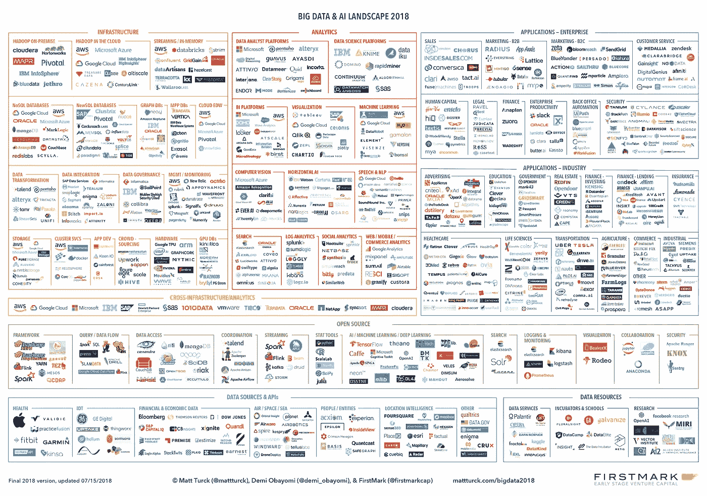
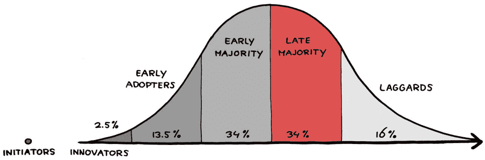

# 强大的力量，巨大的责任:2018 年大数据和人工智能格局

> 原文：<https://medium.com/hackernoon/great-power-great-responsibility-the-2018-big-data-ai-landscape-6a35bcf34f7f>

对于数据世界来说，这是激动人心但又复杂的一年。

正如去年的[，数据技术生态系统继续“全速运转”。如果没有其他事情，数据可能在 2018 年更加突出，无论是在商业还是个人对话中。然而，一些原因已经改变了。](http://mattturck.com/bigdata2017/)

一方面，数据技术(大数据、数据科学、机器学习、人工智能)继续前进，变得越来越高效，也越来越广泛地被世界各地的企业所采用。2018 年迄今为止，企业界的一个关键主题是“**数字化转型**，这并非偶然。这个术语可能对一些人来说很奇怪(“这不就是过去 25 年发生的事情吗？”)，但它反映了许多更传统的行业和公司现在正全力投入到他们成为真正的数据驱动的旅程中。

另一方面，越来越多的公众已经意识到数据的陷阱。无论是通过关于人工智能的[风险的公开辩论，剑桥分析公司丑闻，大规模的 Equifax 数据泄露，与 GDPR 有关的隐私讨论，还是关于中国政府越来越多的监控的报道](https://www.nytimes.com/2018/06/09/technology/elon-musk-mark-zuckerberg-artificial-intelligence.html)，数据世界已经开始揭示一些**更黑暗、更可怕的潜台词。**

两者都是同一现象的另一面，这一现象已经酝酿多年，但现在已经完全展现出来:几乎所有东西(无论是个人还是职业)都在迅速数字化，数据技术在处理和分析这一海量数据方面变得比以往任何时候都更加熟练，而且越来越实时。由此可以产生魔法和虐待。关于如何将这种强大的力量与必要的责任感结合起来的辩论变得至关重要。

让我们来强调一下 2018 年的一些主要趋势和事件。

**基础设施&分析**

从行业角度来看，数据生态系统仍然像以往一样令人兴奋和充满活力，有丰富的创新创业公司、成熟的“规模化企业”和许多积极的公共技术供应商。最重要的是，许多大大小小的客户都**在大规模生产中**部署**这些技术**，并从他们的努力中收获不可否认的价值。

随着用更现代的数据产品替换旧 IT 技术的循环继续，大数据市场(基础架构、分析)似乎正在经历早期大多数买家的循环，并过渡到传统采用曲线的后期大多数。

此外，数据世界继续不可阻挡地向云发展。考虑到大型公共云提供商(AWS、Azure、Google Cloud Platform、IBM)每个季度都创造了数十亿美元的收入，他们的增长速度之快确实令人震惊。这一趋势引发了围绕**供应商锁定**的持续担忧，这可能为提供**云计算**解决方案的初创公司带来机遇。然而，迄今为止，即使是采用云计算战略的公司也倾向于依赖一家供应商作为其主要提供商。

随着他们的不断增长，大型云提供商通过他们的平台(例如，Amazon Neptune、Google AutoML 等)提供各种大数据、数据工程和机器学习工具，从而日益相互竞争。)——而且往往以激进的定价，来吸引更多的开发者，因为他们真正的商业模式是数据存储。随着此类工具的范围和复杂性不断增长，这对数据技术格局产生了巨大影响，可以说创业公司的**竞争**变得更加困难，至少对于广泛的横向机会来说是如此。每年，在大型年度云供应商会议上发布的产品清单(例如，见 AWS [re:Invent](https://aws.amazon.com/new/reinvent/) )都会给创业行业带来冲击波，因为它们让云供应商一举与数十家风投支持的创业公司展开直接竞争。看看公众市场对即将到来的 Elastic IPO 的反应会很有趣，Elastic 是一家开源软件公司，三年前亚马逊推出了直接竞争对手 Elasticsearch。

然而，只要足够差异化，初创公司仍有大量机会。该领域的许多公司正在快速扩展，生态系统的基础设施和分析部分有许多特别有趣、快速增长的细分市场，包括**流**/实时、**数据治理**和**数据结构/虚拟化**。对人工智能的兴趣的爆发也导致了在**人工智能芯片**、 **GPU 数据库**、**人工智能开发工具**以及支持在企业中部署**数据科学和机器学习的平台方面的巨大机遇(和大量资金)。**

**机器学习&人工智能**

在人工智能研究领域，这无疑是疯狂的一年，从 AlphaZero 的高超技术到新进展的惊人发布速度——新形式的生殖对抗网络、Vicarious 的新递归皮层网络、Geoff Hinton 的新胶囊网络。像 NIPS 这样的人工智能会议已经吸引了 8000 人，每天都有数千篇学术论文提交。

与此同时，对 [AGI 的追击仍然难以捉摸](http://mattturck.com/frontierai/)，也许谢天谢地如此。当前关于人工智能的兴奋(和恐惧)浪潮很大程度上源于 2012 年以来深度学习的令人印象深刻的表现，但在人工智能研究社区，有一种**越来越强烈的“现在怎么办？”**一些人质疑深度学习(反向传播)的基础，另一些人则希望超越他们认为的“暴力”方法(大量数据，大量计算能力)，或许更有利于基于神经科学的方法。

人工智能研究界的许多人非但不担心机器人统治世界，反而担心对该领域的持续过度宣传最终可能会令人失望，并导致另一个人工智能核冬天。

然而，在人工智能研究之外，我们刚刚开始在现实世界中部署和应用深度学习，解决不同行业中涉及语音识别、图像分类、对象识别和语言的各种问题。如果生态系统的基础设施和分析部分正在成为后期的大多数，那么我们仍然处于企业和垂直人工智能应用的早期采用者领域。

一两年前开始的基于深度学习的初创公司的寒武纪大爆发基本上没有减弱，尽管人工智能初创公司市场(可以说)显示出最终降温的迹象。预期、回合规模和估值仍然很高，但我们肯定已经过了大型互联网公司仅仅为了人才而高价收购非常早期的人工智能初创公司的阶段。空气也变得清新了一些，揭示了“真正的”人工智能初创公司，而不是一些利用炒作的其他公司。一些在 2014-2016 年时间框架内成立的人工智能创业公司开始达到早期规模，许多公司正在提供越来越有趣的跨行业和垂直领域的产品**，包括健康、金融、“工业 4.0”和后台办公自动化。未来几年，深度学习将继续为现实世界的应用带来大量价值，专注于垂直领域的人工智能初创公司面前有许多巨大的机会。**

**这种持续的爆炸在很大程度上是一种全球现象，其中加拿大、法国、德国、英国和以色列尤为活跃。然而，**中国在人工智能方面似乎处于完全不同的水平**，有报道称，政府主导的数据汇集规模令人难以置信(跨互联网公司和市政当局)，面部识别和人工智能芯片等领域的快速发展，以及初创公司的巨额融资:根据 CB Insights 的数据，2017 年中国仅占全球人工智能交易份额的 9%，但占全球人工智能资金的近 48%，高于 2016 年的 11%(见下文一些例子)。**

**同样，**数据隐私**(以及所有权和安全性)问题正在成为全球关注的焦点。在互联网的早期，数据隐私是关于保护我们在网上所做的事情，这是我们活动中相对较小的一部分。相应地，只有一小部分人(尽管直言不讳且充满激情)真正关心。随着越来越多的互联设备将我们个人和职业生活的方方面面都与互联网联系在一起，利害关系也在发生变化。凭借其在海量数据集中发现异常、预测结果和识别人脸的能力，**人工智能正在加剧数据隐私问题。****

**一个独立但相关的担忧是，这些数据中有很多是由大型互联网公司(GAFA)拥有的。有些人，如脸书，被证明是不太完美的管家。尽管如此，这些数据为他们在生产更强大的人工智能的竞赛中提供了不公平的优势。**

**针对这些问题，一个新出现的主题是将**区块链视为对抗人工智能**风险的可能手段，以及 GAFA 以外的其他人产生伟大人工智能的一种方式。加密经济学被视为一种激励个人提供个人数据的方式，也是机器学习工程师通过匿名处理这些数据来建立模型的方式。这一切仍处于实验阶段，但一些早期的市场和网络正在出现**

****2018 年的风景****

**事不宜迟，以下是我们 2018 年的展望。**

**相当语义注释:术语来来去去。谈论“大数据”的人越来越少，谈论“人工智能”的人越来越多，这往往是为了描述同样的现实。因此，我们对 2018 年的前景进行了轻微的重新命名:现在称为“大数据和人工智能”前景！**

****

**要以全尺寸观看风景，[点击这里](http://mattturck.com/wp-content/uploads/2018/07/Matt_Turck_FirstMark_Big_Data_Landscape_2018_Final.png)。**

**(这张图片是高分辨率的，应该可以放大，包括在手机上)**

**要下载全尺寸图像，[点击此处](http://mattturck.com/wp-content/uploads/2018/06/Matt-Turck-FirstMark-Big-Data-Landscape-2018.png)。**

**要查看电子表格格式的完整公司列表，[请点击此处](http://dfkoz.com/big-data-landscape/)。**

**今年，我的第一马克同事[黛米·奥巴约米](https://twitter.com/demi_obayomi)在景观方面提供了巨大的帮助。**

**我们已经在这篇文章的注释中详细介绍了我们的一些方法。欢迎你的想法和建议——请在评论区评论这篇文章。**

****谁进谁出****

**在出口方面，去年(自 2017 年以来)表现稳健，但并不特别强劲。**

**一些关键公司上市了，特别是 Cloudera、MongoDB Pivotal 和 Zuora。其他的在这个写的时候都在准备出门，比如弹力。**

**还发生了一些引人注目的收购，特别包括 Mulesoft(上市后被 Salesforce 以 65 亿美元收购)、Flatiron Health(被 Roched 以 21 亿美元收购)、Appnexus(被美国电话电报公司以 16 亿美元收购)、Syncsort 和 Vision Solutions(被 Centerbridge Partners 以 12 亿美元收购)、Moat(被甲骨文以 8.5 亿美元收购)、Integral Ad Science(被 Vista Equity Partners 以 8.5 亿美元收购)、eVestment(被纳斯达克以 7.05 亿美元收购)和 Kensho(被 S&P 全球以 5.5 亿美元收购)。值得注意的是，除了 Mulesoft，所有这些公司的总部都在东海岸(纽约、波士顿和亚特兰大)。**

**许多其他公司也以较小的金额被收购:Gigya (SAP)、Blue River Technology (Deere & Co)、CoreOS (Red Hat)、Guavus (Thales)、Lattice Data(苹果)、Socrata(泰勒科技)和 PracticeFusion (AllScripts)。**

**在投资方面，今年是一些大数据和人工智能初创公司进行大规模融资的一年，特别是在中国，其中包括 byte dance(2017 年两轮共投资 3B)、NIO(2017 年两轮共投资 16 亿美元)和 sense time(2017 年和 2018 年两轮共投资 8.5 亿美元)。**

**出现在风景中的主要几轮美国公司包括雪花计算(2.63 亿美元 A 轮——见我们最近在数据驱动的纽约[的](http://firstmarkcap.com/driven/data-driven/)[炉边谈话](https://www.youtube.com/watch?v=cR_4AOKo8YA))、Cohesity(2.5 亿美元 D 轮)、Dataminr(2.21 亿美元 E 轮)、Affirm(2 亿美元 E 轮)、Rubrik(1.8 亿美元 D 轮)、qual trics(1.8 亿美元 C 轮——见一个更老但仍然相关的[炉边谈话](https://www.youtube.com/watch?v=uJd3M5ySjHc)在数据驱动的纽约)、Tanium(1.8 亿美元私募股权轮)、thought spot(1.**

**____________________**

**注意事项:**

**1)和每年一样，我们不可能在图表上列出我们想要的所有公司。虽然该图表的总体理念是尽可能地包容，但我们最终不得不有所选择。我们的方法当然不完美，但简单来说，主要标准如下:**

*   **在同等条件下，我们优先考虑那些已经达到一定市场重要性水平的公司。对于大型科技公司来说，这是一项相当简单的工作。对于成长中的初创公司，考虑到可用的数据量有限，我们经常使用风险资本融资作为潜在市场牵引力的代理(同样，可能不完美)。因此，在其他条件相同的情况下，我们倾向于选择融资额较高的初创公司，通常是首轮融资或更高融资。**
*   **偶尔，当我们认为早期创业公司特别有趣时，我们会做出编辑决定，纳入它们。**
*   **在应用方面，我们优先考虑那些明确利用大数据、机器学习和人工智能作为其产品关键组成部分或差异化因素的公司。正如文章中所讨论的，在公司越来越多地围绕人工智能信息进行营销的时候，这是一项棘手的工作，但我们尽了最大努力。**
*   **今年和前几年一样，我们撤掉了一些公司。移除的一个关键原因是公司被收购，而不是由收购方作为一个独立的公司运营..在某些特定情况下，当我们认为品牌将作为一个合理的独立产品从收购公司中保留下来时，我们会让被收购公司保持不变。**

**2)一如既往，我们在整理这张图表的过程中，难免不经意间漏掉了一些伟大的公司。我们错过你的了吗？欢迎在评论中加入你的想法和建议。**

**3)图表为 png 格式，缩放时应保持整体质量，包括在移动设备上。**

**4)由于我们每年都会收到很多请求:请随意在书籍、会议、演示文稿等中使用图表——两个明显的要求:(1)不要更改/编辑图表；(2)请提供明确的归属(马特·图尔克、黛米·奥巴约米和 FirstMark Capital)。**

**5)免责声明:我是 FirstMark 在这个大数据领域提到的许多公司的投资者，具体来说:ActionIQ、蟑螂实验室、Dataiku、Frame.ai、Helium、HyperScience、Kinsa、Timber、Sense360 和 x.ai。本图表中提到的其他 FirstMark 投资组合公司包括 Bluecore、Engagio、HowGood、payroll、Knewton、Insikt、Optimus Ride 和 Tubular。我是 Datadog 的小股东。**