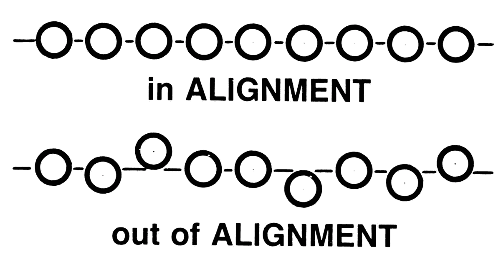
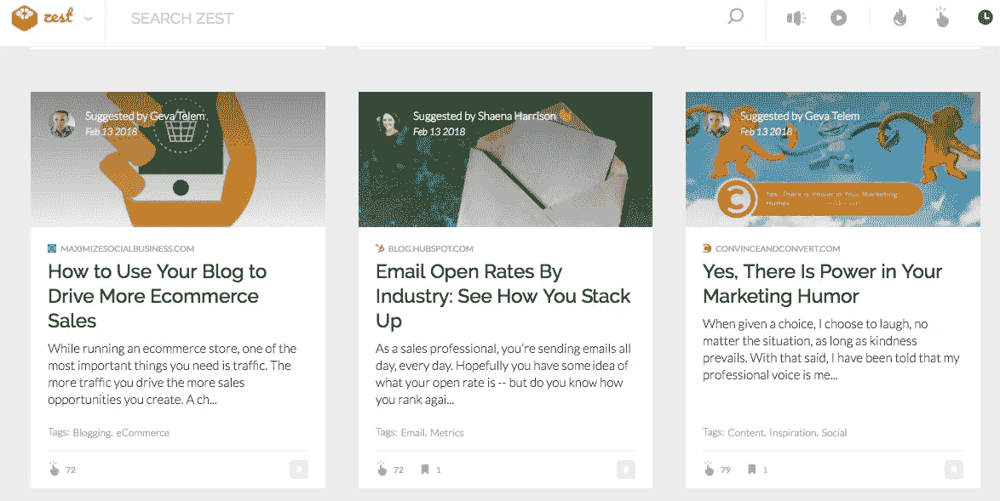

# 伟大的产品符合现有的行为

> 原文：<https://medium.com/hackernoon/great-products-align-with-existing-behaviors-54f5a273cebc>

## 你可以带来尽可能多的创新，但是如果你想要被接受，你需要融入你的观众的生活。



It all comes down to this one simple word.

在过去的几个月里，我一直在使用一个令人惊叹的 Chrome 扩展。 [Yam Regev](https://medium.com/u/cda2e9cf8d4?source=post_page-----54f5a273cebc--------------------------------) 和他的乐队 misfits 不久前推出了 Zest，自从我发现它，我就爱上了它。它的工作原理非常简单——每次我在 Chrome 中打开一个新标签，它都会向我显示一堆 marketeers 与社区分享的有趣文章。



A screenshot from today’s zest screen.

最近，我的 Zest feed 充满了关于人工智能和机器学习的故事。这是所有的嗡嗡声，今天所有的时尚。在过去的六个月里，我遇到了至少几十家对人工智能感兴趣的初创公司。AngelList 上列出了超过 4000 家初创公司，他们正在这个领域做着这样或那样的事情，如果你看看他们一直在做的一些工作，这真的令人麻木。但是，就像任何其他业务领域一样，许多有前途的初创公司过不了多久就会倒闭。许多人会努力寻找适合市场的产品，许多人会在开始获得可持续的收入流之前死去，而且他们中的许多人最终会感到沮丧，想知道为什么他们的潜在客户看不到他们提供的巨大价值——在他们看来，这是如此明显！

这是我们在许多产品公司看到的问题。惊人的产品，但反应冷淡，充其量。为什么？三个主要原因:

1.  **试图解决一个根本不存在的问题，或者问题还不够多。如果这个问题还没有成为我的眼中钉，我认真对待它的可能性会更低——这是事实。因为任何时候你经过我身边，我的身体都会有一跳一跳的疼痛。总有一个更大的痛点占据了我大部分的思维空间。与我暂时可以选择忍受的问题相比，我更关心解决的事情。或者更糟的是，在你让我意识到这是一个问题之前，我甚至没有意识到这是一个问题。你需要设身处地地为你的顾客着想，用他的眼光看待生活。如果他有更重要的事情要处理，他总是会先做。**
2.  **没有很好地定位你的产品。**我见过很多产品公司谈论他们的产品——它能做什么，它有多神奇，它会让你笑逐颜开。你怎麽知道？你怎么知道我已经不笑了？如果你没有强调我明显的疼痛区域，你怎么能做出这样的假设？要么这么做，而且要做好，要么冒着无法让我为你隆重推出解决方案而兴奋的风险。
3.  **这不是正确的推销方式。**谈论你的产品，或者解释它是如何工作的，都不是推销——你只是在极客化。销售就是生意，你需要用那种方式去做。如果你希望有人付给你一美元，你需要确保他们坚信他们所购买的东西的价值:(a)时间——帮助他们减少花在他们经常做的任务上的时间**。经常——这非常重要。如果你要帮我在一个月只做一次的任务上节省哪怕 60%的时间，你在浪费我 10 分钟的时间，这远远超过了我所关心的。(b)效率/精密带宽--。你需要调整你的推销方式，让我为你的产品成为我生活的一部分而感到兴奋。它帮助我减轻早晨的压力，这样我就可以享受早晨的咖啡了。它帮助我赚更多的钱，因为它帮助我回答我的客户问我的问题。**
4.  ****焦点不对。企业倾向于仔细倾听每一个对他们正在做的事情感兴趣的企业所有者和利益相关者。那太好了；企业家应该总是寻求反馈，最重要的是，倾听他们的目标受众。但是为了获得早期的牵引力，有时会产生多个产品的 MVPs 一个与另一个完全不同。这是我强烈反对的。如果你不能用简洁明了的方式向你的观众解释你在做什么，你会一直纠结于把你的品牌定位为解决问题的权威。此外，一旦你的注意力分散在几个产品上，没有一个产品会像它本来应该的那样发展。所以，选择一种产品，并坚持下去。不要做那个让航空公司日子好过的人。从为他们解决一个(也是唯一一个)问题开始，并且做得非常好。你想推出其他产品吗？当然可以。但是一旦你建立了权威、专业知识和统治地位，就要这么做。****

**就在昨天，我与一家初创公司的创始人进行了交谈，他们为零售商提供了一个简单而优雅的解决方案，来衡量和隔离他们商店的客流量。怎么会？利用那里已有的闭路电视摄像头。他们的解决方案可以准确地告诉你——*——有多少顾客走进了商店，他们的性别、年龄组以及他们的整体情绪状态。*我对最后一个有点怀疑，但即使只有前三个有效，这对各地的零售商来说也是一个不可思议的增值，我认为这样一个系统的潜在应用不仅仅局限于零售商。****

## ***我喜欢他们产品的什么？***

***它的简单性。这是一个不需要过多解释的产品。它为零售商提供了一个价值——以令人惊讶的直观方式分离和分析他们的客流量。***

## ***为什么我认为他们的产品很棒？***

***因为，即使作为一个局外人，我知道零售商已经在使用流程来记录他们店里的客流量。一些零售商会使用简单的手动点击计数器来记录每小时进入他们商店的人数。因此，作为一个产品，零售商将(a)看到这样一个系统的价值，(b)欣赏这个产品如何做他们已经做的事情(没有让服务员准确地做这件事的麻烦*)，然后在它上面添加更多的价值(*性别隔离，与历史数据的实时比较分析，如果与外部原因相关*)，提前预测客流量。****

## ****只是针对零售商吗？****

****我不这么认为，但这是一个很好的起点。****

****可以这样想——任何你可以看到细分消费者群带来的价值的线下业务，都有真正的应用。天空是无限的。以餐馆为例。如果我知道什么样的人在什么时候经过，并且我将它映射到不同细分市场中受欢迎的菜单项，我就可以更好地准备我的厨房，储备供应品并缩短等待时间。我甚至可以把我的菜单分解成更小的子菜单，然后拿出相关的菜单给坐在桌子旁边的人。更集中的菜单，更少的选择困惑，更好的转化率，更高的利润。****

****做好这几件简单的事情，你就离找到适合市场的产品和拥有一个健康的公司又近了一步。****

********

```
**[**Medium**](/@abyshake) **|** [**Twitter**](http://twitter.com/@abyshake) **|** [**Facebook**](http://facebook.com/abyshake) **|** [**Quora**](http://bit.ly/abyshake) **|** [**LinkedIn**](http://in.linkedin.com/in/abyshake) **|** [**E-mail**](mailto:mail@abyshake.com)**
```

****[](https://upscri.be/a5ccb9/)

Click here to join the mailing list.****