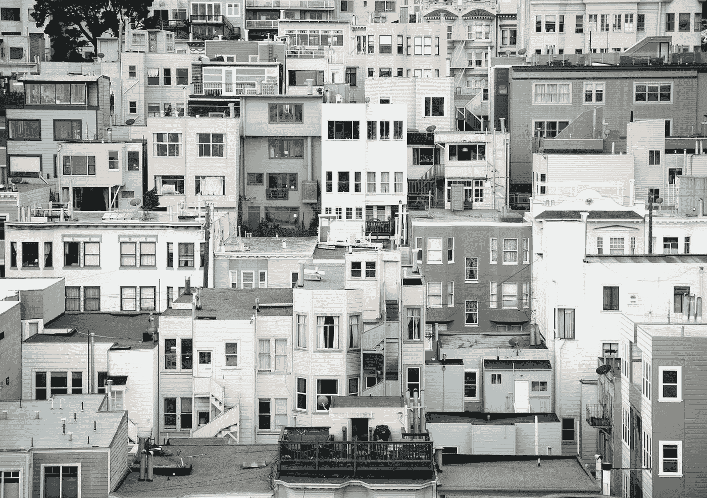
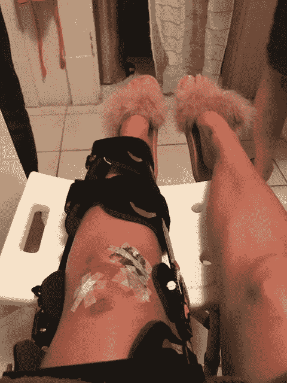
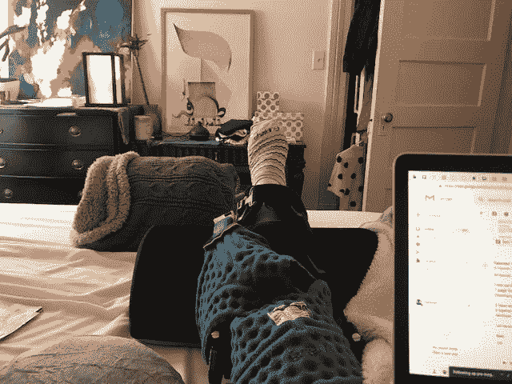
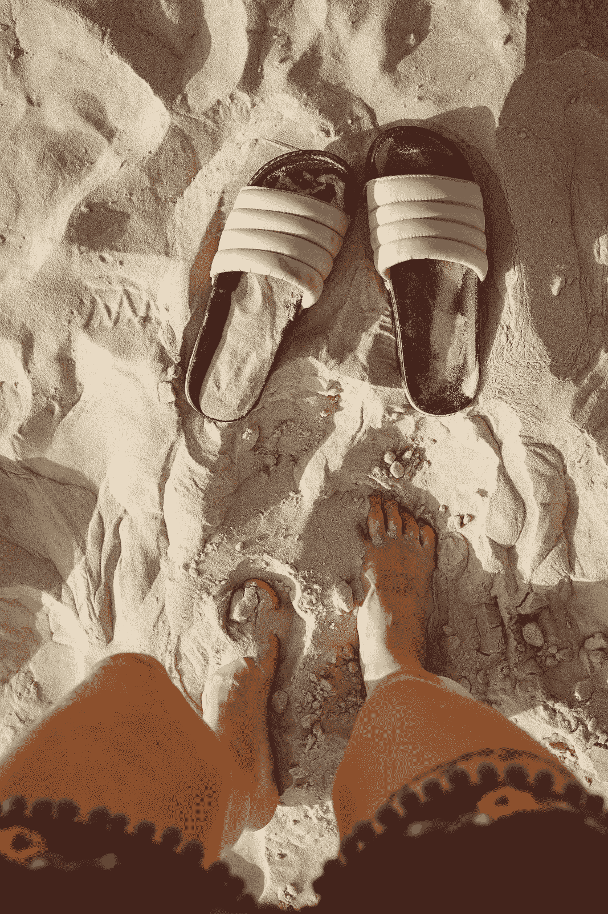

# 停飞旧金山；一个关于膝盖手术和更多的故事

> 原文：<https://medium.com/hackernoon/grounded-in-san-francisco-a-story-about-knee-surgeries-and-more-f3d96af186b6>

## **2018 年 9 月 23 日**

*“就是它了。我要死了”。*这是我崩溃前的最后一个想法。

我多年来第一次在多洛雷斯公园骑自行车(我更像是一个跑步者，也是 Classpass 工作室的爱好者)，几秒钟后，我发现自己陷入了困境:一辆车从我身后驶来，我被困在了电车轨道之间。怎么办；**选项 A** :被我后面的车碾过，**选项 B** :我试着骑自行车穿过铁轨。

我试着做后者。事情就在那时发生了。80 磅重的电动跳跃自行车将我从座位上弹射到空中，当它落在我身上时，我砸到了地上——压碎了我的右肋骨，我的左膝软骨严重暴露。

天哪，我尖叫道。疼痛难以忍受。我抓住我的膝盖，希望我能扭转最后几分钟。接下来发生的事情感觉就像电影一样:汽车停下来，人们出来帮忙。他们提出要叫救护车。我爬到人行道上，感谢我在最后一刻抢到的头盔，并思考着我接下来的步骤。

在我 20 多岁的时候，我是一个相当爱冒险的人；我踢足球，在瑞士阿尔卑斯山跳悬崖，尽情地跳伞，爬了几个小时的山顶，还参加了奥林匹克铁人三项赛。我对疼痛的忍耐力相当高，我想，不，我不需要救护车。我也不想支付高得离谱的费用，因为我知道他们可能除了清理我裂开的伤口什么也做不了。

我可以在自己的公寓里创建一个小型创伤诊所来治疗这种深度创伤。我真正需要的是 x 光和核磁共振。我需要知道我打破或撕裂了什么。我决定最好的下一步是在旧金山找一位顶尖的整形外科医生，并在第二天预约。

因为我是一名产品营销人员，并以发布软件产品为生，所以我花了很多时间在网上，并开玩笑地承认，当我在研究一些东西时，我会走到互联网的尽头。我是那种在购买产品之前会阅读每一篇亚马逊评论，在决定购买任何服务之前会阅读每一篇 Yelp 评论的女孩。

我在旧金山找到了一个很棒的整形外科医生，并做了常规检查。x 光检查清除了我的骨折，但我仍然不能走路。有没有可能我又撕裂了前交叉韧带？九年前，我每周在纽约踢 6 天足球，在一场相当激烈的比赛中撕裂了前交叉韧带。我发誓我再也不会回去参加体育运动了，因为纽约冬天的前交叉韧带恢复训练仍然会给我带来创伤后压力。*(注:我用的是我的腘绳肌腱移植物，而不是尸体，当我想到要拄着拐杖坐纽约地铁时，我仍然畏缩不前！).*

当我向我的医生提到我可能撕裂了前交叉韧带时，他说自行车事故撕裂前交叉韧带的可能性很小，因为他们通常在网球、足球和滑雪等运动中撕裂——过度伸展膝盖并同时扭曲它。但是经过一些初步测试，他发现我的前交叉韧带比预想的要松。果然:核磁共振结果显示前交叉韧带完全撕裂。

妈的。

好吧，在我的“好膝盖”上做前交叉韧带手术，我不认为我会再经历一次。事故发生时我没有哭。当我每两个小时在我的伤口上倒一次酒精，在我的浴室里制造我自己的声音机器，而我在护理我露出软骨的膝盖上的大洞时，我没有哭过。

但是当我从医生的办公室跑出来，结果是我的前交叉韧带撕裂了，可能还有更多——我慌了。我打电话给我的父母，然后我在医院外面的长椅上停下来哭了一会儿。真的很难。并不是我很痛苦。这是对未来道路的预期:*我要等两个月，直到我膝盖的出血停止，然后才能进行前交叉韧带手术，接下来是 6 个月或更长时间的康复。8 个月后，我才开始考虑再次跑步。*

我必须为我久坐的生活方式做好心理准备。我将不得不学会如何在家里坐着，最可怕的是:我将不得不学会在无法控制自己身体的情况下生活是什么样子。

我还必须学会原谅自己，因为我认为不可思议的事情——又一次前交叉韧带膝盖手术——再也不会发生了。

**让我们倒回**

我在路上度过了 2018 年的前 8 个月；到 9 月份，我已经完成了 60 多趟航班，SFO 机场的小商店通过在我点餐时大声说出我的名字来确认我不懈的旅行计划。我过着充实的生活:[写了一本书，我在亚马逊上发表了这本书](https://www.amazon.com/Product-Marketing-Debunked-Go-Market/dp/1718968124)，在洛杉矶与一个不可思议的团队一起拍摄了一部我写的电影[《沙漠中的明星](https://www.astarinthedesert.com/)，并为多个客户建立了一个围绕产品营销的咨询业务。

但是，当你的身体变成一种负担而不是一种资产时，你在这个世界上的自我意识就会改变。

## **2018 年 11 月 14 日**

我妈妈从芝加哥飞来，承诺在我从 11 月 14 日上午进行的前交叉韧带手术中康复时，在我的一居室公寓里和我一起庆祝感恩节。

手术那天早上，我醒来后，立刻大哭起来。没事的，我告诉自己。你会熬过去的，就像以前一样。醒来时发现自己的腿穿着一只裹着绷带的大袜子，这一点都不好玩，我上一次手术的画面浮现在我的潜意识里。我仍然带着 9 年前最后一次膝盖手术留下的疼痛印记。

手术后，我醒来发现不仅仅是前交叉韧带手术，我还做了很多手术:用我的腿筋图做了前交叉韧带手术，还有两处半月板撕裂需要修复。半月板+前交叉韧带修复的恢复时间比单纯前交叉韧带修复长得多:*至少一个月或更长时间不能负重或膝关节屈曲超过 90 度。*

我妈妈从芝加哥飞来扮演看护人，在术后 10 天里是个英雄，把我们的关系带到了新的高度。当她给我擦澡时，我开玩笑地转向她说:“下次，我给你洗澡”。

## **2018 年 11 月 14 日至 20 日**

手术后的头几天是我一生中经历过的最痛苦的时刻。我不是一个医学迷，我的超级敏感的身体在大多数时候不太同意它，所以两天后我决定不吃药。但疼痛是真实的:感觉就像一把大锤穿过了我的膝盖，我一直处于绝望的状态。由于疼痛，我的身体绷紧了，我用尽了每一盎司的力量，不去幻想未来，而只是坐在当下，呼吸着。

在第一周，我连续睡眠时间不超过 90 分钟，醒来时大汗淋漓，拿着支架，一只手放在抬高的膝盖上，希望疼痛会消退。我心想:“这不可能是我的生活”。

我从来没有在室内呆过一整周，在术后的头几天，我开始失去镇静。值得庆幸的是，我的父母一直陪着我，所以我在那段时间里有很好的陪伴和照顾，但我感觉我陷入了一个漩涡。直到术后第六天，我才终于走到外面(滑下楼梯)，呼吸到新鲜空气。

但我很快发现，花时间在我的公寓外面通常不值得这样的困难:拄着拐杖和支架进入优步/Lyft 本身就是一件大事。

## 2018 年 11 月 25 日

“再见亲爱的。我们爱你。”我听到门关上了，因为我打瞌睡回去睡觉。那天清晨，我的父母不得不离开，返回芝加哥。当我在上午 9 点左右完全醒来时，我意识到我真的是最后一个人在我的公寓里，而且几乎不能移动。

直到那一刻，我才意识到自己有多局限。那天早上我试着给自己做早餐，花了将近 45 分钟做燕麦粥，而我拄着拐杖四处摸索。我从右手的架子上取下一个盘子，放在最近的柜台上。然后把它从那个柜台移到我的桌子上。下一个，勺子。接下来，热水。诸如此类。

上午的其余时间也有类似的基调；即使是最简单的动作，我也要多花 10 倍的时间才能完成。到了中午，我已经筋疲力尽了——无论是精神上还是身体上，我决定回到床上。

当我从休息中醒来的时候，我有一个小小的崩溃，我决定收回我想要独立的强烈欲望。我打电话给一个朋友。

## **2018 年 12 月 4 日**

膝盖手术已经过去三周了，自行车事故也过去三个月了。虽然有些日子比其他日子更艰难，我仍然没有连续睡满 8 个小时，但我已经明白人类是如此具有可塑性。我们可以适应任何情况。我敬畏自己内心的力量。

因为我一个人住，为了把任何东西从一个房间搬到另一个房间，我需要带一个背包，所以我已经完全投入到新的露营装备中，并把背包和露营包绑在身上。很快，我就会像《碟中谍》里的汤姆·克鲁斯一样爬在天花板上。我们适应，我们学习如何生存并充分利用我们的环境。

这种情况让我对自己的身体和生活有了新的认识，这是我以前从未接触过的，我很感激经历了这么重要的一课。从主动模式转换到接受模式并不容易。从我记事起，我就拥护独立、自给自足等价值观，并将这些特征与我的价值感和权力感联系在一起。

但是允许别人为你做贡献是一种力量和优雅。因为没有别人的帮助，我甚至不能做基本的事情，我正在学习如何变得真正脆弱，以及如何在不觉得需要交换或某种交易的情况下寻求帮助。我被我的朋友和家人的善良所折服，在一个接纳的空间里是多么美好。

我还是很难开口求助，但是越来越不痛苦了。我经历的每一个困难都迫使我重新审视自己这样做的能力。

虽然我过去常常花很多时间参加活动或在路上，但我的家突然变得充满了晚餐伙伴和永无止境的社交时间。到目前为止，自从手术后，我没有一天晚上一个人吃饭。我正在学习“是”而不是“做”是可以的——我值得并有能力去爱，不是因为我的工作，或者关系，或者我在这个世界上的外在贡献。我值得接受爱，因为我存在。

## **2018 年 12 月 14 日**

**我不是 9 月 23 日从自行车上摔下来的那个人。**

我希望通过这个故事，我可以激励其他人静下心来，并从这个想法中找到安慰，即没有什么是好的或坏的——相反，在每种情况下都有一些东西可以学习。

当我能再次行走时，哪怕是很小的一点点，这很快，我会庆祝这一天，我会漫步到水上公园，在满是躲避海豹的游泳者的水边，我会把我的双脚放在沙子里，大声尖叫*是的，我还活着。我会吸进加州的新鲜空气，带着惊奇和敬畏凝视着我周围美丽的树木和植物，我会向自己承诺，我再也不会把每一天都视为理所当然。*

拥有健康身体的每一天都是伟大的一天，值得庆祝。多好的礼物。我希望你珍惜每一天。

> “有时候命运就像一场不停变换方向的小沙尘暴。你改变方向，但沙尘暴追赶你。你再次转身，但风暴调整。你一遍又一遍地演着这出戏，就像黎明前与死亡的某种不祥之舞。为什么？因为这场风暴不是从远处吹来的，与你无关。这场风暴就是你。你内心的某些东西。所以你能做的就是向它屈服，直接走进风暴，闭上眼睛，塞住耳朵，这样沙子就进不去了，然后一步一步地穿过它。那里没有太阳，没有月亮，没有方向，没有时间感。只有白色的细沙像粉碎的骨头一样盘旋在空中。这就是你需要想象的那种沙尘暴。
> 
> 一旦风暴过去，你将不会记得你是如何熬过来的，你是如何设法活下来的。你甚至不能确定，这场风暴是否真的结束了。但有一点是肯定的。当你从风暴中走出来的时候，你就不是那个走进来的人了。这就是这场风暴的意义所在。”——[村上春树](https://www.goodreads.com/author/show/3354.Haruki_Murakami)