# 将 Slack Bot 从零增长到每月 25000 美元

> 原文：<https://medium.com/hackernoon/growing-a-slack-bot-58ef537262e3>

## 这是一个关于我们如何从零开始构建 Slack bot，然后将其提升为其细分市场中的第一名的故事

在本帖中，你会发现我们是如何构建一个盈利快速增长的 Slack 机器人的。

**TL；我们使用了** Slack Bot 目录、内容营销、产品搜索、社交网络、创业会议作为营销渠道。

通过引导，我们能够实现每月 25，000 美元的收入并开始盈利。

**采用**的定价策略:从测试版免费开始，然后逐步调整价格、计划和限制。

两年前，Artem 和我决定在 Slack 上开发一个机器人:[Standuply——Slack 上的数字 Scrum Master](https://standuply.com/?utm_source=noon)。我们盲目地相信我们能成功。然而，机会对我们不利。

但相比之下，我们有很大的动力，就像没有第二次机会一样。经过两年的努力、压力和恐惧，我们向成功迈出了第一步。

2018 年 5 月，Standuply 的收入达到了 25，000 美元，这意味着我们现在已经盈利了！它为来自 Slack、Evernote、Adobe、IBM、SAP、GE 和其他大公司的 650 名客户提供服务。

**想要提高远程团队的工作效率吗？** [**杰出表现**](https://standuply.com/?utm_source=noon2)**——它改善了财富 500 强公司和小型创业公司的沟通🚀**

# 从商业创意到 10 万美元的产品发布

2018 年 4 月， [Standuply](https://standuply.com/?utm_source=wpblog&utm_medium=post&utm_campaign=from_idea) 年运行率破 10 万美元。我们在西伯利亚工作，在没有资金的情况下，接触了 500 名客户，获得了 19 万美元的收入。这很有挑战性

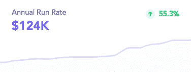

在我们到达那个状态之前，我们在 2016 年进行了 9 个月的实验；这个概念改变了三次，在某个时候，我们几乎准备放弃了。

最终，我们找到了正确的方向。到目前为止，我们开发的一个测试产品为我们带来了数百名客户和 75，000 美元的销售额。

这篇文章是关于工作的第一年，充满了不确定性、错误和学习。这是多么疯狂的一年啊！

# 我们是如何选择商业理念的

Artem 是一名项目管理老手，他也教授项目管理课程。他看到了敏捷团队是如何发展的，并感受到了他们在管理过程中的痛苦。

2016 年引发了聊天机器人的热潮。我对新的机会感到兴奋，并与 Artem 分享了我的商业想法。

我们一起设想了一个对敏捷团队有帮助的 Scrum Master bot。作为一个平台，我们选择了[Slack](https://slack.com/)——正是*这个正确的*选择让我们茁壮成长。

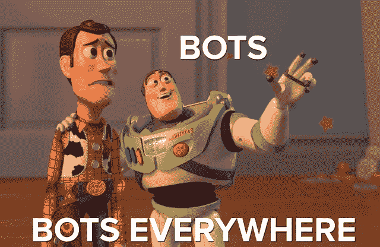

我们雇了一名工程师，和三人小组一起开始了我们的长途旅行。新平台给我们的工程师带来了新的挑战。因此，我们的团队进展比预期的要慢。

不出所料，我们花了几个月的时间打造了第一个 MVP。这就是 SprinterBot(一个帮助敏捷短跑跑得更快的机器人)如何与世界见面的。

***经验教训:*** *至少要有两家开发商才能保持更快的速度。一个人可能会陷入编写新代码的困境。*

# 我们在构建 Slack bot 时面临的挑战

2017 年初，我们有一个测试版，正在服务~200 个团队。然而，就功能和稳定性而言，它远非完美。

回到过去，我们的网站在 Safari 中无法正常工作，Standuply 缺乏用户不断要求的一些功能。一些团队因此离开。

这很痛苦，但是团队中有两个开发人员，我们做不了多少事情。这是你自举时付出的代价。

一个流行的功能请求是关于如果用户错过了及时报告(当 Standuply 运行站立会议时)添加答案。

然后 Slack 公布了他们机器人的按钮。它将允许轻松地添加松弛的答案。按钮似乎是我们 Slackbot 功能的一大补充。

然而，我们的技术基础设施还没有为此做好准备。你猜怎么着？

我们决定重新编写整个机器人，以提供额外的功能。哎哟！在家不要这样！

我们用了 4 个月的时间，而不是 1.5 个月。

发布后，添加答案的功能没有变得任何流行。我们最好把时间花在核心的事情上，比如整合或者提高稳定性。

> 通过这种方式，我们了解到，与核心功能相比，附加功能并不那么重要。不管你做了多少漂亮的小东西，产品的成功在于人们购买的核心功能。

毕竟，我们花了整整 2017 年的时间，从一个不稳定的 Slack bot 和一个蹩脚的 web 界面，到一个具有良好 web 应用程序的工作产品。

# 发展到 15，000 个团队

我们利用几个营销渠道来加速我们的增长。以下是推动我们流量和(有时)线索的主要因素。

1.  **Slack App 目录**

Slack 的某人认为我们的 Slackbot 是值得的，Standuply 已经在 2017 年 3 月的 Slack Bot 目录主页上出现。

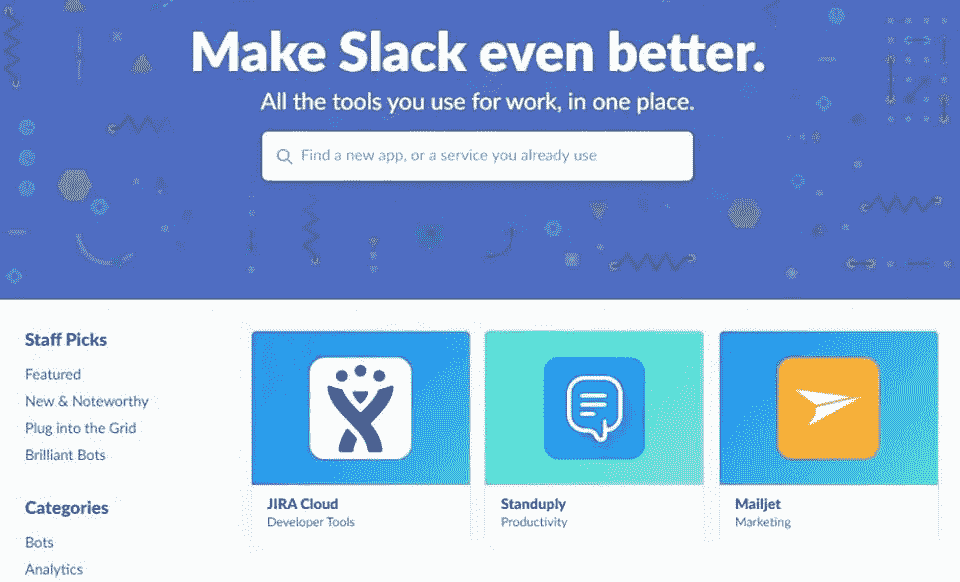

在两周内，我们有 750 个新注册，达到了 1000 个团队的里程碑。

即使特色功能已经结束，我们仍然从 Slack 获得稳定的新用户流。在 Slack bot 目录中是早期 Slack Bot 的首要驱动因素。

**2。内容营销** 除了 Slack Bot 目录，我们利用其他渠道吸引更多团队。我们在 2017 年非常依赖内容营销，并在 2018 年继续这样做。

我发表了几篇长篇阅读。它帮助我们提高了搜索引擎优化，并为我们的博客带来了可观的流量。总体而言，我的帖子在 2017 年获得了 15 万次浏览量。

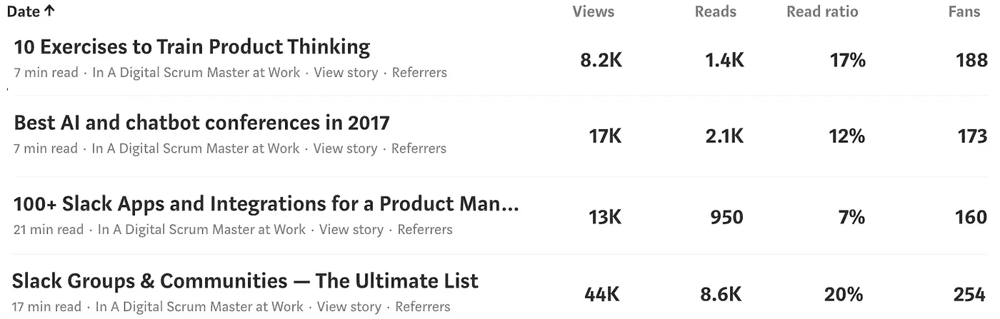

然而，结果与我们的预期相差甚远。很少有新的注册来自这些职位。人们在看书，从旁边走过。

根据我们的调查，100 名受访者中没有人提到我们的博客是他们发现 Standuply 的来源，UTM 跟踪证实了这一点。

**3。产品搜索**
我们在最近的 18 个月里运送了(使用[产品搜索船](http://producthunt.com/ship))8 次单机和相关 Slack bot 产品。我们喜欢寻找产品，你呢？

第一，是我们最初的发布带来了第一批用户。这并不成功，因为我们最终获得了第七名。但是，它给我们带来了~150 支队伍。

第二次是我们的流行博客帖子的网页，上面有 1000 个松弛组。它成为了当天的第二个产品，给我们带来了大约 5000 的访问量，以及……几个新的注册用户。

下一次当产品足够成熟时，我们会发布 Standuply 2.0。我们得到了一些关注——当天的第 6 名，在产品搜索的电子邮件列表中提到，以及大约 100 个新团队。

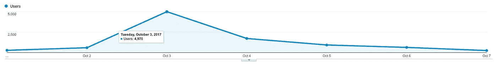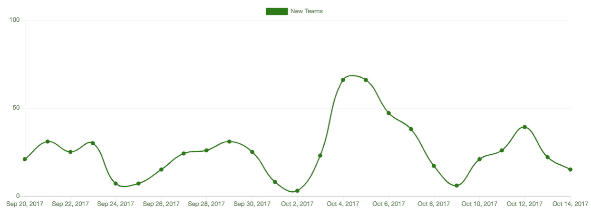

与此同时，我们发布了我们的主要功能和各种结果:[Slack 中的每日热门搜索](https://www.producthunt.com/posts/top-daily-hunts-in-slack)(当日第五产品) [Slack 视频消息](https://www.producthunt.com/posts/slack-video-messaging-by-standuply)(当日第二产品) [Slack 语音消息](https://www.producthunt.com/posts/slack-voice-messaging-by-standuply)(当日第三产品)。

然而，这些发布并没有带来很多团队。更像是公关。

我们最好的发布是最近的一个— [Standuply 3.0](https://www.producthunt.com/posts/standuply-3-0) 。它成为了当天的第一产品和本周的第四产品。因此，我们成功进入了每日和每周的产品搜索邮件列表。

看看它对我们的注册有何影响。

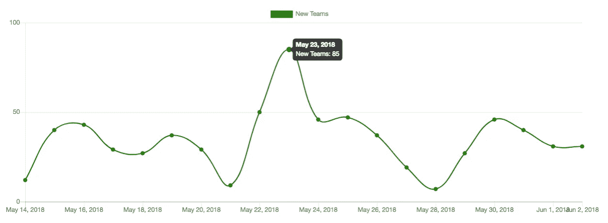

产品搜寻是新线索的重要来源。这是我们学到的东西。

*   您可以根据部署的次数来发布特性和主要版本。产品发布往往会吸引更多的关注，带来更多的注册。
*   在发布日与谁竞争是运气的问题。周二和周三是艰难的日子。如果你没有 100%的把握，那就去周一吧。
*   总的结果是关于产品的吸引力和你带来多少外部支持者。
*   通常周一到周四排名第一的产品会出现在每周时事通讯上，而 Fri 排名第一的产品却没有出现。

**4。科技大会**
我们在 2017 年的三个大会上设立了展位——柏林的[聊天机器人峰会](https://www.chatbotsummit.com/)、赫尔辛基的 [Slush](http://slush.org) 和柏林的 [TechCrunch Disrupt](https://techcrunch.com/events/) 。

聊天机器人峰会完全失败了——很少的潜在用户和毫无价值的谈论聊天机器人将如何统治世界(我承认——大多数不会)。

Slush 是一件大事，更像是一场派对。我们非常喜欢它。此外，Slush 还提供了与演讲者预订教练会议的功能。

我们通过[对讲机](https://intercom.com)与 Des Traynor 进行了交谈(我们每天都用它来提供客户支持)。他给我们的战略建议是坚持懈怠，做一些战术动作。

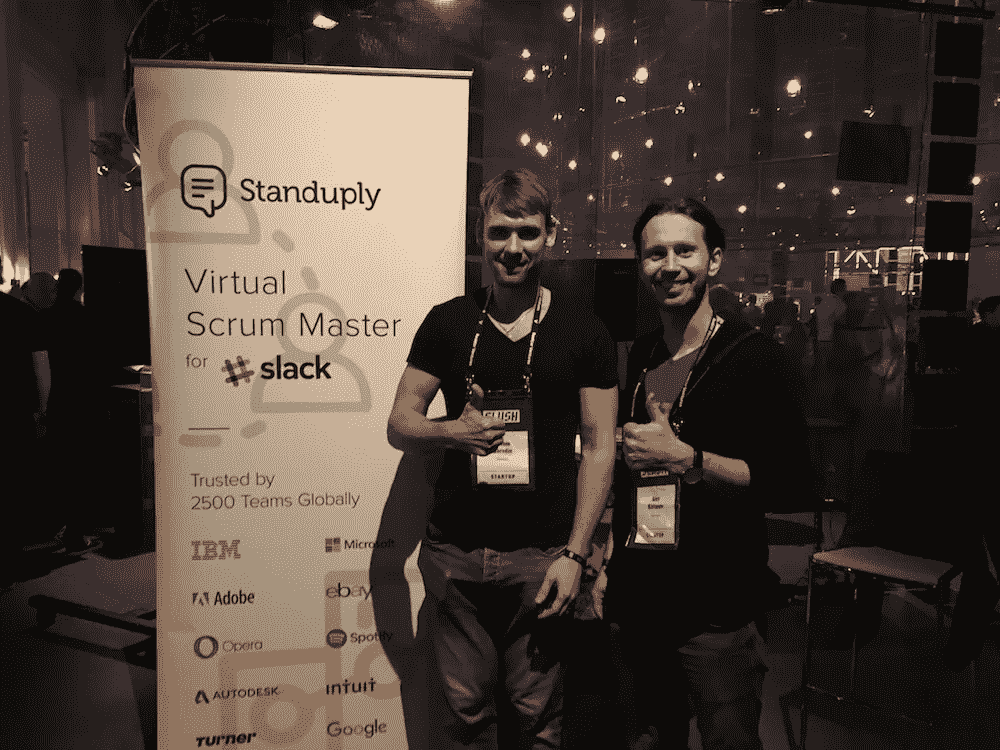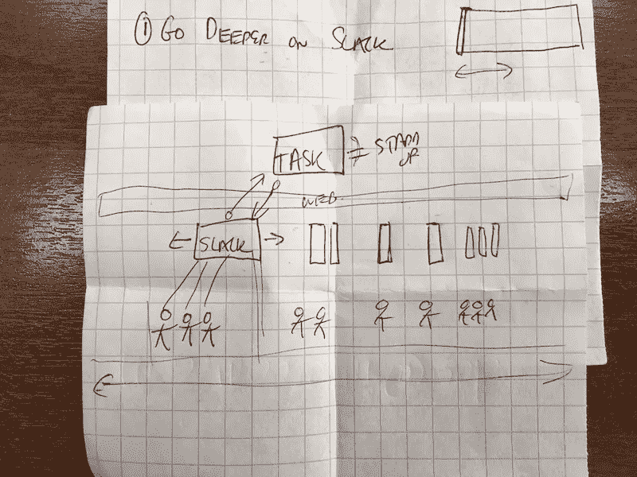

后来德斯评论了我们的进步:

> 我建议你在 Slack 上深入投资的原因是，从我(有限的)观点来看，这是你赌注中风险最大的部分。我鼓励你在用更多的功能积累更多的风险之前，或者通过多渠道来真正测试你的核心假设。我很高兴看到你的核心假设得到了证实，2.5 万美元是一个很好的开始！干得好。——德·特雷纳。

**柏林的 TechCrunch Disrupt** 无法与旧金山的同一事件相提并论。这也是一个失败。相关的谈话和人物很少；创业巷不值这个价。

因此，在零营销预算的情况下，我们在这三场会议上的注册人数最多相当于平常的一天。不太好。

然而，看到人们如何对我们的易拉宝上的信息做出反应是无价的。我们甚至要求 encounters 解释我们仅仅通过观察卷状结构来做什么。很有见地。

上述所有活动都产生了一些反响，因此到 2018 年 6 月，我们最终有 15，000 个团队注册。还不错:)

# 研究价格

我们非常顺利地推出了定价。首先，我们发布了一个通知，告诉大家试用即将结束，并提供了一个付费链接。

没有团队被关闭或限制功能。销售开始出现。

后来，我们在 Slack bot 和 web 应用程序中实现了高级通知。这导致了更多的销售。

没有球队仍然没有被关闭或以任何方式受到限制。这样，在六个月内，我们在 MRR 从几百美元涨到了 6000 美元。

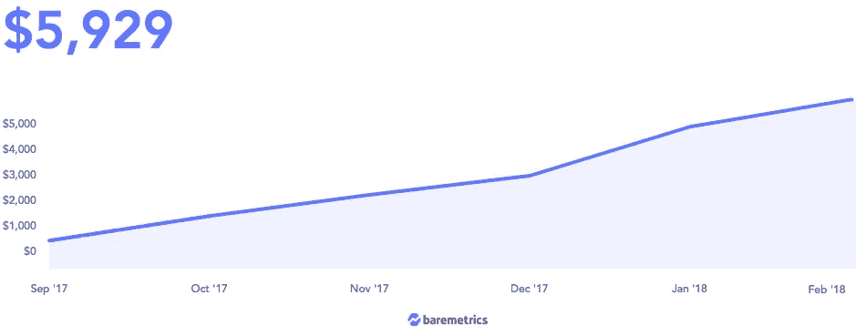

后来，我们推出了两个具有更多功能的额外定价计划。有些是在我们提出计划后交付的。这些功能都标有“很快”，以便客户随时了解情况。

效果真的很好。我们开始看到购买新计划，从而增加了我们的平均检查。

就收入增长而言，下一步是最重要的。我们部署了一个系统，将我们的客户限制在他们购买的范围内。

记住，那时我们没有任何限制。客户可以选择计划和用户数量，但没有任何限制。

我们关注的是产品，而不是账单。

一旦我们推出了这个系统，我们的销售和扩张就一飞冲天。我们有点担心顾客会如何对待它。但是很顺利。

对比一下我们的 MRR 前后。该系统于 4 月全面投入使用。

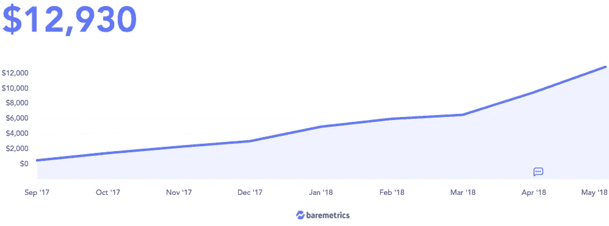

通过这种方式，我们了解到没有必要害怕和你的客户玩游戏。有时候太好会损害你的生意。

# 关键要点

*   Slack Bot 目录是一个惊人的新线索来源；
*   Slack 用户愿意尝试新的机器人，愿意为解决他们痛点的解决方案付费；
*   Slack Bot 生态系统快速增长，为利基产品提供了商机；

但是，竞争越来越激烈。Standuply 在 Slack 上有 [20 多个直接竞争对手](https://onlinegeniuses.slack.com/apps/search?q=standup)。因此，如果你正在考虑建立一个 Slack bot，不要等太久。

查看我的最新帖子:

[*如何有效利用懈怠的终极指南*](https://standuply.com/how-to-use-slack) *。*

[*选择卡斯帕钱包——存放 CSPR 的最佳方式*](/staking-times/choosing-a-casper-wallet-c96d512d3982)

[*哪里可以买到卡斯珀(CSPR)硬币——截至 2022 年的最佳交易所*](/staking-times/where-to-buy-casper-cspr-coin-in-2022-2e041ed675a)

[*如何在 2022 年下注卡斯珀币(CSPR)并计算你的奖励*](/staking-times/how-to-stake-casper-coins-cspr-in-2022-and-calculate-your-rewards-dc5d31a04e63)

图片来源:[Slack.com](https://slack.com/)。