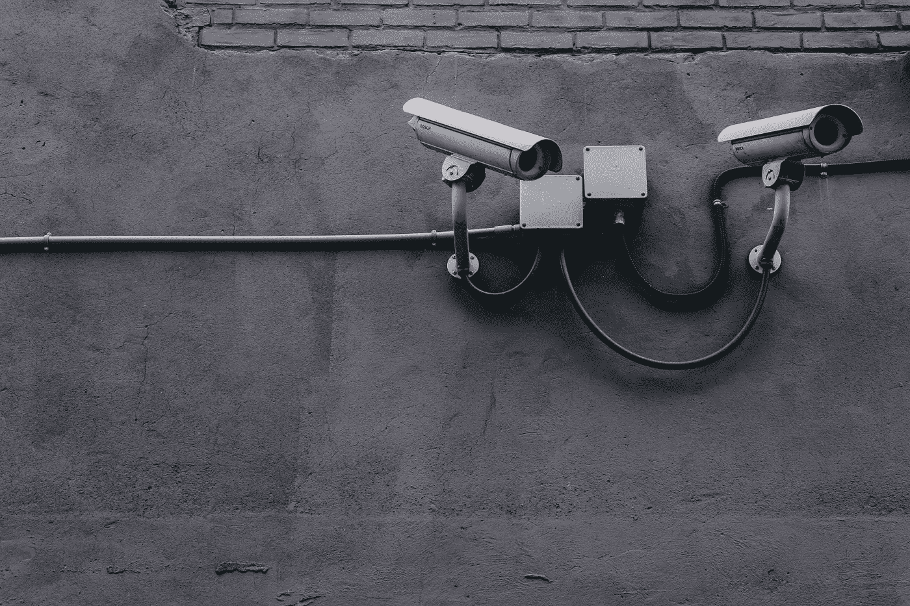
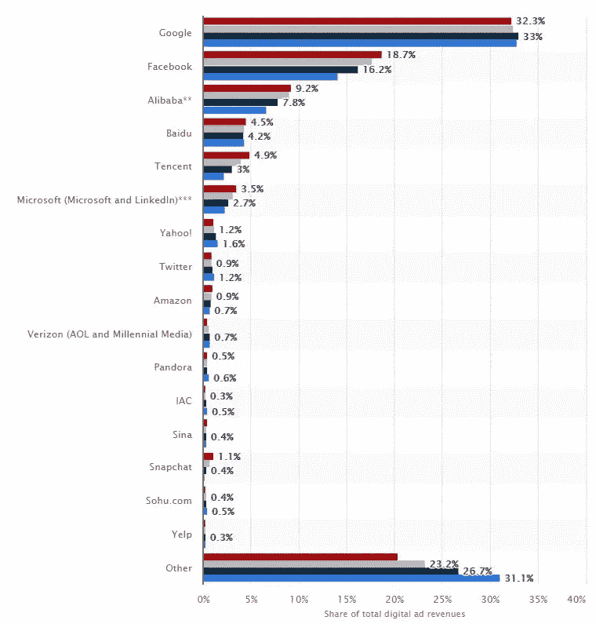
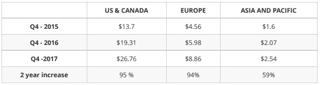
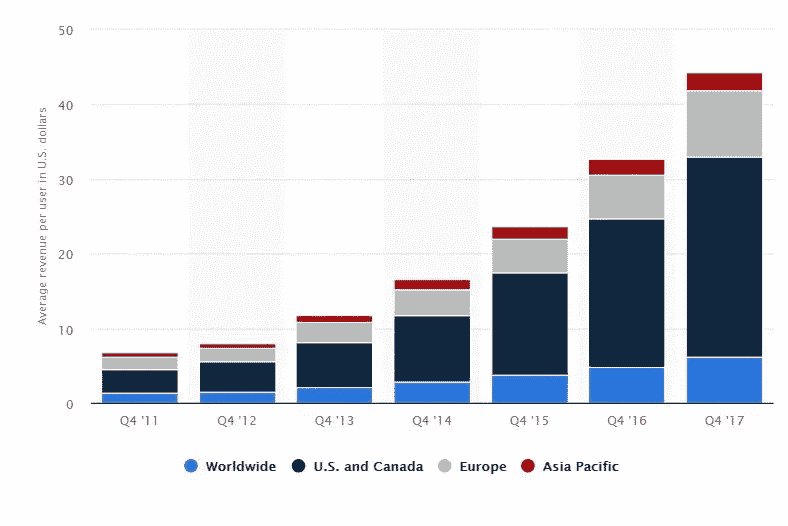
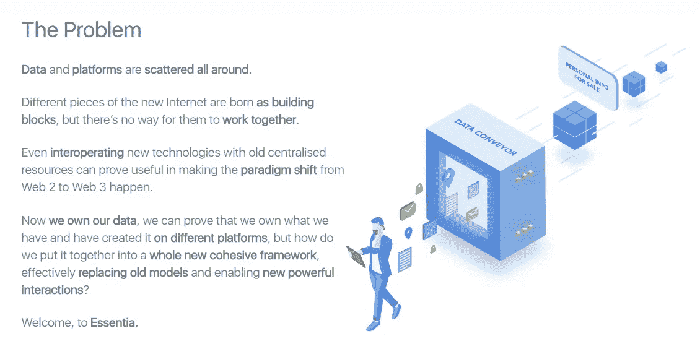

# 超越广告模式，实现民主的真正潜力

> 原文：<https://medium.com/hackernoon/growing-beyond-the-advertising-model-to-achieve-democracys-true-potential-5990de48a86f>

在之前的一篇文章中，我们提出了许多关于广告模式和免费在线服务的问题。**它们都属于隐性成本的范畴，是社会和我们最终要支付的东西。**从反复出现的烦恼到政治权力的丧失，数据集中对政治和社会影响的后果范围很广。**在所有这些“免费”的提议背后，是妥协。**

广告模式有许多问题，都属于隐性成本的范畴。事实上，在 FB 的“免费”报价背后，做出了很多妥协，下面是一个快速概述:

# 广告超载

考虑到在线服务的商业模式，广告的(无限)倍增是不可避免的。事实上，这是演员最大化收入的主要方式。**他们本质上陷入了一个有利可图的恶性循环**:更多广告- >更多观看，更多观看- >更多销售，更多销售- >更多金钱- >更多广告。

由于广告有利可图，越来越多的媒体空间被用于这一目的。过去几年出现了新形式的广告内容混合体，如[原生广告](https://techscience.org/a/2015121503/)、**因为广告商正在寻找新的领域来征服消费者抵触情绪较低的地方。**媒体渠道和品牌渠道之间的边界正在逐渐消失。

在该行业的网络方面，演员的庞大规模应该是一个令人担忧的原因。**脸书现在有超过 20 亿用户。这比任何政府都多，甚至中国或印度都无法与之竞争。在这种主流采用水平下，范围实际上是无限的，没有人会超出范围。为了进一步个性化其广告，脸书收集了大多数个人的详细资料，然后可以用来影响他们。**

脸书是对政治和社会事业最有影响力的媒体。将如此多的权力集中在一个空间显然是危险的，因为这使得社会话语更容易受到操纵和胁迫。然而**数据意味着共享**，当涉及到用户数据时，广告商相当慷慨。

# 收集的数据正在泄露

事实上，该行业参与者之间的频繁交流使得数据问题变得普遍且难以撤销。无论收集点是什么，收集的数据最终都会被出售给尼尔森或 Axciom 等“独立测量和数据公司”。

**消费者不仅失去了对数据的控制，也不知道数据的用途以及目前谁拥有数据**。只要有足够的资金和资源，任何人都有可能获得任何人的非常详细的档案，当然包括亲属。

简介通常**足够定性，让广告商和他们的客户影响观点、行为并最终影响投票。**

# 欢迎来到监视状态

这些数据不仅用于商业目的。自从反恐战争开始以来，**许多西方政府取消了限制情报机构和监视服务的栏杆。随着对在线服务的监控变得司空见惯，现在的新奇之处在于利用监控视频摄像头流中的实时面部识别数据**

人群和个体控制的[工具箱](https://hackernoon.com/tagged/toolbox)在这里。即使我们忽略收集的数据让广告商和政府做了什么，这种简单的收集行为也存在很大问题。随着社会对这种行为的了解，我们的行为“正常化”了。

> 知道自己被观察的简单意识会促使个人改变他们的行为作为回应。

被审视的人会在不知不觉中改变自己的行为和选择。因为我们知道自己被监视，所以我们监控和审查自己的行为。它甚至不一定是一个有意识的过程；我们只是倾向于符合观察者的理想——这被称为观察者效应。

这种现象存在于每一门学科中，有时只是名称不同(霍桑效应)。

哲学家杰里米·边沁利用这一观察来设想一个为最大效率而设计的机构建筑——圆形监狱。由于瞭望塔位于中心，周围都是囚犯，任何囚犯都有可能在任何时候被一名警卫监视。更糟糕的是，囚犯们不知道他们是否被监视着。他自己把它描述为“一种获得精神力量的新模式”。

# 广告影响着承载它们的媒体的内容

广告也会影响到承载它们的媒体。有些影响是显而易见的——比如为广告寻找空间(广告插播、横幅广告等),但最具破坏性的影响也是不太突出的。

事实上，因为内容与广告联系在一起，所以内容创建者必须遵循 T2 的“广告友好”原则。媒体现在相互竞争来主持广告，并创新来吸引他们:植入式广告、真人秀……([宣传——法国](https://www.youtube.com/watch?time_continue=162&v=hr99HzCa0Kg) ) **一切都在成为媒体** ( [宣传](https://www.youtube.com/watch?v=Cv5WLF6UdZc))。数百万人自愿在社交网络上关注品牌账户，以获得健康的日常推广([过度宣传](https://www.youtube.com/watch?v=8ZNOCKl-0Mc))。

最终，由广告支持的免费模式是昂贵的。广告商越来越接近媒体，限制什么能说什么不能说，限制话题和时间表。**因为广告，媒体的多样性和质量都降低了。但是还有更多。一旦广告投放，**为了保持和增加收入，有一种强烈的动机保持与占主导地位的、对广告商友好的框架**。**

# 注定是伟大的

正如我们已经看到的，脸书和其他人的主要利润驱动力是**如何沉迷于他们的服务，以最大限度地将时间花在它上面**。无法平衡，**是设计缺陷**。当扎克伯格谈到脸书的理想，以及他希望如何让它变得更加诚实和透明时，这只不过是营销和公关。在一个两个参与者(脸书和谷歌)占据整个行业一半以上收入的市场上，如果你的广告成本激增，你能做什么？本质上，你别无选择。

[Net digital advertising revenue share of major ad-selling online companies worldwide from 2016 to 2019](https://www.statista.com/statistics/290629/digital-ad-revenue-share-of-major-ad-selling-companies-worldwide/)

# 尺度的边缘

我不是在恳求搞垮脸书或谷歌。几年后，结果最终还是一样。事实上，由于他们的商业模式，GAFA 注定要成为巨人。在“大数据”或他们赋予它的任何名称背后，基本上有两件事:

1.  建立一个强大的系统来收集消费者的数据，对其进行组织、标记和清理。
2.  销售数据经过一个表格一个处理(建立受众)。

这两项活动都从规模中获益匪浅。对于数据收集来说，你越大，你就越有机会收集新的数据点。这里的理想场景是一个准垄断的情况，人们很难避免使用你的服务。

当谈到转售数据时，再次强调大小确实很重要，非常重要！**数据集在数量和质量上都翻了一番**。数据集越大，覆盖的人群就越多，这使得数据经销商能够进入新的市场。同时，从特定个人身上收集的每一个新数据点都允许经销商收取更多费用，因为它允许精确定位和个性化。

最后，随着数据集覆盖越来越多的人，可以发现新的相关性，这反过来增加了数据集中任何给定个人的可用信息量。

从经济角度来看，这意味着**脸书每注册一个新用户，它就从中受益两次**:

1.  首先，它将增加其(活跃)用户总量，这是 FB 收入的基本乘数。
2.  第二，因为更大的数据集允许绘制更有洞察力的分析， **FB 能够增加其每用户收入(ARPU)** 每一个它已经拥有的数据点。

[Facebook’s ARPU, 2015–2017](https://www.statista.com/statistics/251328/facebooks-average-revenue-per-user-by-region/)

ARPU(每用户平均收入)是一个有趣的指标。它让你知道脸书实际上能从你的数据中获取多少钱。ARPU 还与数据库的详细程度密切相关。

高 ARPU 可能表明脸书有非常详细的文件。美国的 ARPU 为 26 美元以上，“2.2 亿美国人的多达 5000 个数据点”，这似乎是匹配的。**最终，ARPU 是脸书能在多大程度上影响民众的一个指标。**

如果我们看看脸书 ARPU 的增长，它在过去四年中一直呈指数增长。再一次，真实的世界似乎证实了这一观察，随着每一次新的投票，脸书所扮演的角色变得越来越重要。

[Facebook’s average revenue per user as of 4th quarter 2017, by region (in U.S. dollars)](https://www.statista.com/statistics/251328/facebooks-average-revenue-per-user-by-region/)

**gafa 现在规模如此之大，以至于他们的每个决定都会产生巨大的影响**。谷歌和脸书是大多数网站最大的流量来源。[当谷歌将一个有着 20 年历史的左倾网站——法语](https://www.legrandsoir.info/un-nouvel-algorithme-de-google-limite-l-acces-aux-sites-web-progressistes-et-de-gauche.html)、世界社会主义网站**的输入流量削减 70%时，这是一个政治行动，对这个国家的政治生活有着真正的影响**。GAFAs 现在是网上信息的看门人，并决定我们能看到什么或看不到什么。由于他们的规模，他们的决定对社会有巨大的影响。

现在我们已经了解了脸书和其他在线服务数据收集实践，是时候发号施令了:

我们是继续在方便的祭坛上牺牲我们的政治权力，还是应该建立我们自己的去中心化的社交网络服务框架，以防止敌对党派的控制和操纵？

Screenshot from [essentia.one](https://essentia.one) website

区块链为建立我们可以信任的分权机构提供了一系列新的选择。一些解决方案，如 [Essentia.one](https://essentia.one) (如上所述)已经在发挥作用。我们将在未来几年看到激进的替代品出现，**这取决于我们如何充分利用它。**

如果你喜欢这篇文章，请告诉我，并查看我的维基以获得更多类似的内容。 **别忘了拍拍它** **帮它传播:**可以一直按👏高达 50 次鼓掌。